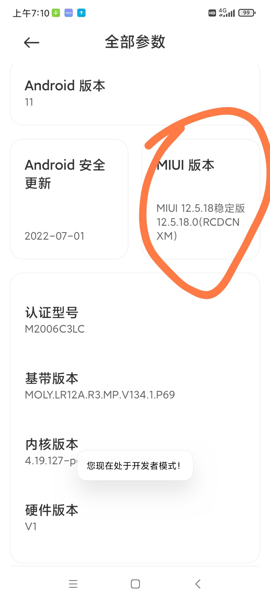

# 所有使用到的安装包：

**小米官方解锁工具miflash：**http://www.miui.com/unlock/done.html
**解包提取boot：**https://magiskcn.com/payload-dumper-go-boot
**下载MIUI系统对应的系统包：**Xiaomiom.com   、 https://miuiver.com/  
**Magisk apk：**https://github.com/HuskyDG/magisk-files/releases  或 http://miuiver.cn/?post=189
**解包提取boot：**https://magiskcn.com/payload-dumper-go-boot
**adb-fastboot：**https://mrzzoxo.lanzoub.com/b02plghuh
**Riru lsposed**：https://github.com/LSPosed/LSPosed
**Riru：**https://github.com/RikkaApps/Riru/releases/tag/v26.1.7

# Step1：打开开发者模式，允许USB调试

**设置-->我的设备-->全部参数-->多次点击MIUI版本即可打开开发者模式**




**设置-->更多设置-->开发者选项-->打开USB调试**


# Step2：解锁BL锁

## 先绑定设备，小米手机插卡绑定设备7天后才可以解锁

**设置-->更多设置-->开发者选项-->设备解锁状态-->绑定设备**

由于我已经解锁，所以从网上找了个图。


## 解锁BL锁

到小米官方网站下载官方解锁工具miflash:http://www.miui.com/unlock/done.html
手机连接电脑后，关机状态下同时长按音量减与开机键，进入Fashboot，然后按照miflash上的提示操作，解锁BL锁。
注意，解锁会清除数据，请提前做好数据备份。

# Step3: 下载安装面具Magisk（Root 权限管理）


## 下载安装面具

安装Magisk apk:https://github.com/HuskyDG/magisk-files/releases
下面的就是Magisk 2.6.301版本的debug版本的apk与release版本的apk,随便选一个安装到手机就行。
不能登录github的可以在这里下载：http://miuiver.cn/?post=189


## 安装apk

如图，安装后打开Magisk应用后，Magisk和管理器都有显示版本号算是安装成功，step3完成。
但是管理器是开始就安装了的，Magisk开始没有(不显示版本号），是我后来再安装的，步骤下来会介绍。


## 安装boot.img和magisk

下载MIUI系统对应的系统包：Xiaomiom.com   、 https://miuiver.com/  都是可以下载系统包的地方。
解包提取boot：[Payload-dumper-go-boot](https://magiskcn.com/payload-dumper-go-boot)（如果系统包有 **boot.img**，可以跳过此步骤）。
我这个系统包是有boot.img的，这里不做解包提取的讲解，请参考教程：[Magisk安装教程 - Magisk中文网 (magiskcn.com)](https://magiskcn.com/)
将boot.img移动到手机中，比如download文件夹下，然后打开手机Magisk应用中的Magisk更新选项，选择”选择并修补一个文件“，选择boot.img，进行安装


界面出现All done，boot.img安装成功


boot.img安装成功后，文件夹下（这里是Download文件夹）会出现magisk-patched-26301-qY4gL.img这样的img文件

电脑下载 **adb-fastboot**：[lanzoub.com/b02plghuh](https://mrzzoxo.lanzoub.com/b02plghuh)（解压出来)

手机插电脑，文件传输模式，把 **boot.img** 和 **magisk_xxx.img** 两个文件复制到 **adb-fastboot** 目录


关机状态下同时长按音量减与开机键，进入Fashboot。然后打开”打开CMD命令行“  输入以下的命令

```
fastboot flash boot 面具文件
```

[waiting for any device（安卓手机通用驱动） - Magisk中文网 (magiskcn.com)](https://magiskcn.com/waiting-for-any-device)
如果出现< waiting for any device >，请参考[waiting for any device（安卓手机通用驱动） - Magisk中文网 (magiskcn.com)](https://magiskcn.com/waiting-for-any-device)进行解决，再行输入命令。

如先前所说，打开Magisk应用后，Magisk和管理器都有显示版本号算是安装成功，step3完成

# Step4: 安装Riru和Riru lsposed

Riru lsposed:https://github.com/LSPosed/LSPosed
Riru:https://github.com/RikkaApps/Riru/releases/tag/v26.1.7

下载Riru和Riru lsposed，放在手机文件夹下(比如Download)


打开面具Magisk-->模块-->从本地安装，安装Riru和Riru lsposed


安装成功后，root完毕(Riru lsposed我没有安装成功，可能它没啥用吧)。
root成功后，安装Re管理器或MT管理器，会请求最高权限，同意后就可以操作像是data/data这样本不能操作的文件了。


# 

