```
参考书籍：
    手把手教你学51单片机（作为51单片机的学习参考）
    STM8单片机自学笔记_14627736（对数码管，74HC595等外设的学习可以参考它们）
    深入浅出STM8单片机入门、进阶与应用实例_14154645（对数码管，74HC595等外设的学习可以参考它们）
参考视频：江科大、普中
```


# 实验


## 实验1：LED闪烁

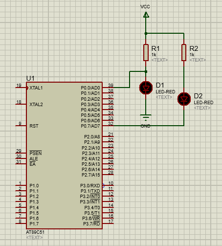

```
#include<reg51.h> //包含头文件
sbit led=P0^0;//利用位定义   
void delay(unsigned char x)          //延时函数
{
	unsigned char i,j;
	for(i = 0;i < x;i++){
		for(j = 0;j < 200;j++);	
	}
}
void main(void){
	led=0;//初始熄灭led灯
	while(1){
		led=~led;//led闪烁
		delay(250);
	}
}
```

## 实验2：流水灯

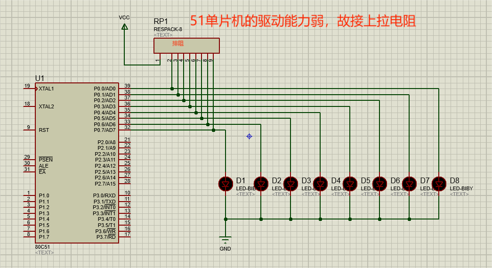

```
#include<reg51.h> //包含头文件
#define led P0
void delay(unsigned char x)          //延时函数
{
	unsigned char i,j;
	for(i = 0;i < x;i++){
		for(j = 0;j < 200;j++);	
	}
}
void main(void){
	led=0x00;
	led=0x01;//初始led灯1亮
	while(1){
		led=led<<1;
		if(led==0x00)
			led=0x01;
		delay(250);
	}
}
```

## 实验3：数码管数字显示

#### 数码管

在数码管中为减少引脚，一般会多个led灯共阳/阴。在电路图中，会用A表示阳极，K表示阴极，各个灯与编号的对应关系如下图所示。

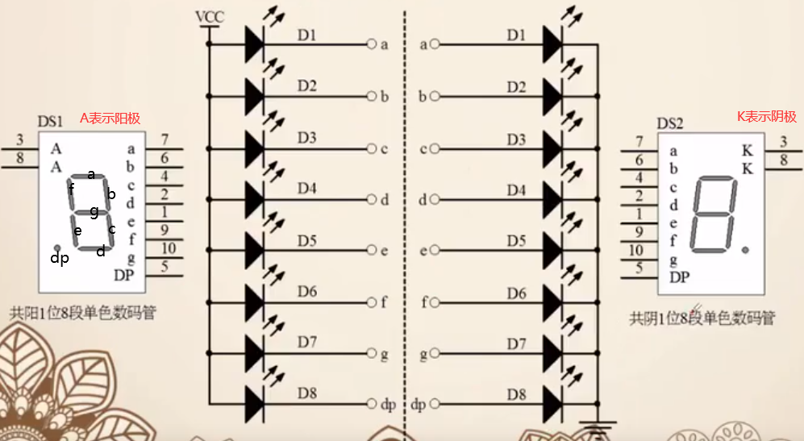

在使用多个数码管时，要引入位、段的概念，位表示的是哪个数码管，段表示的是数码管中各个led灯的电平情况。多位数码管一般会采取动态显示法。公共端上电，后送入位码，然后送段码，决定哪个数码管亮哪些灯，利用人眼的视觉残留，一定时间内依次亮不同的灯，呈现出所有灯亮的效果。
当使用多个数码管时，为减少引脚，可以使用驱动、电子开关、串转并、专用驱动芯片等来节省IO口。
**利用74HC595芯片多个驱动数码管**

### 原理图

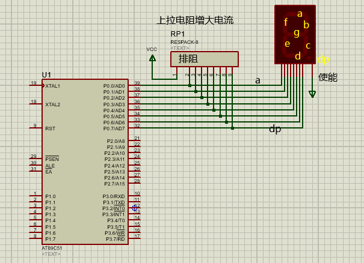**

图中的数码管显然是共阳1位8段数码管，所以使能端口对应的是阳极，我们给它接上电源。
那么中间的小灯应该是低电平亮。比如数字0对应的是abcdef亮，即0xC0=0x1100 0000。

### 代码

```
#include<reg51.h>
code unsigned char ledSeg[10] = {0xc0,0xf9,0xa4,0xb0,0x99,0x92,0x82,0xf8,0x80,0x90};
void delay(unsigned char x)          //延时函数
{
	unsigned char i,j;
	for(i = 0;i < x;i++){
		for(j = 0;j < 200;j++);	
	}
}
void main(void){
	unsigned char i=0;
	P0=0X00;//初始数码管灭
	while(1){
		P0=ledSeg[i];
		delay(250)
		i=(i+1)%10;
	}
}
```

## 实验4：定时器的使用

**时钟周期与机器周期**

时钟周期是CPU一个时钟脉冲所需要的时间，是CPU工作的最小时间单位。
$$
\begin{aligned}
&时钟周期(单位s)=\frac{1}{时钟源频率(单位HZ)}\\
\end{aligned}
$$
机器周期（主要针对汇编语言而言)是单片机完成一个操作的最短时间。
51系列单片机标准架构下一个机器周期是12个时钟周期。

**定时器**

定时器中有一个计数器，从某个初值开始计数，每经过一个机器周期就自动加1，当超过值65535（因为是16位的定时器）发生溢出，溢出之后，定时器的溢出标志位自动置1.

**定时器使用步骤：**

- 设置特殊功能寄存器TMOD,配置好工作模式。
- 设置计数寄存器TH0和TL0的初值。
- 设置TCON,通过TR0(使能)置1来让定时器开始计数。
- 判断TCON寄存器的TF0(标志）位，监测定时器溢出情况

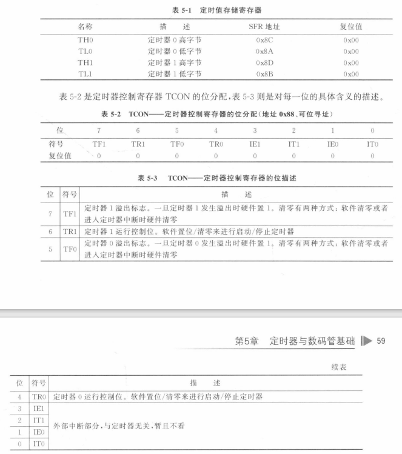

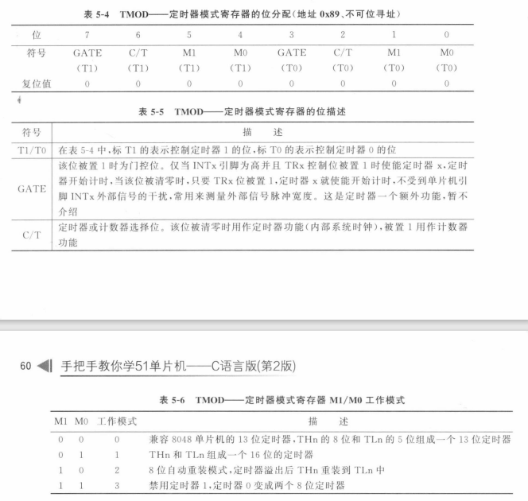

### 原理图

### 代码

```
#include<reg51.h>
code unsigned char seven_seg[10] = {0xc0,0xf9,0xa4,0xb0,0x99,0x92,0x82,0xf8,0x80,0x90};
 
void main(void){
	unsigned char cnt=0;//定义一个计数变量，记录TO溢出次数
	unsigned char i=0;
	TMOD=0x01;//16位定时器模式
	//假设需要20ms溢出一次。
	//晶振是11.0592MHZ,那么一个机器周期是：(1/11059200)*12
    //那么x个机器周期是0.02秒： x*12/11059200=0.02  x=18432  ，需要计数18432次
    //那么从65536-18432=47104开始计数，会计数18432次发生溢出。
    //47104的十六进制是0xB800
	TH0=0xB8;
	TL0=0x00;
	TR0=1;//启动T0
	P0=0X00;//初始数码管灭
	while(1){
		if(TF0==1)//如果发生溢出
		{
			TF0=0;//清除标志位
			TH0=0xB8;//重新赋值
			TL0=0x00;
			cnt++;
			if(cnt>=50)//每秒数码管变动一次，0.02*50=1s
			{
				cnt=0;
				P0=seven_seg[i];
				i=(i+1)%10;
			}
		}
	}
}
```


## 实验5：外部中断

在51单片机中，中断有定时器中断，串口中断，外部中断等等。
在使用中断(以定时器0中断为例）时需要：

- 开启中断
  - 先打开中断总开关EA，
  - 然后打开需要使用的中断开关ET0，
  - 最后设置该中断的中断优先级PT0
- 编写中断服务函数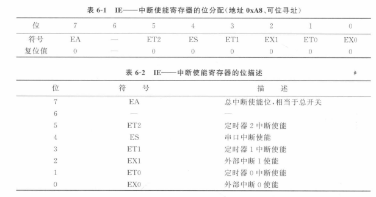

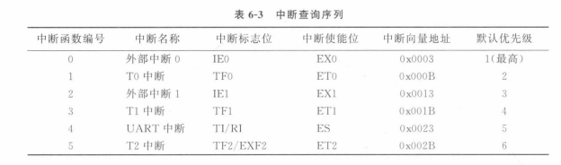

触发中断后，中断标志位会置1，执行中断服务函数，执行完成后，中断标志位置0

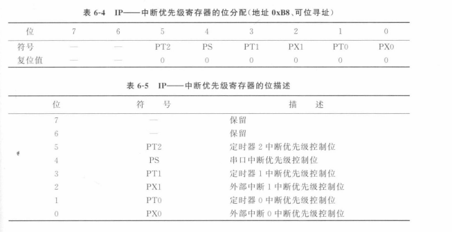

首先中断优先级是数字越小，优先级越高。

其次中断寄存器中配置的优先级是抢占优先级。在中断查询序列中的默认优先级是非抢占优先级。

### 原理图

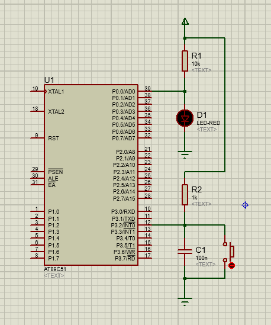

### 代码

```
#include<reg51.h>
sbit LED=P0^0;
void InterruptINT0(void);//中断服务函数
void main(void){
	LED=0;//初始灯灭
	EA=1;//使能总中断
	EX0=1;//使能外部中断0
	PX0=3;//设置外部中断0的优先级
	while(1);
}
void InterruptINT0(void) interrupt 0//INT0中断服务函数，INT0的中断号为0。函数名随便取
{	
	LED=~LED;//改变小灯状态
	while(!INT0); //如果按键一直按，等待
}
```

## 实验6：按键消抖

### 原理图

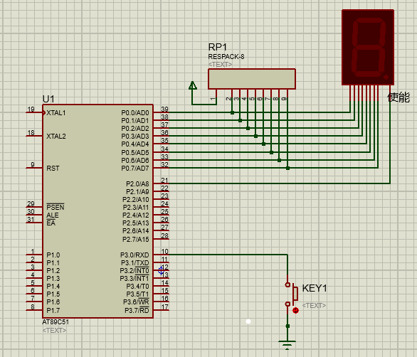

### 代码

```
/******************************************/
//代码运行效果:
//数码管显示数字，当按下KEY1，显示数字加一
//这里使用的方式是通过延时一段时间消除抖动。
//按键消抖可以使用多种方式解决：
//硬件方式：按键两端并联电容(实验5)
//软件方式：延时、中断(实验5)
/******************************************/
#include<reg51.h>

//code的作用是告诉单片机，定义的数据要放在ROM（程序存储区）里面，写入后就不能再更改。
unsigned char code ledSeg[10] = {0xc0,0xf9,0xa4,0xb0,0x99,0x92,0x82,0xf8,0x80,0x90};//数码管显示的数字对应的输出电平
sbit CE=P2^0;//数码管使能
sbit key1 = P3^0;
unsigned char key1_state;       //按键按下的状态变量

void delay(unsigned char x);
void keyScan(void);

void main(void){
	char i;
	CE=1;//给数码管通电
	P0=ledSeg[0];//初始显示0
	while(1){
		keyScan();
		if(key1_state == 1)                //判断键盘状态变量，如果为1，说明有按键按下
		{
			i++;                            //显示数据增加
			P0=ledSeg[i];
			key1_state = 0;                 //数据增加后，键盘状态变量清零
			if(i>9) i = 0;                  //数据增加超过9后，回到0
		}
	}
}

/******************************************/
//延时函数
/******************************************/
void delay(unsigned char x)          
{
	unsigned char i,j;
	for(i = 0;i < x;i++){
		for(j = 0;j < 200;j++);	
	}
}
/******************************************/
//按键扫描函数
/******************************************/
void keyScan(void){
	if(key1==0){//如果按键1按下
		delay(1);//延时一段时间，消除键抖
		if(key1==0){//再对按键检测，如果确实按下，按键状态变量为1
			key1_state=1;
			while(key1==0);//等待按键松开
		}	
	}

}
```


## 实验7：数码管动态显示

### 原理图

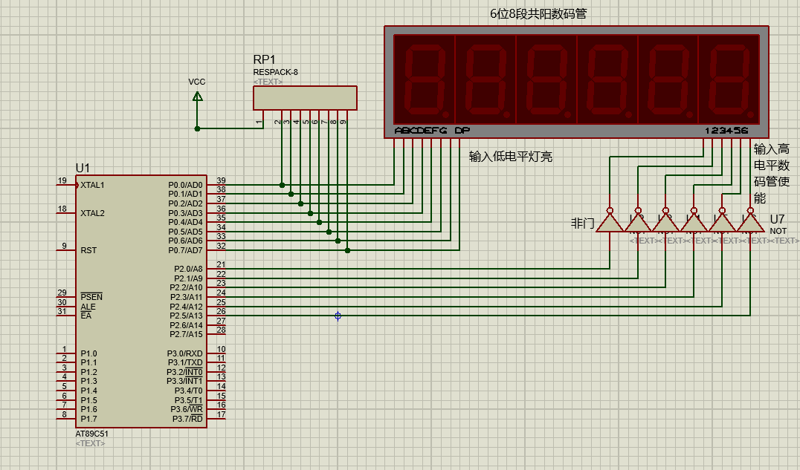

### 代码

```
#include<reg51.h>

#define u8 unsigned char
#define u32 unsigned int

u32 cnt=0;//定义一个计数变量，记录T0溢出次数
u8 ledSelect=0;//动态扫描的位选

code u8 ledSeg[10] = {0xc0,0xf9,0xa4,0xb0,0x99,0x92,0x82,0xf8,0x80,0x90};//段选
code u8 ledBit[6] = {0xfe,0xfd,0xfb,0xf7,0xef,0xdf};//位选
u8 ledBuff[6]={0xc0,0xc0&0x7f,0xc0,0xc0&0x7f,0xc0,0xc0};//数码管显示缓冲区,初始均显示0

u8 flag1s=0;//1秒定时标志

void InitTimer0(void);
void InterruptTimer0(void);
void main(void){
	u32 secCnt=0;//记录经过的秒数
	P2=ledBit[0];//选择数码管
	InitTimer0();//初始化定时器
	
	while(1){
		if(flag1s==1)//判断1s定时标志
		{
			flag1s=0;//清零标志位
			secCnt++;
			//将secCnt变为数码管显示字符
			ledBuff[0]=ledSeg[secCnt/3600/10];
			ledBuff[1]=ledSeg[secCnt/3600%10]&0x7f;//0x7f是为了点亮小数点位
			ledBuff[2]=ledSeg[secCnt/60%60/10];
			ledBuff[3]=ledSeg[secCnt/60%60%10]&0x7f;
			ledBuff[4]=ledSeg[secCnt%60/10];
			ledBuff[5]=ledSeg[secCnt%60%10];
            if(secCnt>=86400)//24*60*60=86400
            {
            	secCnt=0;
            }
		}
	}
}

void InitTimer0(void){
	TMOD=0x01;//16位定时器模式
	//假设需要1ms溢出一次。
	//晶振是11.0592MHZ,那么一个机器周期是：(1/11059200)*12
	//那么x个机器周期是0.001秒： x*12/11059200=0.001  x=921  ，需要计数921次
	//那么从65536-921=64615开始计数，会计数64615次发生溢出。
	//64615的十六进制是0xFC67
	TH0=0xfc;
	TL0=0x67;
	EA=1;//使能总中断
	ET0=1;//使能T0中断
	TR0=1;//启动T0
}
void InterruptTimer0(void) interrupt 1//Timer0中断服务函数，定时器0的中断号为0。函数名随便取
{	
	//重装定时器
	TH0=0xfc;
	TL0=0x67;
	cnt++;
	if(cnt>=1000)//每秒数码管变动一次，0.001*1000=1s
	{
		cnt=0;
		flag1s=1;
	}
	//关闭所有的数码管，消除鬼影
	P2=ledBit[ledSelect];//段选
	//人眼的反映时间是0．05至0．2秒，假设是60ms，那么这意味着最慢我们应该在60ms完成6个数码管的刷新
	//也就是说每10ms刷新一次，否则会产生抖动。
	//在这里我们设置定时器每1ms产生一次定时器中断，刷新一次。
	switch(ledSelect)
	{
		case 0: P0=ledBuff[0];break;
		case 1: P0=ledBuff[1];break;
		case 2: P0=ledBuff[2];break;
		case 3: P0=ledBuff[3];break;
		case 4: P0=ledBuff[4];break;
		case 5: P0=ledBuff[5];break;
	}
	ledSelect++;
	if(ledSelect>=6) ledSelect=0;
}
```

## 实验8：步进电机

### 参考视频

```
https://www.bilibili.com/video/BV1pz4y1X7dg
https://doc.embedfire.com/motor/motor_tutorial/zh/latest/basis_part/stepper_motor.html
```

### 实验9：


## 实验1000：RS485通信（未实验）

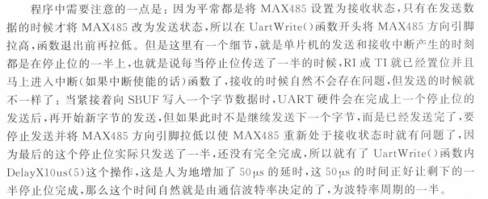


执行流程:

**main.c**

```

main函数不断执行：			UartDriver();调用串口驱动。
每隔一段时间发生定时器中断：	UartRxMonitor(1);对串口接收监控
UartRxMonitor(1);对串口接收监控，
	如果从接收数据开始，超过某段时间比如30ms没有在接收到数据，我们认为本次数据接收完毕。
	可以给 接收完毕标志位 赋值1，表示完成一次读取。
```

**RS485.c**

```
UartDriver()串口驱动函数会不断判断是否已经完成一次接收，
	如果已经完成一次接收：
		重置 接收完毕标志位（置0）
		会对缓冲区的数据进行处理：清零接收计数器，调用动作执行函数UartAction(*buf, len)等
		
UartAction()动作执行函数会执行一些操作比如将接收到的数据进行处理，并发送数据过去。
	这个因需要执行的操作而改变，因此动作执行函数会定义在主函数中，由用户自行定义。

串口中断函数：负责接收数据，以及通过接收计数器计数本次已经接收多少字节数据等

UartRead():不是用来接收数据，而是将缓冲区接收的数据全部放入指定区域，接收数据的事情由串口中断服务函数负责了
这样做的用处是保存本次接收数据。比如如果两次接收到的数据时间间隔很短，那么在缓冲区中的数据就会被最新一次接收的数据覆盖，上次接收的数据如果要用到就没了。
UartWrite():确实是用来发送数据的
```

执行流程：

```
该代码是将接收到的数据原样返回。
首先main会不断调用串口驱动UartDriver();但由于还没有接收到数据，所以什么也不会发生。
在没有接收到数据这段时间，UartRxMonitor(1);不断对串口接收监控，由于什么也没接收到，所以什么也没发生。

当接收到第一个字节的数据开始，串口中断函数会接收数据，把数据保存在接收数据缓冲区bufRxd。并计数cntRxd,表示本次接收已经接收了cntRxd个字节的数据。假设本次接收会收到10个字节数据。

在这期间，每隔指定的时间，定时器中断会调用UartRxMonitor()监控串口接收。
	/**************************
	cntbkp用来保存接收计数器cntRxd上个时间的状态，如果与cntRxd相同，说明本段时间没接收到新数据。
	cntRxd为0表示总线空闲，大于0表示一次接收正进行。
	在已经开始本次接收（cntRxd!=0)的情况下
		如果本段时间空闲（cntRxd==cntbkp)，那么进行时间计数idletmr++，当时间计数超过某个值，
			我们可以认为本次接收完毕，接收完毕标志位flagFrame置1
		如果本段时间不空闲，更新cntbkp状态，清零时间计数idletmr。
	如果总线空闲（cntRxd==0)
		重置cntbkp状态为0
	****************************/
在这期间，cntbkp和cntRxd会不断更新，直到本次接收结束（flagFrame=1）（此时cntbkb=cntRxd=10)

而串口驱动函数UartDriver()在主函数中不断执行，所以当接收结束（flagFrame=1），UartDriver()会立马识别到，并采取操作：
	清除接收完毕标志位（flagFrame=0）
	清零接收计数器（cntRxd)，表示总线空闲了
	在该代码中本函数中是采取了 对缓冲区数据原样发送回去 的操作。
	
这时在经过一段时间，定时器中断调用UartRxMonitor()时：
	会发现总线空闲，清零cntbkp。
	
现在cntbkp，cntRxd，flagFrame都为0，总线空闲，恢复到最初的状态了。
如果下次再接收到数据，重复上述步骤。

所以在下一个实验使用485协议按照Modbus进行操作时，我们更改的是对接收数据进行处理的函数UartAction。
在串口驱动函数中使用了将缓冲区数据保存起来的函数UartRead()，我认为，需要时也可以重写。所以在先前的叙述中，没有过多解释UartRead()函数。
```

**RS485.c**

```
#include <reg52.h>
#include <intrins.h>
sbit RS485 DIR = P1^7;						//RS-485方向选择引脚

bit flagFrame = 0;							//帧接收完成标志，即接收到一帧新数据
bit flagTxd = 0;							//单字节发送完成标志，用来替代TXD中断标志位
unsigned char cntRxd = 0;//接收字节计数器
unsigned char pdata bufRxd[64];//接收字节缓冲区

extern void UartAction( unsigned char * buf, uns igned char len);

/*串口配置函数，baud为通信波特率* /
void ConfigUART(unsigned int baud)
	RS485_ DIR = 0;							//RS-485设置为接收方向
	SCON = 0x50;							//配置串口为模式1
	TMOD&= 0x0F;							//清零T1的控制位
	TMOD | = 0x20;							//配置T1为模式2
	TH1 = 256- (11059200/12/32)/baud; //计算 T1重载值
	TL1 = TH1;								//初值等于重载值
	ET1 = 0;								//禁止TI中断
	ES= 1;									//使能串口中断
	TR1 = 1;								//启动T1
}
/*软件延时函数，延时时间(t* 10)μs */
void DelayX1Ous( unsigned char t)
{
    do {
        _nop_ ();_nop_ ();_nop_ ();_nop_ ();_nop_ ();
        _nop_ ();_nop_ ();_nop_ ();_nop_ ();_nop_ ();
    } while(--t);
}

/*串口数据写入，即串口发送函数，buf为待发送数据的指针,len为指定的发送长度*/
void UartWrite( unsigned char *buf, unsigned char len)
{
	RS485 DIR = 1;							//RS 485设置为发送
	while (len--)							//循环发送所有字节
	{
		flagTxd = 0;						//清0发送标志
		SBUF =*buf++;						//发送一个字节数据
        while (!flagTxd);					//等待该字节发送完成
	}
	DelayX10us(5);						//等待最后的停止位完成，延时时间由波特率决定
    RS485_DIR = 0;						//RS485设置为接收
}

/*串口数据读取函数,buf为接收指针，len为指定的读取长度,返回值为实际读到的长度*/
unsigned char UartRead( unsigned char *buf, unsigned char len)
{
    unsigned char i;
    if (len> cntRxd)						//指定读取长度大于实际按收到的数据长度时，
    {										//读取长度设置为实际接收到的数据长度
        len=cntRxd;
    }
    for (i=0; i<len; i++)					//复制接收到的数据到接收指针上
    {
        *buf++ = bufRxd[i];
    }
    cntRxd = 0;								//接收计数器清0
    return len;								//返回实际读取长度
}

/*串口接收监控，由空闲时间判定帧结束，需在定时中断中调用，ms为定时间隔*/
void UartRxMonitor(unsigned char ms)
{
    static unsigned char cntbkp = 0;
    static unsigned char idletmr = 0;
    if (cntRxd > 0)							//接收计数器大于0时，监控总线空闲时间
    {
        if (cntbkp != cntRxd)				//接收计数器改变，即刚接收到数据时，清0空闲计时
        {
            cntbkp = cntRxd;
            idletmr=0;
        }
        else								//接收计数器未改变，即总线空闲时，累积空闲时间
        {
            if (idletmr < 30)				//空闲计时小于30ms时，持续累加
            {
                idletmr += ms;
                if (idletmr>= 30)			//空闲时间达到30ms时，即判定为一帧接收完毕
                {
                    flagFrame = 1;			//设置帧接收完成标志
                }
            }
        }
    }
    else
    {
        cntbkp = 0;
    }
}


/*串口驱动函数，监测数据帧的接收，调度功能函数，需在主循环中调用*/
void UartDriver()
{
    unsigned char len;
    unsigned char pdata buf[40];
    if (flagFrame)							 //有命令到达时，读取处理该命令
    {
        flagFrame = 0;
        len = UartRead(buf, sizeof(buf)- 2); //将接收到的命令读取到缓冲区中
        UartAction(buf, len);				 //传递数据帧，调用动作执行函数
    }
}

/*串口中断服务函数*/
void InterruptUART( ) interrupt 4
{
    if (RI)									//接收到新字节
    {
        RI= 0;								//清0接收中断标志位
        if (cntRxd < sizeof(bufRxd))		//接收缓冲区尚未用完时，
        {									//保存接收字节，并递增计数器
            bufRxd[cntRxd++]=SBUF;
        }
    }

    if (TI)									//字节发送完毕
    {
        TI=0;								//清0发送中断标志位
        flagTxd=1;							//设置字节发送完成标志
    }
}


```

**main.c**

```
#include < reg52.h>
unsigned char T0RH = 0;						//T0重载值的高字节
unsigned char T0RL = 0;						//T0重载值的低字节
void ConfigTimer0(unsigned int ms);
extern void UartDriver();
extern void ConfigUART unsigned int baud);
extern void UartRxMonitor( unsigned char ms);
extern void UartWrite( unsigned char *buf, unsigned char len);
void main()
{
    EA= 1;//开总中断
    ConfigTimer0(1);						//配置T0定时1ms
    ConfigUART(9600);						//配置波特率为9600
    while (1)
    {
        UartDriver();						//调用串口驱动
    }
}


/*串口动作函数，根据接收到的命令帧执行响应的动作
buf为接收到的命令帧指针,1en为命令帧长度*/
void UartAction(unsigned char *buf, unsigned char len)
{
	//在接收到的数据帧后添加换车换行符后发回
	buf[len++]=''\r';
    buf[en++] = '\n';
    UartWrite(buf, len);
}


/*配置并启动TO,ms为T0定时时间* /
void ConfigTimer0( unsigned int ms)
{
    unsigned long tmp;						//临时变量
    tmp = 11059200/ 12;						//定时器计数频率
    tmp = (tmp*ms) / 1000;					//计算所需的计数值
    tmp=65536-tmp;							//计算定时器重载值
    tmp=tmp+33;								//补偿中断响应延时造成的误差
    T0RH = (unsigned char)(tmp>> 8);		//定时器重载值拆分为高低字节
    T0RL = (unsigned char) tmp;
    TMOD &= 0xF0; 							//清0 T0的控制位
    TMOD| = 0x01;							//配置T0为模式1
    TH0 = T0RH; 							//加载T0重载值
    TL0 = T0RL; 
    ET0 = 1;								//使能T0中断
    TR0 = 1;								//启动T0
}

/* T0中断服务函数，执行串口接收监控*/
void InterruptTimer00) interrupt 1
{
    TH0 = T0RH;								//重新加载重载值
    TL0 = T0RL;
    UartRxMonitor(1);						//串口接收监控
}
```

# 项目

## 项目1：电子表程序设计


