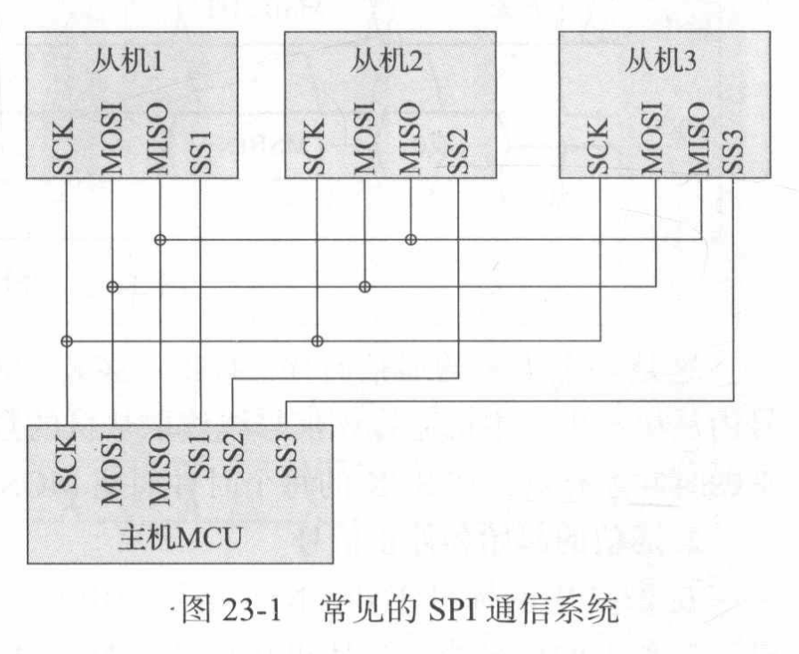
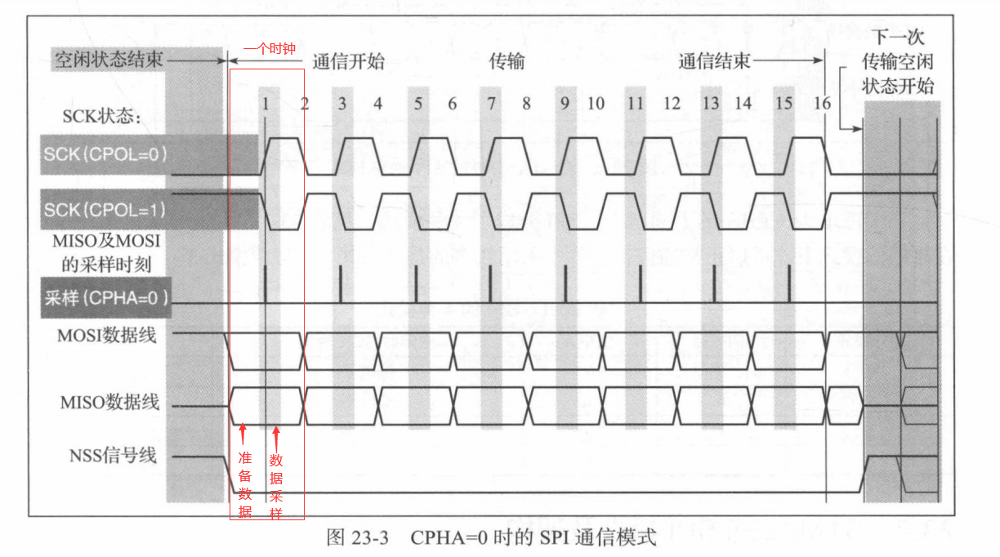
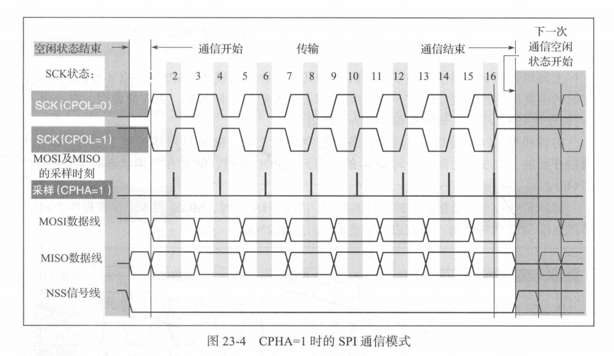

# SPI通信

**SPI通信使用3条总线及片选线：**

- SCK：时钟线，保证信号同步
- MOSI：数据线，主机输出从机输入
- MISO：主机输入从机输出
- 片选线($\overline{SS}，\overline{NSS}，\overline{CS}$)：主机通过片选线选择与哪个从机通信，上面的一横表示低电平有效

如果只有一个从机，可以没片选线，如果只有主机输入从机输出，可以没有MOSI线。

**SPI共有四种通信模式，规定了总线空闲时SCK的状态(时钟极性CPOL)，以及数据采样时刻(时钟相位CPHA)。**
CPOL=1：表示SCK空闲时为高电平。
CPHA=1：表示时钟偶数边沿采样。
假设CPHA=1，CPOL=1，空闲时SCK高电平，那么是在时钟低电平准备数据，高电平采样读取数据(空闲时采样)。
假设CPHA=1，CPOL=0，空闲时SCK低电平，那么是在时钟高电平准备数据，低电平采样读取数据(空闲时采样)。
假设CPHA=0，CPOL=1，空闲时SCK高电平，那么是在时钟高电平准备数据，低电平采样读取数据。
假设CPHA=0，CPOL=0，空闲时SCK低电平，那么是在时钟低电平准备数据，高电平采样读取数据。

总结一下，CPOL规定了空闲是SCK是否为高电平，CPHA规定了是否时钟非空闲时准备数据，空闲时采样

**关于起始信号，结束信号**

- UART中采用两根线TX，RX实现双向通信，规定空闲时为高电平，检测到电平下降认为数据传输开始，以停止位作为数据结束的判断，波特率的规定实现数据同步。一个数据帧一个数据帧的同步传输。
- IIC通过SCL,SDA两根线实现双向通信，通信前发送从机地址实现多从机设备选择，总线仲裁解决多主机共用总线问题。没有规定波特率，所以，每个数据帧通过发送开始信号，结束信号，ACK应答信号实现数据同步
- SPI通过SCL,MOSI,MISO,SS线实现双向通信，SS片选实现多从机设备选择，检测到SCL非空闲认为数据开始。要约定双方的波特率。（我猜测是检测SCL空闲一位的时间说明总线空闲，一位的时间这个随波特率而定，需要约定波特率。）

**因此，SPI通信需要配置**

时钟极性，时钟相位，主机/从机，高位/低位在前，波特率，单双向通信。

