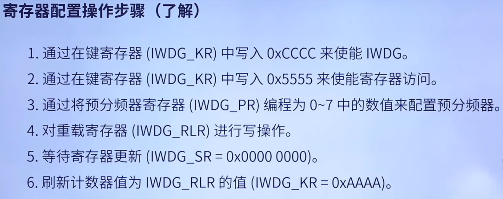

# STM32相关软件下载与安装

下载并安装STM32CubeIDE

# 

# 其他

## 独立按键


串联的电容用于消除按键抖动。从这个电路中可以看出，当按键按下，电路导通，PB12直连GND，读取到的是低电平。
当按键松开，连接的是3.3v的正极，而采用浮空输入，内部有高速电阻，所以R11分的电压几乎可忽略不计，相当于直连正极，读到的是高电平。
如果采用上拉输入，相当于内部接了上拉电阻，此处的上拉电阻可以省略。

HAL_GPIO_ReadPin()

GPIO_PinState是高电平和低电平状态的枚举类型
HAL_GPIO_TogglePin（）翻转输出电平

Ctrl+鼠标点击，可查看函数实现
浮空输入，内部有高电阻

# GPIO

## 8种GPIO模式

## 使用GPIO的基本步骤

- 配置GPIO引脚的时钟使能。(stm32为实现低功耗，所有外设时钟默认不使能)

- 配置输入输出模式：输入/推挽或开漏输出、输出速度、上拉/下拉，输入输出速度。然后初始化引脚
- 使用GPIO'

# 使用UART的基本步骤

串行通信方式，RS232电平。异步通信通过帧发送，帧由起始位，数据位，奇偶校验位，停止位构成，通过波特率和起始位保证通信双方接发同步。有Rx,Tx两条数据线。

- 配置UART的GPIO引脚
  - 使能GPIO和UART的时钟
  - 配置GPIO引脚为复用功能等
  - 配置GPIO引脚的复用映射到UART的收发引脚
- 配置UART的波特率、数据位、等等信息
- 配置UART的发送和接收方式
  - 配置UART的发送和接收中断（可选，配置中断向量表，开中断）
  - 或者轮询方式进行发送和接收（主循环中轮询）
- 使能UART

##  UART代码

```
//UART HAL库代码


#include "stm32f1xx_hal.h"  
#include "stdio.h"	

//重定向printf函数
#if 1
#pragma import(__use_no_semihosting)             
//标准库需要的支持函数                 
struct __FILE 
{ 
	int handle; 

}; 

FILE __stdout;       
//定义_sys_exit()以避免使用半主机模式    
void _sys_exit(int x) 
{ 
	x = x; 
} 
//重定义fputc函数 
int fputc(int ch, FILE *f)
{      
	while((USART1->SR&0X40)==0);//循环发送,直到发送完毕   
    USART1->DR = (unsigned char) ch;      
	return ch;
}
#endif 


uint8_t TxBuf[]="Hello World";//HAL库使用的串口接收缓冲
UART_HandleTypeDef UART1_Handler; //UART句柄
void MX_USART1_UART_Init(void);  
void HAL_UART_MspInit(UART_HandleTypeDef *huart);
void SystemClock_Config(void);


int main(void)
{ 
	
	HAL_Init();                    	 	//初始化HAL库    
	SystemClock_Config();   	//设置时钟,72M
	MX_USART1_UART_Init();					//初始化串口	
	while (1)
	{
		HAL_Delay(100);
		HAL_UART_Transmit(&UART1_Handler, TxBuf, sizeof(TxBuf), 100);
	}		
}

/***************************
时钟部分代码
****************************/
//系统时钟时钟
void SystemClock_Config(void)
{
	RCC_OscInitTypeDef RCC_OscInitStructure; 
	RCC_ClkInitTypeDef RCC_ClkInitStructure;

	RCC_OscInitStructure.OscillatorType=RCC_OSCILLATORTYPE_HSE;    	//时钟源为HSE
	RCC_OscInitStructure.HSEState=RCC_HSE_ON;                      	//打开HSE
	RCC_OscInitStructure.HSEPredivValue=RCC_HSE_PREDIV_DIV1;		//HSE预分频
	RCC_OscInitStructure.PLL.PLLState=RCC_PLL_ON;					//打开PLL
	RCC_OscInitStructure.PLL.PLLSource=RCC_PLLSOURCE_HSE;			//PLL时钟源选择HSE
	RCC_OscInitStructure.PLL.PLLMUL=RCC_PLL_MUL9; 							//主PLL倍频因子

	if(HAL_RCC_OscConfig(&RCC_OscInitStructure)!=HAL_OK) {
		while(1);
	}

	//选中PLL作为系统时钟源并且配置HCLK,PCLK1和PCLK2
	RCC_ClkInitStructure.ClockType=(RCC_CLOCKTYPE_SYSCLK|RCC_CLOCKTYPE_HCLK|RCC_CLOCKTYPE_PCLK1|RCC_CLOCKTYPE_PCLK2);
	RCC_ClkInitStructure.SYSCLKSource=RCC_SYSCLKSOURCE_PLLCLK;		//设置系统时钟时钟源为PLL
	RCC_ClkInitStructure.AHBCLKDivider=RCC_SYSCLK_DIV1;				//AHB分频系数为1
	RCC_ClkInitStructure.APB1CLKDivider=RCC_HCLK_DIV2; 				//APB1分频系数为2
	RCC_ClkInitStructure.APB2CLKDivider=RCC_HCLK_DIV1; 				//APB2分频系数为1
	
	if (HAL_RCC_ClockConfig(&RCC_ClkInitStructure,FLASH_LATENCY_2) != HAL_OK)
	{
		while(1);
	}
}

/***************************
串口部分代码
****************************/

//初始化IO 串口1 
void MX_USART1_UART_Init()
{	
	//UART 初始化设置
	UART1_Handler.Instance=USART1;					   	 //USART1
	UART1_Handler.Init.BaudRate=115200;				    //波特率
	UART1_Handler.Init.WordLength=UART_WORDLENGTH_8B;   //字长为8位数据格式
	UART1_Handler.Init.StopBits=UART_STOPBITS_1;	    //一个停止位
	UART1_Handler.Init.Parity=UART_PARITY_NONE;		    //无奇偶校验位
	UART1_Handler.Init.HwFlowCtl=UART_HWCONTROL_NONE;   //无硬件流控
	UART1_Handler.Init.Mode=UART_MODE_TX_RX;		    //收发模式
	HAL_UART_Init(&UART1_Handler);					    //HAL_UART_Init()会使能UART1
	
}


 
//UART底层初始化，时钟使能，引脚配置，中断配置
//此函数会被HAL_UART_Init()调用
void HAL_UART_MspInit(UART_HandleTypeDef *huart)//huart:串口句柄
{
    //GPIO端口设置
	GPIO_InitTypeDef GPIO_Initure;
	
	if(huart->Instance==USART1)//如果是串口1，进行串口1 MSP初始化
	{
		__HAL_RCC_GPIOA_CLK_ENABLE();			//使能GPIOA时钟
		__HAL_RCC_USART1_CLK_ENABLE();			//使能USART1时钟
		__HAL_RCC_AFIO_CLK_ENABLE();
	
		GPIO_Initure.Pin=GPIO_PIN_9;			//PA9
		GPIO_Initure.Mode=GPIO_MODE_AF_PP;		//复用推挽输出
		GPIO_Initure.Pull=GPIO_PULLUP;			//上拉
		GPIO_Initure.Speed=GPIO_SPEED_FREQ_HIGH;//高速
		HAL_GPIO_Init(GPIOA,&GPIO_Initure);	   	//初始化PA9

		GPIO_Initure.Pin=GPIO_PIN_10;			//PA10
		GPIO_Initure.Mode=GPIO_MODE_AF_INPUT;	//模式要设置为复用输入模式！	
		HAL_GPIO_Init(GPIOA,&GPIO_Initure);	   	//初始化PA10

	}
}
```

```
// UART 标准库代码
//将串口接收的数据原样返回

#include "stm32f10x.h"	
#include "stm32f10x_usart.h"
#include "stdio.h"
//重定向printf函数
#if 1
#pragma import(__use_no_semihosting)             
//标准库需要的支持函数                 
struct __FILE 
{ 
	int handle; 

}; 

FILE __stdout;       
//定义_sys_exit()以避免使用半主机模式    
void _sys_exit(int x) 
{ 
	x = x; 
} 
//重定义fputc函数 
int fputc(int ch, FILE *f)
{      
	while((USART1->SR&0X40)==0);//循环发送,直到发送完毕   
    USART1->DR = (unsigned char) ch;      
	return ch;
}
#endif 


void GPIO_Configuration(void);
void USART_Configuration(u32 bound);
void RCC_Configuration(void);
int main(void)
{	
	RCC_Configuration();
	GPIO_Configuration();
	USART_Configuration(9600);
 
	while(1)
	{
		if(USART_GetFlagStatus(USART1,USART_FLAG_RXNE)==SET)
		{
			USART_SendData(USART1,USART_ReceiveData(USART1));
		}
	}	 
}


/***************************
时钟部分代码
****************************/

void RCC_Configuration(void)
{
	ErrorStatus HSEStartUpStatus;//定义枚举型变量HSEStartUpStatus
	RCC_DeInit();//复位系统时钟设置
	RCC_HSEConfig(RCC_HSE_ON);//开启HSE
	HSEStartUpStatus=RCC_WaitForHSEStatusUp();//等待HSE起振并稳定
	if(HSEStartUpStatus==SUCCESS)//判断HSE是否起振成功，是则进入if内部
	{
		RCC_HCLKConfig(RCC_SYSCLK_Div1);//选择HCLK(AHB)时钟源为SYSCLK 1 分频
		RCC_PCLK2Config(RCC_HCLK_Div1);//选择PCLK2时钟源为HCLK(AHB) 1 分频
		RCC_PCLK1Config(RCC_HCLK_Div2);//选择PCLK1时钟源为HCLK(AHB) 2 分频
		FLASH_SetLatency(FLASH_Latency_2);//设置FLASH延时周期数为2
		FLASH_PrefetchBufferCmd(FLASH_PrefetchBuffer_Enable);//使能FLASH预取缓存
		RCC_PLLConfig(RCC_PLLSource_HSE_Div1,RCC_PLLMul_9);//选择锁相环(PLL)时钟源为HSE 1 分频，倍频数为9，则PLL输出频率为 8MHz*9=72MHz
		RCC_PLLCmd(ENABLE);//使能PLL
		while(RCC_GetFlagStatus(RCC_FLAG_PLLRDY)==RESET);//等待PLL输出稳定
		RCC_SYSCLKConfig(RCC_SYSCLKSource_PLLCLK);//选择SYSCLK时钟源为PLL
		while(RCC_GetSYSCLKSource()!=0x08);//等待PLL成为SYSCLK时钟源
	}
	
	RCC_APB2PeriphClockCmd(RCC_APB2Periph_USART1|RCC_APB2Periph_GPIOA, ENABLE);	//使能USART1，GPIOA时钟
}
 
  

/***************************
串口部分代码
****************************/

//初始化IO 串口1 
void GPIO_Configuration(void)
{
  //GPIO端口设置
  GPIO_InitTypeDef GPIO_InitStructure; 
	  
	//USART1_TX   GPIOA.9
  GPIO_InitStructure.GPIO_Pin = GPIO_Pin_9; //PA.9
  GPIO_InitStructure.GPIO_Speed = GPIO_Speed_50MHz;
  GPIO_InitStructure.GPIO_Mode = GPIO_Mode_AF_PP;	//复用推挽输出
  GPIO_Init(GPIOA, &GPIO_InitStructure);//初始化GPIOA.9
   
  //USART1_RX	  GPIOA.10初始化
  GPIO_InitStructure.GPIO_Pin = GPIO_Pin_10;//PA10
  GPIO_InitStructure.GPIO_Mode = GPIO_Mode_IN_FLOATING;//浮空输入
  GPIO_Init(GPIOA, &GPIO_InitStructure);//初始化GPIOA.10  
}


 
//UART底层初始化，时钟使能，引脚配置，中断配置
void USART_Configuration(u32 bound){
	USART_InitTypeDef USART_InitStructure;


   //USART 初始化设置

	USART_InitStructure.USART_BaudRate = bound;//串口波特率
	USART_InitStructure.USART_WordLength = USART_WordLength_8b;//字长为8位数据格式
	USART_InitStructure.USART_StopBits = USART_StopBits_1;//一个停止位
	USART_InitStructure.USART_Parity = USART_Parity_No;//无奇偶校验位
	USART_InitStructure.USART_HardwareFlowControl = USART_HardwareFlowControl_None;//无硬件数据流控制
	USART_InitStructure.USART_Mode = USART_Mode_Rx | USART_Mode_Tx;	//收发模式

  USART_Init(USART1, &USART_InitStructure); //初始化串口1
  USART_Cmd(USART1, ENABLE);                    //使能串口1 

}
```


## UART中断接收


```
//这只是最简单的中断接收程序，故不能保证接收的数据无误等。


#include "stm32f1xx_hal.h"  
#include "stdio.h"	

//重定向printf函数
#if 1
#pragma import(__use_no_semihosting)             
//标准库需要的支持函数                 
struct __FILE 
{ 
	int handle; 
}; 

FILE __stdout;       
//定义_sys_exit()以避免使用半主机模式    
void _sys_exit(int x) 
{ 
	x = x; 
} 
//重定义fputc函数 
int fputc(int ch, FILE *f)
{      
	while((USART1->SR&0X40)==0);//循环发送,直到发送完毕   
    USART1->DR = (unsigned char) ch;      
	return ch;
}
#endif 

unsigned char aRxBuffer[10];//HAL库使用的串口接收缓冲
UART_HandleTypeDef UART1_Handler; //UART句柄
void MX_USART1_UART_Init(void);  
void HAL_UART_MspInit(UART_HandleTypeDef *huart);
void SystemClock_Config(void);

int main(void)
{ 
    HAL_Init();                  //初始化HAL库    
    SystemClock_Config();   	//设置时钟,72M
    MX_USART1_UART_Init();					//初始化串口	
    while(1);			
}

/***************************
时钟部分代码
****************************/
//系统时钟时钟
void SystemClock_Config(void)
{
	RCC_OscInitTypeDef RCC_OscInitStructure; 
	RCC_ClkInitTypeDef RCC_ClkInitStructure;

	RCC_OscInitStructure.OscillatorType=RCC_OSCILLATORTYPE_HSE;    	//时钟源为HSE
	RCC_OscInitStructure.HSEState=RCC_HSE_ON;                      	//打开HSE
	RCC_OscInitStructure.HSEPredivValue=RCC_HSE_PREDIV_DIV1;		//HSE预分频
	RCC_OscInitStructure.PLL.PLLState=RCC_PLL_ON;					//打开PLL
	RCC_OscInitStructure.PLL.PLLSource=RCC_PLLSOURCE_HSE;			//PLL时钟源选择HSE
	RCC_OscInitStructure.PLL.PLLMUL=RCC_PLL_MUL9; 							//主PLL倍频因子

	if(HAL_RCC_OscConfig(&RCC_OscInitStructure)!=HAL_OK) {
		while(1);
	}

	//选中PLL作为系统时钟源并且配置HCLK,PCLK1和PCLK2
	RCC_ClkInitStructure.ClockType=(RCC_CLOCKTYPE_SYSCLK|RCC_CLOCKTYPE_HCLK|RCC_CLOCKTYPE_PCLK1|RCC_CLOCKTYPE_PCLK2);
	RCC_ClkInitStructure.SYSCLKSource=RCC_SYSCLKSOURCE_PLLCLK;		//设置系统时钟时钟源为PLL
	RCC_ClkInitStructure.AHBCLKDivider=RCC_SYSCLK_DIV1;				//AHB分频系数为1
	RCC_ClkInitStructure.APB1CLKDivider=RCC_HCLK_DIV2; 				//APB1分频系数为2
	RCC_ClkInitStructure.APB2CLKDivider=RCC_HCLK_DIV1; 				//APB2分频系数为1
	
	if (HAL_RCC_ClockConfig(&RCC_ClkInitStructure,FLASH_LATENCY_2) != HAL_OK)
	{
		while(1);
	}
}

/***************************
串口部分代码
****************************/

//初始化IO 串口1 
void MX_USART1_UART_Init()
{	
	//UART 初始化设置
	UART1_Handler.Instance=USART1;					   	 //USART1
	UART1_Handler.Init.BaudRate=115200;				    //波特率
	UART1_Handler.Init.WordLength=UART_WORDLENGTH_8B;   //字长为8位数据格式
	UART1_Handler.Init.StopBits=UART_STOPBITS_1;	    //一个停止位
	UART1_Handler.Init.Parity=UART_PARITY_NONE;		    //无奇偶校验位
	UART1_Handler.Init.HwFlowCtl=UART_HWCONTROL_NONE;   //无硬件流控
	UART1_Handler.Init.Mode=UART_MODE_TX_RX;		    //收发模式
	HAL_UART_Init(&UART1_Handler);					    //HAL_UART_Init()会使能UART1
	
	HAL_UART_Receive_IT(&UART1_Handler, (unsigned char *)aRxBuffer,sizeof(aRxBuffer));//该函数会开启接收中断：标志位UART_IT_RXNE，并且设置接收缓冲以及接收缓冲接收最大数据量  
}

//UART底层初始化，时钟使能，引脚配置，中断配置
//此函数会被HAL_UART_Init()调用
void HAL_UART_MspInit(UART_HandleTypeDef *huart)//huart:串口句柄
{
    //GPIO端口设置
	GPIO_InitTypeDef GPIO_Initure;
	
	if(huart->Instance==USART1)//如果是串口1，进行串口1 MSP初始化
	{
		__HAL_RCC_GPIOA_CLK_ENABLE();			//使能GPIOA时钟
		__HAL_RCC_USART1_CLK_ENABLE();			//使能USART1时钟
		__HAL_RCC_AFIO_CLK_ENABLE();
	
		GPIO_Initure.Pin=GPIO_PIN_9;			//PA9
		GPIO_Initure.Mode=GPIO_MODE_AF_PP;		//复用推挽输出
		GPIO_Initure.Pull=GPIO_PULLUP;			//上拉
		GPIO_Initure.Speed=GPIO_SPEED_FREQ_HIGH;//高速
		HAL_GPIO_Init(GPIOA,&GPIO_Initure);	   	//初始化PA9

		GPIO_Initure.Pin=GPIO_PIN_10;			//PA10
		GPIO_Initure.Mode=GPIO_MODE_AF_INPUT;	//模式要设置为复用输入模式！	
		HAL_GPIO_Init(GPIOA,&GPIO_Initure);	   	//初始化PA10
		
		HAL_NVIC_EnableIRQ(USART1_IRQn);				//使能USART1中断通道
		HAL_NVIC_SetPriority(USART1_IRQn,3,3);			//抢占优先级3，子优先级3

	}
}
/***************************
中断部分代码
****************************/
//当串口接收到信号，会触发串口中断，调用USART1_IRQHandler函数
//HAL_UART_IRQHandler函数会判断是否为该USART口发生USART中断，如果发生，执行该函数	
//HAL_UART_IRQHandler函数中会一根还是，这个函数又会调用HAL_UART_RxCpltCallback函数，实际上HAL_UART_RxCpltCallback函数才是真正的编写中断服务程序的函数。
//HAL_UART_Receive_IT的作用是开启中断，设置接收缓冲以及接收缓冲接收最大数据量 。
//当接收了HAL_UART_Receive_IT中指定数目字节数据后，HAL_UART_RxCpltCallback才会被触发一次

void HAL_UART_RxCpltCallback(UART_HandleTypeDef *huart)
{
	if(huart->Instance==USART1)//如果是串口1
	{
		printf("您收到的数据是：");
		if(HAL_UART_Transmit(&UART1_Handler, (uint8_t *)aRxBuffer, sizeof(aRxBuffer), 5000) != HAL_OK)
		{
		// Error_Handler();  // Error handling function
		}
		printf("\r\n");
	}
}
 
//串口1中断服务程序
void USART1_IRQHandler(void)                	
{ 
	HAL_UART_IRQHandler(&UART1_Handler);	//调用HAL库中断处理公用函数
	HAL_UART_Receive_IT(&UART1_Handler, (unsigned char *)aRxBuffer,sizeof(aRxBuffer)) ;
} 
```

```
// UART 标准库代码

#include "stm32f10x.h"	
#include "stm32f10x_usart.h"
#include "stdio.h"
//重定向printf函数
#if 1
#pragma import(__use_no_semihosting)             
//标准库需要的支持函数                 
struct __FILE 
{ 
	int handle; 

}; 

FILE __stdout;       
//定义_sys_exit()以避免使用半主机模式    
void _sys_exit(int x) 
{ 
	x = x; 
} 
//重定义fputc函数 
int fputc(int ch, FILE *f)
{      
	while((USART1->SR&0X40)==0);//循环发送,直到发送完毕   
    USART1->DR = (unsigned char) ch;      
	return ch;
}
#endif 


void NVIC_Configuration(void);
void GPIO_Configuration(void);
void USART_Configuration(u32 bound);
void RCC_Configuration(void);
int main(void)
{	
	RCC_Configuration();
	GPIO_Configuration();
	 NVIC_Configuration();
	USART_Configuration(9600);
	
 
	while(1)
	{
	}	 
}


/***************************
时钟部分代码
****************************/

void RCC_Configuration(void)
{
	RCC_APB2PeriphClockCmd(RCC_APB2Periph_USART1|RCC_APB2Periph_GPIOA, ENABLE);	//使能USART1，GPIOA时钟
}
 
  

/***************************
串口部分代码
****************************/

//初始化IO 串口1 
void GPIO_Configuration(void)
{
  //GPIO端口设置
  GPIO_InitTypeDef GPIO_InitStructure; 
	  
	//USART1_TX   GPIOA.9
  GPIO_InitStructure.GPIO_Pin = GPIO_Pin_9; //PA.9
  GPIO_InitStructure.GPIO_Speed = GPIO_Speed_50MHz;
  GPIO_InitStructure.GPIO_Mode = GPIO_Mode_AF_PP;	//复用推挽输出
  GPIO_Init(GPIOA, &GPIO_InitStructure);//初始化GPIOA.9
   
  //USART1_RX	  GPIOA.10初始化
  GPIO_InitStructure.GPIO_Pin = GPIO_Pin_10;//PA10
  GPIO_InitStructure.GPIO_Mode = GPIO_Mode_IN_FLOATING;//浮空输入
  GPIO_Init(GPIOA, &GPIO_InitStructure);//初始化GPIOA.10  
}


 
//UART底层初始化，时钟使能，引脚配置，中断配置
void USART_Configuration(u32 bound){
	USART_InitTypeDef USART_InitStructure;


   //USART 初始化设置

	USART_InitStructure.USART_BaudRate = bound;//串口波特率
	USART_InitStructure.USART_WordLength = USART_WordLength_8b;//字长为8位数据格式
	USART_InitStructure.USART_StopBits = USART_StopBits_1;//一个停止位
	USART_InitStructure.USART_Parity = USART_Parity_No;//无奇偶校验位
	USART_InitStructure.USART_HardwareFlowControl = USART_HardwareFlowControl_None;//无硬件数据流控制
	USART_InitStructure.USART_Mode = USART_Mode_Rx | USART_Mode_Tx;	//收发模式

  USART_Init(USART1, &USART_InitStructure); //初始化串口1
  USART_Cmd(USART1, ENABLE);                    //使能串口1 

}


/***************************
中断部分代码
****************************/
void NVIC_Configuration(void)
{
NVIC_InitTypeDef NVIC_InitStructure;
  //Usart1 NVIC 配置
  NVIC_InitStructure.NVIC_IRQChannel = USART1_IRQn;
	NVIC_InitStructure.NVIC_IRQChannelPreemptionPriority=3 ;//抢占优先级3
	NVIC_InitStructure.NVIC_IRQChannelSubPriority = 3;		//子优先级3
	NVIC_InitStructure.NVIC_IRQChannelCmd = ENABLE;			//IRQ通道使能
	NVIC_Init(&NVIC_InitStructure);	//根据指定的参数初始化VIC寄存器
	
	NVIC_PriorityGroupConfig(NVIC_PriorityGroup_2);
	USART_ITConfig(USART1, USART_IT_RXNE, ENABLE);//开启串口接受中断
}


//USART_GetFlagStatus(USART1,USART_FLAG_RXNE)与USART_GetITStatus(USART1,USART_IT_RXNE)使用起来是一样的
void USART1_IRQHandler(void)                	//串口1中断服务程序
{
	if(USART_GetITStatus(USART1, USART_IT_RXNE) != RESET)  //接收中断(接收到的数据必须是0x0d 0x0a结尾)
	{
			USART_SendData(USART1,USART_ReceiveData(USART1)); 
			USART_ClearITPendingBit(USART1,USART_IT_RXNE);
	 } 
}
```


# DMA

DMA(Direct Memory Access)直接存储器访问，将数据从一个地址空间复制到另一个地址空间，提供在外设和存储器之间或者存储器和存储器之间的高速数据传输。DMA传输方式无需CPU直接控制传输，也没有中断处理方式那样保留现场和恢复现场过程，使得CPU的效率大大提高。

STM32 最多有 2 个 DMA 控制器（ DMA2 仅存在大容量产品和互联型产品中），12个独立的可配置的通道(请求)， DMA1 有 7 个通道。DMA2 有 5 个通道。每个通道专门用来管理来自于一个或多个外设对存储器访问的请求。还有一个仲裁器来协调各个 DMA 请求的优先权。


- DMA常用库函数

  ```
  DMA_DeInit(DMA1_Channel6);											//将DMA的通道6寄存器重设为缺省值 
  DMA_Init(DMA1_Channel6,&DMA1_Init); 								//对DMA通道6进行初始化	
  DMA_ITConfig(DMA1_Channel6,DMA_IT_TC|DMA_IT_HT,ENABLE);						//使能DMA通道6的传输完成中断和半传输中断
  DMA_Cmd(DMA1_Channel6,ENABLE);           							//使DMA通道6开始工作
  USART_DMACmd(USART2, USART_DMAReq_Rx, ENABLE);        				//开启串口DMA接收
  u16 CurrDataCount=DMA_GetCurrDataCounte(DMA1_Channel6) //获取DMA通道当前剩余的待传输数据数目
  DMA_GetITStatus(DMA_IT_TC6)!=RESET //查询DMA的通道6是否已经传输完成，产生传输完成中断
  DMA_ClearITPendingBit(DMA_IT_TC6);//清除DMA通道6的传输完成中断
  ```

  

- 使用DMA基本步骤：

  ```
  DMA中约定了源地址和目的地址，以及需要搬运的数据大小(存放于计数器中)后，使能对应的DMA通道，会开始搬运数据，每搬运完成一个字节，计数器减1，传输完成中断置位
  ```

  - 配置RCC寄存器，打开DMA时钟，一般挂载在AHB上
  - 配置NVIC，比如给予DMA传输完成中断0级抢占优先级
  - 配置DMA寄存器各个参数

## DMA串口收发代码

```
// UART 标准库代码

#include "stm32f10x.h"	
#include "stm32f10x_usart.h"
#include "stdio.h"
//重定向printf函数
#if 1
#pragma import(__use_no_semihosting)             
//标准库需要的支持函数                 
struct __FILE 
{ 
	int handle; 

}; 

FILE __stdout;       
//定义_sys_exit()以避免使用半主机模式    
void _sys_exit(int x) 
{ 
	x = x; 
} 
//重定义fputc函数 
int fputc(int ch, FILE *f)
{      
	while((USART1->SR&0X40)==0);//循环发送,直到发送完毕   
    USART1->DR = (unsigned char) ch;      
	return ch;
}
#endif 


//USART2_MAX_TX_LEN和USART2_MAX_RX_LEN在头文件进行了宏定义，分别指USART2最大发送长度和最大接收长度
u8 USART2_TX_BUF[USART2_MAX_TX_LEN]; 	//发送缓冲,最大USART2_MAX_TX_LEN字节
u8 u1rxbuf[USART2_MAX_RX_LEN];			//发送数据缓冲区1
u8 u2rxbuf[USART2_MAX_RX_LEN];			//发送数据缓冲区2
u8 witchbuf=0;                  		//标记当前使用的是哪个缓冲区,0：使用u1rxbuf；1：使用u2rxbuf
u8 USART2_TX_FLAG=0;					//USART2发送标志，启动发送时置1
u8 USART2_RX_FLAG=0;					//USART2接收标志，启动接收时置1


void NVIC_Configuration(void);
void GPIO_Configuration(void);
void USART_Configuration(u32 bound);
void RCC_Configuration(void);
void DMA_Configuration(void);
int main(void)
{	
	RCC_Configuration();
	GPIO_Configuration();
	 NVIC_Configuration();
	USART_Configuration(9600);
	
 
	while(1)
	{
	}	 
}


/***************************
时钟部分代码
****************************/

void RCC_Configuration(void)
{
	RCC_APB2PeriphClockCmd(RCC_APB2Periph_USART1|RCC_APB2Periph_GPIOA, ENABLE);	//使能USART1，GPIOA时钟
	RCC_AHBPeriphClockCmd(RCC_AHBPeriph_DMA1,ENABLE);						//使能DMA1时钟
}
 
  

/***************************
串口部分代码
****************************/

//初始化IO 串口1 
void GPIO_Configuration(void)
{
  //GPIO端口设置
  GPIO_InitTypeDef GPIO_InitStructure; 
	  
	//USART1_TX   GPIOA.9
  GPIO_InitStructure.GPIO_Pin = GPIO_Pin_9; //PA.9
  GPIO_InitStructure.GPIO_Speed = GPIO_Speed_50MHz;
  GPIO_InitStructure.GPIO_Mode = GPIO_Mode_AF_PP;	//复用推挽输出
  GPIO_Init(GPIOA, &GPIO_InitStructure);//初始化GPIOA.9
   
  //USART1_RX	  GPIOA.10初始化
  GPIO_InitStructure.GPIO_Pin = GPIO_Pin_10;//PA10
  GPIO_InitStructure.GPIO_Mode = GPIO_Mode_IN_FLOATING;//浮空输入
  GPIO_Init(GPIOA, &GPIO_InitStructure);//初始化GPIOA.10  
}


 
//UART底层初始化，时钟使能，引脚配置，中断配置
void USART_Configuration(u32 bound){
	USART_InitTypeDef USART_InitStructure;


   //USART 初始化设置

	USART_InitStructure.USART_BaudRate = bound;//串口波特率
	USART_InitStructure.USART_WordLength = USART_WordLength_8b;//字长为8位数据格式
	USART_InitStructure.USART_StopBits = USART_StopBits_1;//一个停止位
	USART_InitStructure.USART_Parity = USART_Parity_No;//无奇偶校验位
	USART_InitStructure.USART_HardwareFlowControl = USART_HardwareFlowControl_None;//无硬件数据流控制
	USART_InitStructure.USART_Mode = USART_Mode_Rx | USART_Mode_Tx;	//收发模式

    USART_ITConfig(USART2, USART_IT_IDLE, ENABLE);									//开启检测串口空闲状态中断
    USART_ClearFlag(USART2,USART_FLAG_TC);											//清除USART2标志位
    USART_Init(USART1, &USART_InitStructure); //初始化串口1
    USART_Cmd(USART1, ENABLE);                    //使能串口1 

    USART_DMACmd(USART2, USART_DMAReq_Tx, ENABLE);        					//开启串口DMA发送
    USART_DMACmd(USART2, USART_DMAReq_Rx, ENABLE);        					//开启串口DMA接收

}


/***************************
中断部分代码
****************************/
void NVIC_Configuration(void)
{
NVIC_InitTypeDef NVIC_InitStructure;
    //Usart1 NVIC 配置
    NVIC_InitStructure.NVIC_IRQChannel = USART1_IRQn;
    NVIC_InitStructure.NVIC_IRQChannelPreemptionPriority=3 ;//抢占优先级3
    NVIC_InitStructure.NVIC_IRQChannelSubPriority = 3;		//子优先级3
    NVIC_InitStructure.NVIC_IRQChannelCmd = ENABLE;			//IRQ通道使能
    NVIC_Init(&NVIC_InitStructure);	//根据指定的参数初始化VIC寄存器

    NVIC_PriorityGroupConfig(NVIC_PriorityGroup_2);
    
	
	//DMA1通道6 NVIC 配置
	NVIC_InitStructure.NVIC_IRQChannel = DMA1_Channel6_IRQn;				//NVIC通道设置
	NVIC_InitStructure.NVIC_IRQChannelPreemptionPriority = 3 ;				//抢占优先级
	NVIC_InitStructure.NVIC_IRQChannelSubPriority = 0;						//子优先级
	NVIC_InitStructure.NVIC_IRQChannelCmd = ENABLE;							//IRQ通道使能
	NVIC_Init(&NVIC_InitStructure);											//根据指定的参数初始化NVIC寄存器
 
	//DMA1通道7 NVIC 配置
	NVIC_InitStructure.NVIC_IRQChannel = DMA1_Channel7_IRQn;				//NVIC通道设置
	NVIC_InitStructure.NVIC_IRQChannelPreemptionPriority = 3 ;				//抢占优先级
	NVIC_InitStructure.NVIC_IRQChannelSubPriority = 1;						//子优先级
	NVIC_InitStructure.NVIC_IRQChannelCmd = ENABLE;							//IRQ通道使能
	NVIC_Init(&NVIC_InitStructure);											//根据指定的参数初始化NVIC寄存器
}


//USART_GetFlagStatus(USART1,USART_FLAG_RXNE)与USART_GetITStatus(USART1,USART_IT_RXNE)使用起来是一样的
void USART1_IRQHandler(void)                	//串口1中断服务程序
{
	if(USART_GetITStatus(USART1, USART_IT_RXNE) != RESET)  //接收中断(接收到的数据必须是0x0d 0x0a结尾)
	{
			USART_SendData(USART1,USART_ReceiveData(USART1)); 
			USART_ClearITPendingBit(USART1,USART_IT_RXNE);
	 } 
}

/***************************
DMA部分代码
****************************/
void DMA_Configuration(void)
{
	DMA_InitTypeDef DMA1_Init;
	NVIC_InitTypeDef NVIC_InitStructure;
	DMA_DeInit(DMA1_Channel6);	//将DMA的通道6寄存器重设为缺省值 
	
	//DMA_USART2_RX  USART2->RAM的数据传输
	DMA1_Init.DMA_PeripheralBaseAddr = (u32)(&USART2->DR);					//外设地址
	DMA1_Init.DMA_MemoryBaseAddr = (u32)u1rxbuf;            				//内存(接收缓冲区)基地址
	DMA1_Init.DMA_DIR = DMA_DIR_PeripheralSRC;								//数据传输方向，从外设读取到内存
	DMA1_Init.DMA_BufferSize = USART2_MAX_RX_LEN;							//DMA通道的DMA缓存的大小
	DMA1_Init.DMA_PeripheralInc = DMA_PeripheralInc_Disable;				//外设地址寄存器不变（不递增)
	DMA1_Init.DMA_MemoryInc = DMA_MemoryInc_Enable;							//内存地址寄存器递增
	DMA1_Init.DMA_PeripheralDataSize = DMA_PeripheralDataSize_Byte;			//外设数据宽度为8位
	DMA1_Init.DMA_MemoryDataSize = DMA_MemoryDataSize_Byte;					//内存数据宽度为8位
	DMA1_Init.DMA_Mode = DMA_Mode_Normal;									//工作在正常缓存模式
	DMA1_Init.DMA_Priority = DMA_Priority_High; 							//DMA通道x拥有最高优先级 
	DMA1_Init.DMA_M2M = DMA_M2M_Disable;									//DMA通道x没有设置为内存到内存传输
	 
	DMA_Init(DMA1_Channel6,&DMA1_Init); 									//对DMA通道6进行初始化
	
	//DMA_USART2_TX  RAM->USART2的数据传输
	DMA_DeInit(DMA1_Channel7);												//将DMA的通道7寄存器重设为缺省外设地址启动传输前装入实际RAM地址
	DMA1_Init.DMA_MemoryBaseAddr = (u32)USART2_TX_BUF;              		//内存(发送缓冲区)基地址
	DMA1_Init.DMA_DIR = DMA_DIR_PeripheralDST; 								//数据传输方向，从内存发送到外设
	DMA1_Init.DMA_BufferSize = USART2_MAX_TX_LEN;							//DMA通道的DMA缓存的大小
	DMA1_Init.DMA_PeripheralInc = DMA_PeripheralInc_Disable;				//外设地址寄存器不变
	DMA1_Init.DMA_MemoryInc = DMA_MemoryInc_Enable;							//内存地址寄存器递增
	DMA1_Init.DMA_PeripheralDataSize = DMA_PeripheralDataSize_Byte;			//数据宽度为8位
	DMA1_Init.DMA_MemoryDataSize = DMA_MemoryDataSize_Byte;					//数据宽度为8位
	DMA1_Init.DMA_Mode = DMA_Mode_Normal;									//工作在正常模式
	DMA1_Init.DMA_Priority = DMA_Priority_High; 							//DMA通道x拥有高优先级 
	DMA1_Init.DMA_M2M = DMA_M2M_Disable;									//DMA通道x没有设置为内存到内存传输

	DMA_Init(DMA1_Channel7,&DMA1_Init); 									//对DMA通道7进行初始化
	

	DMA_ITConfig(DMA1_Channel6,DMA_IT_TC,ENABLE);							//开USART2 Rx DMA中断
	DMA_ITConfig(DMA1_Channel7,DMA_IT_TC,ENABLE);							//开USART2 Tx DMA中断

	DMA_Cmd(DMA1_Channel6,DISABLE);           								//使DMA通道6停止工作
	DMA_Cmd(DMA1_Channel7,DISABLE);           								//使DMA通道7停止工作

}

//DMA 发送应用源码
void DMA_USART2_Tx_Data(u8 *buffer, u32 size)
{
	while(USART2_TX_FLAG){};						//等待上一次发送完成（USART2_TX_FLAG为1即还在发送数据）,实际应用中，传输数据期间，可以执行另外的任务
	USART2_TX_FLAG=1;							//USART2发送标志（启动发送）
	DMA1_Channel7->CMAR  = (uint32_t)buffer;	//设置要发送的数据地址,记住需要先失能DMA通道，显然能走到这里通道已经失能
	DMA1_Channel7->CNDTR = size;    			//设置要发送的字节数目
	DMA_Cmd(DMA1_Channel7, ENABLE);				//开始DMA发送
}

//DMA1通道7中断
void DMA1_Channel7_IRQHandler(void)
{
	if(DMA_GetITStatus(DMA1_IT_TC7)!= RESET)	//DMA接收完成标志
	{
		DMA_ClearITPendingBit(DMA1_IT_TC7); 	//清除中断标志 
		USART_ClearFlag(USART2,USART_FLAG_TC);	//清除串口2的标志位
		DMA_Cmd(DMA1_Channel7, DISABLE );   	//关闭USART2 TX DMA1 所指示的通道
		USART2_TX_FLAG=0;						//USART2发送标志(关闭)
	}
}

//DMA一般接收有两个缓冲区，
//接收定长数据使用传输完成中断，接收
//处理DMA1 通道6的接收完成中断
//定长数据
void DMA1_Channel6_IRQHandler(void)
{
	u8 *p;
	if(DMA_GetITStatus(DMA1_IT_TC6)!= RESET)		//DMA接收完成标志
	{
		DMA_ClearITPendingBit(DMA1_IT_TC6); 		//清除中断标志 
		USART_ClearFlag(USART2,USART_FLAG_TC);		//清除USART2标志位
		DMA_Cmd(DMA1_Channel6, DISABLE );   		//关闭USART2 TX DMA1 所指示的通道；
		
		//接收不定长数据需要增加:
		//USART2_RX_LEN = USART2_MAX_RX_LEN - DMA1_Channel6->CNDTR;	//获得接收到的字节数
		
		if(witchbuf)                        		//之前用的u2rxbuf，切换为u1rxbuf
		{
			p=u2rxbuf;								//先保存前一次数据地址再切换缓冲区
			DMA1_Channel6->CMAR=(u32)u1rxbuf;		//切换为u1rxbuf缓冲区地址
			witchbuf=0;                     		//下一次切换为u2rxbuf
		}else                               		//之前用的u1rxbuf，切换为u2rxbuf
		{
			p=u1rxbuf;								//先保存前一次数据地址再切换缓冲区
			DMA1_Channel6->CMAR=(u32)u2rxbuf;		//切换为u2rxbuf缓冲区地址
			witchbuf=1;                     		//下一次切换为u1rxbuf
		}
		DMA1_Channel6->CNDTR = USART2_MAX_RX_LEN;	//DMA通道的DMA缓存的大小
		DMA_Cmd(DMA1_Channel6, ENABLE);     		//使能USART2 TX DMA1 所指示的通道
		
		//******************↓↓↓↓↓这里作数据处理↓↓↓↓↓******************//
		
		DMA_USART2_Tx_Data(p,USART2_MAX_RX_LEN);
		、、
		//******************↑↑↑↑↑这里作数据处理↑↑↑↑↑******************//
		
	}
}

//不定长数据

//串口2中断函数
void USART2_IRQHandler(void)                	
{
	u8 *p;
	//增加
	u8 USART2_RX_LEN = 0;											//接收数据长度
	
	if(USART_GetITStatus(USART2, USART_IT_IDLE) != RESET)			//串口2空闲中断
	{
		//增加
		USART_ReceiveData(USART2); 									//清除串口2空闲中断IDLE标志位
		
		USART_ClearFlag(USART2,USART_FLAG_TC);						//清除USART2标志位
		DMA_Cmd(DMA1_Channel6, DISABLE );   						//关闭USART2 TX DMA1 所指示的通道
		//修改
		USART2_RX_LEN = USART2_MAX_RX_LEN - DMA1_Channel6->CNDTR;	//获得接收到的字节数
		if(witchbuf)                        						//之前用的u2rxbuf，切换为u1rxbuf
		{
			p=u2rxbuf;												//先保存前一次数据地址再切换缓冲区
			DMA1_Channel6->CMAR=(u32)u1rxbuf;						//切换为u1rxbuf缓冲区地址
			witchbuf=0;                     						//下一次切换为u2rxbuf
		}else                               						//之前用的u1rxbuf，切换为u2rxbuf
		{
			p=u1rxbuf;												//先保存前一次数据地址再切换缓冲区
			DMA1_Channel6->CMAR=(u32)u2rxbuf;						//切换为u2rxbuf缓冲区地址
			witchbuf=1;                     						//下一次切换为u1rxbuf
		}
		DMA1_Channel6->CNDTR = USART2_MAX_RX_LEN;					//DMA通道的DMA缓存的大小
		DMA_Cmd(DMA1_Channel6, ENABLE);     						//使能USART2 TX DMA1 所指示的通道
		
		//******************↓↓↓↓↓这里作数据处理↓↓↓↓↓******************//
		
		//修改：
		DMA_USART2_Tx_Data(p,USART2_RX_LEN);
		
		//******************↑↑↑↑↑这里作数据处理↑↑↑↑↑******************//
		
  }
}


```


# STM32中断

STM32有68个可屏蔽中断通道，包括EXTI、TIM、ADC等等。使用**NVIC**统一管理中断。STM32的中断优先级可以分为抢占优先级和响应优先级。

> 抢占优先级是优先级高的可以在其他中断执行过程中夺得MCU使用权的，响应优先级则是在多个中断同时触发时，获得MCU使用权的优先级。STM32总共有4位数据进行设置抢占和响应优先级，这4位可以进行切分，分为高n位的抢占优先级，和低4-n位的响应优先级。

中断：要进入NVIC,有相应的中断服务函数，需要CPU处理
事件：不需要进入NVIC，仅用于内部硬件自动控制的，如：TMI,DMA,ADC

## EXTI外部中断

EXTI可以监测指定的GPIO口的电平信号，在其电平变化时，向NVIC申请中断。
支持的触发方式有：上升沿触发，下降沿触发，双边沿触发，软件触发

### 使用步骤

> 在STM32中GPIO外部中断信号的流程图如下：
> 信号---->GPIO--->AFIO(F1)  /  SYSCFG(F4/F7/H7) --->EXTI--->NVIC--->CPU

#### Step1：使能GPIO时钟

> 在STM32中，为了低功耗，几乎所有的外设时钟默认情况下都是关闭的，所以使用外部中断，需要先打开所使用到的GPIO口对应的时钟。
>
> ```c
>__HAL_RCC_GPIOx_CLK_ENABLE();
> ```

#### Step2：设置GPIO/AFIO(SYSCFG)/EXTI

>  EXTI(External interrupt/event Controller)外部中断事件控制器，包含多条产生事件/中断请求的边沿检测器，即多条EXTI线。每条EXTI线可以单独配置：类型（中断、事件），触发方式（上升沿，下降沿），支持软件触发、开启/屏蔽、挂起
>
>  比如EXTI线0-15对应于GPIO0-15，EXTI16对应PVD输出，等等。
>
>  所谓的对应关系，IO中断是使用EXTI0-15。EXTI0对应于GPIO PIN0,而PA0~PG0共用这一根线，那么要将EXTI0与哪个对应？这就是在配置EXTI和IO的对应关系，从这里可以知道，同一编号的IO中断不可以同时使用。
>
>  **使用IO中断需要配置AFIO(F1)(Alternate Function IO)复用IO**，如果是F4/F7/H7，则配置SYSCFG，它们功能相似。
>  AFIO可以用来调试IO配置(SWD/JTAG)，重映射配置，外部中断配置。
>  **在使用AFIO前一定要打开它的时钟**，RCC_APB2ENR寄存器的的AFIO时钟
>
>  关于EXTI屏蔽，上/下沿触发等：
>
>  
>
>  这是EXTI的工作原理图。
>  当输入线传来信号时，会先经过边沿检测电路，上升/下降沿触发选择寄存器会控制电路的检测情况，当满足要求，高电平会经过或门（如果打开了软件中断，那么软件中断也可以通过这个，传递中断信号），经过后，会将请求挂起寄存器置1，如果中断屏蔽寄存器是开放中断的（为1），那经与门，就可以得到高电平，将信号送到NVIC。
>  如果事件屏蔽寄存器是开发中断信号的（为1），那么就可以通过脉冲发生器控制一些硬件的中断。

##### Step2：如果用HAL库，HAL_GPIO_Init函数一步到位

> HAL_GPIO_Init() 库函数已经包括了Step2.1-2.4全部内容

##### Step2.1：设置GPIO输入模式

```c

```


##### Step2.2：设置AFIO/SYSCFG时钟

> 设置代码： 
>
>  ```c
>  __HAL_RCC_AFIO_CLK_ENABLE();使能AFIO时钟
>  ```

##### Step2.3：设置EXTI和IO对应关系。

##### Step2.4 设置EXTI屏蔽，上/下沿触发

#### Step3：设置NVIC

##### NVIC

> NVIC(Nested vectored interrupt controller)嵌套向量中断控制器，总共可以支持256个中断，256个优先级，允许裁剪。所以STM32的不同系列的中断数目，优先级不同。
>
> NVIC负责统一管理中断，进行中断的使能，和优先级控制。
> 许多中断信号发往CPU，如果由CPU负责按优先级处理开启的中断，过于浪费CPU资源且麻烦，于是通过NVIC统一管理，给部分中断使能，并按照优先级的顺序将中断信号发送到CPU，CPU就只要处理中断即可。
>
> 中断信号在NVIC的处理流程：
>
> 应用程序中断及复位控制寄存器AIRCR寄存器负责管理响应优先级与与抢占优先级的位数切分。
>
> > 内核中断信号经SHPR控制，发往CPU
> > 外部中断信号---->ISER/ICER中断使/除能寄存器---->IPR中断优先寄存器寄存器--->CPU

##### Step3.1 设置中断分组AIRCR

> 应用程序中断及复位控制寄存器AIRCR寄存器负责管理响应优先级与与抢占优先级的位数切分。
>
> 在STM32中只使用了IPR的4位用来设置优先级，优先级有抢占与响应两种，4位中前几位是抢占优先级，后几位是响应优先级，由AIRCR控制
>
> 比如AIRCR中控制优先级的几位是111，则表示0位抢占，4位响应，在STM32中，在STM32中总共有5种分组方式：0-4，...,4-0。
>
> IPR寄存器则是用于配置优先级的大小
>
> 设置代码：
>
> ```c
> 设置中断分组AIRCR：HAL_NVIC_SetPriorityGrouping()
> ```

##### Step3.2 设置中段优先级

> 相关知识在 step3.1 设置中断分组AIRCR
> 设置代码：
>
> ```c
> 设置中断优先级IPRx:HAL_NVIC_SetPriority()
> ```

##### Step3.3 使能中断

> 设置代码：
>
> ```c
> 使能中断ISERx:HAL_NVIC_EnableIRQ
> ```

#### Step4：设计中断服务函数

> 首先我们编写的中断服务函数（硬件）时，应该与官方文件中规定的中断服务函数名比如EXTIx_IRQHandler()一致。
> HAL库：
>
> - EXTIx_IRQHandler()的代码只是调用了HAL_GPIO_EXTI_IRQHandler()函数;
>
>   ```c
>   void EXTI15_10_IRQHandler(void){
>   	HAL_GPIO_EXTI_IRQHandler(GPIO_PIN_10);
>   }
>   ```
>
> - HAL_GPIO_EXTI_IRQHandler函数会先判断该GPIO口的是否发生中断（中断标志位是否为1），如果是，清除中断，并调用回调函数HAL_GPIO_EXTI_Callback()函数。
>
>   ```
>   //官方文档中的
>   void HAL_GPIO_EXTI_IRQHandler(uint16_t GPIO_Pin){
>   	if(__HAL_GPIO_EXTI_GET_IT(GPIO_Pin)!=RESET){
>   		__HAL_GPIO_EXTI_CLEAT_IT(GPIO_Pin);
>   		HAL_GPIO_EXTI_Callback(GPIO_Pin);
>   	}
>   }
>   ```
>
> - HAL_GPIO_EXTI_Callback(uint16_t GPIO_Pin)这个函数是真正执行具体功能的函数，该函数需要用户重写。
>
> - **总结**
>
>   - 使用HAL库需要按照上述格式写中断服务函数如：EXTIx_IRQHandler()
>
>     然后写执行中断具体功能的函数HAL_GPIO_EXTI_Callback(uint16_t GPIO_Pin)
>
>     可以不清除标志位
>
>   - 也可以仿照上述流程自己写EXTIx_IRQHandler()，功能，清标志等都写在里面，不调用回调函数


### 外部中断点灯示例

按键key0：一端接地，一端接PC5。故PC5使用上拉输入模式，按键松开，读到高电平，按下，读到低电平。
小灯LED0：正极接电源，负极接PA8。故PA8采用推挽输出，输出低电平，小灯亮。


```c
/**********************************************************************
点灯代码
**********************************************************************/
#include "stm32f1xx_hal.h"   
#define LED0_Pin GPIO_PIN_8
#define LED0_GPIO_Port GPIOA
#define KEY0_Pin GPIO_PIN_5
#define KEY0_GPIO_Port GPIOC
#define KEY0_EXTI_IRQn EXTI9_5_IRQn
#define KEY0_Press GPIO_PIN_RESET
#define KEY0_NotPress GPIO_PIN_SET
#define LED0_ON() HAL_GPIO_WritePin(LED0_GPIO_Port, LED0_Pin,GPIO_PIN_RESET)
#define LED0_OFF() HAL_GPIO_WritePin(LED0_GPIO_Port, LED0_Pin, GPIO_PIN_SET)
#define LED0_Toggle() HAL_GPIO_TogglePin(LED0_GPIO_Port, LED0_Pin)

void exti_init();
void SystemClock_Config(void);

int main(void)
{ 
	HAL_Init();//初始化HAL库    
	SystemClock_Config();  	//设置时钟,72M
	exti_init();
	LED0_OFF();
	while(1);
}

/**********************************************************************
中断代码
**********************************************************************/


void exti_init(){
	GPIO_InitTypeDef GPIO_InitStruct={0};
    
	//开启开关和按键的时钟
	__HAL_RCC_GPIOC_CLK_ENABLE();
	__HAL_RCC_GPIOA_CLK_ENABLE();
	
	//配置GPIO输入模式，AFIO时钟，EXTI
	GPIO_InitStruct.Pin=LED0_Pin;
	GPIO_InitStruct.Mode=GPIO_MODE_OUTPUT_PP;
	GPIO_InitStruct.Pull=GPIO_NOPULL;
	GPIO_InitStruct.Speed=GPIO_SPEED_FREQ_HIGH;
	HAL_GPIO_Init(LED0_GPIO_Port,&GPIO_InitStruct);
	
	GPIO_InitStruct.Pin=KEY0_Pin;
	GPIO_InitStruct.Mode=GPIO_MODE_IT_FALLING;//采用外部中断，下降沿触发
	GPIO_InitStruct.Pull=GPIO_PULLUP;
	HAL_GPIO_Init(KEY0_GPIO_Port,&GPIO_InitStruct);
	
	//设置NVIC
	HAL_NVIC_SetPriorityGrouping(NVIC_PRIORITYGROUP_2);
	HAL_NVIC_SetPriority(EXTI9_5_IRQn,2, 0);
	HAL_NVIC_EnableIRQ(EXTI9_5_IRQn);

}

//中断服务函数
void EXTI9_5_IRQHandler(void)
{
    HAL_GPIO_EXTI_IRQHandler(KEY0_Pin );		//调用中断处理公用函数
}

//重写回调函数
void HAL_GPIO_EXTI_Callback(uint16_t GPIO_Pin)
{
//		HAL_Delay(100);
    if(GPIO_Pin==KEY0_Pin){
			if(HAL_GPIO_ReadPin(KEY0_GPIO_Port, KEY0_Pin)==KEY0_Press){
				LED0_Toggle();
			}
		}
}


//系统时钟时钟
void SystemClock_Config(void)
{
	HAL_StatusTypeDef ret = HAL_OK;
	RCC_OscInitTypeDef RCC_OscInitStructure; 
	RCC_ClkInitTypeDef RCC_ClkInitStructure;

	RCC_OscInitStructure.OscillatorType=RCC_OSCILLATORTYPE_HSE;    	//时钟源为HSE
	RCC_OscInitStructure.HSEState=RCC_HSE_ON;                      	//打开HSE
	RCC_OscInitStructure.HSEPredivValue=RCC_HSE_PREDIV_DIV1;		//HSE预分频
	RCC_OscInitStructure.PLL.PLLState=RCC_PLL_ON;					//打开PLL
	RCC_OscInitStructure.PLL.PLLSource=RCC_PLLSOURCE_HSE;			//PLL时钟源选择HSE
	RCC_OscInitStructure.PLL.PLLMUL=RCC_PLL_MUL9; 							//主PLL倍频因子

	if(HAL_RCC_OscConfig(&RCC_OscInitStructure)!=HAL_OK) {
		while(1);
	}

	//选中PLL作为系统时钟源并且配置HCLK,PCLK1和PCLK2
	RCC_ClkInitStructure.ClockType=(RCC_CLOCKTYPE_SYSCLK|RCC_CLOCKTYPE_HCLK|RCC_CLOCKTYPE_PCLK1|RCC_CLOCKTYPE_PCLK2);
	RCC_ClkInitStructure.SYSCLKSource=RCC_SYSCLKSOURCE_PLLCLK;		//设置系统时钟时钟源为PLL
	RCC_ClkInitStructure.AHBCLKDivider=RCC_SYSCLK_DIV1;				//AHB分频系数为1
	RCC_ClkInitStructure.APB1CLKDivider=RCC_HCLK_DIV2; 				//APB1分频系数为2
	RCC_ClkInitStructure.APB2CLKDivider=RCC_HCLK_DIV1; 				//APB2分频系数为1
	
	if (HAL_RCC_ClockConfig(&RCC_ClkInitStructure,FLASH_LATENCY_2) != HAL_OK)
	{
		while(1);
	}
}


```


# IWDG

- IWDG(Independent watchdog)本质上是一个可以产生系统**复位**信号的计数器，主要用于解决CPU异常，程序故障等问题。
- IWDG是一个递减的计数器，由独立的RC振荡器(LSI)提供时钟（可在待机/停止模式下运行），看门狗被激活后，计数器不断递减，直到计数为0x000时，产生复位。如果在此期间，喂狗（重装载计数器的值），就会重新开始计数，不会复位。
- 看门狗的使用RC振荡器，时钟不够精确，一般用于要求高稳定，对时间精确要求不严的场合。

​	

## IWDG的工作原理


- **预分频寄存器：**用于设置预分频系数
- **状态寄存器**：显示看门狗的状态，比如预分频值是否更新结束，重装载值是否更新结束。比如只有预分频值更新结束后，才可以修改重装载寄存器，读取的重装载值才有效。
- **重装载寄存器**：用于重载递减计数器的值，**最大为4096**。当收到键寄存器的喂狗指令会喂狗。
- **键寄存器：**用于启动看门狗，喂狗，使能IWDG_PR,IWDG_RLR的访问许可。写入0xAAAA可以让重装载寄存器喂狗，写入0x5555是使能访问许可，写入0xCCCC是启动看门狗。

LSI提供的时钟信号经过预分频器分频，得到看门狗时钟频率IWDG CLK，给递减计数器提供时钟，当递减计数器计数到0，就会进行复位。
同时当预分频寄存器，重装载寄存器正在更新中与更新结束时，都会通知状态寄存器，改变其值。

## IWDG预分频器的溢出时间计算

LSI的时钟频率不精确，F1系列在30KHZ到60KHZ之间变化，通常我们取40KHZ的典型值，当然具体的还是请参考数据手册。


$$
\begin{aligned}
&溢出时间计算公式：T_{out}=\frac{psc*rlr}{f_{IWDG}} \\
&T_{out}是溢出时间、f_{IWDG}是是时钟源频率、psc是预分频系数，rlr是看门狗的重装载值。
\end{aligned}
$$

关于预分频系数如何选择，不同的预分频系数对应的最短溢出时间（计数1次）和最长溢出时间不同（计数4096次）不同，我们应根据需要的溢出时间选择合适的。参考手册里有对应表格，可以自己算，也可查表。

## 看门狗的配置

### 寄存器配置

这是看门狗的寄存器配置步骤，具体的建议参考相关参考手册。



### HAL库配置

```c
这两个函数定义于文件如stm32f1xx_hal_iwdg.c中,对应的.h文件有参数的定义及参考值。
HAL_IWDG_Init(IWDG_HandleTypeDef *hiwdg)：使能IWDG,取消PR/RLR寄存器写保护，设置预分频系数和重装载值，
HAL_IWDG_Refresh(IWDG_HandleTypeDef *hiwdg)：喂狗，即写入0xAAAA到IWDG_KR

.h文件：
typedef struct
{
  //IWDG的寄存器的基地址,可以在stm32f103xe.h中找到  #define IWDG    ((IWDG_TypeDef *)IWDG_BASE)   IWDG_TypeDef是IWDG的寄存器结构体
  IWDG_TypeDef *Instance;   
  //IWDG初始值
  IWDG_InitTypeDef Init;      
} IWDG_HandleTypeDef;

typedef struct
{
  uint32_t Prescaler; //分频系数
  uint32_t Reload;  //重装载值
} IWDG_InitTypeDef;
```

```
#include "delay.h"

#include "stm32f1xx_hal.h"   
#include"stdio.h"

//串口配置句柄，发送缓冲区和接收缓冲区
UART_HandleTypeDef huart1;
uint8_t TxBuf[]="Hello World";
uint8_t RxBuf[4];

//重定向printf函数
#if 1
#pragma import(__use_no_semihosting)             
//标准库需要的支持函数                 
struct __FILE 
{ 
	int handle; 
}; 

FILE __stdout;       
//定义_sys_exit()以避免使用半主机模式    
void _sys_exit(int x) 
{ 
	x = x; 
} 
//重定义fputc函数 
int fputc(int ch, FILE *f)
{      
	while((USART1->SR&0X40)==0);//循环发送,直到发送完毕   
    USART1->DR = (unsigned char) ch;      
	return ch;
}
#endif 


//声明函数
void SystemClock_Config(void);
static void MX_USART1_UART_Init(void);
void IWDG_Init(void);
void IWDG_Feed(void);


/**********************************************************************
在代码中将看门狗配置为每秒必须喂狗一次，否则会复位。加上串口部分内容。
运行的效果是：
当延时时间delay_ms(1009)大于1s,不能及时喂狗：在打印完"您还没喂狗，请及时喂狗"后，延时函数执行时，时间达到一秒，复位，反复执行上述流程。
当延时时间delay_ms()小于1s,可以及时喂狗：在打印完"您还没喂狗，请及时喂狗"后，延时函数执行后，喂狗，"已经喂狗"，不断重复while循环中的内容。
由于LSI不精确，可能delay_ms(1009)延时，仍然可以成功喂狗。
**********************************************************************/
int main(void)
{ 
	//我们要使用HAL库，所以一定要先初始化HAL库，要使用STM32，需要先初始化系统时钟
	HAL_Init();//初始化HAL库    
	SystemClock_Config();  	//设置时钟,72M,
	delay_init(72);//初始化延时函数
	//出于对代码调试的需要，加上了串口
	MX_USART1_UART_Init();
	printf("您还没喂狗，请及时喂狗");
	
	IWDG_Init();//初始化看门狗
	while(1){
		delay_ms(1009);
		IWDG_Feed();//喂狗
		printf("已经喂狗");
	}
}

/**********************************************************************
看门狗代码
**********************************************************************/
IWDG_HandleTypeDef IWDG_Handler; //独立看门狗句柄,定义为全局变量
void IWDG_Init(){
	IWDG_Handler.Instance=IWDG;
	//由于希望每秒喂一次狗，所以选择分频系数32,对应的重装载值为1250   1s=1250*32/40000，参考溢出时间计算公式。
	IWDG_Handler.Init.Prescaler=IWDG_PRESCALER_32;
	IWDG_Handler.Init.Reload=1250;
	HAL_IWDG_Init(&IWDG_Handler);
}

void IWDG_Feed(void){
	HAL_IWDG_Refresh(&IWDG_Handler);
}


/**********************************************************************
串口部分代码
**********************************************************************/
static void MX_USART1_UART_Init(void)
{
  huart1.Instance = USART1;							//USART1
  huart1.Init.BaudRate = 115200;					//波特兰
  huart1.Init.WordLength = UART_WORDLENGTH_8B;		//8位数据位
  huart1.Init.StopBits = UART_STOPBITS_1;			//一个停止位
  huart1.Init.Parity = UART_PARITY_NONE;			//无奇偶校验位
  huart1.Init.Mode = UART_MODE_TX_RX;				//收发模式
  huart1.Init.HwFlowCtl = UART_HWCONTROL_NONE;		//无硬件流控
  huart1.Init.OverSampling = UART_OVERSAMPLING_16;  //？？？？？
  if (HAL_UART_Init(&huart1) != HAL_OK)				//HAL_UART_Init()会使能UART1
  {
  }

}

//UART底层初始化，时钟使能，引脚配置，中断配置
//此函数会被HAL_UART_Init()调用
void HAL_UART_MspInit(UART_HandleTypeDef *huart)//huart:串口句柄
{
    //GPIO端口设置
	GPIO_InitTypeDef GPIO_Initure;
	
	if(huart->Instance==USART1)//如果是串口1，进行串口1 MSP初始化
	{
		__HAL_RCC_GPIOA_CLK_ENABLE();			//使能GPIOA时钟
		__HAL_RCC_USART1_CLK_ENABLE();			//使能USART1时钟
		__HAL_RCC_AFIO_CLK_ENABLE();
	
		GPIO_Initure.Pin=GPIO_PIN_9;			//PA9
		GPIO_Initure.Mode=GPIO_MODE_AF_PP;		//复用推挽输出
		GPIO_Initure.Pull=GPIO_PULLUP;			//上拉
		GPIO_Initure.Speed=GPIO_SPEED_FREQ_HIGH;//高速
		HAL_GPIO_Init(GPIOA,&GPIO_Initure);	   	//初始化PA9

		GPIO_Initure.Pin=GPIO_PIN_10;			//PA10
		GPIO_Initure.Mode=GPIO_MODE_AF_INPUT;	//模式要设置为复用输入模式！	
		HAL_GPIO_Init(GPIOA,&GPIO_Initure);	   	//初始化PA10
		
		HAL_NVIC_EnableIRQ(USART1_IRQn);				//使能USART1中断通道
		HAL_NVIC_SetPriority(USART1_IRQn,3,3);			//抢占优先级3，子优先级3

	}
}


/**********************************************************************
系统时钟代码
**********************************************************************/
//系统时钟
void SystemClock_Config(void)
{
	RCC_OscInitTypeDef RCC_OscInitStructure; 
	RCC_ClkInitTypeDef RCC_ClkInitStructure;

	RCC_OscInitStructure.OscillatorType=RCC_OSCILLATORTYPE_HSE;    	//时钟源为HSE  8MHZ
	RCC_OscInitStructure.HSEState=RCC_HSE_ON;                      	//打开HSE
	RCC_OscInitStructure.HSEPredivValue=RCC_HSE_PREDIV_DIV1;		//HSE预分频 8/1=8MHZ
	RCC_OscInitStructure.PLL.PLLState=RCC_PLL_ON;					//打开PLL
	RCC_OscInitStructure.PLL.PLLSource=RCC_PLLSOURCE_HSE;			//PLL时钟源选择HSE
	RCC_OscInitStructure.PLL.PLLMUL=RCC_PLL_MUL9; 							//主PLL倍频因子	8*9=72MHZ

	if(HAL_RCC_OscConfig(&RCC_OscInitStructure)!=HAL_OK) {
		while(1);
	}

	//选中PLL作为系统时钟源并且配置HCLK,PCLK1和PCLK2
	RCC_ClkInitStructure.ClockType=(RCC_CLOCKTYPE_SYSCLK|RCC_CLOCKTYPE_HCLK|RCC_CLOCKTYPE_PCLK1|RCC_CLOCKTYPE_PCLK2);
	RCC_ClkInitStructure.SYSCLKSource=RCC_SYSCLKSOURCE_PLLCLK;		//设置系统时钟时钟源为PLL
	RCC_ClkInitStructure.AHBCLKDivider=RCC_SYSCLK_DIV1;				//AHB分频系数为1	 72MHZ
	RCC_ClkInitStructure.APB1CLKDivider=RCC_HCLK_DIV2; 				//APB1分频系数为2	PCLK1 窗口看门狗时钟就来自于它 72/2=36MHZ
	RCC_ClkInitStructure.APB2CLKDivider=RCC_HCLK_DIV1; 				//APB2分频系数为1	PCLK2 72/1=72MHZ
	
	if (HAL_RCC_ClockConfig(&RCC_ClkInitStructure,FLASH_LATENCY_2) != HAL_OK)
	{
		while(1);
	}
}
```

# WWDG

- WWDG(Window watchdog)窗口看门狗：能够**产生系统复位**信号和**提前唤醒中断**的计数器。通常被用来检测软件故障，运行时效是否精准，常用于需要精确监测程序运行时间的场合。
- 复位的情况：
  - 计数器从设定的重载值递减至设定的窗口值(不包括窗口值）前，不允许喂狗，喂狗会导致复位
  - 在计数器从窗口值（包括）递减至0x3f时，会产生复位。所以可以在这期间喂狗，防止复位，也只有这段时间可以喂狗。

- 中断的情况：当计数器达到0x40时，会参数早期唤醒中断（EWI)
- 综上：避免复位应只在也必须在窗口期(窗口值到0x3f)喂狗，可以通过控制延时，尽早喂狗与中断EWI喂狗两种方式进行


## WWDG工作原理


WDGA位为1代表启动看门狗。
在看门狗开启的情况下，如果T6为0(当计数器的值从0x40变到0x3f,T6的值变为0），那么③处的电平为0,经过非门和或门，使得②处电平也为1,开启复位。
在看门狗开启的情况下，计数器从设定的重载值递减至设定的窗口值(不包括窗口值）前，⑥处电平1，如果喂狗(会写入WWDG_CR),⑤电平为1，从而使得④②处电平也为1,开启复位。

## 超时时间计算

$$
\begin{aligned}&超时时间计算公式：T_{WWDG}=\frac{4096*2^{WDGTB}*(T[5:0]+1)}{f_{WWDG}} \\&T_{WWDG}是超时时间、f_{WWDG}是是时钟源频率、2^{WDGTB}是预分频系数，在预分频器中设置，4096是WWDG的固定的分频系数。\end{aligned}
$$

## WWDG配置步骤

### HAL库配置

这里我们给出的是中断EWI喂狗的步骤和方式，延时喂狗请参考窗口看门狗自行修改

- HAL_WWDG_Init()	工作参数初始化，使能WWDG,设置预分频系数和窗口值
- HAL_WWDG_MspInit()		WWDG Msp初始化，用于配置NVIC,CLOCK等
- HAL_NVIC_SetPriority()、HAL_NVIC_Enable()	设置优先级、使能中断
- WWDG_IRQ_Handler()-->HAL_WWDG_IRQ_Handler()	编写中断服务函数
- HAL_WWDG_EarlyWakeupCallback()	重定义提前唤醒回调函数
- HAL_WWDG_Refresh()	喂狗

```
typedef struct
{
  uint32_t Prescaler; 
  uint32_t Window;
  uint32_t Counter
  uint32_t EWIMode ; 
} WWDG_InitTypeDef;

typedef struct
{
  WWDG_TypeDef                 *Instance; 
  WWDG_InitTypeDef             Init;   
} WWDG_HandleTypeDef;
```

```
#include "delay.h"

#include "stm32f1xx_hal.h"   
#include"stdio.h"

//声明函数
void SystemClock_Config(void);
void WWDG_Init(void);
void LED_Init(void);

/**********************************************************************
运行的效果是：
代码在While中循环，每隔58.25ms看门狗计数到0x40触发中断，调用中断处理函数，翻转小灯电平
**********************************************************************/
int main(void)
{ 
	//我们要使用HAL库，所以一定要先初始化HAL库，要使用STM32，需要先初始化系统时钟
	HAL_Init();//初始化HAL库    
	SystemClock_Config();  	//设置时钟72M，设置了窗口看门狗时钟为32MHZ
	delay_init(72);
	LED_Init();							//初始化LED	
	WWDG_Init();//初始化看门狗
	while(1){
	}
}

/**********************************************************************
看门狗代码
**********************************************************************/
WWDG_HandleTypeDef WWDG_Handler;     //窗口看门狗句柄,定义为全局变量
void WWDG_Init(){
	//超出时间计算：58.25ms=4096*8*(0x7F-0x3F)/36MHZ*1000
    WWDG_Handler.Instance=WWDG;
    WWDG_Handler.Init.Prescaler=WWDG_PRESCALER_8; 		//设置分频系数
    WWDG_Handler.Init.Window=0x5F;       		//设置窗口值
    WWDG_Handler.Init.Counter=0x7F;     		//设置计数器值
    WWDG_Handler.Init.EWIMode=WWDG_EWI_ENABLE;//使能窗口看门狗提前唤醒中断 
    HAL_WWDG_Init(&WWDG_Handler);        	//初始化WWDG
}

//WWDG底层驱动，时钟配置，中断配置
//此函数会被HAL_WWDG_Init()调用
void HAL_WWDG_MspInit(WWDG_HandleTypeDef *hwwdg) //hwwdg:窗口看门狗句柄
{   
    __HAL_RCC_WWDG_CLK_ENABLE();    //使能窗口看门狗时钟
        
    HAL_NVIC_SetPriority(WWDG_IRQn,2,3);    //抢占优先级2，子优先级为3
    HAL_NVIC_EnableIRQ(WWDG_IRQn);          //使能窗口看门狗中断
}


//窗口看门狗中断服务函数
void WWDG_IRQHandler(void)
{
    HAL_WWDG_IRQHandler(&WWDG_Handler);//调用WWDG共用中断处理函数
}

//中断服务函数处理过程
//此函数会被HAL_WWDG_IRQHandler()调用
void HAL_WWDG_EarlyWakeupCallback(WWDG_HandleTypeDef* hwwdg)
{
    HAL_WWDG_Refresh(&WWDG_Handler);//更新窗口看门狗值
    HAL_GPIO_TogglePin( GPIOA, GPIO_PIN_8);
}

/**********************************************************************
小灯代码
**********************************************************************/
//LED IO初始化
void LED_Init(void)
{
    GPIO_InitTypeDef GPIO_Initure;
    __HAL_RCC_GPIOA_CLK_ENABLE();           	//开启GPIOA时钟
    
    GPIO_Initure.Pin=GPIO_PIN_8; 				//PA8
    GPIO_Initure.Mode=GPIO_MODE_OUTPUT_PP;  	//推挽输出
    GPIO_Initure.Pull=GPIO_PULLUP;          	//上拉
    GPIO_Initure.Speed=GPIO_SPEED_FREQ_HIGH;    //高速
    HAL_GPIO_Init(GPIOA,&GPIO_Initure);

    HAL_GPIO_WritePin(GPIOA,GPIO_PIN_8,GPIO_PIN_SET);	//PA8置1，默认初始化后灯灭
}

/**********************************************************************
系统时钟代码
**********************************************************************/
//系统时钟
void SystemClock_Config(void)
{
	RCC_OscInitTypeDef RCC_OscInitStructure; 
	RCC_ClkInitTypeDef RCC_ClkInitStructure;

	RCC_OscInitStructure.OscillatorType=RCC_OSCILLATORTYPE_HSE;    	//时钟源为HSE  8MHZ
	RCC_OscInitStructure.HSEState=RCC_HSE_ON;                      	//打开HSE
	RCC_OscInitStructure.HSEPredivValue=RCC_HSE_PREDIV_DIV1;		//HSE预分频 8/1=8MHZ
	RCC_OscInitStructure.PLL.PLLState=RCC_PLL_ON;					//打开PLL
	RCC_OscInitStructure.PLL.PLLSource=RCC_PLLSOURCE_HSE;			//PLL时钟源选择HSE
	RCC_OscInitStructure.PLL.PLLMUL=RCC_PLL_MUL9; 							//主PLL倍频因子	8*9=72MHZ

	if(HAL_RCC_OscConfig(&RCC_OscInitStructure)!=HAL_OK) {
		while(1);
	}

	//选中PLL作为系统时钟源并且配置HCLK,PCLK1和PCLK2
	RCC_ClkInitStructure.ClockType=(RCC_CLOCKTYPE_SYSCLK|RCC_CLOCKTYPE_HCLK|RCC_CLOCKTYPE_PCLK1|RCC_CLOCKTYPE_PCLK2);
	RCC_ClkInitStructure.SYSCLKSource=RCC_SYSCLKSOURCE_PLLCLK;		//设置系统时钟时钟源为PLL
	RCC_ClkInitStructure.AHBCLKDivider=RCC_SYSCLK_DIV1;				//AHB分频系数为1	 72MHZ
	RCC_ClkInitStructure.APB1CLKDivider=RCC_HCLK_DIV2; 				//APB1分频系数为2	PCLK1 窗口看门狗时钟就来自于它 72/2=36MHZ
	RCC_ClkInitStructure.APB2CLKDivider=RCC_HCLK_DIV1; 				//APB2分频系数为1	PCLK2 72/1=72MHZ
	
	if (HAL_RCC_ClockConfig(&RCC_ClkInitStructure,FLASH_LATENCY_2) != HAL_OK)
	{
		while(1);
	}
}
```

# SysTick

SysTick系统节拍时钟，是ARM Cortex-M3内核的一个内设，STM32属于该内核，因此有SysTick。
由于所有该内核的都有SysTick,显然，它将使得程序的可移植性更好。

- 工作原理：从其结构图可以明显的看出，首先SysTick从时钟源接口获得时钟驱动，然后从重装寄存器将重装值读入当前计数寄存器，并在时钟驱动下减一计数，发生下溢时，将计数标志置位，并在满足一定条件下触发SysTick溢出中断，同时进行一次重装值载入操作。


- 步骤
  - 配置SysTick的预装载值，时钟源以及分频
  - 写SysTick中断服务函数

```
u32 tick=0;

void delay_1s(void)
{
	tick=0;
	while(tick<1000);
}

/*
void Systick_Configuration(void)
{
	//主频为72/8=9 MHz,故1ms计时： 1000*计数次数/主频=1ms-->计数次数=主频/1000
	SysTick_Config(9000000/1000);
	//选择HCLK进行8分频后作为Systick时钟源，本函数一定要置于SysTick_Config后调用
	//时钟源在SysTick_Config中会将时钟源位置重新设置，使得设置的时钟无效
	//但是将SysTick_CLKSourceConfig移到SysTick_Config之后调用，要记得先禁能，然后调用SysTick_CLKSourceConfig，再使能。我不会
	SysTick_CLKSourceConfig(SysTick_CLKSource_HCLK_Div8);
	
}
*/


void Systick_Handler(void)
{
	tick++;
}

int main(void)
{
	Systick_Configuration();
	delay_1s();
}

```

```
/*****************************
显然这里的配置流程可以分为两类，这里的代码是第一类
一类是实现一个延时功能，延时功能只需要定时器工作一个周期，也就是从重装载值减到0的一个过程，执行一次后需要关闭定时器
实现系统的us延时（参数）
{
   //选择时钟 建议选择外部时钟
   //写入重装载值  21*参数
   //当前值清零
   //打开计数器
   //等待标志位置1
   //关闭计数器
}
一类是利用中断，一定时间进一次中断，以此来实现一个时间片轮询的操作方式。这时候，就需要定时器一直计数了

系统滴答的初始化代码
{
   //选择系统滴答的时钟
   //配置系统抵达的重装载值
   //当前值清零
   //打开中断使能 
   
   //NVIC控制器

   //开启定时器   
}
中断服务函数
{
	判断标志；
	清楚标志；
	执行操作。
}

//SysTick设置中断优先级为15： NVIC_SetPriority (SysTick_IRQn, (1<<__NVIC_PRIO_BITS) - 1);
******************************/


u8 reload=0;
void delay_init(){
	SysTick_CLKSourceConfig(SysTick_CLKSource_HCLK_Div8);	//选择外部时钟，将 72MHz 的频率 8 分频，把系统嘀嗒定时器的变化定位在 1ms
	raload = SystemCoreClock / 1000;
}


void delay_ms(u16 t)
{	
	//SysTick->CTRL &=~ (1<<2);//选择时钟源--进行AHB 8分频
	//SysTick->CTRL &=~ (1<<1);//使能定时器中断	
	SysTick->LOAD = reload-1;//AHB是72MHz时，填入计数值；
	SysTick->VAL=0x00; // 清空计数器
	SysTick->CTRL |= (1<<0);//开启计数器；也可以用SysTick_CTRL_ENABLE_Msk	赋值
	while((SysTick->CTRL&(1<<16))==0);//判断计数器计数是否结束（CTRL的第16位）
	SysTick->CTRL &=~ (1<<0);//关闭计数器；
	SysTick->VAL=0x00; // 清空计数器
}

```


# 基本定时器

- 16位递增计数器
- 16位预分频器
- 可用于触发DAC
- 在计数器溢出时，可产生中断/DMA请求
- 

# 点亮第一个LED灯

```c
#include "stm32f1xx_hal.h"

void SystemClock_Config(void);
static void MX_GPIO_Init(void);

int main(void)
{
  HAL_Init();                   // 初始化HAL库
  SystemClock_Config();         // 配置系统时钟
  MX_GPIO_Init();               // 初始化GPIO

  while (1)
  {
		HAL_GPIO_TogglePin(GPIOA,GPIO_PIN_8);// 切换LED灯的状态
		HAL_GPIO_TogglePin(GPIOD,GPIO_PIN_2);
		HAL_Delay(500);// 延时500ms
  }
}


static void MX_GPIO_Init(void)
{
	GPIO_InitTypeDef GPIO_InitStruct={0};
	
    // 开启GPIOA时钟
	__HAL_RCC_GPIOA_CLK_ENABLE();
	__HAL_RCC_GPIOD_CLK_ENABLE();
	
    //设置PA8,PD2为高速推挽输出
	GPIO_InitStruct.Pin=GPIO_PIN_8;
	GPIO_InitStruct.Mode=GPIO_MODE_OUTPUT_PP;
	GPIO_InitStruct.Speed=GPIO_SPEED_FREQ_HIGH;
	HAL_GPIO_Init(GPIOA,&GPIO_InitStruct);
	
	GPIO_InitStruct.Pin=GPIO_PIN_2;
	HAL_GPIO_Init(GPIOD,&GPIO_InitStruct);
    
  	// 初始状态关闭LED灯
	HAL_GPIO_WritePin(GPIOA,GPIO_PIN_8,GPIO_PIN_SET);
	HAL_GPIO_WritePin(GPIOD,GPIO_PIN_2,GPIO_PIN_SET);
}

void SystemClock_Config(void)
{
  RCC_OscInitTypeDef RCC_OscInitStruct = {0};
  RCC_ClkInitTypeDef RCC_ClkInitStruct = {0};

  // 启用外部晶振
  RCC_OscInitStruct.OscillatorType = RCC_OSCILLATORTYPE_HSE;
  RCC_OscInitStruct.HSEState = RCC_HSE_ON;
  RCC_OscInitStruct.HSEPredivValue = RCC_HSE_PREDIV_DIV1;
  RCC_OscInitStruct.PLL.PLLState = RCC_PLL_ON;
  RCC_OscInitStruct.PLL.PLLSource = RCC_PLLSOURCE_HSE;
  RCC_OscInitStruct.PLL.PLLMUL = RCC_PLL_MUL9;
  if (HAL_RCC_OscConfig(&RCC_OscInitStruct) != HAL_OK)
  {
    Error_Handler();
  }

  // 配置系统时钟
  RCC_ClkInitStruct.ClockType = RCC_CLOCKTYPE_HCLK | RCC_CLOCKTYPE_SYSCLK |
                                RCC_CLOCKTYPE_PCLK1 | RCC_CLOCKTYPE_PCLK2;
  RCC_ClkInitStruct.SYSCLKSource = RCC_SYSCLKSOURCE_PLLCLK;
  RCC_ClkInitStruct.AHBCLKDivider = RCC_SYSCLK_DIV1;
  RCC_ClkInitStruct.APB1CLKDivider = RCC_HCLK_DIV2;
  RCC_ClkInitStruct.APB2CLKDivider = RCC_HCLK_DIV1;
  if (HAL_RCC_ClockConfig(&RCC_ClkInitStruct, FLASH_LATENCY_2) != HAL_OK)
  {
    Error_Handler();
  }
}
void Error_Handler(void)
{
  // 出错处理函数
  while (1)
  {
  }
}

```


### 按键改变小灯亮灭

```
#include "stm32f1xx_hal.h"

void SystemClock_Config(void);
static void MX_GPIO_Init(void);

int main(void)
{
  HAL_Init();                   // 初始化HAL库
  SystemClock_Config();         // 配置系统时钟
  MX_GPIO_Init();               // 初始化GPIO

  while (1)
  {
  	if(HAL_GPIO_ReadPin(GPIOA,GPIO_PIN_15)==GPIO_PIN_RESET){
			HAL_GPIO_WritePin(GPIOA,GPIO_PIN_8,GPIO_PIN_RESET);
		}else{
			HAL_GPIO_WritePin(GPIOA,GPIO_PIN_8,GPIO_PIN_SET);
		}
  }
}


static void MX_GPIO_Init(void)
{
	GPIO_InitTypeDef GPIO_InitStruct={0};
	
    // 开启GPIOA时钟
	__HAL_RCC_GPIOA_CLK_ENABLE();
	
    //设置PA8为高速推挽输出
	GPIO_InitStruct.Pin=GPIO_PIN_8;
	GPIO_InitStruct.Mode=GPIO_MODE_OUTPUT_PP;
	GPIO_InitStruct.Speed=GPIO_SPEED_FREQ_HIGH;
	HAL_GPIO_Init(GPIOA,&GPIO_InitStruct);
	
	//设置PA15为上拉输入，PA15按下为低电平，松开为高电平
	GPIO_InitStruct.Pin=GPIO_PIN_15;
	GPIO_InitStruct.Mode=GPIO_MODE_INPUT;
	GPIO_InitStruct.Pull=GPIO_PULLUP;
	HAL_GPIO_Init(GPIOA,&GPIO_InitStruct);	
    
  	// 初始状态关闭LED灯
	HAL_GPIO_WritePin(GPIOA,GPIO_PIN_8,GPIO_PIN_SET);

}

void SystemClock_Config(void)
{
  RCC_OscInitTypeDef RCC_OscInitStruct = {0};
  RCC_ClkInitTypeDef RCC_ClkInitStruct = {0};

  // 启用外部晶振
  RCC_OscInitStruct.OscillatorType = RCC_OSCILLATORTYPE_HSE;
  RCC_OscInitStruct.HSEState = RCC_HSE_ON;
  RCC_OscInitStruct.HSEPredivValue = RCC_HSE_PREDIV_DIV1;
  RCC_OscInitStruct.PLL.PLLState = RCC_PLL_ON;
  RCC_OscInitStruct.PLL.PLLSource = RCC_PLLSOURCE_HSE;
  RCC_OscInitStruct.PLL.PLLMUL = RCC_PLL_MUL9;


  // 配置系统时钟
  RCC_ClkInitStruct.ClockType = RCC_CLOCKTYPE_HCLK | RCC_CLOCKTYPE_SYSCLK |
                                RCC_CLOCKTYPE_PCLK1 | RCC_CLOCKTYPE_PCLK2;
  RCC_ClkInitStruct.SYSCLKSource = RCC_SYSCLKSOURCE_PLLCLK;
  RCC_ClkInitStruct.AHBCLKDivider = RCC_SYSCLK_DIV1;
  RCC_ClkInitStruct.APB1CLKDivider = RCC_HCLK_DIV2;
  RCC_ClkInitStruct.APB2CLKDivider = RCC_HCLK_DIV1;
}
 
```


```

点灯：
灯亮
while(1);

灯闪烁：
while(1){
	灯亮
    延时1s
    灯灭
    延时1s
}


按键点灯：按下按键时，灯亮，松开按键时，灯灭
while(1){
	if 按键是按下的
		灯亮
	else
		灯灭
}

按键点灯：按下按键时，灯亮，再次按下按键，灯灭
while(1){
	if 按键是按下的
		翻转灯亮灭
		while(按键没有松开)
}

消抖按键点灯：按下按键时，灯亮，再次按下按键，灯灭
while(1){
	if 按键是按下的
		延时一段时间
		if 按键还是按下的
            翻转灯亮灭
            while(按键没有松开)
}
```


