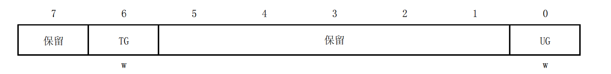

# 参考资源
```
书：
深入浅出STM8单片机入门、进阶与应用实例（比较啰嗦全面，看视频吧，书不建议，寄存器版本）
STM8单片机自学笔记（简洁易懂，寄存器版本。库函数版本）

软件：
STVD开发
IAR开发
STVP烧录固件

工具：ST-LINK仿真烧录器

数据手册下载网站：：https://www.alldatasheet.com,官网
```


# 时钟
**STM8单片机默认使用HSI RC时钟的8分频，即2 MHz**
## \*STM8的时钟源
STM8有四个可选时钟源：
- 1~24 MHz高速外部晶体振荡器(HSE,High Speed External crystal);
- 最大24 MHz高速外部时钟信号(HSE user - ext);
- 16 MHz高速内部RC振荡器(HSI,High Speed Internal RC oscillator);
- 128 kHz低速内部RC振荡器(LSI,LowSpeed Internal RC)。
具体内容，参考书本，此处不过多解释。
### HSI(最常用)
相关寄存器：
- CLK_CKDIVR分频因子
- CLK_ICKR的标志位HSIRDY，指示HSI是否稳定
- CLK_ICKR的HSIEN使能位，负责打开关闭HSI
### LSI
低功耗，低成本时钟源，可用于停机模式维持独立看门狗，或自动唤醒单元AWU
相关寄存器：
- CLK_ICKR的LSIEN使能位，负责打开关闭LSI
- CLK_ICKR的LSIRDY标志位，指示LSI是否稳定
## 示例代码（HSI,寄存器版本)
```
#include "iostm8s005k6.h"
void CLK_Config(void)
{
	CLK_CKDIVR=0X00;//HSI不分频，单片机工作在16 MHz
}

void main(void)
{
	CLK_Config();	
	while(1);//死循环，防止程序跑飞
}

//程序参数纠错//别问为什么，反正不加报错
#ifdef USE_FULL_ASSERT
void assert_failed(u8* file, u32 line)
{ 

}
#endif
```
## 示例代码（HSI,库函数版本）
```
#include "stm8s.h"
#include "stm8s_clk.h"
void CLK_Config(void)
{
	CLK_HSIPrescalerConfig(CLK_PRESCALER_HSIDIV1);//HSI不分频，单片机工作在16 MHz
}

void main(void)
{
	CLK_Config();	
	while(1);//死循环，防止程序跑飞
}

//程序参数纠错//别问为什么，反正不加报错
#ifdef USE_FULL_ASSERT
void assert_failed(u8* file, u32 line)
{ 

}
#endif
```

# GPIO
### 支持的GPIO配置模式


## 推挽、开漏、上拉、悬浮详解
**悬浮输入：** 引脚电平状态不确定，易受外界影响，适用于部电压采集，A/D模数转换。
**上拉输入：** 连接上拉电阻，稳定电平，减少外界干扰。应用于外部按键。
**推挽输出：** 输出确定的高低电平，由于接了上拉/下拉电阻，所以可以借此提高负载驱动能力，提高开关速度。
**开漏输出：** 自身无法输出确定的高电平，只能输出低电平。仅可通过外接外部上拉电阻来输出高电平。优点是低功耗，电平转换。
## 相关寄存器
每个GPI0端口都分配有五个寄存器:
- 输出数据寄存器 Px_ODR
- 输入数据寄存器 Px_IDR
- 数据方向寄存器 Px_DDR
- 控制寄存器1 Px_CR1
- 控制寄存器2 Px_CR2 （x表示端口组，取A~I)
DDR为0表示输入，为1表示输出
输入模式中：CR1为0表示悬浮，为1表示上拉
输出模式中：CR1为0表示开漏，为1表示推挽
输入模式中：CR2为0表是不开启中断，为1表示开启中断
输出模式中：CR2为0表示不采取快速模式，为1表示采取快速模式

在进行读操作是我们通过读取寄存器IDR的值获取引脚的电平状态，通过改变寄存器ODR的值进行输出。

## 示例代码（寄存器版本)
配置PB4~PB7为悬浮输入模式;
PB0~PB3为弱上拉输入模式;
读取PB端口状态赋值给变量“x”;
读取单一端口PB2状态赋值给变量“y”:
```
#include "iostm8s005k6.h"

void GPIO_Config(void)
{
	PB_DDR =0x00;//对应二进制为“0000 0000”， PB全端口均为输入模式
	PB_CR1=0x0F;//对应二进制为“0000 1111” ，PB4~PB7悬浮输入，PB0~PB3上拉输入
	PB_CR2=0X00;//不开启中断
}

void main(void)
{
	unsigned char x,y;
	
	//使用默认时钟，不做配置
	GPIO_Config();
	x=PB_IDR; //读取PB端口状态并赋值给变量“x”
	y= (PB_IDR>>2)&0x01; //读取PB2端口状态并赋值给变量“x”(理解一下位运算和&就知道为什么这么写了)	
	while(1);//死循环，防止程序跑飞
}

//程序参数纠错//别问为什么，反正不加报错
#ifdef USE_FULL_ASSERT
void assert_failed(u8* file, u32 line)
{ 

}
#endif
```
配置PB组GPI0端口高4位为2MHz速率开漏输出模式，低4位为
10MHz速率推挽输出模式，让端口输出“0101 0111” 电平状态: 
```
#include "iostm8s005k6.h"
void GPIO_Config(void)
{
	PB_DDR =0xFF;//对应二进制为“1111 1111”， PB全端口均为输出模式
	PB_CR1=0x0F;//对应二进制为“0000 1111”，高4位(PB7-PB4)开漏输出，低4位(PB3-PB0)推挽输出
	PB_CR2=0x0F;//对应二进制为“0000 1111” ，高4位2MHz速率，低4位10MHz速率
	PB_ODR= 0x57;//对应二进制为“0101 0111” ，即为用户自定义初始输出状态数据
}

void main(void)
{
	//使用默认时钟，不做配置
	GPIO_Config();
	while(1);//死循环，防止程序跑飞
}

//程序参数纠错//别问为什么，反正不加报错
#ifdef USE_FULL_ASSERT
void assert_failed(u8* file, u32 line)
{ 

}
#endif
```
Stm8中进行位操作也有如同51中P1_1这样的用法，是在头文件例如iostm8s005k6.h中定义好的。
## 示例代码（库函数版本）
配置PB4~PB7为悬浮输入模式;
PB0~PB3为弱上拉输入模式;
读取PB端口状态赋值给变量“x”;
读取单一端口PB2状态赋值给变量“y”:
```
#include "stm8s.h"
#include "stm8s_gpio.h"

void GPIO_Config(void)
{
	//配置PB4~PB7为悬浮输入模式
	GPIO_Init(GPIOB, GPIO_PIN_4|GPIO_PIN_5|GPIO_PIN_6|GPIO_PIN_7, GPIO_MODE_IN_FL_NO_IT );
	//PB0~PB3为弱上拉输入模式
	GPIO_Init(GPIOB, GPIO_PIN_0|GPIO_PIN_1|GPIO_PIN_2|GPIO_PIN_3, GPIO_MODE_IN_PU_NO_IT);
}

void main(void)
{
        u8 x,y;
	//使用默认时钟，不做配置
	GPIO_Config();
	x=GPIO_ReadInputData(GPIOB); //读取PB端口状态并赋值给变量“x”
	y= GPIO_ReadInputPin(GPIOB,GPIO_PIN_2); //读取PB2端口状态并赋值给变量“x”(理解一下位运算和&就知道为什么这么写了)	
	while(1);//死循环，防止程序跑飞
}

//程序参数纠错//别问为什么，反正不加报错
#ifdef USE_FULL_ASSERT
void assert_failed(u8* file, u32 line)
{ 

}
#endif
```


# 中断
## 中断类型
STM8可处理的中断分为两类：
- **不可屏蔽中断**，无法关闭，只要发生CPU必须去处理
- **可屏蔽中断**，可以关闭，通过下面代码可以关闭开启
	- asm("sim");                     //关闭系统总中断
	- asm("rim");                     //打开系统总中断
可屏蔽中断有内嵌的外部中断（定时器中断，ADC中断等等），IO口外部中断（比如检测到高电平触发中断，或者检测到低电平，上升/下降沿）
## 中断管理模式
STM8有两种中断管理模式：
- **非嵌套模式**，所有可屏蔽中断同软件中断优先级，因而不可抢占
- **嵌套模式**，有不同软件中断优先级，因而可抢占
中断优先级有软件中断优先级和硬件中断优先级之分，具体不必细究(计算机组成原理有讲解)，软件中断可由程序员配置，硬件中断出厂确定无可更改。
**中断的判断逻辑如下：**
- 谁先发生，谁先中断（无其他中断执行）
- 同时发生，先比较软件中断优先级，优先级高的先执行，如果软件中断优先级相同，比较硬件中断优先级，优先级高的先执行。（无其他中断执行）
- 假设A中断正执行，B中断发生，比较软件中断优先级。若B的软件优先级高于A，B中断可以打断A，抢占到CPU，先执行。若B的软件优先级不高于A，必须等待A中断执行完毕，才能继续争夺CPU。
## 相关寄存器
- CPU条件寄存器CCR
- 软件优先级寄存器ITC_SPRx，设置外部中断的软件中断优先级
- 外部中断控制寄存器EXTI_CR1、EXTI_CR2，设置外部中断触发方式（下降沿，上升沿，高低电平触发）
## 示例代码(UART中断)
## 示例代码(TIM4中断)

# 基本定时器TIM4
STM8中TIM4的时钟源来自于系统时钟$f_{MASTER}$ ，$f_{MASTER}$ 默认是HSI的8分频2 MHz。
## 相关寄存器
- TIM4_CR1控制寄存器：
	- ARPE位置1，使能自动预装载
	- CEN位置1，使能计数器，使计数器开始计数
- TIM4_IER中断使能寄存器
	- UIE位置1，打开定时器4中断
- TIM4_SR1状态寄存器
	- UIF位置1，说明发生溢出，定时器中断被触发。会执行定时器中断函数（执行中断函数时，要清零UIF位，否则会循环一直执行中断函数)。
- TIM4_EGR事件产生寄存器
- TIM4_CNTR计数器
	- TIM4_CNTR存放计数值
- TIM4_PSCR预分频寄存器
	- 用于预分频，确定计数器每过去多少时间加1
	- PSC[2:0]，有三位，可取值0-7
	- 定时器频率=$\frac{f_{MASTER}}{2^{PSC[2:0]}}$ 
	- 比如如果主频是16 MHz，PSC[2:0]设为7，那么定时器时钟频率就是16MHz/2^7=125 KHz
- TIM4_ARR自动重装载寄存器
	- 确认计数器的计数最大值，当计数器值超过此最大值，将触发定时器中断。
## 定时器的工作过程
- 计数器 有一个初值，假设是5吧
- 有一个计数器(CNTR)，第一次计数从初值5开始数数，每隔一段时间加1，
- 有一个计数器最大值(ARR)，假设是200吧，计数器达到200，会判定发生溢出，将标志位置1
- 有一个标志位(UIF)，用来判断计数器的值是否达到200，达到后会执行设定的相关事件(中断处理函数)
- 事件执行完后，计数器从0开始计数，重复上述行为。

## 示例代码（寄存器版本)
```
#include "iostm8s005k6.h"

void TIM4_Config(void)
{
  
	TIM4_IER=0x00;          //先关闭定时器4中断
	TIM4_EGR = 0x00;        //
	TIM4_PSCR = 7;          //定时器4时钟=16MHz/2^7=125KHZ 
	//125KHZ意味着，计数器每隔1/125K s加1，计数125次，时间过去1ms。 
	TIM4_ARR = 125;         //设定1定时器产生1毫秒重装载时的计数值，255是最大值
	TIM4_CNTR = 0x00;       //设定计数器的初值为0
	TIM4_SR=0x00;            //清除中断标志位
	TIM4_CR1|=0x81;           //使能定时器4，开始计数、使能自动预装载
	TIM4_IER |= 0x01;           //打开定时器中断
}

void main(void)
{
	asm("sim");                     //关闭系统总中断
	CLK_CKDIVR = 0x00;              //CPUDIV = 1 HSIDIV = 1  内部时钟 = 16Mhz
	TIM4_Config();
	asm("rim"); //打开系统总中断
	while(1);//死循环，防止程序跑飞
}

#pragma vector = 25     //设置定时器4重载的中断向量号 = 25
__interrupt void TIM4_UPDATE_IRQHandler(void)//定时器4中断处理函数
{
	TIM4_SR = 0x00;  //清除中断标志UIF
	//自定义代码
}


//程序参数纠错//别问为什么，反正不加报错
#ifdef USE_FULL_ASSERT
void assert_failed(u8* file, u32 line)
{ 

}
#endif
```
## 示例代码（库函数版本）

```
#include "stm8s.h"
#include "stm8s_tim4.h"


void TIM4_Config(void)
{
	TIM4_DeInit();//重置回默认值
	TIM4_TimeBaseInit(TIM4_PRESCALER_128,125);//定时器4时钟=16MHz/2^7=125KHZ ，设定1定时器产生1毫秒重装载时的计数值，255是最大值
	TIM4_SetCounter(0);//可省略，计数器的默认初值本就为0
	TIM4_ARRPreloadConfig(ENABLE);//使能自动预装载，也不是必须有的
	TIM4_ITConfig(TIM4_IT_UPDATE,ENABLE );//打开定时器中断
	TIM4_Cmd(ENABLE);//使能定时器4,开始计数
}

void CLK_Config(void)
{
	CLK_HSIPrescalerConfig(CLK_PRESCALER_HSIDIV1);//HSI不分频，单片机工作在16 MHz
}
void main(void)
{
	asm("sim");                     //关闭系统总中断
	CLK_Config();              //CPUDIV = 1 HSIDIV = 1  内部时钟 = 16Mhz
	TIM4_Config();
	asm("rim"); //打开系统总中断
	while(1);//死循环，防止程序跑飞
}

#pragma vector = 25     //设置定时器4重载的中断向量号 = 25
__interrupt void TIM4_UPDATE_IRQHandler(void)//定时器4中断处理函数
{
	TIM4_ClearITPendingBit(TIM4_IT_UPDATE);  //清除中断标志UIF
	//自定义代码
}


//程序参数纠错//别问为什么，反正不加报错
#ifdef USE_FULL_ASSERT
void assert_failed(u8* file, u32 line)
{ 

}
#endif
```
# 高级控制定时器TIM1

# UART
## 串口通信

串口通信（Serial communication）是一种通信方式，通过串行（逐位）传输数据。它是计算机和其他设备之间传输数据的常用方法。串口通信有多种类型，如 UART（通用异步收发器）、SPI（串行外设接口）、I2C（内部集成电路总线）等。
## 定义

UART（通用异步收发器）是一种异步串行通信协议，使用两个数据线进行通信：TX（发送）和 RX（接收）。UART 通信具有以下特点：

- 异步：通信双方不需要共享时钟信号，而是各自有一个独立的时钟源。通信的开始和结束由起始位和停止位来标识。
- 数据帧结构：每个数据帧通常包括一个起始位、5到9个数据位、一个可选的奇偶校验位和一个或两个停止位。
- 波特率：通信速率，即每秒传输的位数。通信双方需要设置相同的波特率以进行有效通信。
- UART 通信只需两个设备之间的两个数据线，适用于点对点通信。
- 可扩展：通过添加额外的硬件（例如 RS-232、RS-485、RS-422 等），UART 通信可以用于长距离传输或多设备通信。

## UART 通信过程

- 发送设备将要发送的字节（8位数据）从并行到串行转换，并将起始位、数据位、奇偶校验位（可选）和停止位组合成一个数据帧。
- 数据帧通过 TX 线发出，连接对面的RX引脚。
- 接收设备的 RX 线接收数据帧，连接对面的TX引脚。
- 接收设备通过内部时钟，从起始位开始，同步地对接收到的数据位进行采样。
- 将接收到的数据位转换回字节，并检查奇偶校验位（如果存在）以确保数据传输的正确性。
- 如NE果数据有效，接收设备会处理这些数据。如果检测到错误，接收设备可以请求重发。
## 相关寄存器
- UART_SR状态寄存器
	- TXE：置1，说明发送数据寄存器空，可以发送下一字节数据（写UART_DR会自动将TXE置0)
	- TC：置1，说明一帧发送完毕。
	- RXNE：置1，说明读数据寄存器非空，数据已经接收
- UART_DR数据寄存器
	- 用于存放接收到的数据，与要发送的数据
	- 接收数据：dat=UART2_DR
	- 发送数据：UART2_DR=dat
- UART_BRR1、UART_BRR2波特率寄存器
	- 用于设置波特率
	- 比如2MHz时钟下9600波特率，2 000 000/9600=208=0x00d0,故BRR2=0x00（波特率的高4位与低4位）,BRR1=0x0d(波特率的中间8位)
- UART_CR1控制寄存器
	- 用来配置接收数据的位数
	- M字长，置0是8个数据位，置1是9个数据位
	- UARTD 禁用UART，置0是使能UART，置1是禁用UART
	- PCEN使能校验位，置0是无校验位，置1是有奇偶校验位
- UART_CR2控制寄存器
	- 用来使能UART发送和接收，使能发送和接收中断等
	- RIEN接收中断使能，置1可使能接收中断
	- TEN发送使能，允许UART发送数据
	- REN接收使能，允许UART接收数据
- UART_CR3控制寄存器
	- 设置停止位个数，STOP[1:0]为00、10、11分别表示1、2、1.5个停止位
## 示例代码（寄存器版本)
每接收到8字节数据，便将这8字节数据发送回去
```
#include "iostm8s005k6.h"

#define u8 unsigned char
#define u16 unsigned short
#define u32 unsigned long

u8 cntRxd=0;
u8 bufRxd[10]={0};
u8 sendFlag=0;

void UART2_Config(u32 baudrate)//主时钟16 MHz
{
	u32 baud=16000000/baudrate;
	//先写BRR2 , 再写BRR1
	UART2_BRR2 = ((u8)((baud & 0xf000) >> 8 )) | ((unsigned char)(baud & 0x000f));       //先写波特比率的高4位与低4位
	UART2_BRR1 =  ((u8)((baud & 0x0ff0) >> 4));      //后写波特比率的中间8位
	
	UART2_CR1 = 0x00; // 8位数据，无奇偶校验
	UART2_CR2 = 0x2C; // 发送使能，接收使能，接收中断使能
	UART2_CR3 = 0x00; // 1个停止位 

}

void UartWrite(u8 *buf,u8 len)
{
  while (len--)							//循环发送所有字节
  {
    
    UART2_DR =*buf++;						//发送一个字节数据
    while (!(UART2_SR&0X40));					//等待该字节发送完成
  }
  while (!(UART2_SR&0X80));					//等待一帧发送完成
}

void main(void)
{
	asm("sim");                     //关闭系统总中断
	CLK_CKDIVR = 0x00;              //CPUDIV = 1 HSIDIV = 1  内部时钟 = 16Mhz
	UART2_Config(9600);//设置波特率为9600
	asm("rim"); //打开系统总中断
	while(1)
	{
		if(sendFlag==1)
		{
			UartWrite(bufRxd,cntRxd);
			cntRxd=0;
			sendFlag=0;
		}
	}
}

#pragma vector = 23              //设置串口2接收中断向量号 = 23
__interrupt void UART2_RX_RXNE(void)//UART2接收中断处理函数
{    
	if((UART2_SR&0X20)) 
	{
                UART2_SR&=~(0x20);//清除接收中断标志位
		if(cntRxd<8)
		{
			bufRxd[cntRxd++]=UART2_DR;
		}
                if(cntRxd==8)
		{
			sendFlag=1;
		}
	}	
}


//程序参数纠错//别问为什么，反正不加报错
#ifdef USE_FULL_ASSERT
void assert_failed(u8* file, u32 line)
{ 

}
#endif
```
## 示例代码（库函数版本）
每接收到8字节数据，便将这8字节数据发送回去
```

#include "stm8s.h"
#include "stm8s_uart2.h"

u8 cntRxd=0;
u8 bufRxd[10]={0};
u8 sendFlag=0;

void UART2_Config(u32 baud)//主时钟16 MHz
{
	UART2_DeInit();//恢复默认配置
	//配置串口参数为：波特率baud，8位数据位，1位停止位，无校验，禁止同步传输，允许接收发送
	UART2_Init((u32)baud,
	           UART2_WORDLENGTH_8D,
	           UART2_STOPBITS_1,
	           UART2_PARITY_NO,
	           UART2_SYNCMODE_CLOCK_DISABLE,
	           UART2_MODE_TXRX_ENABLE);
	UART2_ITConfig(UART2_IT_RXNE_OR, ENABLE);//使能接收中断
	UART2_Cmd(ENABLE);//使能UART

}

void CLK_Config(void)
{
	CLK_HSIPrescalerConfig(CLK_PRESCALER_HSIDIV1);//HSI不分频，单片机工作在16 MHz
}

void UartWrite(u8 *buf,u8 len)
{
	while (len--)							//循环发送所有字节
	{
		UART2_SendData8(*buf++);                                    //发送一个字节数据					
		while(!UART2_GetFlagStatus(UART2_FLAG_TXE));					//等待该字节发送完成
	}
	while(!UART2_GetFlagStatus(UART2_FLAG_TC));//等待一帧发送完成
}


void main(void)
{
	asm("sim");                     //关闭系统总中断
	CLK_Config();              //CPUDIV = 1 HSIDIV = 1  内部时钟 = 16Mhz
	UART2_Config(9600);//设置波特率为9600
	asm("rim"); //打开系统总中断
	while(1)
	{
		if(sendFlag==1)
		{
			UartWrite(bufRxd,cntRxd);
			cntRxd=0;
			sendFlag=0;
		}
	}
}

#pragma vector = 23              //设置串口2接收中断向量号 = 23
__interrupt void UART2_RX_RXNE(void)//UART2接收中断处理函数
{    
	if(UART2_GetITStatus(UART2_IT_RXNE) != RESET) 
	{
                 UART2_ClearITPendingBit(UART2_IT_RXNE);            //清除UART1挂起标志//清除接收中断标志位
		if(cntRxd<8)
		{
			bufRxd[cntRxd++]=UART2_ReceiveData8();
		}
                if(cntRxd==8)
		{
			sendFlag=1;
		}
	}	
}


//程序参数纠错//别问为什么，反正不加报错
#ifdef USE_FULL_ASSERT
void assert_failed(u8* file, u32 line)
{ 

}
#endif
```


# AD模数转换
# SPI
# IIC
## IIC定义
- IIC总线是两线式串行总线，用于连接多个芯片和传感器。由两条信号线完成通信，是半双工通信协议：SDA——数据线、SCL——时钟线
- IIC同时支持多个主机和多个从机，每个设备都有7位的唯一的地址。其中产生时钟信号的是主机，在此时，接收数据的都被认为是从机。
- 一般采用开漏结构和总线相连，因此SCL和SDA都需接上拉电阻。故总线空闲，SCL,SDA均为高电平，连接总线任一器件输出低电平，都会拉低总线电平。
## IIC通信时序

- **空闲状态**：SCL线与SDA线均处于高电平状态，等待起始信号
- **起始信号**：由主机发送。SCL线为高电平期间，SDA线由高电平向低电平的变化表示起始信号。
- **停止信号**：由主机发送。SCL线为高电平期间，SDA线由低电平向高电平的变化表示停止信号（释放SDA时，SDA会自动被拉高）
- **数据传输**：SCL为低电平期间，才允许改变SDA电平，传输数据。SCK为高电平时，用以数据读取。故除开始结束信号外，SCL高电平时，不允许改变SDA。
- **数据传送格式**：以8位字节为单位传送，高位在前。每个字节发送完成后，通信过程中需要严格遵守IIC总线协议，包括起始信号、控制字节、地址字节、数据字节、应答信号、停止信号等。
- **应答信号ACK：** 
	- 当每个字节发送完成后，如果希望继续发送数据，而不是停止通信，接收方应该发送ACK表示接收到数据，请继续通信。举例说明，当主设备是发送方，向从设备写数据，从设备接收完一个字节还希望继续接收的话，会发送ACK信号，而主设备将接收到ACK。当主设备是接收方，从从设备读数据，接收完一个字节还希望继续接收的话，将发送ACK数据告诉从机。
	- 当发送方传送完8位时，发送方释放SDA，由接收方控制SDA，且SDA=0；
- **应答信号NACK：** 
	- 当每个字节发送完成后，如果不希望继续发送数据，停止通信，接收方将发送NACK表示停止通信。
	- 当发送方传送完8位时，发送方释放SDA，由接收方控制SDA，且SDA=1。
- **地址字节：** 由7位设备地址，加一位R/$\overline{W}$构成。R/$\overline{W}$为1表示接下来是主机读信号，从机发送信号，为0表示接下来是主机发送，从机读取。（上面有一横，表示低电平有效）
## 示例代码
```
#define SCL_PORT GPIOx
#define SCL_PIN GPIO_PIN_x

#define SDA_PORT GPIOx
#define SDA_PIN GPIO_PIN_x

#define SCL_H              GPIO_WriteHigh(SCL_PORT, SCL_PIN)
#define SCL_L              GPIO_WriteLow(SCL_PORT, SCL_PIN)
#define SDA_H              GPIO_WriteHigh(SDA_PORT, SDA_PIN)
#define SDA_L              GPIO_WriteLow(SDA_PORT, SDA_PIN)

#define SDAM             GPIO_ReadInputPin(SDA_PORT, SDA_PIN)
#define SET_SCL_OUT()    {GPIO_Init(SCL_PORT, SCL_PIN, GPIO_MODE_OUT_PP_HIGH_SLOW);}
#define SET_SDA_OUT()    {GPIO_Init(SDA_PORT, SDA_PIN, GPIO_MODE_OUT_PP_HIGH_SLOW);}
#define SET_SDA_IN()     {GPIO_Init(SDA_PORT, SDA_PIN, GPIO_MODE_IN_FL_NO_IT);}
#define IIC_TIME()       delayus(5)

void IIC_Init(void)
{
    //将两个数据线都设置为输出模式,起始高电平
    SET_SCL_OUT();
    SET_SDA_OUT();
}

void IIC_Start(void)	//SCL线为高电平期间，SDA线由高电平向低电平
{
	SET_SDA_OUT();
	SCL_H;
	SDA_H;
	IIC_TIME();		//等待电平稳定
	SDA_L;				//拉低SDA电平，发送开始信号
	IIC_TIME();
	SCL_L;				//拉低SCL电平，等待数据传输
}

void IIC_Stop(void)	//SCL为高电平期间，SDA由低电平到高电平
{
	SET_SDA_OUT();
	SDA_L;			//电平置低
	IIC_TIME();
	SCL_H;			//数据读取
	IIC_TIME();
	SDA_H;			//电平置高
}

void IIC_SetACK(void){  //发送ACK信号
	SET_SDA_OUT();
	SDA_L;				//发送ACK
	IIC_TIME();
	SCL_H;				//数据读取
	IIC_TIME();
	SCL_L;				//便于下次操作
}

void IIC_SendNACK(void){	//发送NACK信号
	SET_SDA_OUT();
	SDA_H;					//发送ACK
	IIC_TIME();
	SCL_H;					//数据读取
	IIC_TIME();
	SCL_L;					//便于下次操作   
}

u8 IIC_RecvACK(void)
{
	u8 recvAck;
	SET_SDA_IN();
	SCL_H;				//准备读取SDA
	IIC_TIME();
	recvAck=(u8)SDAM;	//读取SDA数据
	IIC_TIME();
    //占用SDA，由于接上拉电阻，默认输出高电平，此时SCL为高电平，可能会出现误发结束信号
    //因此先置低SCL，然后占用SDA
	SCL_L;
	SET_SDA_OUT();
	return recvAck;
}


u8 IIC_ReadByte(void){		//读取一个字节数据
	u8 i,dat=0;
	SET_SDA_IN();
	for(i=0;i<8;i++)
	{
		SCL_H;				//数据读取，此处可判断SCL是否空闲，进行时钟同步
		dat<<=1;
		if(SDAM)
		{
			dat|=0x01;
		}else
		{
			dat&= 0xfe;
		}
		IIC_TIME();
		SCL_L;				//恢复SCL为低电平
		IIC_TIME();
	}
	SET_SDA_OUT();
	return dat;
}

u8 IIC_WriteByte(u8 dat){//发送一个字节数据

    u8 i;
    SET_SDA_OUT();//获取SDA
    for(i=0;i<8;i++)
    {
	    SCL_L;
	    IIC_TIME();
        if(dat&0x80){//传输的数据是高位在前
            SDA_H;
        }else{
            SDA_L;;
        }
        dat<<=1; 
        SCL_H;
        IIC_TIME();    
    }
    SCL_L;	
    IIC_TIME();
    return IIC_RecvACK();
}

```
# EEPROM


# 其他
#### **芯片引脚**


##### 数据手册的芯片引脚和现实的芯片引脚如何对应

可以看出，现实的芯片有一个小的圆形印记，将芯片的字体摆正，圆形印记在左下方，所以芯片的引脚是以左下方的第一个引脚为1号，逆时针编号到第n号(比如64)


