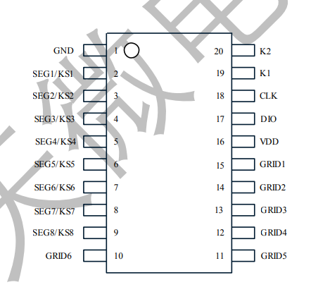
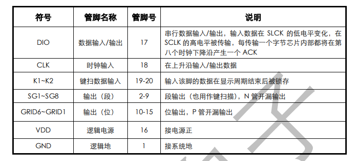
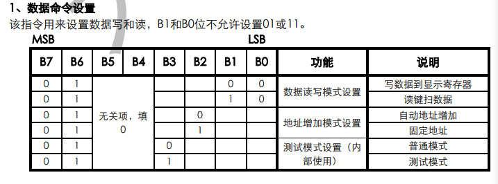
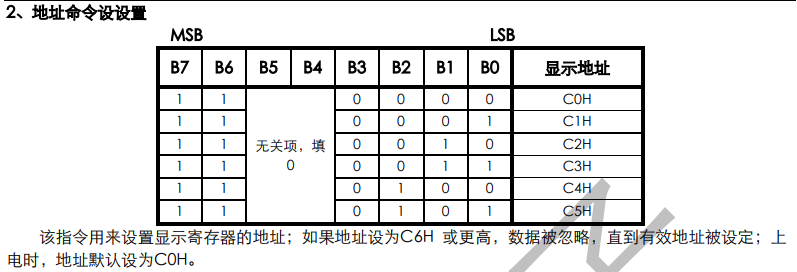
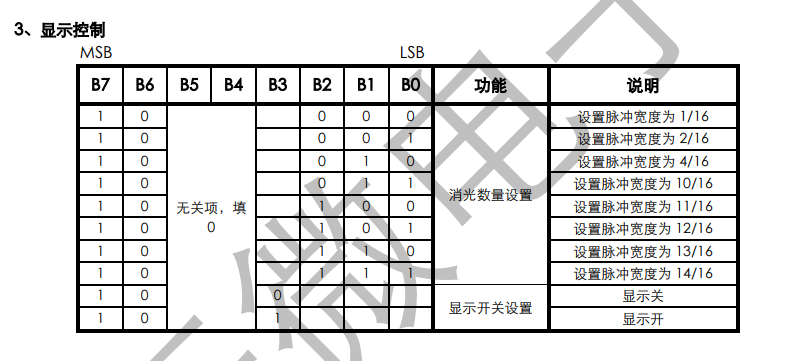
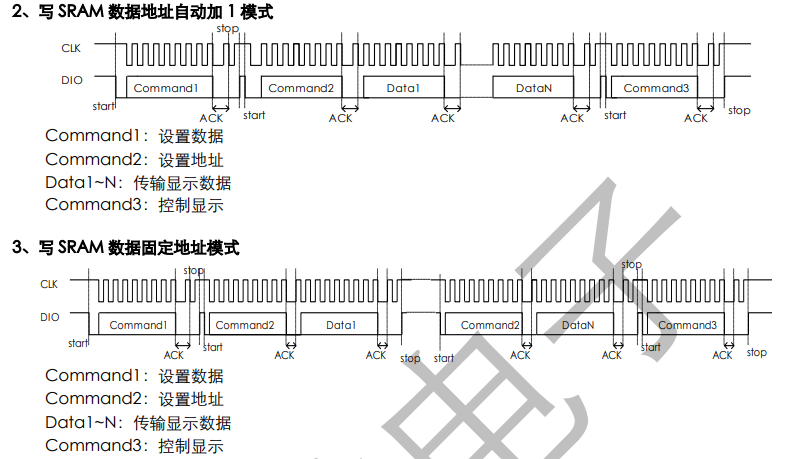

# TM1637驱动数码管

## TM1637

- TM1637是带键盘扫描接口的LED驱动控制专用电路。

- 显示模式（8段x6位），支持共阳数码管输出。
- 键扫描（8x2bit)，不支持组合按键。
- 两线串行接口（CLK,DIO)。

### TM1637引脚





### 驱动晶体管

TM1637驱动数码管需要：将数据写入到数码管对应的显示寄存器中，打开对应的数码管。
写入寄存器和打开数码管，都是对寄存器进行操作，写入命令或数据，这是第一个要点。
第二个要点是，MCU按照TM1637协议，与TM1637通信。

#### 写数据到寄存器

首先要知道在TM1637中，和数码管对应的6个字节的地址别是：
GRID1-GRID6：00H-05H，写显示数据时，按显示地址从低位到高位，从数据字节的低位到高位操作。

写显示数据到显示寄存器，需要先写数据命令，指明是写数据到显示寄存器。
然后需要写入地址命令，再之后是写显示的数据，最后写入控制显示命令，显示哪些数码管，以什么亮度显示。

##### 控制命令：



比如说，这里我们要驱动数码管亮，因此数据命令是0x40

比如说，如果我们是要驱动GRID3对应的数码管亮，就要写入数据到C2H，地址命令是0xC2.

比如说，如果我们希望所有的数码管亮，且亮度最大，那么显示控制命令是0x84|0x87=0x8f

#### TM1637时序

TM1637协议是非常规的IIC协议，首先要注意它是先传输低位，再传输高位数据的，并且与IIC协议不同，它没有IIC从设备地址。
TM1637写数据时序图：




```
#include"tm1637.h"
void IIC_Delay(){
	_nop_();_nop_();_nop_();
	_nop_();_nop_();_nop_();
}

void IIC_Start(){
	//CLK,SCL初始高电平
	CLK=1;
	SDA=1;
	IIC_Delay();//等待电路稳定
	//SDA由高电平跳到低电平，发送开始信号
	SDA=0;
	IIC_Delay();
	CLK=0;//便于下个信号发送，防止误读
	IIC_Delay();
	IIC_Delay();
	IIC_Delay();
}

void IIC_Stop(){
	CLK=0;//进入数据传输状态
	IIC_Delay();
	SDA=0;//SDA开始时为低电平
	IIC_Delay();
	CLK=1;//进入数据发送/接收状态
	IIC_Delay();
	SDA=1;//SDA由低电平跳到高电平，发送结束信号
	IIC_Delay();
}
void delay_6us()
{
	_nop_();
}		
void IIC_GetAck(){
	u8 ack;
	CLK=0;
	SDA=1;//释放SDA
	IIC_Delay();
	while(SDA);//等待接收方发送ack信号
	CLK=1;//通知接收方发送ack信号
	IIC_Delay();
	
//	return ack;	
}
void IIC_SetAck(){
	CLK=0;
	IIC_Delay();
	SDA=0;//发送ack信号
	IIC_Delay();
	CLK=1;//通知接收方接收ack信号
	IIC_Delay();
	CLK=0;
	IIC_Delay();
}


void TM1637_Write_cmd(Byte cmd)  //写一个字节
{
	Byte n;
	IIC_start();

	for(n=0;n<8;n++)
	{
		CLK = 0;
		delay_6us();
		SDA = cmd&0x01;
	/*	if(cmd&0x01)
		{
			SDA = 1;	
		}
		else
		{
			SDA = 0;
		}	*/
		cmd>>=1;
		CLK = 1;
		delay_6us();		
	}
}

Byte Keysacn()	//键盘扫描函数
{
	Byte n,key_value;
	IIC_start();
	TM1637_Write_cmd(0x42);
	IIC_ack();
	SDA = 1;
	for(n=0;n<8;n++)
	{
		CLK = 0;
		delay_6us();
		key_value = key_value>>1;
	//  key_value>>=1;
		CLK = 1;
		if(SDA)
		{
			key_value = key_value|0x80;
		}
		else
		{
			key_value = key_value|0x00;
		}
		delay_6us();
		delay_6us();
		delay_6us();
			
	}
	IIC_ack();
	IIC_stop();	 
	return (key_value);
}

void Display(Byte dat)	//显示函数
{
	Byte n;
	IIC_start();
	TM1637_Write_cmd(0x40);
	IIC_GetAck();
	IIC_stop();
	IIC_start();
	TM1637_Write_cmd(0xc0);
	IIC_GetAck();
	for(n=0;n<6;n++)
	{
		TM1637_Write_cmd(dat);
		IIC_GetAck();	
	}
	IIC_stop();
	IIC_start();
	TM1637_Write_cmd(0x8f);
	IIC_GetAck();
	IIC_stop();	
}

void TM1637_Init()	//初始化函数
{
	IIC_start();
	TM1637_Write_cmd(0x8f);
	IIC_GetAck();
	IIC_stop;
}
 

```

