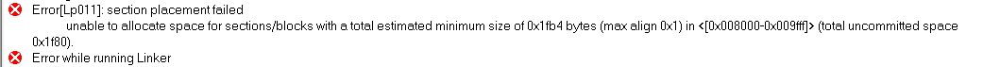
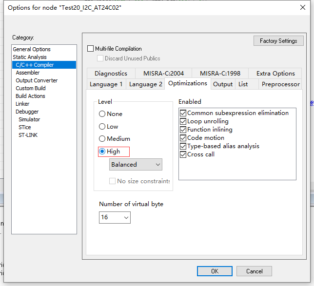
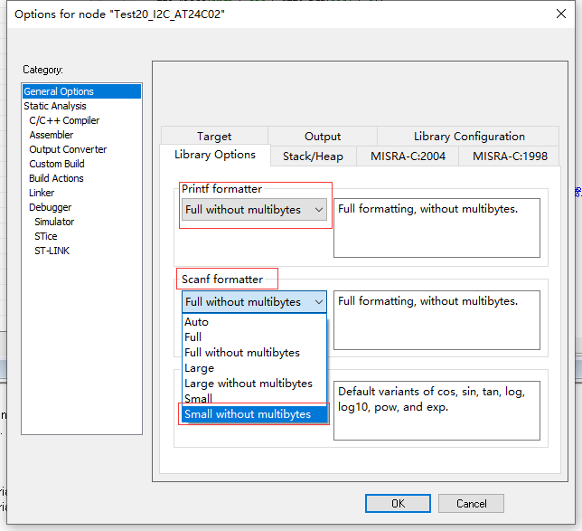

# IAR

##### 错误1

**unable to allocate space for sections/blocks with a total estimated minimum size of 0x1fb4 bytes (max align 0x1) in <[0x008000-0x009fff]> (total uncommitted space**  

**解决办法**

- options-->C/C++ Compiler-->Optimizations：将Level改为High

- options-->General Options-->Library Options：

  Printf formatter与Scanf formatter改小，比如改为Small without multibyte