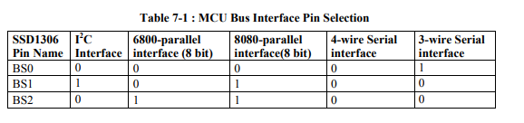
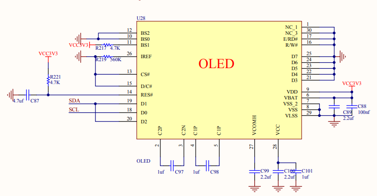
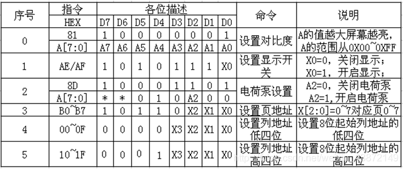

# 各类屏幕介绍

## 点阵屏

点阵屏(Dot matrix screen)指在显示屏上长和宽各能显示出多少个像素点。
*从技术角度来说，所有屏幕都是以像素矩阵的形式显示，都是点阵屏，但在日常语言中，人们通常会将"点阵屏"这个术语更多地用于指代传统的液晶点阵屏或LED点阵屏，而将其他类型的屏幕根据其特定技术特征进行分类和命名。就好比485明明是物理层的通讯协议，没有规定帧的格式，但是市面上有很多运行于数据链路层的私有485协议，实际上它们不是485协议，只是基于485协议的私有数据链路层协议，但大家都称呼它为私有485协议。*
下面是一些点阵屏：


## 段码(笔段式)屏

段码屏（Segment Display）通常被认为是一种特殊类型的点阵屏(你也可以认为不是)。点阵屏是一种将图像或文本信息分割成像素矩阵的显示设备，而段码屏是其中的一种变体。

段码屏通常由七段显示器或十六段显示器组成，每个段（或几个段）对应一个特定的字符或数字。每个段可以通过控制电压或电流来点亮或熄灭，从而显示出不同的字符或数字。段码屏在数字显示和字符显示方面非常常见，例如用于显示数字时钟、计数器、温度显示等。


## LED屏(Light-Emitting Diode Display)

Light-Emitting Diode翻译为发光二极管，由它的名字就可以看出，LED屏是通过使用发光二极管（LED）作为像素点来显示图像的显示屏。

下面是一些LED屏


## LCD(Liquid Crystal Display)

Liquid Crystal Display翻译为液晶显示屏，LCD是一种使用液晶材料来控制光的透过程度来显示图像和字符的技术。

LCD屏幕可以分为图形型和字符型，它们在显示内容和使用方式上有一些区别：

1. 图形型LCD屏幕：图形型LCD屏幕通常具有较高的分辨率和灵活性，可以显示更复杂的图形和图像。它们可以通过像素级别的控制来显示任意的图形和图像，可以绘制线条、曲线、点阵图像等。图形型LCD屏幕通常用于需要显示较复杂图形的应用场景，如图形用户界面（GUI）显示、图表绘制等。
   

2. 字符型LCD屏幕：字符型LCD屏幕由一组预定义的字符组成，每个字符由一个固定大小的点阵矩阵表示。字符型LCD屏幕可以显示有限数量的字符，通常用于显示文本信息，如字母、数字、符号等。它们通常具有较低的分辨率，但可以显示大量的字符，并且能够提供简单的文本显示功能。
   字符型LCD用于显示字符，每个字符像素矩阵间都有预留的间隔，强行用来显示图片就会出现下图所示画面。

   

区别总结如下：

- 图形型LCD屏幕具有较高的分辨率和灵活性，可以显示复杂的图形和图像。
- 字符型LCD屏幕由预定义的字符组成，每个字符具有固定的点阵表示，用于显示有限数量的字符和文本信息。

## OLED屏 (Organic Light-Emitting Diode)

Organic Light-Emitting Diode意为有机发光二极管。OLED是一种利用有机化合物作为发光材料的显示技术，它能够直接发光而无需背光源。

## TFT(Thin Film Transistor)

Thin Film Transistor意为薄膜晶体管。TFT是一种液晶显示屏的技术，其中每个液晶像素点都与一个薄膜晶体管相连，通过控制晶体管的电流来控制像素的亮度和颜色。

# SSD1306

## MCU接口

SSD1306总共有8个数据引脚和5个控制引脚，不同的MCU模块可以通过BS[2:0]引脚选择设置




如下图所示，它就使用的是IIC接口，从它BS0-2的接线情况可以看出。而出于节省IO引脚的需要，其余引脚也是参照上表配置的。



### MCU I2C接口

```
I2C通讯接口由从机地址为SA0(D/C#引脚作为SA0), I2C总线数据信号(SDAout/D2输出和SDAin/D1输入)和I2C
总线时钟信号SCL (D0) 组成。数据和时钟信号线都必须接上上拉电阻。RES#用来初始化设
备。
```

- I2C通信的地址由7位从机地址加1位读写控制，即$011110 + SA0+R/W\#$位组成
- R/W位是I2C的读写选择(1读0写)，一般向OLED写数据居多，极少读，因此下图为了节省IO口，R/W#接地了。
- 而SSD1306中，SA0位为从机地址提供一位的扩展，0111100和0111101都可以作为从机地址，下图的D/C#引脚接地表示从机地址为0111100
- RES#为0会初始化设备。所以可以看出与上面的例子不同下图的例子出于某种需要RES#不再是接地。


### 命令表

SSD1306的部分常用命令如下所示
在SSD1306中，有的命令是单字节命令，有的是双字节命令。比如设置显示开关0xAE就是关闭OLED屏幕，是单字节命令。比如设置对比度(亮度)的命令就是双字节命令，可以认为0x81是一个命令头，只有先发送0x81，才允许发送对比度进行设置，否则命令无效，而从图中可以看出A[7:0]都是用于对比度设置，因此对比度取值为0x00-0xFF。



具体的命令参见数据手册，现就SSD1306的初始化命令为例，对其命令表进行介绍。

```
//将OLED面板关闭(睡眠模式)
OLED_WriteCommond(0xae);//单字节命令

//设置显示起始行地址(0x40-0x7F，共64行，每行一像素)，
OLED_WriteCommond(0x40); 

//设置列、行扫描方向。0xa1和0xc8表示从0行0列开始扫描
OLED_WriteCommond(0xa1);//set SEG/Column Mapping     0xa0左右反置 0xa1正常
OLED_WriteCommond(0xc8);//set COM/Row Scan Direction   0xc0上下反置 0xc8正常


//设置显示偏移A[5:0]
//经实验偏移由0x00-->0x03图像上移了些许
OLED_WriteCommond(0xd3);
OLED_WriteCommond(0x00);

//设置对比度和亮度。
OLED_WriteCommond(0x81);//set contrast control register
OLED_WriteCommond(0xcf);//set SEG Output Current Brightness(0x00-0xff)

//设置时钟分频和RC振荡器频率。 A[3:0] 分频因子, A[7:4] 震荡频率设置
OLED_WriteCommond(0xd5);//双字节命令
OLED_WriteCommond(0x80);

//设置多路复用比例A[5:0]
OLED_WriteCommond(0xa8);
OLED_WriteCommond(0x3f)

//设置COM引脚硬件配置。
OLED_WriteCommond(0xda);//set com pins hardware configuration
OLED_WriteCommond(0x12);//Sequential COM pin configuration，Enable COM Left/Right remap

//设置预充电期间的持续时间
OLED_WriteCommond(0xd9);/*Set Pre-Charge Period */
OLED_WriteCommond(0xf1);

//设置VCOMH电压和VCOM Deselect电平。
OLED_WriteCommond(0xdb);/*Set VCOMH Deselect Level */
OLED_WriteCommond(0x40);/*set display start line*/  

//设置页面寻址模式(0x00水平寻址,01垂直寻址,02页寻址)
OLED_WriteCommond(0x20);
OLED_WriteCommond(0x02);


//恢复到RAM内容显示(重置)0xA4 根据RAM 内容显示，0xA5 屏幕全亮)
OLED_WriteCommond(0xa4);

//设置是否反相
OLED_WriteCommond(0xa6);//Set Normal/Inverse Display   0xA6正常,0xA7反相(白色背景，黑色前景)
、
//设置充电泵使能和禁用。0x14是启用，0x10是禁用
OLED_WriteCommond(0x8d);//set Charge Pump enable/disable
OLED_WriteCommond(0x14);//set(0x10) disable

//打开OLED面板（正常模式）
OLED_WriteCommond(0xaf);//打开屏幕
```

