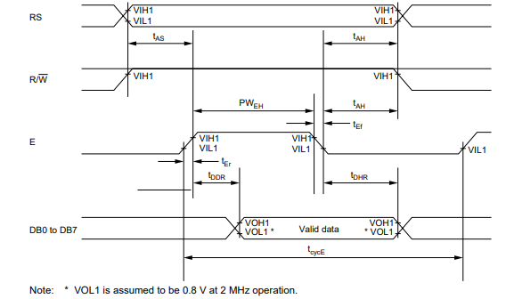
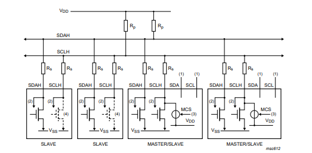
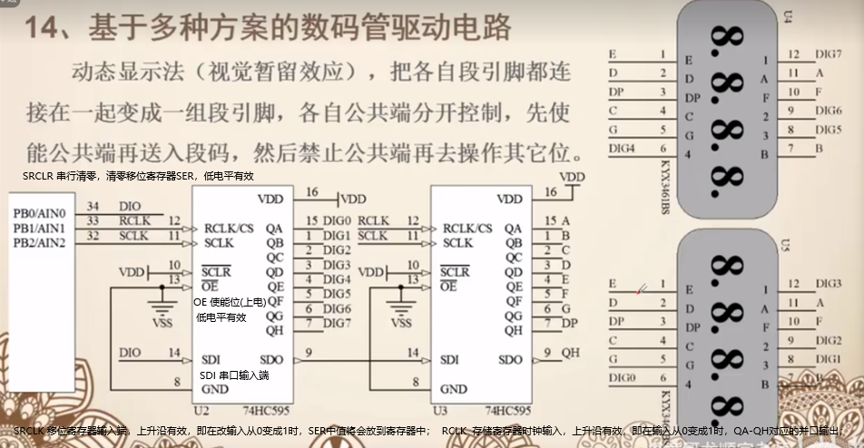
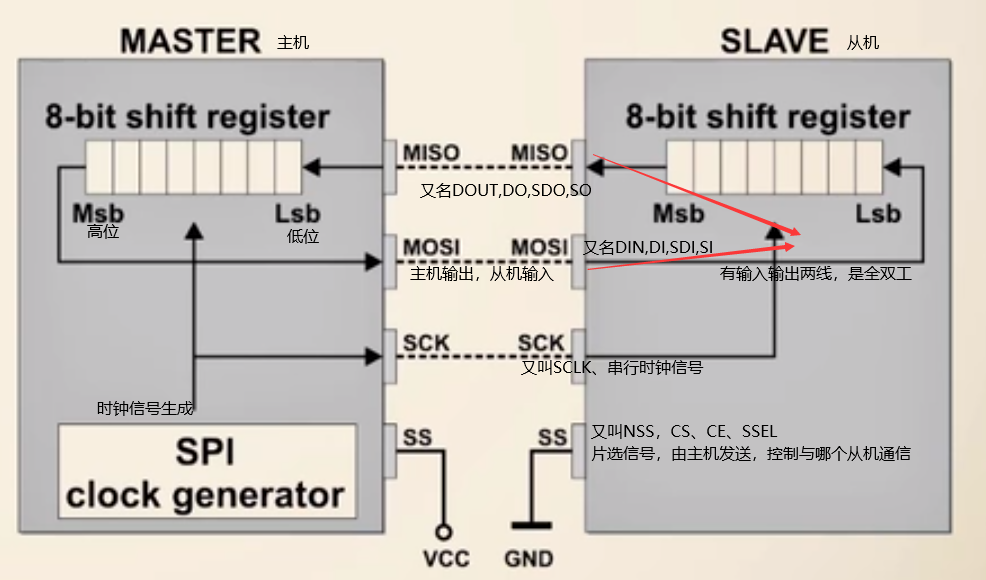

# 液晶显示屏

- 液晶显示屏依靠驱动芯片来控制显示内容和操作，驱动芯片有HD44780等等。
- 液晶显示屏的种类有很多，如字符型液晶、图形型液晶和TFT液晶等
  - 字符型液晶：字符型液晶显示屏仅能显示预定义的字符。
  - 图形型液晶：图形型液晶显示屏能够显示自定义的图像、图形和文本。
  - TFT液晶显示屏：一种彩色液晶显示屏，使用TFT技术来控制像素点。

## HD44780

- 内置字符生成器，支持预定义的字符集，如字母、数字和特殊符号。

- 支持8位和4位并行接口，以便与微控制器连接。

- 可控制多行字符显示，如1行、2行或4行。

- 支持自定义字符，可以创建和显示特定于应用的字符。

- 具有简单的指令集，方便编程和控制。

### 时序图阅读



首先把RS置0/1（选择指令/数据模式)。然后将R/$\overline{W}$置1，为读模式。随后将E置1，使能。经过$t_{DDR}$ 时间后，就可以从总线上取指令/数据了。

```c
代码参考：
u8 LCD1602_ Read(u8 readtype) //读取液晶模组状态或数据
{
    u8 readdata;//定义返回值变址(存放状态信息或数据信息)
    if(readtype = = 0){//判断读取类型
    	LCDRS= 0;//读取状态信息  
    }
    else{
    	LCDRS= 1;//读取数据信息.    
    }
    LCDRW= 1;//读取操作
    delay(5); //延时等待稳定
    LCDEN= 1;//模块使能
    delay(5);//延时等待数据返回
    readdata = PORT;//从数据线上取回读取信息
    LCDEN= 0;//模块不使能
    return readdata;//返回信息
}

void LCD1602_Write(u8 cmdordata 。u8 writetype){//写入液晶模组命令或数据
    //写入数据是先将数据发送到数据总线上，再使能，将EN由1-->0产生下降沿，使写入数据生效
	if(writetype = = 0)//判断写人类型
		LCDRS= 0;//写入命令信息
	else
		LCDRS= 1;//写入数据信息
	LCDRM= 0;//写入操作
	PORT = cmdordata ;//向数据线端口写入信息
	delay(5);//延时等待稳定
	LCDEN= 1;//模块使能
	delay(5);//延时等待写入
	ICDEN=0://模块不使能
}
```


## 1602字符型液晶模组

主要引脚：

- VCC与GND：电源连接与接地。

- VEE：对比度调整，通过一个可变电阻器连接，以调整显示对比度。

- RS（Register Select）：寄存器选择，用于选择指令(0)或数据(1)模式。

- R/$\overline{W}$（Read/Write）：读/写选择，决定当前操作是读取还是写入液晶模块。

- EN（Enable）：使能信号，用于触发读/写操作。

- DB0-DB7：数据线，用于传输8位数据或指令。并行DB0-DB7，串行DB4-DB7。

- A（Anode）和K（Cathode）：背光LED的阳极和阴极。


## 12864图形型液晶

主要引脚：

- VCC、GND、EN、VEE、RST、A\K：电源连接、接地、使能引脚、对比度调整、复位、背光正/负极。
- DB0-DB7：数据线，用于传输8位数据或指令
- RS（Register Select）：命令/数据选择引脚，用于选择指令(0)或数据(1)模式。
- R/$\overline{W}$（Read/Write）：读/写选择，决定当前操作是读取还是写入液晶模块。  
- PSB，串/并模式选择，为1，使用DB0-7。为0，使用RS、R/W、EN进行通信，此时RS为CS[串行片选功能]()，R/W为SID串行输入输出功能，EN为CLK串行时钟功能。
- NC：空脚
- VO：内部电压输出


## EEPROM

EEPROM（Electrically Erasable Programmable Read Only Memory），电可擦除可编程只读存储器，是一种掉电之后数据不会丢失的存储芯片。
EEPROM里面用的芯片是24c0x系列芯片，它能够存储数据的大小为：
24C01：128字节（128×8位）
24C02：256字节（256×8位）
24C04：512字节（512×8位）
24C08：1K字节（1K×8位）
24C16：2K字节（2K×8位）

## IIC通信相关问题

- **主机发送数据时，如果有多个从机，那么是不是所有从机都会接收到数据？**

  IIC的每个设备都有唯一的地址，所以发送开始信号后，会先发送从机的地址数据，故总线上所有的从机会对该地址进行比对，如果和自己的地址匹配，才接收下面的数据；

- **为什么总线上有任一主机发送时钟低电平，那么总线电平是低电平？**

  IIC一般采用开漏结构和总线相连，因此SCL和SDA都需接上拉电阻。

  
  如图，如果所有设备都输出高电平，那么总线电平为高电平，如果有一个设备发送低电平，那么，上拉电阻和发送低电平端口有电压差，电路导通，所以总线上的电平为低电平（高中物理中理想状态单独一根导线上的电压处处相等)

- **如果IIC总线上有多个主机发送数据，会发生数据冲突吗？**

  - 如果多个主机发送数据的时间不同，那么先发送数据的主机会占有主线，后发送的会检测到主线忙，于是停止发送。

  - 如果多个主机发送数据的时间相同，会进行时钟同步和总线仲裁

    - 时钟同步：

      当有多个主机在同时发送时钟信号到总线上时，SCL被有最长低电平的器件占有控制权

      如何实现：该主机发送时钟高电平后，会读SCL电平。由于IIC总线特点，总线上一个主机发送低电平时，整个总线的电平会拉低。所以当SCL为低电平时，该主机会进行等待，直到，SCL电平为高电平才进入下一步。

      代码参考：

      ```c
      IIC_SCL_HIGH();
      delayus(2);//等待电平稳定
      unsigned int num=2000;
      while(num--){
      	if(IIC_SCL_Read()){//IIC_SCL_Read():读取SCL时钟信号
              //这是在进行时钟同步，当有多个主机在同时发送时钟信号到总线上时，SCL被有最长低电平的器件占有控制权
              //在这里，如果设置了SCL=HIGH，读取到的电平却没有改变为高电平，说明它没有占有总线，于是等待。
              break;
      	}
      }
      ```

      

    - 总线仲裁：各个主机发送SDA信息，发送低电平的占有总线，发送高电平的退出竞争，仲裁可以持续多位。

- **如果接收方没有来得及发送ACK信号会怎么样？**

  主机会发送开始信号重新传输，或发送结束信号，结束传输。

- 有没有可能主机发送得太快，从机还没有来得及读，就进入下一步？

  可能，所以在芯片通过IIC与传感器通信时，传感器数据手册会有最大时钟频率设置，保证传感器来得及读取数据。所以在改变SCL,SDA电平时，会进行延时，一方面是等待电路稳定，另一方面是为了从设备来得及读取。


**三极管**
	在电路中作用：作为开关使用、放大电流
	有三个极：基极B、集电极C、发射极E

- NPN型三极管
- PNP型三极管

**mos管**
	有三个极

- P沟道

- N沟道

#### 数码管

在数码管中为减少引脚，一般会多个led灯共阳/阴。在电路图中，会用A表示阳极，K表示阴极，各个灯与编号的对应关系如下图所示。


在使用多个数码管时，要引入位、段的概念，位表示的是哪个数码管，段表示的是数码管中各个led灯的电平情况。多位数码管一般会采取动态显示法。公共端上电，后送入位码，然后送段码，决定哪个数码管亮哪些灯，利用人眼的视觉残留，一定时间内依次亮不同的灯，呈现出所有灯亮的效果。
当使用多个数码管时，为减少引脚，可以使用驱动、电子开关、串转并、专用驱动芯片等来节省IO口。
**利用74HC595芯片多个驱动数码管**



可以发现，有上划线的表示低电平有效。


#### SPI协议



#### 相关例程

##### 点亮一个led灯

```c
RCLK  

//head
#include "iostm8s208mb.h"
//normal datatype
#define u8 uint8_t
#define u16 uint16_t
#define u32 uint32_t
typedef unsigned char uint8_t;
typedef unsigned short uint16_t;
typedef unsigned long uint32_t;

// function declare
void led_init();
void delayms(u16 count);
//main
void main( void )
{
  u8 i=0;
  led_init();
  while(1)
  {
      PB_ODR=0x01<<i++;
      delayms(500);
  }
}
// functions
void led_init()
{
  PB_DDR=0x01;
  PB_CR1=0XFF;
  PB_CR2=0x00;
  PB_ODR=0x01;
}
void delayms(u16 count)
{
  u8 i,j;
  while(count--)
  {
      for(i=0;i<50;i++)
      {
        for(j=0;j<20;j++);
      }
  }
}

```

##### 流水灯

```
        
//head
#include "iostm8s208mb.h"
//normal datatype
#define u8 uint8_t
#define u16 uint16_t
#define u32 uint32_t
typedef unsigned char uint8_t;
typedef unsigned short uint16_t;
typedef unsigned long uint32_t;

// function declare
void led_init();
void delayms(u16 count);
//main
void main( void )
{
  led_init();
  while(1)
  {
  }
}
// functions
void led_init()
{
  PB_DDR=0xFF;
  PB_CR1=0XFF;
  PB_CR2=0x00;
  PB_ODR=0x01;
}
void delayms(u16 count)
{
  u8 i,j;
  while(count--)
  {
      for(i=0;i<50;i++)
      {
        for(j=0;j<20;j++);
      }
  }
}

```

##### 中断点亮LED

```c
//------------------------------header------------------------------------------
#include "iostm8s208mb.h"
//------------------------------common datatype---------------------------------
typedef unsigned char uint8_t;
typedef unsigned short uint16_t;
typedef unsigned long uint32_t;
#define u8 uint8_t
#define u16 uint16_t
#define u32 uint32_t
//------------------------------macros------------------------------------------
#define LED PI_ODR_ODR0
//------------------------------function declare--------------------------------
void delay(u16 count);
void GPIO_init(void);
//------------------------------global------------------------------------------

//------------------------------main--------------------------------------------
void main( void )
{
  GPIO_init();
  asm("sim");
  EXTI_CR1=0X20;//EXTI_CR1是一个寄存器，用于控制外部中断线1（即PC0引脚所连接的中断线）的触发方式
  asm("rim");
}
//------------------------------functions---------------------------------------
void GPIO_init(void)
{
  PI_DDR_DDR0=1;
  PI_CR1_C10=1;
  PI_CR2_C20=0;

  PC_DDR_DDR0=0;
  PC_CR1_C10=1;
  PC_CR2_C20=1;  
}

#pragma vector=0X07//这是一条编译器指令，定义中断函数向量号，0x07对应外部中断0（即PC0）。
/*
#pragma vector=0X07`，它告诉编译器将下面的函数（`EXTI_PORTC_IRQHandler`）放在中断向量表的第7个位置，这个位置是外部中断0的位置（每个中断有一个对应的向量表位置）。当外部中断0发生时，CPU会跳转到中断向量表的第7个位置，执行相应的中断处理函数。

中断向量表是一张存储着所有中断处理函数地址的表格，存储在特定的内存区域。中断向量表的地址存储在内核寄存器中。当发生中断时，内核会从中断向量表中获取中断处理函数的地址，并跳转到该地址执行中断处理函数。

STM8有两种类型的中断：外部中断和内部中断。外部中断可以处理来自GPIO引脚、定时器、UART、SPI、I2C等外设的中断。内部中断可以处理来自CPU内部的中断，例如时钟溢出、ADC转换完成等。
*/
__interrupt void EXTI_PORTC_IRQHandler(void)//__interrupt：关键字，表示该函数是一个中断服务子程序。
{
  delay(10);
  if (PC_IDR_IDR0==0)//判断PC0引脚是否被按下，即判断外部中断是否发生。
  {
    LED=!LED;
    while(!PC_IDR_IDR0);//等待PC0引脚被松开，避免因为按键抖动导致的误操作。
  }
}

void delay(u16 count)
{
  u8 i,j;
  while (count--)
  {
    for(i=0;i<50;i++)
      for(j=0;j<20;j++);
  }
}

//ChatGPT描述的执行结果
如果按下按键并一直保持按下不松开，那么中断程序将会不停地被触发，然后在每次中断时，LED灯的状态都会取反。也就是说，LED灯会不停地闪烁，直到松开按键为止。因为在中断程序中，检测到按键按下时，会一直在循环中等待按键松开才继续执行下面的程序。
当程序运行时，如果按键没有按下，LED会一直处于初始状态（默认为熄灭状态）。当按下按键时，LED的状态会翻转一次（从熄灭状态变为点亮状态或从点亮状态变为熄灭状态），并且在按键释放之前，LED的状态不会再次改变。
```


##### STM8定义外部中断的例子（ChatGPT写的）

```c
#pragma vector=EXTI_PORTC_VECTOR
__interrupt void EXTI_PORTC_IRQHandler(void)
{
  // 中断处理代码
}

```


# 时钟周期与机器周期

- 时钟周期：

   ```
   CPU时间的最小基本单位，通常是CPU时钟信号从上升沿到下降沿再到下一次上升沿所需要的时间。不同的CPU架构和处理器型号，时钟周期的长度可能不同，例如，一个12MHz的晶振，CPU时钟信号的一个完整周期为1/12MHz ≈ 83.33纳秒。
   ```

- 机器周期：

   ```
   一个机器周期包括多个时钟周期，通常是CPU执行一个完整的机器指令所需要的时间。
   ```

- 通常来说，CPU的时钟频率越高，机器周期包含的时钟周期数量就越少，因为在相同的时间内，CPU可以执行更多的操作和指令。

# 智能机制作：嵌入式系统（MKL25Z128VLK4 MCU)

学堂在线的课程 智能机制作：嵌入式系统 的2.2从晶体管到CPU没看懂，建议在学习数字电路后，重新回顾。

## CPU的基本结构和运行机制

ALU：运算逻辑单元
Reg：寄存器单元
CU：控制单元
对于CPU的各个单元的存在意义，我们理一下：
首先，计算机是用于计算的，那么它必须要有一个用于逻辑计算的单元：ALU
其次，我们应该要意识，运行的结果需要有存放的地方，那就是：寄存器
最后，计算机需要有一个部件使得计算机知晓应该采取何样的顺序，执行何种运算，这就是：控制器
IO设备用于计算机与外界交互，毕竟我们需要的不是一个自顾自的做自己的事，无法使用的石头。


