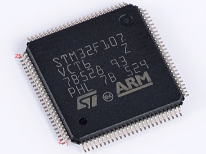
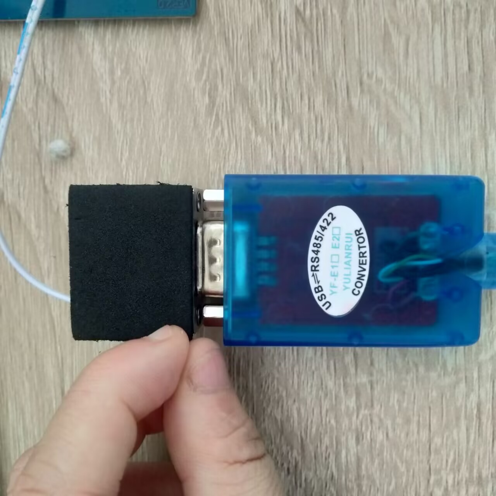
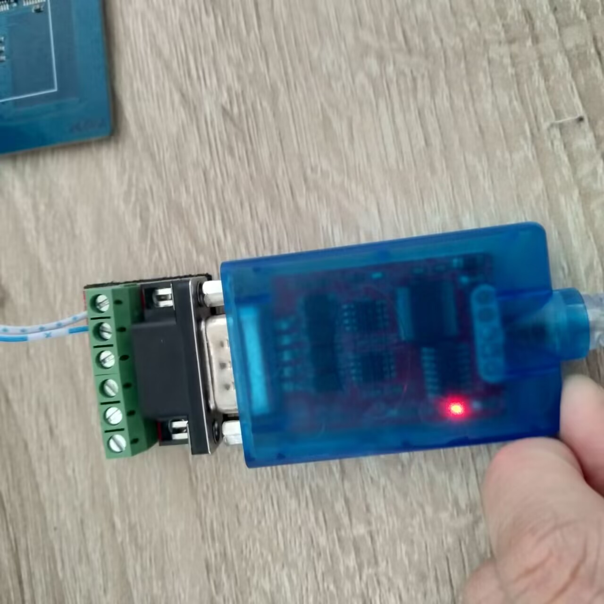
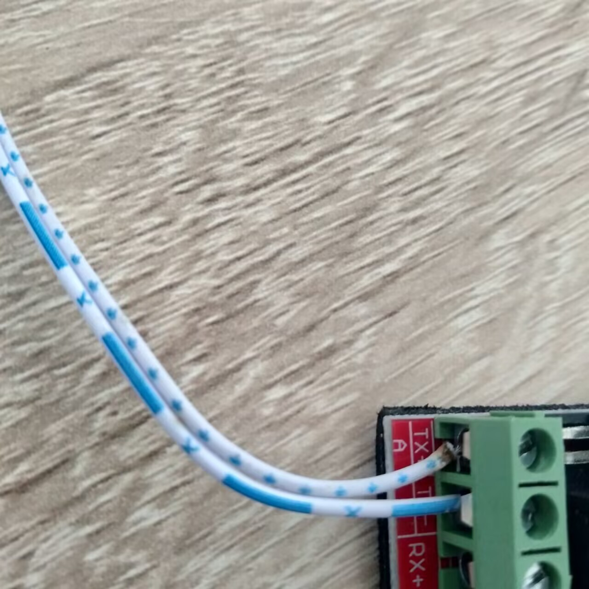
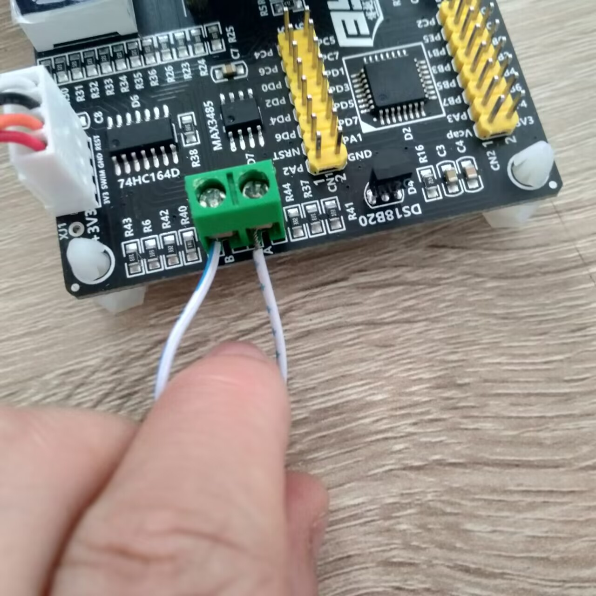

##### \_nop\_（）延时多久

```
_nop_()延时一个机器周期
如果学过计算机组成原理应该知道：
	CPU的最小时间单位是一个脉冲耗时，即一个时钟周期(主频倒数)。
	一个指令周期是CPU从主存中取出并执行一条指令所需要的全部时间。
	而CPU从主存中取出并执行一条指令是可以分为取指令，取有效地址，执行指令等最小操作的
	机器周期就是计算机执行这样的一个操作所需要的最短时间。机器周期有定长和不定长的设计方式。
	在单片机中机器周期应该是定长的吧，51系列标准的架构下，一个机器周期有12和时钟周期。
```


##### 关于51与STM8芯片的烧录问题
51：电压不能过大，这个在stc_isp的硬件选项-->低压检测电压，有说明最大电压
stm8：需要外接电源，不能只用stlink供电，否则可能会烧录不进去，会出现如下报错：
```
Programming OPTION BYTE area...

Error : Cannot communicate with the tool.

Wrong tool selection or check tool power supply or check that a previous session is closed.

Error : < OPTION BYTE programming failed.
```
##### 引脚对应问题

- 如何将原理图的芯片引脚与数据手册的芯片引脚与实际芯片的芯片引脚如何对应？

  - 原理图的引脚数组标号和数据手册的引脚标号一致

  - 实际芯片引脚和数据手册引脚对应：

    以STM32芯片为例，STM32较小的小圆点出发，逆时针排列便是1-n号引脚。

##### USB-RS485/422转接头的接线问题

这是一个USB-RS485/422转接头。

它可以将开发板的485接口和电脑的USB接口接在一起，使得电脑通过串口调试助手与有485模块的开发板进行485通信。

至于如何接线的问题，显然：A接A，B接B。




##### 关于某些想打人的部分
- 外接电源和用烧录器供电常常对一块板子是有区别的，一方面烧录器通常只提供3.3v的电压，一方面有些元件可能需要高电压才能工作，而且有时候电源模块中元件的变动会导致使用烧录器供电时，板子代码看起来错误运行的情况，实际上只是供电的问题。
#### 关于规范的代码

##### 关于全局变量是放于.h还是.c

全局变量的定义通常放在源文件（.c）中，而不是头文件（.h）中。
这是因为全局变量具有全局作用域，将其定义放在头文件中会导致在多个源文件中重复定义，从而引发编译错误。
为了在多个源文件中共享全局变量，一种常见的做法是将全局变量的声明放在头文件中，而将其定义放在一个源文件中。其他源文件需要使用该全局变量时，可以通过包含相应的头文件来获取变量的声明。
例如，假设有一个全局变量`int globalVar;`定义于source.c中，我们可以在头文件中添加以下声明：

```c
// source.h
extern int globalVar;
```

其他源文件需要使用该全局变量时，只需包含头文件即可：

```
// other.c
#include "source.h"

// 可以使用 globalVar 进行操作
```

这样可以确保全局变量在多个源文件中的声明一致性，并避免重复定义的问题。

##### 宏定义提高代码可读性的技巧1

将需要共享的宏定义放在一个公共的配置文件（例如`config.h`）中，通过`#include "config.h"`在其他文件中引用。使用`#ifndef`检查宏是否已定义，没有定义便进行重定义，以避免冲突，并确保单个代码的可移植性与整个工程配置的便于修改。

在 `config.h`中定义宏：

```
#define IIC_SDA_PIN GPIO_PIN_0
```

在 `iic.h` 中引用 `config.h` 并定义宏：

```
#include "config.h"

#ifndef IIC_SDA_PIN
#define IIC_SDA_PIN  GPIO_PIN_4
#endif

// 其他的 IIC 相关定义

/*
通过在iic.h 中引用 config.h，你可以使用 config.h 中定义的宏，同时保持了可移植性和灵活性。如果 config.h和 iic.h`中都有同名的宏定义，并且使用了 #ifndef`来检查宏是否已定义，那么会优先选择 config.h 中的定义。
*/
```


```

```