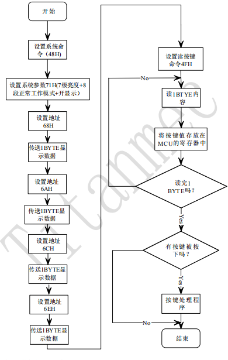
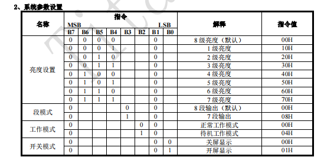

# TM1650
- 标准IIC协议通信
- 有数据输出，驱动灯。键盘扫描，读取矩阵键盘能力。
- 操作流程(如下图所示)：
	- 
	- Step1：设置系统命令48H，设置系统参数
		- 系统参数如何取值 
			- 如图所示，如果选择7级别亮度，则B7-B4为0111，选择8段工作B3为0，选择正常工作B2为0，选择开显示B1-B0为01，合计01110001，即71H。
			- 
	- **Step2(可选)：** 设置显示地址1，设置显示数据1。设置显示地址2，设置显示数据2。设置显示地址3，设置显示数据3。....
	- **Step3(可选)：** 发送读取命令4FH，读取按键数据1，读取按键数据2，读取按键数据3...

# RS485芯片
- 一般有$RO,\overline{RE},DE,DI$四个引脚
- RO是从芯片外部输入到芯片的一端，接芯片的RX脚
- $\overline{RE}$，低电平有效，给RO使能
- DI是从芯片内部输出到芯片外的一端，接芯片的TX脚
- $DE$，高电平有效，给DI使能
- 一般将$\overline{RE},DE$接在同一根线上，发送时高电平，接收时低电平。其余的部分就与普通UART通信完全一致。
- 也有的将$\overline{RE},DE,DI$都与UART_TX连接，实现自动收发（平时是低电平RX接收模式，当要发送数据时，TX会有高低电平输出，自动给$DE$高电平使能，进入发送模式。）

# TM1812
 - 256级调光，可级联，12个PWM控制输出引脚。
 - 比较麻烦的地方：0/1码的高低电平时间以ns为衡量单位。
	 - 实际编程发现，1.25us周期可无视，高电平时间满足要求即可。
	 - 在预编译中，多个nop组成延时函数，这样可以避免编译器优化，时间不对。
# FR0396
- 没什么复杂的，高低电平输出就行了。
# HSU-CHM-01A温湿度传感器
- 数据手册很难找
- 标准IIC通信
- 有写模式和读模式，7位设备地址固定为0X7F
- 写数据时，安照IIC通信，先后写入地址，寄存器地址，寄存器值。用来设置芯片工作模式。举例，先写0X7F
- 读数据时，先后写入地址，寄存器地址，然后读取寄存器值。

