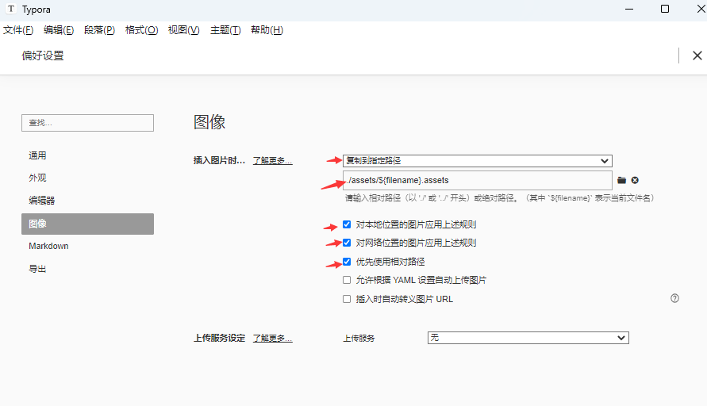
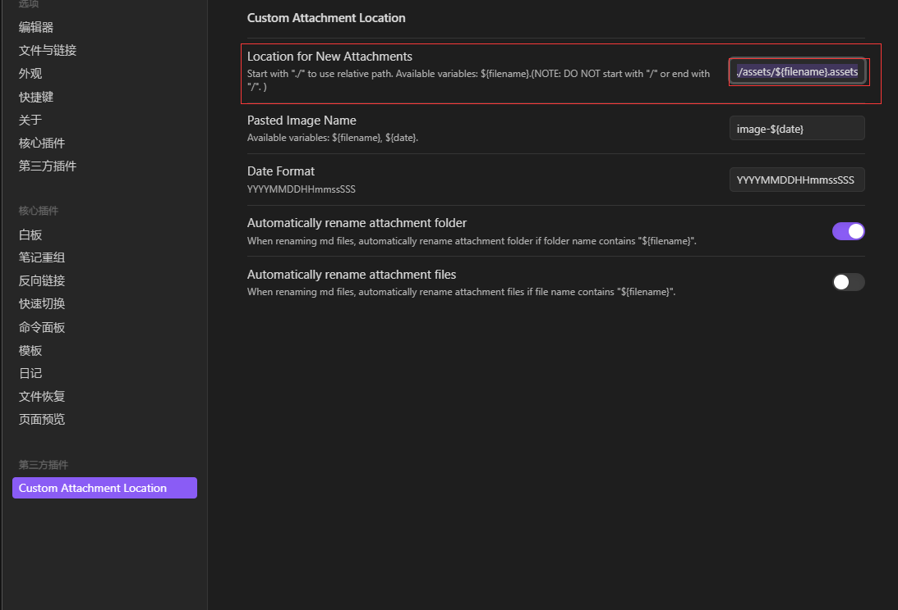
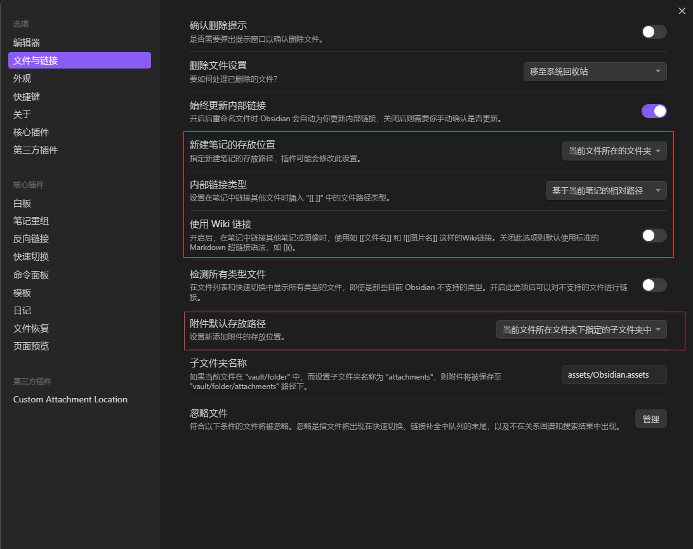
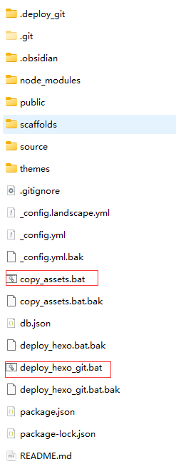
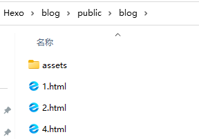

# 安装


- 安装Git、Node.js、安装Hexo、
- GitHub创建个人仓库创建，仓库公开，仓库名必须是"账号名.github.io"
- 生成SSH添加到GitHub
- hexo部署到GitHub站点文件夹下_config.yml文件中,这段代码替换原本的deploy部分代码 
```
deploy:
	  type: git
	  repo: git@github.com:账号名/账号名.github.io.git #实际上就是SSH
	  branch: branch_name #你的分支名，一般远程仓库默认分支名是main
```
- 7.设置个人域名(如果你买了的话)
	省略，想偷懒了
- 8.发布文章
```
hexo init [folder]  			#新建一个网站
hexo new page page_name  		#新建分页
hexo new article_name			#新建文章
hexo new draft draft_name 		#新建草稿
hexo clean						#清除本地hexo缓存文件
hexo s 							#运行本地服务器（预览）
hexo g 							#生成静态文件
hexo d 							# 部署到服务器(发布)
hexo g -d 						#生成并部署文件
hexo clean && hexo g && hexo d
```

# 对应库的安装

```
给我自己看的，并不是说非要安装这些库

Obsidian推荐库：
Copy Block link：很方便的进行块引用和块嵌入
Custom Attachment location：使得typora中的图片保存位置与Obsidian兼容


Hexo推荐库：
hexo-abbrlink # 生成永久文章链接，方便链接复制等(链接中有中文时，字符串编码很长)
hexo-blog-encrypt #加密文章
hexo-renderer-pandoc #将markdown文件变成html文件，方便编写latex数学公式
valine  #实现评论功能
下面的大多是官方插件之类的，换主题时基本上顺便下载了
hexo-deployer-git 
hexo-autonofollow
hexo-cli
hexo-directory-category
hexo-front-matter
hexo-fs
hexo-generator-archive
hexo-generator-category
hexo-generator-feed
hexo-generator-index
hexo-generator-json-content
hexo-generator-sitemap
hexo-generator-tag
hexo-i18n
hexo-log
hexo-pagination
hexo-renderer-ejs
hexo-renderer-stylus
hexo-server
hexo-theme-landscape
hexo-util
```
# Obsidian使用时遇到的问题

## 如何兼容Obsidian与Typora图片保存位置等

Typora进行如下配置，保存位置改为./assets/\${filename}.assets
 下载插件Custom Attachment location，然后进行如下配置，保存位置改为`./assets/${filename}.assets`：



## 兼容Hexo与Typora的图片设置
`hexo`的资源文件夹在`source/images`下，也就是它只处理这个目录下的图片，实际上网上有很多种解决办法，调整typora中图片的设置(我的设置：`./assets/${filename}.assets`)，修改`post_asset_folder:false改为true`等等。但这都意味着我typora中图片的位置必须做出改动，如果我偏不呢？
F12查看了html中的路径后，我想，我用批处理把图片移动到public文件夹下就可以了吧。
于是我写了两个批处理代码,放在这个位置


`copy_assets.bat` 将`./source/_posts`下的assets全部拷贝到`./public/blog`下，blog我这里的站点文件夹名，因人而异，如何确定参考下图


```
@echo off
set "A_PATH=./source./_posts"
set "B_PATH=./public/blog"

:: 确保 B_PATH/assets 文件夹存在
if not exist "%B_PATH%\assets\" mkdir "%B_PATH%\assets"

:: 遍历 A_PATH 中的所有 assets 文件夹并复制其内容到 B_PATH/assets
for /d /r "%A_PATH%" %%D in (assets) do (
    xcopy "%%D\*" "%B_PATH%\assets\" /E /I /Y
)
echo Done.
pause
```
看，我这里`./public/blog`下有html文件，所以是这样的目录。


`deploy_hexo_git.bat` 用来调用`copy_assets.bat`,将源码，静态页面部署到github。所以使用时，写好笔记后，双击`deploy_hexo_git.bat`就完成代码提交，hexo部署了。
```
@echo off
(
echo Running Hexo commands...

echo Cleaning...
hexo clean

echo Generating...
hexo g 

echo Copying assets...
call copy_assets.bat

echo Deploying...
hexo d


echo Git Source Add...
git add . 

echo Git Source Commit...
git commit -m "%date%%time%"

echo Git Source Push...
git push origin source

echo Done.
pause
)
```

## 兼容Obsidian与Hexo

[Hexo + Obsidian + Git 完美的博客部署与编辑方案 - 掘金 (juejin.cn)](https://juejin.cn/post/7120189614660255781 )

## \标签图片不能正常显示

采用绝对路径


## Obsidian中如何在关系图图谱中隐藏png等附件文件

首先，我使得Obsidian中的图片保存与Typora保持一致了。
在此基础上，将其设置为附件文件夹即可。


## 加密文章

使用插件：hexo-blog-encrypt


# valine添加评论区(可选)
参考教程：https://cloud.tencent.com/developer/article/1946684
此教程对任何主题通用，但是对于建立文件的位置，不同主题可能有不一样的地方。
举一个例子，
我用的主题是`Wikitten`，`article.ejs`的位置是在这里`blog\themes\Wikitten\layout\common\article.ejs`
因此我这里的步骤是，在注册`LeanCloud`官网，安装好`valine`插件后，

先在` _config.yml `中添加
```
#6、Valine https://valine.js.org 
valine: appid: #Leancloud应用的appId 
appkey: #Leancloud应用的appKey 
verify: false #验证码 
notify: false #评论回复提醒 
avatar: mm #评论列表头像样式：''/mm/identicon/monsterid/wavatar/retro/hide placeholder: Just go go #评论框占位符
```
然后，在`blog\themes\Wikitten\layout\common\article.ejs`中添加(加到文档末尾就行)
这个和教程不大一样，这部分代码是我在另一个主题中翻到的，它的评论区能自适应尺寸，我觉得更好看
```
<% if (theme.valine && theme.valine.appid && theme.valine.appkey){ %>
    <section id="comments" class="comments">
      <style>
      .comments{margin:30px;padding:10px;background:rgb(0, 0, 0); }
      @media screen and (max-width:800px){.comments{margin:auto;padding:10px;background:#000}}
      </style>
      <%- partial('post/valine', {
        key: post.slug,
        title: post.title,
        url: config.url+url_for(post.path)
        }) %>
    </section>
  <% } %>
```
在`blog\themes\Wikitten\layout\common\post`  下新建文件`valine.ejs`，添加代码：
```
<div id="vcomment" class="comment"></div> 
<script src="//cdn1.lncld.net/static/js/3.0.4/av-min.js"></script>
<script src="//unpkg.com/valine/dist/Valine.min.js"></script>
<script>
   var notify = '<%= theme.valine.notify %>' == true ? true : false;
   var verify = '<%= theme.valine.verify %>' == true ? true : false;
    window.onload = function() {
        new Valine({
            el: '.comment',
            notify: notify,
            verify: verify,
            app_id: "<%= theme.valine.appid %>",
            app_key: "<%= theme.valine.appkey %>",
            placeholder: "<%= theme.valine.placeholder %>",
            avatar:"<%= theme.valine.avatar %>"
        });
    }
</script>


```

发现没，`article.ejs`和`valine.ejs`的关系是：
```
|article.ejs
|post
|     valine.ejs
```
找得到article.ejs就行

# 添加代码复制功能（可选）


# hexo 上传后gitHub 中custom domain 被重置 
参考该教程：[hexo 上传后gitHub 中custom domain 被重置_shaoin_2的博客-CSDN博客](https://blog.csdn.net/weixin_49175501/article/details/128705141)
# obsidian英语学习(可选)

