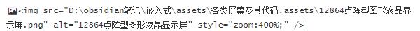
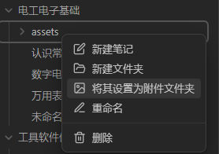

# Obsidian常用插件
 Copy Block link：很方便的进行块引用和块嵌入
 Custom Attachment location：使得typora中的图片保存位置与Obsidian兼容
 Hidden Folder：兼容Obsidian与Hexo，隐藏文件，美化显示
# Obsidian使用时遇到的问题
- 如何与Typora、hexo兼容：参考我的另一篇博客？？？？？？？
## \标签图片不能正常显示
采用绝对路径

## Obsidian中如何在关系图图谱中隐藏png等附件文件
首先，我使得Obsidian中的图片保存与Typora保持一致了。
在此基础上，将其设置为附件文件夹即可。

## 加密文章
使用插件：hexo-blog-encrypt

