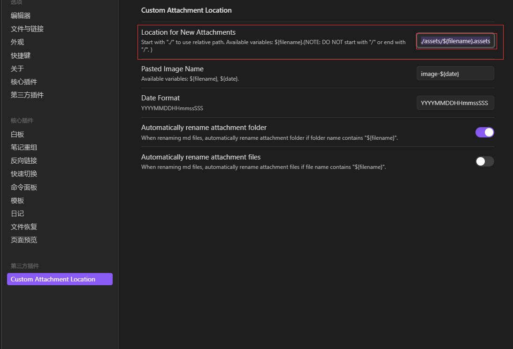

# Obsidian常用插件
 Copy Block link：很方便的进行块引用和块嵌入
 Custom Attachment location：使得typora中的图片保存位置与Obsidian兼容
 File Tree Alternative Plugin：兼容Obsidian与Hexo，美化显示
# Obsidian使用时遇到的问题
## 如何兼容Obsidian与Typora图片保存位置等
Typora进行如下配置，保存位置改为./assets/${filename}.assets
 下载插件Custom Attachment location，然后进行如下配置，保存位置改为./assets/${filename}.assets：

## 兼容Hexo与Typora的图片设置

## 兼容Obsidian与Hexo
[Hexo + Obsidian + Git 完美的博客部署与编辑方案 - 掘金 (juejin.cn)](https://juejin.cn/post/7120189614660255781) 
## \标签图片不能正常显示
采用绝对路径

## Obsidian中如何在关系图图谱中隐藏png等附件文件
首先，我使得Obsidian中的图片保存与Typora保持一致了。
在此基础上，将其设置为附件文件夹即可。

## 加密文章
使用插件：hexo-blog-encrypt

