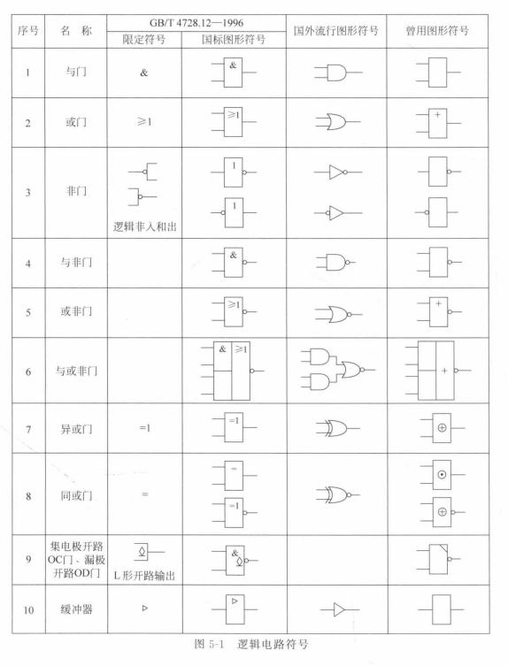
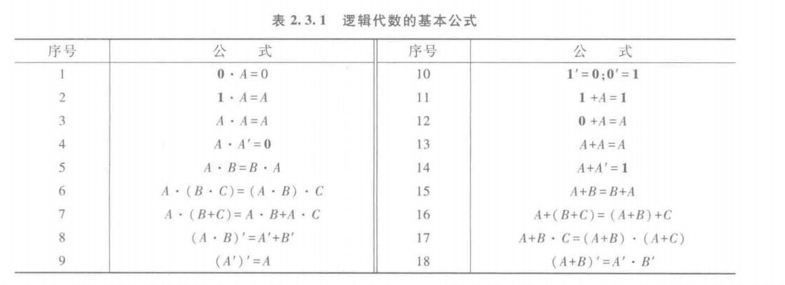
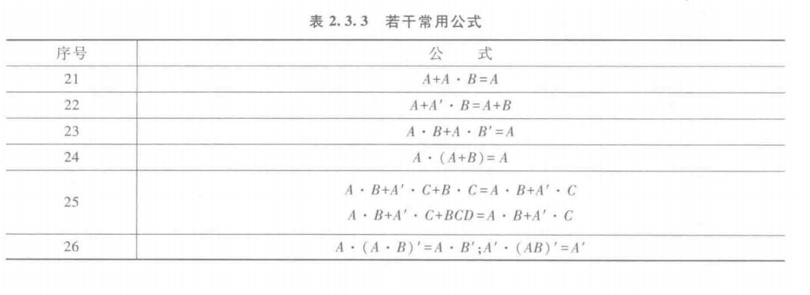
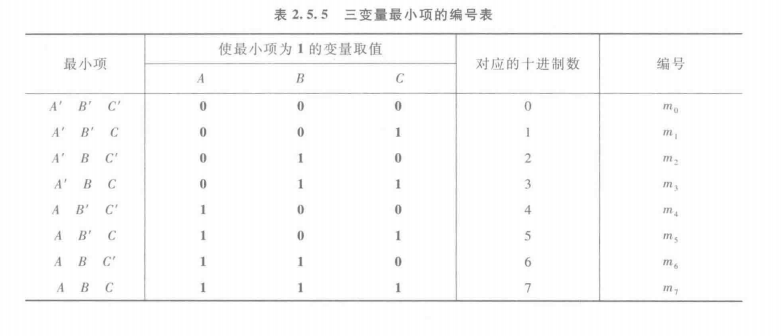
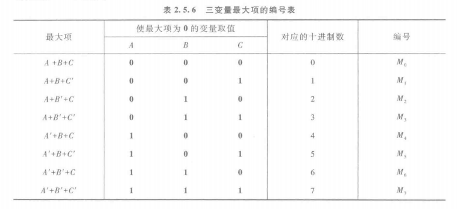
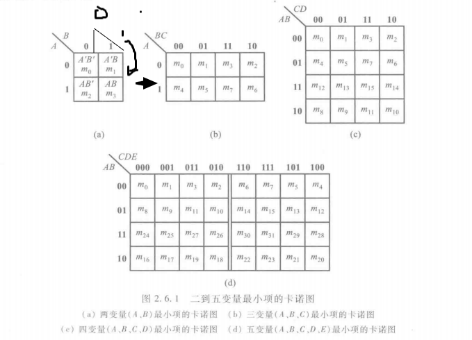
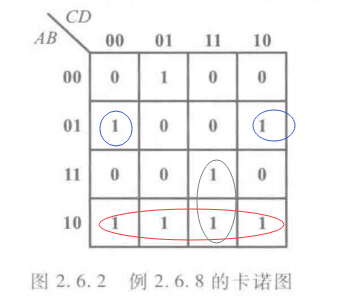
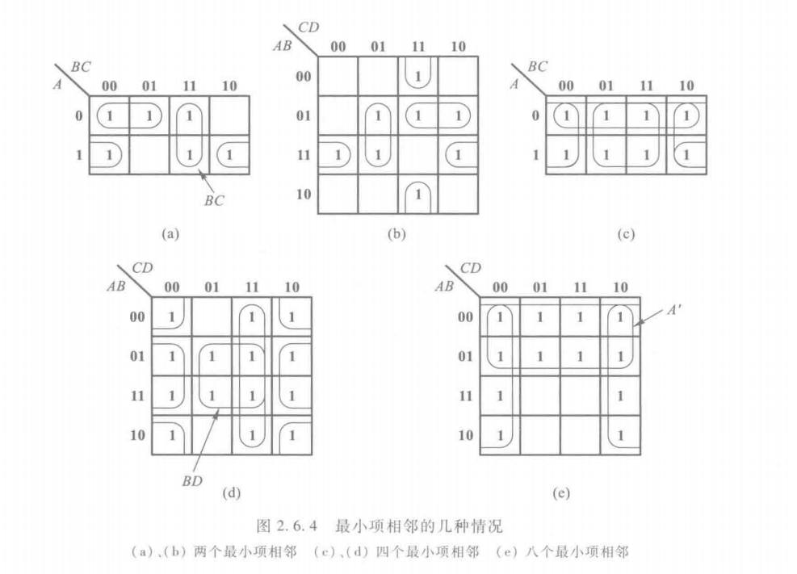
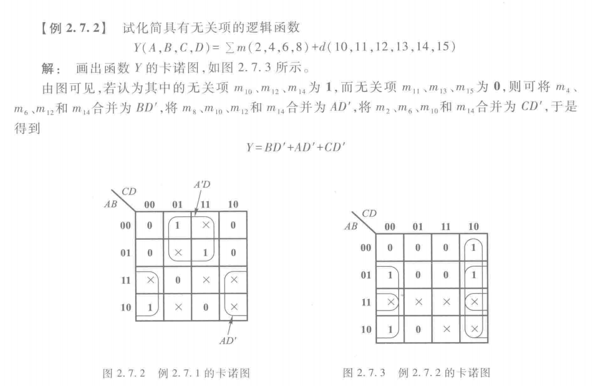

# 概述
学习教材
```
清华数字电路基础
B站王红数字电路视频：https://www.bilibili.com/video/BV18p411Z7ce/
```

# 逻辑代数基础
## 逻辑电路符号及基本公式
#### 下面是各种逻辑电路的符号



#### 逻辑代数基本公式

和集合的交并公式差不多



**逻辑代数常用公式**



#### 代入定理、反演定理和对偶定理

和方程的代入公式以及命题取非一个道理

**代入定理：**在任何一个包含变量A的逻辑等式中,若以另外一个逻辑式代入式中所有A的位置,则等式仍然成立。这就是所谓的代人定理。

> 举例说明：若(A+B)'=A' $\cdot $B' ,可以将任何一个逻辑式子如(A+B)代入A，等式依然成立。((A+B)+B)'=(A+B)' $\cdot $B'

**反演定理：** 对于任意一个逻辑式Y,若将其中所有的“·"换成“+”,“+"换成“·”,0换成1,1换成0,原变量换成反变量,反变量换成原变量,则得到的结果就是Y'。这个规律称为反演定理。

> 举例说明：已知Y=AB+C+1，易得Y'=(A'+B')$\cdot $C$\cdot $1

**对偶定理：** 若两个逻辑式相等，其对偶式也相等。（对任何一个逻辑式Y，Y与Y‘互为对偶式。）

##  逻辑函数的标准形式及化简

### 标准形式

逻辑函数的标准形式是写为最小项之和或最大项之积，任何一个逻辑函数都可以这么写。比如两变量的AB+AB'，与(A+B)(A'+B)，和概率论很像对吧。

三变量最小项和最大项如图，A’与A分别记作0与1，所以AB'C写作二进制101，值是5





### 化简

#### 公式化简法

用基本公式，常用公式，反复使用，化简，举例AB+AB'=A(B+B')=A

#### 卡诺图化简法

已知逻辑上相邻最小项可并项，设法使逻辑相邻的物理上也可相邻，直观由图反应，便可轻松知哪些可并项。

下图是两到五变量最小项卡诺图，规律显而易见。

如图（a)-->(b)所示，在那边添加变量，向哪边扩展，理解成折叠的纸片展开(便于理解后面的相邻，实际上是格雷码。这只是一种理解记忆方式)，所以有横向0 1 折叠展开-->0 1 1 0  --> (0)1 (0)1 (1)1 (1)0。



**举例卡诺图化简：**

Y=A’B'C'D'+A'BD'+ACD+AB'=A'B'C'D+A'BCD'+A'BC'D'+ABCD+AB'CD+AB'CD'+AB'C'D+AB'C'D'=$m_1+m_4+m_6+m_8+m_9+m_{10}+m_{11}+m_{15}$
画成卡诺图如下图所示，解释一下，图中最小项之和中有m11——AB'CD，即1011，也就是横排10，竖排11，下图4行3列的位置填1，其余的m1等等同理填入。


化简时，可以轻易看出相邻的部分，图中同颜色圈住的地方（理解，折叠回二变量最小卡诺图时相邻的就是相邻最小项），所以可以将其化简回去得到Y=AB'+A'BD'+A'B'C'D'或AB'+A'BD'+ACD。

红色圈住的方块，先看横排，10(AB')是共有的，再看竖排，没有共有的，化简得AB'

灰色圈住的方块，先看横排，11与10共1(A)，再看竖排，11(CD)共有，化简得ACD

蓝色圈住的方块，先看横排，01(A'B)是共有的，再看竖排，00与10共0(D')，化简得A’BD‘

合起来得到Y=AB'+A'BD'+ACD

**卡诺图化简的其他例子可参考下图：**



**从先前的例题可以知道，卡诺图化简的结果不唯一，但是最简式子的项数一定唯一（例题中都是三项之和）**

#### 奎恩麦克拉斯基化简法(Q-M化简法)
便于计算机编程实现的化简法
##### 无关项在逻辑函数化简中的应用
**约束项：** 恒等于0的项（概率为0的事件）
**任意项：** 取任何值都对电路毫无影响的项
**无关项：** 约束项+任意项
在理论设计中，电路可以毫无限制，但实际应用通常是有背景的，好比买电脑是在一定预算下考虑性价比，而非无脑上高配置。在这种情况下，就出现了约束项，无关项，可以引入以化简电路（中学数学中配方法等公式使用应当并不陌生，也是这样的化简的）
**相关证明：**
```
逻辑函数通常表现为最小项之和Y=A'B+AB' ,如果AB=0,那么Y=A'B+AB' +AB是没有影响的（与0作或等于自身）

对于任意项，书中举了个例子
假设Y=AB'C'，已知A=B=C时切断电源，所以我们说ABC是Y的任意项
ABC=1时，电源切断，对电路无影响，ABC=0时，与0作或等于没做。所以Y=AB'C'+ABC与先前是没什么区别的。
```
**举例**

