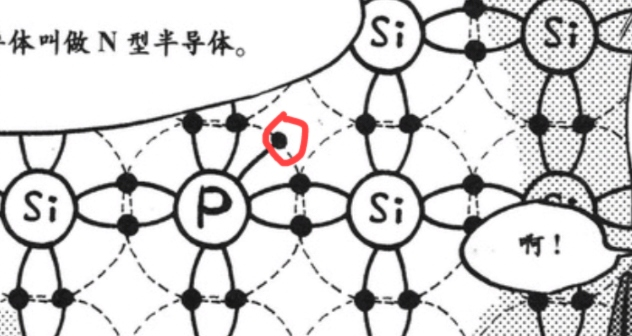
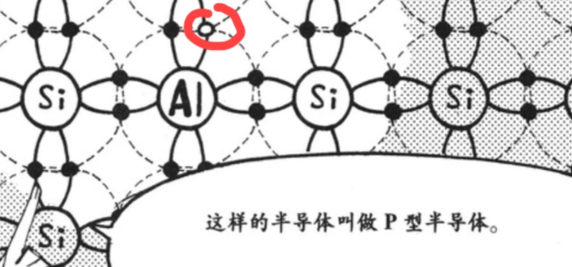
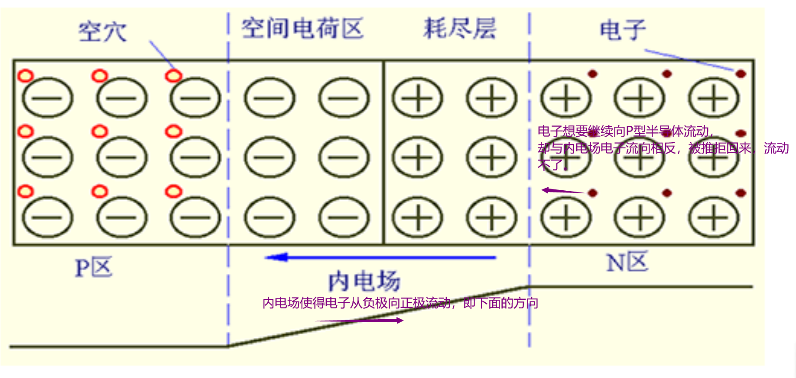

# 半导体
本节意在认识导体、半导体，知晓导体为何导电，半导体为何有此种性质。

##### 什么是电流？
电路中自由电子的流动，可以说电路中流动的自由电子愈多，电流愈大。

##### 为什么铜是最好的导体之一？
因为铜最外层只有一个电子，我们知道最外层电子数愈少，就愈容易被外力影响，使最外层电子脱离。因此，很轻易就能使得铜外层的电子脱离，产生移动，从而产生电流（即轻易产生电流，易导电）。
同时最外层电子数越接近8，越不容易被外力影响，使电子脱离，故而，绝缘性越强。

##### 什么是半导体？
我们知道，由于最外层8个电子最稳定，于是原子总有使自己最外层有8电子的趋势，故而原子原子间具有共价键，形成化合物。
硅晶体的排列通常是一个硅原子周围是4个硅原子，如下图所示，有4个共价键，相当稳定，可以说是非常优秀的绝缘体。

当然，施加外力能使得硅晶体中电子脱离，产生微弱电流，相当微弱，与期望的半导体性质不同，因此如何得到半导体呢？
参杂别的原子，增加自由电子或空穴， 让它不这么稳定。
这样，我们就得到了半导体，即**导电性易于控制，可以使它导电，也可以使其不导电的物质。**

##### 如何理解N型，P型半导体？
**N型半导体(negative,负极的)：** 掺入5价杂质原子的半导体，(自由电子过剩)的半导体，如下图所示：

**P型半导体(positive,正极的)：** 掺入3价杂质原子的半导体，(自由电子缺乏，即空穴过剩)的半导体。如下图所示：

我们知道，原子趋向于使自己有8个最外层电子，那么在外力作用下，图中N型半导体的磷(P)趋向于失去电子，带正电，P型半导体的铝(Al)趋向于得到电子，带负电。

那么将PN型半导体连在一起，首先N型半导体中的电子会向P中的空穴移动，填补其空穴。使得P区半导体边沿带负电，N区半导体边沿带正电，产生内电场，如图所示。而内电场使得电子从负极向正极流动，即下面的方向，但电子想要继续向P型半导体流动，却与内电场电子流向相反，被推拒回来，流动不了。

这样电子的流动就停止了，电流导通不了，如何使得电流导通呢？
既然内电场阻止了电流导通，那很容易得出这样的结论：施加与内电场方向相反的电场，促进电流导通，使其导电。施加与内电场方向相同的电场，阻碍电流导通，使其不导电
对了，一般被称为PN结的，就是P、N型半导体交界处，耗尽层这部分。
**综上可以得出这样的一个结论：** PN结的P极接正极，N极接负极，半导体导电，产生正向电流，反之基本不导电，产生负向电流。

# 未完成的草稿部分

电路，可分为电子电路和电气电路。
电子电路:由电阻、线圈、电容、二极管等元件组成的电路
电气电路:由电阻、线圈、电容组成的电路
电子电路基本可分为8种:
放大电路:将输入信号增大后输出的电路
振荡电路:可以在没有信号的情况下产生交流信号，比如正弦波和锯齿形波等周期波
调制电路:可以调制振动大小或频率的电路
检波电路:从接收的信号中提取出声音等信号，将其恢复原状的电路。
滤波器:从信号中过滤出需要的信号的电路
运算放大器:？？？
逻辑电路:负责计算加法或乘法，存储文字或数字的电路。
电源电路:交流转直流

晶体管:

