# 半导体
本节意在认识导体、半导体，知晓导体为何导电，半导体为何有此种性质。

## 1、 什么是电流？
电路中自由电子的流动，可以说电路中流动的自由电子愈多，电流愈大。

## 2、为什么铜是最好的导体之一？
因为铜最外层只有一个电子，我们知道最外层电子数愈少，就愈容易被外力影响，使最外层电子脱离。因此，很轻易就能使得铜外层的电子脱离，产生移动，从而产生电流（即轻易产生电流，易导电）。
同时最外层电子数越接近8，越不容易被外力影响，使电子脱离，故而，绝缘性越强。

## 3、什么是半导体？
我们知道，由于最外层8个电子最稳定，于是原子总有使自己最外层有8电子的趋势，故而原子原子间具有共价键，形成化合物。
硅晶体的排列通常是一个硅原子周围是4个硅原子，如下图所示，有4个共价键，相当稳定，可以说是非常优秀的绝缘体。
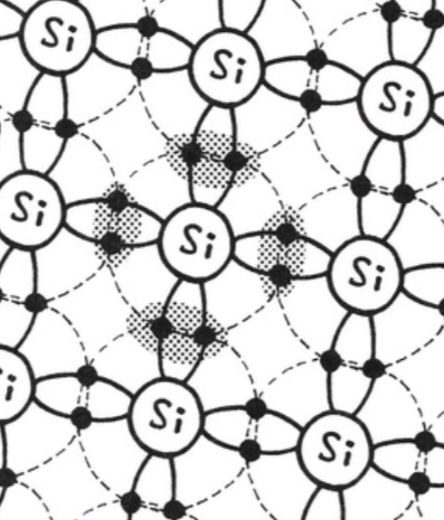
当然，施加外力能使得硅晶体中电子脱离，产生微弱电流，相当微弱，与期望的半导体性质不同，因此如何得到半导体呢？
参杂别的原子，增加自由电子或空穴， 让它不这么稳定。
这样，我们就得到了半导体，即**导电性易于控制，可以使它导电，也可以使其不导电的物质。**

## 4、如何理解N型，P型半导体？
**N型半导体(negative,负极的)：** 掺入5价杂质原子的半导体，(自由电子过剩)的半导体，如下图所示：
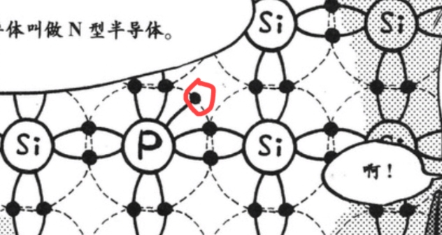
**P型半导体(positive,正极的)：** 掺入3价杂质原子的半导体，(自由电子缺乏，即空穴过剩)的半导体。如下图所示：

我们知道，原子趋向于使自己有8个最外层电子，那么在外力作用下，图中N型半导体的磷(P)趋向于失去电子，带正电，P型半导体的铝(Al)趋向于得到电子，带负电。

那么将PN型半导体连在一起，首先N型半导体中的电子会向P中的空穴移动，填补其空穴。使得P区半导体边沿带负电，N区半导体边沿带正电，产生内电场，如图所示。而内电场使得电子从负极向正极流动，即下面的方向，但电子想要继续向P型半导体流动，却与内电场电子流向相反，被推拒回来，流动不了。
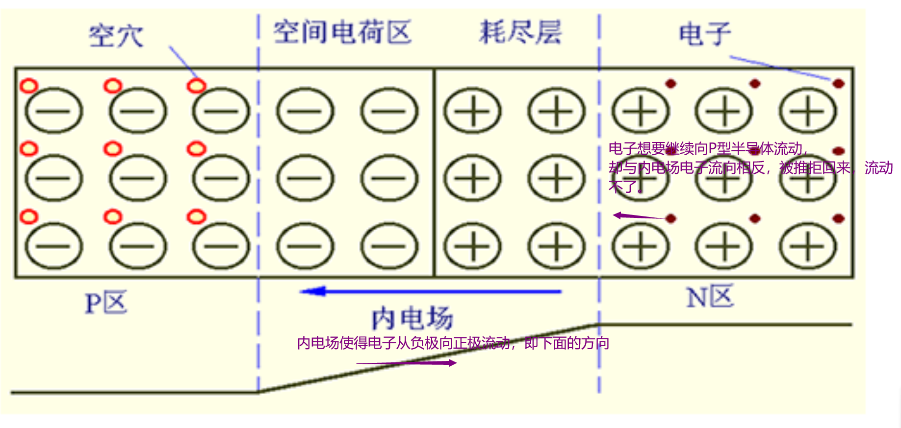

这样电子的流动就停止了，电流导通不了，如何使得电流导通呢？
既然内电场阻止了电流导通，那很容易得出这样的结论：施加与内电场方向相反的电场，促进电流导通，使其导电。施加与内电场方向相同的电场，阻碍电流导通，使其不导电。

对了，一般被称为PN结的，就是P、N型半导体交界处这部分。

**综上可以得出这样的一个结论：**  PN结的P极接正极，N极接负极，半导体导电，产生正向电流，反之基本不导电。

# 晶体管

# 基尔霍夫定律
**基尔霍夫定律：** 流入电路中某节点的电流之和等于流出电流之和。沿着任何闭合回路的电压总和为零。
## 基尔霍夫定律判断电路中的电流方向
像是能量守恒定律，有入必有出一样。据此可以对每个结点列出关于电流的方程。以及对每个闭合回路列出关于电压的方程(以每个小回路，先随意假定电流方向)
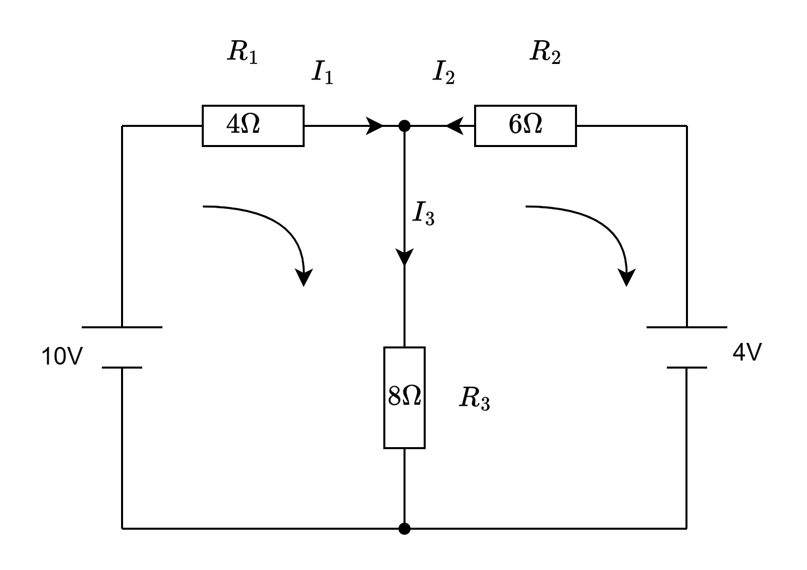
如图所示的电路图，首先对电路中每个元件$R_1、R_2、R_3$ ，假定流过它们的电流$I_1、I_2、I_3$，再随便假设其流向(这里是根据一般电流是由正极流出假定的，实际上随意假定方向也是一样的计算)。这样我们就可以**对电路中的结点进行电流分析**得到方程$I_1+I_2-I_3=0$ 。
然后对电路中每个小回路(注意是最简单的小回路)按电流流向进行电压分析(顺着电流方向电压下降)，不妨统一按照顺时针方向分析。
容易假设电源负极电压为$0$，正极电压分别为$10V，4V$。
**顺时针对第一个回路进行分析。** 从正极出发先经过$R_1$，顺时针方向与$I_1$方向相同，降压，故经$R_1$电压变化是$-4I_1$。然后经过$R_3$，顺时针方向与$I_3$方向相同，降压，故经$R_3$电压变化是$-8I_3$。最后经过电源负极到正极，升压，故电源电压变化是$+10$。所以得方程：$-4I_1-8I_3+10=0$
**顺时针对第二个回路进行分析。** 从负极出发先经过$R_3$，顺时针方向与$I_3$方向相反，升压，故经$R_3$电压变化是$8I_3$。然后经过$R_2$，顺时针方向与$I_2$方向相反，升压，故经$R_2$电压变化是$6I_2$。最后经过电源正极到负极，降压，故电源电压变化是$-4$。所以得方程：$8I_3+6I_2-4=0$
**三个方程联立**，求得$I_1=1.038(A),I_2=-0.308(A),I_3=0.731(A)$
由此我们可以得到电路中电流的实际流向与大小：
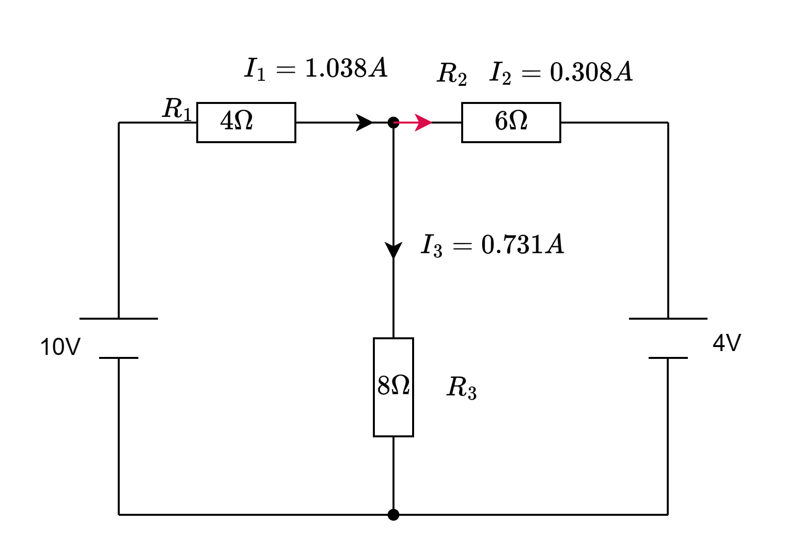

# 以水流理解电路原理

参考教程：[电压与水压 电流大小与电流速度 - 知乎 (zhihu.com)](https://zhuanlan.zhihu.com/p/385873231)（没看完，待完善。物理化学基础薄弱，待学习。）
**电流/电压：** 以水流量水压类比电流，暂且假设一个水流无限多的桶，水压(电压)越大，被压出的水量越多，同时水流越急，单位时间流过单位面积的水体积(电流)越大。
**二极管：** 等效于单向阀门
**三极管：** 如何对应到NPN，PNP型三极管待思考。
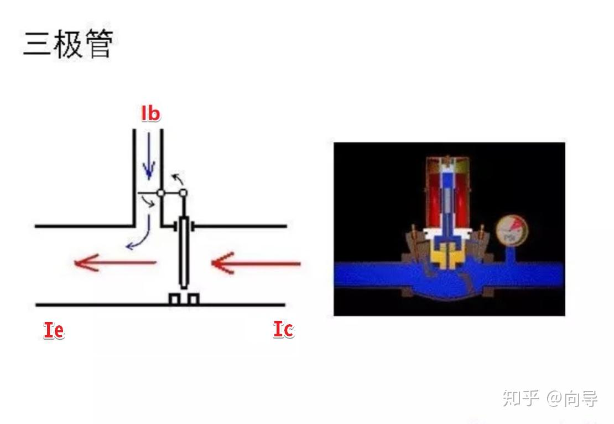
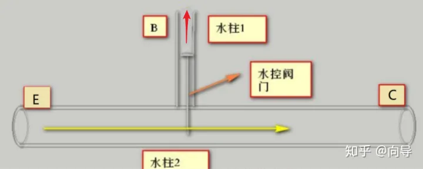
电容：洞庭湖具有洪水缓冲，雨季蓄水，旱季放水的作用。电容的作用类比湖泊，有缓冲电流使其平缓，缺电蓄电，满电放电做电源的作用。还有通交流阻直流的作用。
电阻：类比水管？（存疑，待思考）
电感：没听过，待学习。

# 数字电路部分
## 逻辑代数基础
### 逻辑电路符号及基本公式
##### 下面是各种逻辑电路的符号

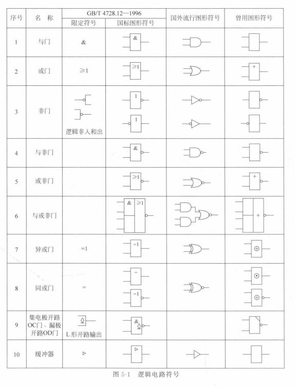

##### 逻辑代数基本公式

和集合的交并公式差不多

**逻辑代数常用公式**

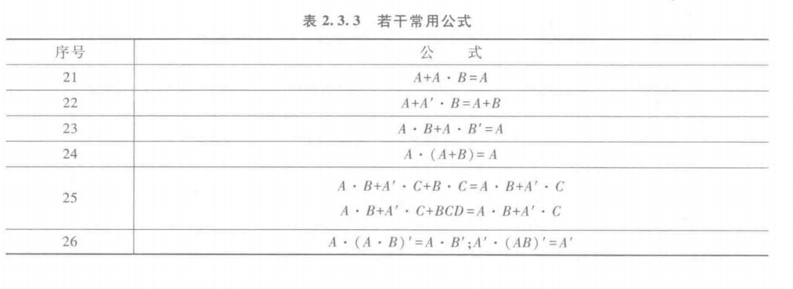

##### 代入定理、反演定理和对偶定理

和方程的代入公式以及命题取非一个道理

**代入定理：**在任何一个包含变量A的逻辑等式中,若以另外一个逻辑式代入式中所有A的位置,则等式仍然成立。这就是所谓的代人定理。

> 举例说明：若(A+B)'=A' $\cdot $B' ,可以将任何一个逻辑式子如(A+B)代入A，等式依然成立。((A+B)+B)'=(A+B)' $\cdot $B'

**反演定理：** 对于任意一个逻辑式Y,若将其中所有的“·"换成“+”,“+"换成“·”,0换成1,1换成0,原变量换成反变量,反变量换成原变量,则得到的结果就是Y'。这个规律称为反演定理。

> 举例说明：已知Y=AB+C+1，易得Y'=(A'+B')$\cdot $C$\cdot $1

**对偶定理：** 若两个逻辑式相等，其对偶式也相等。（对任何一个逻辑式Y，Y与Y‘互为对偶式。）

###  逻辑函数的标准形式及化简

#### 标准形式

逻辑函数的标准形式是写为最小项之和或最大项之积，任何一个逻辑函数都可以这么写。比如两变量的AB+AB'，与(A+B)(A'+B)，和概率论很像对吧。

三变量最小项和最大项如图，A’与A分别记作0与1，所以AB'C写作二进制101，值是5

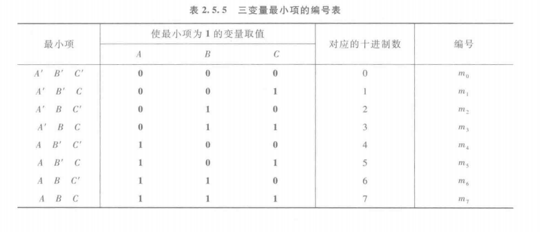

#### 化简

##### 公式化简法

用基本公式，常用公式，反复使用，化简，举例AB+AB'=A(B+B')=A

##### 卡诺图化简法

已知逻辑上相邻最小项可并项，设法使逻辑相邻的物理上也可相邻，直观由图反应，便可轻松知哪些可并项。

下图是两到五变量最小项卡诺图，规律显而易见。

如图（a)-->(b)所示，在那边添加变量，向哪边扩展，理解成折叠的纸片展开(便于理解后面的相邻，当然只是一种记忆方式)，所以有横向0 1 折叠展开-->0 1 1 0  --> (0)1 (0)1 (1)1 (1)0。

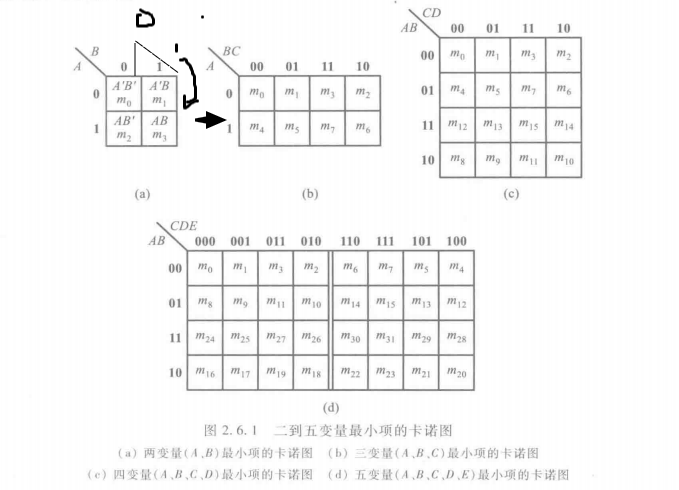

**举例卡诺图化简：**

Y=A’B'C'D'+A'BD'+ACD+AB'=A'B'C'D+A'BCD'+A'BC'D'+ABCD+AB'CD+AB'CD'+AB'C'D+AB'C'D'=$m_1+m_4+m_6+m_8+m_9+m_{10}+m_{11}+m_{15}$
画成卡诺图如下图所示，解释一下，图中最小项之和中有m11——AB'CD，即1011，也就是横排10，竖排11，下图4行3列的位置填1，其余的m1等等同理填入。

化简时，可以轻易看出相邻的部分，图中同颜色圈住的地方（理解，折叠回二变量最小卡诺图时相邻的就是相邻最小项），所以可以将其化简回去得到Y=AB'+A'BD'+A'B'C'D'或AB'+A'BD'+ACD。

红色圈住的方块，先看横排，10(AB')是共有的，再看竖排，没有共有的，化简得AB'

灰色圈住的方块，先看横排，11与10共1(A)，再看竖排，11(CD)共有，化简得ACD

蓝色圈住的方块，先看横排，01(A'B)是共有的，再看竖排，00与10共0(D')，化简得A’BD‘

合起来得到Y=AB'+A'BD'+ACD

**卡诺图化简的其他例子可参考下图：**

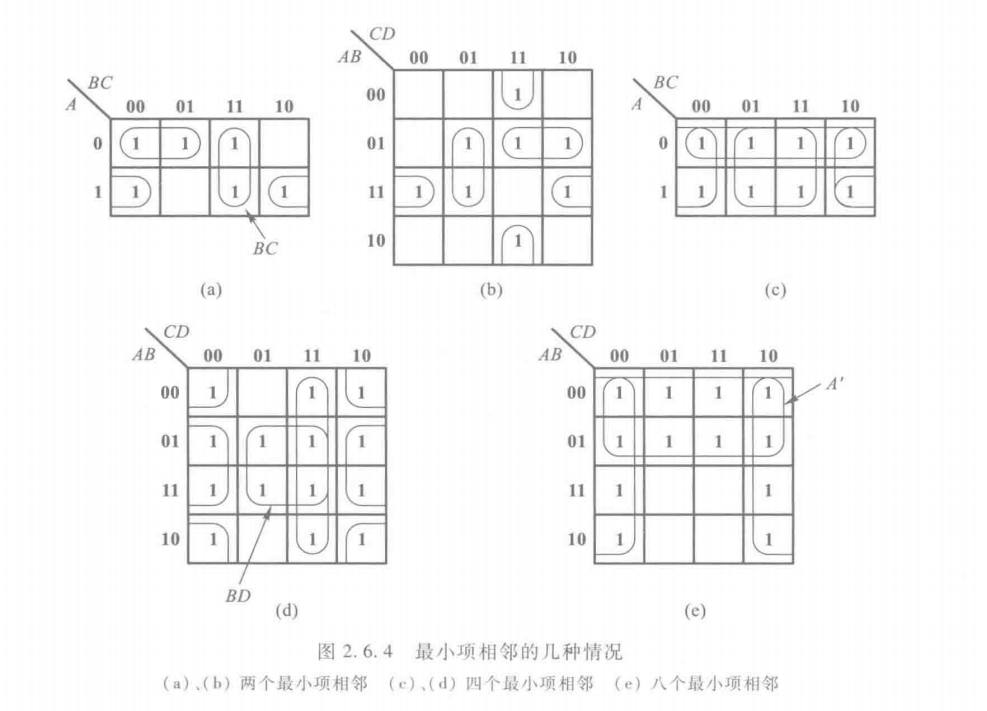

**从先前的例题可以知道，卡诺图化简的结果不唯一，但是最简式子的项数一定唯一（例题中都是三项之和）**

# 未完成的草稿部分

电路，可分为电子电路和电气电路。
电子电路:由电阻、线圈、电容、二极管等元件组成的电路
电气电路:由电阻、线圈、电容组成的电路
电子电路基本可分为8种:
放大电路:将输入信号增大后输出的电路
振荡电路:可以在没有信号的情况下产生交流信号，比如正弦波和锯齿形波等周期波
调制电路:可以调制振动大小或频率的电路
检波电路:从接收的信号中提取出声音等信号，将其恢复原状的电路。
滤波器:从信号中过滤出需要的信号的电路
运算放大器:？？？
逻辑电路:负责计算加法或乘法，存储文字或数字的电路。
电源电路:交流转直流

晶体管:

