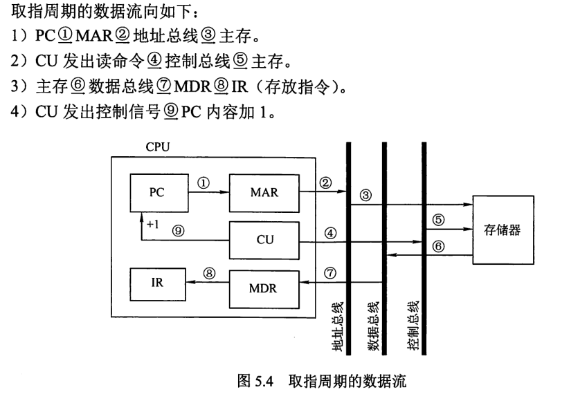

​                                                                                                                                                                                                                                                                                                                                                                                                                                                                                                                                                                                                                                                                                                                                                                                                                                                                                                                                                                                                                                                                                                                                                                                                                                                                                                                                                                                                                                                                                                                                                                                                                                                                                                                                                                                                                                                                                                                                                                                                                                                                                                                                                                                                                                                                                                                                                                                                                                                                                                                                                                                                                                                                                                                                                                                                                                                                                                                                                                                                                                                                                                                                                                                                                                                                                                                                                                                                                                                                                                                                                                                                                                                                                                                                                                                                                                                                                                                                                                                                                                                                                                                                                                                                                                                                                                                                                                                                                                                                                                                                                                                                                                                                                                                                                                                                                                                                                                                                                                                                                                                                                                                                                                                                                                                                                                                                                                                                                                                                                                                                                                                                                                                                                                                                                                                                                                                                                                                                                                                                                                                                                                                                                                                                                                                                                                                                                                                                                                                                                                                                                                                                                                                                     


它是用来解决什么问题的？
它以什么样的顺序讲述了什么？


```/
计算机的四个发展时代：电子管时代-->晶体管时代-->中小规模集成电路时代-->超大规模集成电路时代。

机器字长：计算机进行一次整数运算所能处理的二进制数据的位数，一般和通用寄存器位数或者是用于整数运算的运算器位数相等。
存储字长：一个存储单元中的二进制代码的位数
数据字长：数据总线一次能并行传输的二进制数据位数
指令字长：一个指令字包含的二进制位数
冯诺伊曼机(首次提出存储程序)：
由运算器、存储器、控制器、输入设备和输出设备构成，以运算器为中心，控制流驱动。
指令和数据由二进制表示，以同等地位存放于存储器内，可按地址寻访。CPU根据指令周期的不同阶段区分指令与数据。
指令由操作码和地址码构成。

现代计算机多以存储器为中心
现代计算机常将运算器和控制器都集成在一起，作为CPU。
现代计算机硬件:主机(CPU,主存)，I/O设备(辅存、输入/输出设备)

冯诺伊曼首次提出了存储程序的概念，存储程序是指将指令以代码的形式事先输入计算机主存，然后按照其在存储器的首地址执行第一条指令，以后就按该程序的规定顺序执行其他指令，直到程序执行结束。


主存：存储体，MAR(存储地址寄存器)，MDR(存储数据寄存器)。
从主存中读/写数据：先将输入地址到MAR，然后存储体/主存将数据放到MDR，再由主存/存储体从MDR中取得数据
主存中的数据以存储单元为最小单位，一个存储单元的长度称为存储字长，有n个存储单元。
那么MAR的大小就有存储单元个数n决定，而MDR的大小就是一个存储单元的大小(一个存储字长)。

运算器：由寄存器ACC,MQ,x,ALU等构成。
ACC(累加器)：用来存放操作数或者运算结果。
MQ(乘商寄存器)：在进行乘除运算时，存放操作数或者运算结果。
x(通用操作数寄存器)：存放操作数
ALU(算数逻辑单元):进行算数、逻辑运算。
被乘数*乘数=积 被除数/除数=商...余数
在进行加减法操作时：先把加/减数放到x，然后将ACC的被加数取出，(ACC)+(x)或(ACC)-(x)经过ALU运算后的结果放入ACC,
在进行乘法操作时：先把乘数放到MQ,然后把被乘数放到x，然后(x)*(MQ)经过ALU运算后的结果放入ACC。如果乘积较大，ACC存放乘积高位，MQ存放乘积低位。
在进行除法操作时：先把除数放到x,然后把ACC中的被除数取出，(ACC)/(x)经过ALU运算后的余数放入ACC,商放入MQ。   

控制器：由CU，IR，PC等构成
CU(控制单元)：分析指令，给出控制信号
IR(指令寄存器)：存放当前执行的指令
PC(程序计数器)：存放下一条指令的地址，有自动加1的功能
取指：从PC中获得指令地址，将指令存放到IR
执行指令:将指令的操作码送到CU，进行译码，CU发出控制信号。

全部的工作流程：
以y=a*b+c为例解释，其中a=2,b=3,c=1;
步骤可分为：注意(PC)表示PC寄存器中的值，PC表示PC寄存器
取数a到ACC
	(PC)=0，指向第一条指令的存储地址
	(PC)->MAR，(MAR)=0
	M(MAR)->MDR,(MDR)=指令取数a
	(MDR)->IR,(IR)=指令取数a
	OP(IR)->CU，CU分析，知道此为取数指令
	Ad(IR)->MAR,(MAR)=a的存储地址
	M(MAR)->MDR,(MDR)=2;
    (MDR)->ACC,(ACC)=2;
乘b得a*b，存于ACC
	(PC)+1,(PC)=1
	(PC)->MAR，(MAR)=1
	M(MAR)->MDR,(MDR)=指令乘b
	(MDR)->IR,(IR)=指令乘b
	OP(IR)->CU，CU分析，知道此为乘法指令
	Ad(IR)->MAR,(MAR)=b的存储地址
	M(MAR)->MDR,(MDR)=3;
    (MDR)->MQ,(MQ)=3;
    (ACC)*(MQ)->ACC,(ACC)=6
加c得a*b+c，存于ACC
	(PC)+1,(PC)=2
	(PC)->MAR，(MAR)=2
	M(MAR)->MDR,(MDR)=指令加c
	(MDR)->IR,(IR)=指令加c
	OP(IR)->CU，CU分析，知道此为加法指令
	Ad(IR)->MAR,(MAR)=c的存储地址
	M(MAR)->MDR,(MDR)=1;
    (MDR)->x,(x)=1;
    (ACC)*(x)->ACC,(ACC)=7
将a*b+c存放到主存单元的y所在位置。
	(PC)+1,(PC)=3
	(PC)->MAR，(MAR)=3
	M(MAR)->MDR,(MDR)=指令存a*b+c的结果数
	(MDR)->IR,(IR)=指令存a*b+c的结果数
	OP(IR)->CU，CU分析，知道此为存数指令
	Ad(IR)->MAR,(MAR)=y的存储地址
	(ACC)->MDR,(MDR)=7;
    (MDR)->地址为(MAR)的存储单元，存数完成。
停机：
	(PC)+1,(PC)=4
	(PC)->MAR，(MAR)=4
	M(MAR)->MDR,(MDR)=指令停机
	(MDR)->IR,(IR)=指令停机
	OP(IR)->CU，CU译码，知道此为停机指令
	停机

源程序--编译--》汇编源程序--汇编--》目标程序--链接--》可执行程序                                                                                                                             
计算机的性能指标：
字长
CPU时钟周期：一次脉冲所需时间
CPU周期(机器周期)
指令周期：
CPU主频：1s有多少个时钟周期，CPU时钟周期的倒数，单位Hz。
CPI:执行一条指令需要CPU时钟周期数
IPS：每秒可执行多少条指令，显然IPS=CPU主频/平均CPI。因为不同指令的CPI不同，所以此处使用平均值。
KIPS:每秒可执行多少K条指令,
MIPS:每秒可执行多少M条指令
FLOPS：每秒执行多少次浮点运算。KFLOPS,MFLOPS,GFLOPS,TFLOPS、PFLOPS,EFLOPS,ZFLOPS
注意：这里的1K=1000，注意我们只有在谈及内存时1K=1024
1K=10^3、1M=10^6、1G=10^9、1T=10^12、1P=10^15、1E=10^18、1Z=10^21
数据通路带宽：数据总线一次能并行传送的数据位数
吞吐量：系统在单位时间内处理的请求数量，它主要取决于主存的存取周期(相比指令数据的存取时间，CPU运算的时间几可忽略)
响应时间：用户向计算机发送请求，到系统对该请求做出响应并获得所需结果的等待时间。


汇编、编译、与解释：
汇编是将汇编语言这种低级语言翻译为机器语言。
编译和解释是将C、Java等高级语言翻译为机器语言。
编译是一次性翻译完全部，然后执行。解释是逐条翻译并立即执行。
以hello.c的编译过程为例
		预处理器			编译器 	   汇编器    printf.o->  链接器
hello.c         hello.i		    hello.s  	 hello.o 			  hello.exe
预处理器将hello.c的#命令处理，比如将#include xx.h的文件内容插入程序文件，得到hello.i
编译器将hello.i翻译成汇编语言hello.s
汇编器将hello.s翻译为可重定位的目标文件hello.o
链接器将多个可重定位的目标文件和标准库函数文件合在一起变成可执行文件。
```


```
BCD码是一种用四位二进制数表示1位十进制数(0-9)的编码方式。
8421码：
	0-9分别与其二进制数0000-1001对应
	进行加法运算时：
		3+4-->0011 + 0100 -->0111(在映射表内)，故 3+4=7--0111
		8+5-->1000 + 0101 -->1101(不在映射表内)，故加6修正-->0001 0011，故8+5=13--0001 0011
		13+7-->0001 0011 +0000 0111-->0001 1010-->0002 0000
		总之，在映射表内不变，不在映射表内加6，如有溢出，进位。
余3码：8421码加0011，即0-9分别对应0011-1100。进行加法运算无需修正。
	8+5-->1011+1000-->0001 0011
2421码：0000 的四个位分别对应的权值是2、4、2、1
		为避免5可以写为1011与0101两种表达的情况，规定0-4对应的码值最高位为0，5-9对应的码值最高位为1
		0-0000、1-0001、2-0010、3-0011、4-0100、5-1011、6-1100、7-1101、8-1110、9-1111
		
		
原码、反码与补码
原码：最高位为符号位，0表示正、1表示负、其余为数值位。
反码：正数三码合一，原码即反码。负数符号位不变，其余取反。
补码：取反加1(加在最后一位，也就是说如果有小数部分，也是加在最后的那位上)


串行进位加法器
并行进位加法器
带标志加法器
ALU


```

全加器的逻辑结构：
全加器图
如图所示，全加器有加数$A_i$ ，加数$B_i$ ，与低位传来的进位$C_{i-1}$ ,输出本位和$S_i$和向高位的进位
$C_i$ 。
容易得出其逻辑表达式：
$S_i=A_i \bigoplus B_i \bigoplus C_{i-1}$
$C_i=A_iB_i+(A_i \bigoplus B_i)C_{i-1}$

串行进位加法器：
串行进位加法器图示
串行进位加法器中最长的运算时间主要由进位信号的传递时间决定，


并行进位加法器：
并行进位加法器图示
令$G_i=A_iB_i ,P_i=A_i \bigoplus B_i$
称$G_i$为进位产生函数(本地进位)，称$P_i$为进位传递函数。
将其代入$C_1\sim C_4$的公式，可得：

$C_1=G_1+P_1C_0$
$C_2=G_2+P_2G_1+P_2P_1C_0$
$C_3=G_3+P_3G_2+P_3P_2G_1+P_3P_2P_1C_0$
$C_4=G_4+P_4G_3+P_4P_3G_2+P_4P_3P_2G_1+P_4P_3P_2P_1C_0$

显然的，只要设计好计算$C_1\sim C_4$的电路，那么在$A_1\sim A_4、B_1\sim B_4、C_0$到达时，$C_1\sim C_4$几乎可同时得到，生成各位的和。
实现上述表达式的电路称为先行进位部件CLA，显然CLA部件的位数越多，电路越复杂，因此我们采用分为多组，组间串行，组内并行的方式实现多位加法器。


带标志加法器

算术逻辑单元ALU：可以进行多种算术和逻辑运算

```
定点数的移位计算：
算术移位：移位时符号位不变，数值位发生移动，补0或1。实现左移乘2，右移除2的效果。
移位添补规则图

逻辑移位:将操作数视为无符号数，移位补0
循环移位：
	带进位标志位CF的循环移位
		图示
		带标志位的循环一位会：将CF标志位移入缺失的数位，将移出的数移入CF标志位
	不带进位标志位CF的循环移位
		图示
		数据循环移动，同时移出的数位放入CF标志位
```

定点数的加减运算：
	溢出判断：只有符号相同的数作加法运算，才会产生溢出
	方法一：采用一位符号位。如果两个符号相同的数A、B的补码相加，得到的补码S符号与之相反，发生溢出。$溢出逻辑判断式:V=AB\overline{S}+\overline{AB}S$				

方法二：采用两位符号位。正数符号位为00，负数符号位为11。如果正数作加法发生上溢，运算得到的补码符号位变为01，如果负数作加法发生下溢，符号位变为10。
$[8+8]_{补}=	00\_1000 +00\_1000=01\_0000 (上溢)$
$[-8-9]_{补}=	11\_1000 +11\_0111=10\_1111 (下溢)$
$溢出逻辑判断式:V=S_1\bigoplus S_2,其中S_1、S_2为两数运算所得补码结果的两个符号位$	
方法三：采用一位符号位。根据数据位进位(符号位进位，与最高数值位进位)情况判断溢出。两正数相加发生上溢，必定是最高数值位发生溢出，进1到符号位，而符号位的两个0加上进位的1，符号位必定没有发生溢出。两负数相加不发生下溢，首先符号位两个1相加一定会溢出，而不发生下溢，符号位是不变的，所以最高数值位一定溢出了。由此可知。两负数相加发生下溢，一定是在符号位溢出的情况下，最高数值位没有溢出。
$溢出逻辑判断式:V=C_S\bigoplus C_1,其中C_S、C_1为运算结果补码的符号位与最高数值位进位情况$	


双符号位补码也称模4补码，而在计算机中存储模4补码只需要一个符号位，因为模4补码的两个符号位总是相同的。是在送往ALU运算时，将符号位的值同时送入ALU的双符号位，即只在ALU中采取双符号位。我认为可以理解为双符号位的高位存储的时原来的符号，低位存储的是计算后的符号，符号相同的数作加法运算，发生溢出，那么计算前后的符号会相反，所以他们异或为1表示发生溢出。


原码一位乘法：
	乘法运算器图
    符号位通过异或确定，数值部分通过被乘数和乘数绝对值的多轮加法，右移(由于绝对值是正数，所以是逻辑右移)完成
	以1.1101*0.1011=1.1000 1111  (五位数据，1位符号位)为例
    X寄存器存放被乘数，MQ寄存器存放乘数，乘积低位，ACC存放乘积高位。

```
异或得符号位1
将被乘数和乘数绝对值放入X、MQ寄存器。
初始，ACC置0：X(01101)  ACC(00000) MQ(01011)  ，在接下来的记录中我们会以 (ACC) (MQ) |舍弃位 的格式记录数据
注意MQ最低位是当前参与乘法的位, 当前MQ(0101[1])，最低位为1，(ACC)+(X)-->ACC,若最低位为0，(ACC)+0-->ACC
显然，最开始最低位为1，应让(ACC)+(X)-->ACC
(ACC)+(X)-->ACC: 01101 01011   
逻辑右移：         00110 10101 |1
(ACC)+(X)-->ACC: 10011 10101  
逻辑右移：         01001 11010 |1
(ACC)+0-->ACC: 01001 11010  由于当前参与乘法的位为0，所以ACC里的值不是加(X)，而是0
逻辑右移：       00100 11101 |0
(ACC)+(X)-->ACC: 10001 11101  
逻辑右移：         01000 11110 |1

最后我们得到的计算结果(不包括符号位)是0[1000 1111]0 ,即1000 1111
加上符号位，得1.1101*0.1011=1.1000 1111

此处使用的是小数进行计算，如果是整数，比如11101*01011=11000 1111 也是同理
```


补码一位乘法(Booth)
	乘法运算器图
    计算通过被乘数和乘数绝对值的多轮加法，算术右移完成
	以-0.1101*0.1011=-0.1000 1111  (五位数据，1位符号位)为例，即1.0011(补)\*0.1011(补)=1.0111 0000(补)
    X寄存器存放被乘数，MQ寄存器存放乘数，乘积低位，ACC存放乘积高位。

```
异或得符号位1
将被乘数和乘数绝对值放入X、MQ寄存器。
初始，ACC置0：X(001101)  ACC(000000) MQ(01011 | 0)  ，在接下来的记录中我们会以 (ACC) (MQ) |辅助位 的格式记录数据
booth算法采用双符号位，，所一这里的寄存器统一用n+2位。MQ也是n+2位，但是为了便于观看，我们将它的最后一位省略或以辅助位的格式书写
注意MQ最低位是当前参与乘法的位, 当前MQ(0101[1] | 0)。如果辅助位减最低位，为1，(ACC)+(X)补-->ACC；为0，(ACC)+0-->ACC；为-1，(ACC)+[-(X)]补-->ACC。
(X)补=11_0011 ，[-(X)]补=00_1101

显然，初始，辅助位-最低位=0-1=-1，应让(ACC)+[-(X)]补-->ACC
(ACC)+[-(X)]补-->ACC-->ACC: 00_1101 01011 
算术右移：                    00_0110 10101 |1  符号位虽然有俩位，但必须相同，当初一位看就行，最前面那个符号位当摆设

(ACC)+0-->ACC：             00_0110 10101  
算术右移：                    00_0011 01010 |1  补码符号位为00，右移补0

(ACC)+(X)补-->ACC:          11_0110 01010  
算术右移：                    11_1011 00101 |0  补码符号位为11，右移补1
                            00_1101
(ACC)+[-(X)]补-->ACC-->ACC:  00_1000 00101  
算术右移：                    00_0100 00010 |1
                            00_0011
(ACC)+[(X)]补-->ACC-->ACC:11_0111 00010


最后我们得到的计算结果是[11_0111 0001]0 ,即11_0111 0001
变成原码即为：11_1000 1111

此处使用的是小数进行计算，如果是整数也是同理
```

原码一位除法(恢复余数法）：
	除法运算器图
    符号位通过异或确定，数值部分通过被除数数和乘数绝对值的多轮加法，左移完成
    以0.1011/0.1101=0.1101...0.0111*2^(-4)  (五位数据，1位符号位)为例
    X寄存器存放除数，ACC寄存器存放被除数、余数，MQ寄存器存放商。

```
异或得商的符号位0，余数符号位与被除数一致
将被除数和除数绝对值放入ACC,X寄存器。
初始，MQ置0：X(01101)  ACC(01011) MQ(00000)  ，在接下来的记录中我们会以 (ACC) (MQ) 的格式记录数据。[-(X)]补=10011
注意，计算机会先假定商1，然后进行判断，判断结果是商错了，就会改为商0，并恢复余数。
原码一位除法的算法与我们日常计算时列竖式的步骤差不多。将余数和除数作差作为新余数，如果大于等于0，说明除数数更大一些，商1，余数不变；如果小于0，便应该商0，那么应该采用旧余数，所以应该恢复余数。
显然这个余数是否大于0，是通过判断ACC寄存器值的符号位得到的。

(ACC)+[-(X)]补-->ACC:11110 00000 //ACC符号位为1，显然应该商0,需要恢复余数
MQ置0，(ACC)+(X)-->ACC:01011 00000   
左移：11100 00000

假定商1，(ACC)+[-(X)]补-->ACC:01001 00000 //ACC符号位为0，显然应该商1
MQ置1:01001 00010
左移：10010 00010

假定商1，(ACC)+[-(X)]补-->ACC:00101 00010
MQ置1:00101 00011
左移：01010 00110

假定商1，(ACC)+[-(X)]补-->ACC:11101 00110 
MQ置0，(ACC)+(X)-->ACC:01010 00110
左移：10100 01100

假定商1，(ACC)+[-(X)]补-->ACC:00111 01100
MQ置1:00111 01101
(是否要恢复余数，由ACC情况而定)

最后我们得到的计算结果(不包括符号位)是商：0.1101 余数：.0.0111*2^(-4)  
```


原码一位除法(加减交替法）：
	除法运算器图
    符号位通过异或确定，数值部分通过被除数数和乘数绝对值的多轮加法，左移完成
    以0.1011/0.1101=0.1101...0.0111*2^(-4)  (五位数据，1位符号位)为例
    X寄存器存放除数，ACC寄存器存放被除数、余数，MQ寄存器存放商。

```
异或得商的符号位 ，余数符号位与被除数一致
将被除数和除数绝对值放入ACC,X寄存器。
初始，MQ置0：X(01101)  ACC(01011) MQ(00000)  ，在接下来的记录中我们会以 (ACC) (MQ) 的格式记录数据。[-(X)]补=10011
计算机会将余数和除数作差作为新余数，如果大于等于0，商1，余数左移并加除数；如果小于0，便应该商0，余数左移并减除数
显然这个余数是否大于0，是通过判断ACC寄存器值的符号位得到的。

(ACC)+[-(X)]补-->ACC:11110 00000 （余数：第1轮）//ACC符号位为1：所以商为0，显然需要左移再加除数 
左移：11100 00000

//上面反馈的加减余数，直接反映在下一轮计算是否是加还是减除数，得到新余数
(ACC)+(X)-->ACC:01001 00001   //ACC符号位为0：所以商为1，应该左移再减除数
左移：10010 00010

(ACC)+[-(X)]补-->ACC:00101 00011  //ACC符号位为0：所以商为1，应该左移再减除数
左移：01010 00110

(ACC)+[-(X)]补-->ACC:11101 00110 //ACC符号位为1：所以商为0，应该左移再加除数
左移：11010 01100

(ACC)+[-(X)]补-->ACC:00111 01101 //ACC符号位为0：所以商为1 不需要再加一次除数

最后我们得到的计算结果(不包括符号位)是商：0.1101 余数：.0.0111*2^(-4)  
```


$假定R_i是第i轮余数，R_{i-1}是第i-1轮余数，X是除数绝对值,有R_i=2*R_{i-1}+sgn(-R_{i-1})X$
$什么叫第i轮余数，恢复余数法中以与除数相减(或者说与除数的补码相加)所得的数，称为余数。得到的第i个这样的数叫第i轮余数$
$什么叫第i轮余数,加减交替法中第一轮余数为被除数与除数相减所得的数，第i+1轮(i>0)余数为每一次加减法后所得的数$
$如果加上符号位有n位，那么需要进行n轮这样的计算才能得到结果。$
$对于恢复余数法，最后一轮，在得到第n轮余数后，要进行判断，R_n非负，可终止,R_n即为所求，R_n为负，需要恢复余数,R_n +(X)即为所求$
$对于加减交替法，最后一轮，在得到第n轮余数后，也要进行判断，R_n非负，可终止,R_n即为所求，R_n为负，需要恢复余数,R_n +(X)即为所求$
$对两种算法，得到第n轮余数，判断时就已经得到商了。$


补码一位除法：
	除法运算器图
    计算通过被除数数和乘数绝对值的多轮加法，左移完成


​    以0.1000/-0.1011=-0.1011...0.0111*2^(-4)  (五位数据，1位符号位)为例，即0.1000(补)/1.0101(补)=1.0101(补)...0.0111\*2^(-4)(补)
​    X寄存器存放除数，ACC寄存器存放被除数、余数，MQ寄存器存放商。

```
异或得商的符号位 ，余数符号位与被除数一致
将被除数和除数绝对值放入ACC,X寄存器。
初始，MQ置0：X(11_0101)  ACC(00_1000) MQ(0_0000),被除数、余数、除数采用双符号位
在接下来的记录中我们会以 (ACC) (MQ) 的格式记录数据。[-(X)]补=00_1011
计算机会根据余数和除数的符号决定，同号商1，余数左移一位减除数（减一个数等于加一个数的补码），异号商0，余数左移一位加上除数
其中第一步是被除数与除数的符号决定，符号相同就减去除数，相反就加上除数，以此得到第一个余数。
在最后一步，末位商恒置1，这样当然会有误差，但误差不会超过2^(-n),没有误差的算法也有，自行推导。

//第一步ACC和X中的值异号，加上X中的值，得到第一个余数
(ACC)+(X)补，然后判断，得商1-->ACC:11_1101 00001 （余数：第1轮）//ACC符号位与X符号相同：所以商为1。显然接下来需要左移再减除数 
左移：11_1010 0010

//上面反馈的加减余数，直接反映在下一轮计算是否是加还是减除数，得到新余数
(ACC)+[-(X)]补，然后判断，得商0-->ACC:00_0101 00010   //接下来左移，加除数
左移：00_1010 00100 

(ACC)+(X)补，然后判断，得商1-->ACC:11_1111 00101  //接下来左移，减除数
左移：11_1110 01010

(ACC)+[-(X)]补，然后判断，得商0-->ACC:00_1001 01010 //接下来左移，加除数
左移：11_0010 10100

(ACC)+(X)补,末位商恒置1-->ACC:00_0111 10101

最后我们得到的计算结果是商：1_0101 余数：.0.0111*2^(-4)  
```


# 补码为什么可以进行四则运算

首先，我们应该明白，补码本质上是一种模运算，与进制无关，进制只是数的表现形式而已

以一个符号位的8位二进制数为例：
$x_补=(x+256) )\; mod \;256$

所以$-3_{十进制}=1000 \thinspace 0011_{二进制原码}=1111 \thinspace 1101_{二进制补码}=253_{十进制补码}=256-3$
按照模运算的算法：$-3 \; mod \; 256 =253 \; mod \; 256$
所以下面我以十进制为例，演示补码可以进行加法和乘法，其中-5，-30的补码是251与226
之所以非要用十进制而不是二进制演示，我觉得十进制方便看，好理解而已

|      | 原码(十进制) | 补码十进制                                                  |
| ---- | ------------ | ----------------------------------------------------------- |
| 5+6  | 5+6=11       | 5+6=(5+6)mod 256=11                                         |
| 5*6  | 5*6=30       | 5*6=(5\*6)mod 256=30                                        |
| -5+6 | -5+6=1       | -5+6--> 补：(256-5)+6=补：（251+6) mod 256= 补：1-->1       |
| -5*6 | -5*6=-30     | -5*6--> 补：(256-5)\*6=补：（251\*6) mod 256= 补：226-->-30 |

显然补码进行四则运算是没有问题的。
接下来证明从模运算的角度证明，为什么补码可以这样计算。
$即证明：x_补+y_补=(x+y)_补 与x_补*y_补=(x*y)_补$

对于模运算我们应该清楚：
$ x \; mod \; d=(x+kd)\; mod \; d=(x+d)\; mod \; d$
$ (x+y) \; mod \; d=x \; mod \; d  +y \; mod \; d$
$ (x*y) \; mod \; d=(x \; mod \; d ) *(y \; mod \; d)$


不妨设其为8位二进制数，
$x_补+y_补=(x+256)\; mod \;256+(y+256) \; mod \;256=(x +y+256)\; mod \;256 $
$(x+y)_补=(x+y+256)\; mod \; 256 $

$x_补*y_补=[(x+256)\; mod \;256]*[(y+256)\; mod \;256]$
                $=[(x+256)*(y+256) ]\; mod \; 256=
(x*y+256)\; mod \; 256$
$(x*y)_补=(x*y+256)\; mod \; 256 $
$显然：x_补+y_补=(x+y)_补 与x_补*y_补=(x*y)_补$


由先前的证明，其实不难发现，如果我们把补码当作无符号数进行计算，取运算结果低位，确实可以得到正确的数据。
例如 原：1_1101 *0_1011=补：1_0011\*0_1011 =得到1101 0001   也就是补码1_0001 <-->1_1111
这确实是正确的，其中1_1101的1是符号位，1101是数值位(这里是5位数据乘法，就取低5位)。

但是相比补码的一位乘法(booth算法)，有些不同，booth算法得到的结果是1_0111 0001 对应的原码：1_100 01111，可以发现1101=13 ，1011=11，143=100 01111，13*11=143=8\*32+15 =100 01111

虽然这没个球用，但感觉很有意思，是不是可以通过这个弄出补码的除法运算算法，毕竟很像商与余数。


存储系统

存储器概述

```
存储器的层次结构：
 存储器层次结构图
 CPU(内部的寄存器)--高速缓存--主存--辅存
 CPU可以直接访问的有高速缓存，主存。
 cache--主存：解决了主存与CPU访速度不匹配的问题
 主存--赋存：解决了主存容量不够的问题
 
存储器的分类：
	按层次结构可分：高速缓存，主存，辅存
	按存储介质可分：半导体、磁表面，光存储器
	按存取方式可分：随机存取存储器(RAM/ROM,如内存)、顺序存取存储器(SAM,如磁带)，直接存取存储器(DAM,如磁盘)，相连存储器(CAM,如快表)
	按信息可更改性：读/写存储器，只读存储器(ROM)
    按断电后信息是否消失：易失性存储器、非易失性存储器
    按信息读出后，原信息是否被破坏：破坏性读出，如DARM芯片；非破坏性读出，如SARM芯片、磁盘
    
    
存储器的性能指标：
	存储器存取时间图
    存储容量：存储字数*存储字长(比如1M*8位)
    单位成本：每位价格=总成本/总容量
    存储速度：数据传输率(主存带宽)=数据的宽度/存储周期
    其中存取时间是启动一次存储器到完成一次操作所经历的时间，分为读出时间和写入时间
    存取周期：由存取时间和恢复时间构成，是存储器进行一次完成的读/写操作需要的全部时间
    主存带宽：又叫数据传输率，表示每秒从主存进出信息的最大数量，单位是为字/s、B/s、b/s
```


存储芯片的基本元件(栅极管)是这样的：由mos管与电容组成，MOS管的特点是电压达到某个阈值会导通，而电容可以保存电荷。
	

​	写入/读出1/0：导通MOS管，写入/读出一个高/低电平

一个基础的存储芯片如下图所示


SRAM以触发器为基本元件，DRAM以栅极管为基本元件，因此可以得出它们的共同点和区别
共同点：都是易失性的(断电不保存)
区别：相比DRAM，SRAM具有非破坏性读出，运行速度快，不需要刷新，可以同时送行列地址的优点。
            但也具有成本高，功耗高，发热大，集成度低的缺点


```
由于电容内的电荷只能维持2ms不消失，因此由电容为基础元件的DRAM需要通过刷新使得存储信息不消失。
刷新以行为单位，每次刷新一行，有三种方法：
    分散刷新:每次读写完都刷新一行，不存在死时间。比如本次读写操作完成刷新第i行，下次读写操作完就刷新第i+1行
    集中刷新：2ms内选择一个时间段，刷新全部的行
    异步刷新:2ms内每行刷新一次即可，比如整个要刷新2000行，那么每1us刷新一行即可。
```


只读存储器ROM：

```
ROM有以下几种：
	MROM掩模式只读存储器，芯片生产过程中写入信息，之后不可重写
	PROM可编程只读存储器，可用专门的PROM写入器写入，但写入一次后不可更改
	EPROM可擦除可编程只读存储器，允许用户写入，可用某种方法擦除后多次重写，有如UVEPROM,EEPROM等
	Flash:闪存，可多次快速擦除重写，需要先擦除才能写入，故写比读慢。SD卡，U盘都是常见的Flash Memory
	SSD：控制单元+Flash芯片构成
一般的主存是由RAM以及BIOS的ROM部分构成
```


提升主存速度

我们知道，像是DRAM之类的芯片，它的恢复时间可能会比较长，是存取时间的几倍，这显然是影响主存读写速度的，如何解决呢?
双端口RAM:解决多个CPU访问同一个内存条问题
多模块存储器：解决内存恢复时间较长，读写速度不快的问题

双端口RAM：
	首先，我们需要知道双端口RAM的两个CPU分别有两组独立的地址、时间、控制总线，这样访问速度便得到极大提升
	其次，双端口RAM可能会出现两个CPU同时写，或者一个写一个读这种不合法操作，这个问题采取以下方法解决：
		当内存被访问，置忙信号，由判断逻辑决定暂时关闭一个端口(延时一段时间才能访问)，另一个端口正常访问。


多模块存储器：多体并行存储器、单体多字存储器

多体并行存储器：有高位交叉编址和低位交叉编址两种编址方式

一根内存条访问完后需要一段时间才能够访问，可如果我们有多根内存条，那么只要两次访问的地址属于不同的内存条，那么便无需等待便可直接访问下一个地址。
当然由于现实中我们往往是访问连续的内存单元，于是如图所示，高位交叉编址几乎没有发挥什么效果，几乎相当于单纯的扩容，而低位交叉编址明显的节省了时间。


  

单体多字存储器：单体多字存储器就是相当于多体并行存储器低位交叉编址的m个存储体使用同一个地址，数据总线，一次读写m个连续的地址的数据，当然，相应的是，总线宽度也要扩展为m个字


主存容量扩展：

芯片是有极限的，或许我们只有8M*8的存储芯片，但可以通过字扩展与位扩展将其变为64M*32的芯片，甚至更多。
所谓位扩展，就是几个同样规格的芯片，共用地址线，如下图所示


所谓字扩展，就是几个同样规格的芯片，共用数据线，通过译码器，线选法(n条线控制n个芯片片选信号)实现存储单元个数的增加


磁盘存储器

磁盘存储器组成：磁盘驱动器、磁盘控制器、盘片。磁盘有几个记录面就有几个磁头，有几条磁道就有几个柱面，划分了多少个扇区就有多少个。
由磁盘的原理可知，磁盘的读写操作是串行的，且不可能同一时间既读又写。

磁盘性能指标：

- 容量：磁盘能存储的字节总数，分为非格式化容量与格式化容量。
  - 非格式化容量：磁记录表面可以利用的磁化单元总数
  - 格式化容量：按某种特定的记录格式所能存储的信息总量
- 记录密度：盘面单位面积记录的二进制的信息量，有道密度，位密度，和面密度
  - 道密度：磁盘沿半径方向单位长度的磁道数
  - 位密度：磁道(一圈圈的那种)单位长度上能记录的二进制代码位数
  - 面密度：道密度与位密度的乘积\
- 平均存取时间=寻道时间(磁头移动到目的磁道)+旋转延迟时间(磁头定位到所在扇区)+传输时间(传数据所花时间)
- 数据传输率：磁盘存储器在单位时间内向主机传送数据的字节数，即为数据传输率
- 假设磁盘转速为r转/s，每条磁道容量为N个字节，则数据传输率为rN

磁盘地址：一般由 驱动器号(可能有多个硬盘)+柱面号+盘面号+扇区号 构成


磁盘阵列RAID：RAID是将多个独立的物理磁盘组成一个独立的逻辑盘，数据在多个物理盘上分割交叉存储，并行访问，以提高存储性能，可靠性，安全性。

RAID0：无冗余和无校验的磁盘阵列。逻辑上相邻的两个扇区数据在物理上存到两个磁盘，类似于低位交叉编址的多体存储器。

RAID1：镜像磁盘阵列。用另一个磁盘，建立一份完全一样的数据拷贝。


RAID2：采用纠错的海明码的磁盘阵列。如下图所示，逻辑上连续的4bit数据A1-4被放在Disk0-3中，后面的$A_{p1-3}$存放的是这4bit数据的海明校验码，由海明校验码知识可知，此处可纠正一位错


RAID3-5：采取了更好的校验方法的磁盘阵列，冗余信息更少，安全性更高。


固态硬盘


存储系统存在的明显冲突：高速的CPU与低速的内存,对内存大小的需要与内存有限的容量。
通过双端口RAM我们解决了多个CPU访问同一内存的问题，并通过多模块存储器提高了对内存的访问速度，但这都只是线性的，几倍的改善，相比内存与CPU读写速度的差异还远远不够。
于是我们引入了高速缓存Cache。
根据程序的局部性原理，被访问的指令或数据很可能在不久再次被访问，被访问的内存单元附近的存储单元很可能在不久被访问，因此我们可以将这些数据放到一个高速缓存中，来提高访问速度。
在以该思路解决问题时，遇到了两个问题需要思考：
	问题一：如何界定什么是附近的存储单元？什么是附近？
	问题二：对于主存和从主存中挪到高速缓存的数据，如何保证它们的同步？主存和高速缓存的映射关系如何？主存很大，高速缓存很小，高速缓存满了怎么办?
对于问题一，可以将主存和高速缓存分块，以块为单位交换数据，同一个块内的内存单元叫附近的。
对于问题二：分别可以用Cache写策略，Cache和主存的映射方式，Cache替换算法来解决。


Cache写策略

```
全写法：当CPU对Cache写命中时，修改Cache中的内容，同时立即写回主存。这样对主存的访存次数增加，但保证了数据一致性。
写回法：当CPU对Cache写命中时，只修改Cache中的内容，而不立即写回主存，只有当此块数据被换出时，才写回主存。这样可以减少对主存的访存次数，但仍然存在数据不一致的隐患。


写分配法：当CPU对Cache写不命中时，把主存中的块调入Cache，在Cache中修改，通常搭配写回法使用。
非写分配法：当CPU对Cache写不命中时，只写入主存，不调入Cache，通常搭配全写法使用。
```

Cache和主存的映射方式
这里总共提出了Cache和主存的三种映射方式：全相连映射，直接映射，组相连映射

```
标记：用于指明对应的内存块
全相联映射：已知主存地址，对比所有Cache块的标记，如果有标记匹配且有效位为1，即Cache命中。主存地址=标记+块内地址
直接映射：通过主存地址，计算出对应的Cache块号，对比标记，如果标记匹配且有效位为1，即Cache命中。主存地址=标记(主存块号前几位)+Cache块号(主存块号后几位)+块内地址
组相联映射：通过主存地址，计算出对应的Cache组号，对比组内所有块标记，如果有标记匹配且有效位为1，即Cache命中。主存地址=标记(主存块号前几位)+组 号(主存块号后几位)+块内地址
```


Cache替换算法


```
在从主存向Cache中放数据时，发现没有空闲的位置可以放数据，便需要从Cache块中选择一块替换出去，在Cache和主存的映射方式不同的情况下，需要使用替换算法的时机也是不同的，在此，我们先对此阐释一下。
在全相联映射中，主存块对应所有的Cache块，当Cache完全满时，便无空闲位置，此时需要使用Cache替换算法，替换掉一个Cache块。
在直接映射中，主存块对应的那一个Cache块满，便算无空闲位置，需要使用Cache替换算法，当然这里其实不需要用到替换算法。
在组相联映射中，主存块对应的Cache组完全满时，便无空闲位置，需要使用Cache替换算法。
```

常见的Cache替换算法有：随机算法(RAND)、先进先出算法(FIFO)、近期最少使用算法(LRU)、最近不经常使用算法(LFU)。
随机算法(RAND)：若Cache已满，则随机的选择一块替换。
优点是实现简单，但没有考虑局部性原理，命中率低，实际效果很不稳定。

先进先出算法(FIFO)：若Cache已满，则优先替换最先被调入的块
优点也是实现简单，但仍然没有考虑局部性原理，最先调入Cache的可能是最频繁被访问的。


近期最少使用算法(LRU)：为每一个Cache设置一个计数器，	用于记录Cache多久没有被访问了，Cache满后，替换计数最大的。
计数器的更新策略：当Cache被命中时，命中行计数器清零，计数器比它大的不变，小的加1。Cache未被命中，又有空闲时，新装入行计数器为0，其余加1。Cache未被命中，且无空闲时，计数最大的被替换并将计数器置0，其余加1。
优点是，考虑到了局部性原理，Cache命中率高，问题是，当频繁被访问的主存块数量大于Cache块数量时，可能会发生抖动。
比如Cache共两块，连续访问主存{1,2,3,1,2,3,1,2,3},造成的结果是，后面一直在进行替换。

最近不经常使用算法(LFU)：为每一个Cache设置一个计数器，用于记录每个Cache被访问过几次，当Cache满后，替换计数最小的。
其缺点是没有很好的遵循局部性原理，运行效果不如LRU。因为最近频繁访问的，未来可能并不访问，而LFU的机制会使得不访问相当长的一段时间后，该块才会被替换走。


页式存储

```
实际应用中，由于主存容量的有限等原因，常常会采用虚拟存储方式，这里介绍的便是对主存的虚拟页式存储。
将用户的程序等按照主存/Cache块大小，划分页，进行编址，得到逻辑地址。
然后将这些页面放到主存中，这些页面在主存的地址便是其物理地址，逻辑地址和物理地址的映射表称为**页表**，放在主存中。
程序员角度能看见的只有逻辑地址，所以CPU在访问该程序对应的内存单元时，需要根据逻辑地址得到物理地址然后访问。
基于程序的局部性原理，也为了降低CPU访问页表时间，使用一个高速缓存TLB存储部分页表项。
故综上可知，CPU在访问一个主存单元时，会先根据其逻辑地址，得到逻辑页号与页内地址。
然后根据逻辑页号得到物理页号，如果TLB命中则访问TLB，否则访问页表，得到物理页号。
根据物理页号与页内地址，得到主存物理地址，访问Cache，不命中则从主存得到数据。
```


虚拟存储

```
这里介绍的是对外存的虚拟页式存储，思路和前面的一般无二。
首先，对如应用程序之类的进行编址，便有了其逻辑地址。
然后，应用程序都是存储在外存中的，只有部分最近一段时间会使用的数据会调入主存。
于是页表中便需要记录，逻辑页号，主存块号，外存块号的映射关系。
考虑到有些逻辑页号对应的外存没有调入主存，便需要一个有效位，记录该逻辑页是否在主存中。
考虑到可能对主存中的数据进行修改，便需要一个脏位。
考虑到主存中的块，比如常时间不使用的块，应该调回外存，于是需要一个访问位。
```


段式存储

```
页式存储是将存储单元划分为等长的页，那么段式存储便是将程序一类的按比如逻辑结构划分为多个段进行存储。
如果是段页式存储的话，会将每个段再划分为固定大小的页。
```


# 4 指令系统

```
指令(机器指令)是指示计算机执行某种操作的命令，一台计算机所有指令的集合构成该计算机的指令系统，也称指令集。
指令系统是一台机器硬件能执行的指令全体，是计算机软/硬件的界面，是指令集体系结构(ISA)最核心的部分。
ISA定义了软件和硬件间的接口，规定了如指令格式、数据类型及格式、程序可访问的寄存器个数/位数/编号,存储空间的大小以及编址方式/寻址方式、指令执行过程的控制方式。
```

## 指令类型

- 一条指令通常包括操作码和地址码两部分。
  - 操作码指示计算机应该进行何种操作以及具有何种功能。
  - 地址码给出被操作的指令或数据的地址。
  - 指令按照不同的分类方式分别有如零地址指令，转移指令等等

### 按地址码分类

```
根据地址码数目的不同，指令又可以分为零地址指令，一地址指令等等。
```

- **零地址指令：**不需要操作数，比如空操作，停机，关中断等等
- **一地址指令：**只需要单个操作数，比如取反，自加，求补等等。或需要两个操作数，但其中一个操作数隐含在如ACC这样的寄存器中。
- **二地址指令：**常用于需要两个操作数的运算，比如A1与A2中的数据运算，结果放到A1中。
- **三地址指令：**常用于需要两个操作数的运算，如A1与A2中的数据运算，结果放到A3中。
- **四地址指令：**常用于需要两个操作数的运算，如A1与A2中的数据运算，结果放到A3中，A4是下一条要执行的指令的地址。              


### 按指令长度分类

```
按指令的长度分类，又有定长指令结构(所有指令的长度相等)与不定长指令结构
根据指令长度不同又有半字长指令，单字长指令，双字长指令等等
首先，我们应该清楚以下概念，指令字长、存储字长、机器字长
指令字长是一条指令的总长度，而有的计算机是不定长指令结构，所以指令字长是可变的
机器字长是CPU进行一次整数运算所能处理的二进制数据的位数(通常和ALU相关)
存储字长是一个存储单元的二进制代码位数(通常和MDR长度相同)
```

- **定长指令结构：**指令系统中所有指令的长度相等
- **不定长指令结构：**指令系统中所有指令的长度不等


### 按操作码长度分类

- **定长操作码：**指令系统中所有指令的操作码长度都相同
- **可变操作码：**指令系统中指令的操作码长度可变


#### 扩展操作码

```
定长指令字结构+可变长操作码--->扩展操作码格式
设计扩展操作码时需注意：
1)不允许短码是长码的前缀，即短操作码不能与长操作码的前面部分的代码相同。
2)各指令的操作码一定不能重复。

扩展操作码向我们演示了定长操作码与可变操作码的优缺点，显然定长操作码设计简单，译码和识别速度会很快，但是对应的指令数量是du
```

下图就是一种扩展操作码结构：

```
已知，指令字长16位，每个地址码4位，
操作码部分，将前4位作为基本操作码字段。

三地址指令：0000-1110作为操作码，1111做为扩展码，用于扩展二地址指令等等
二地址指令：1111 0000 - 1111 1110，作为操作码，1111 1111做为扩展码，用于扩展一地址指令等等
一地址指令：1111 1111 0000 - 1111 1111 1110，作为操作码，1111 1111 1111做为扩展码，用于扩展零地址指令等等
零地址指令：1111 1111 1111 0000-1111 1111 1111 1111是操作码

很容易计算出，这种指令设计下，三地址指令，二地址指令，一地址指令，零地址指令有15、15、15、16条
```


我们再举一个例子：

```
设计一条指令系统结构,满足三地址指令，二地址指令，一地址指令，零地址指令有15、12、62、32条

答案应该是：
三地址指令15条，15=2^4-2^0,所以取1111位扩展码，最后0个位不固定
三地址指令：0000-1110作为操作码，1111做为扩展码，用于扩展二地址指令等等

二地址指令是12条，12=2^4-2^2,故1111 11xx为扩展码，最后二个位不固定，其余为操作码
二地址指令：1111 0000 - 1111 1011作为操作码，1111 11xx做为扩展码，用于扩展一地址指令等等

一地址指令是62条，62=2^6-2^1,故1111 1111 111x为扩展码，最后一个位不固定，其余为操作码
一地址指令：1111 1100 0000 -1111 1111 1101，作为操作码，1111 1111 111x做为扩展码，用于扩展零地址指令等等
零地址指令：(1111 1111 111)0 0000-(1111 1111 111)1 1111是操作码

```


### 按操作类型分类

- **数据传送指令：**
  - MOV (寄存器间的数据传送)
  - LOAD(将内存中的数据加载到CPU寄存器)
  - STORE(将CPU寄存器中数据写入内存)

- **算术和逻辑运算指令**
  - 加减乘除：ADD、SUB、MUL、DIV
  - 比较：CMP
  - 加\减1：INC、DEC
  - 逻辑运算的与、或、取反、异或：AND、OR、NOT、XOR

- **移位指令**
  - 算术移位
  - 逻辑移位
  - 循环移位

- **转移指令**
  - 无条件转移JMP
  - 条件转移BRANCH
  - 调用CALL
  - 返回CALL
  - 陷阱TRAP

- **输入输出指令**


## 指令的寻址方式

> 寻址方式是寻找指令或操作数有效地址的方式，有指令寻址与数据寻址两大类

- **指令寻址：**寻找下一条要执行的指令的地址(寻址后，存在PC内)，称为指令寻址。
- **数据寻址：**根据地址码寻找本条指令的数据的真实地址，称为数据寻址
  - 注意，地址码字段中的地址不一定是真实地址，这种地址称为形式地址  (A) ，A是寄存器编号或内存单元地址，形式地址结合寻址方式，可以得到操作数在存储器中的真实地址，这种地址称为有效地址(EA)

### 指令寻址

- **顺序寻址**

  ```
  通过程序计数器PC自动加"1"得到下一条指令的地址（这里的1是指该条指令的指令字长，注意可变长指令的指令字长是不等的)
  ```

- **跳跃寻址**

  ```
  通过转移跳跃指令如JMP实现的，跳跃到所给出的地址
  ```

### 数据寻址

由于有多种数据寻址方式，对于该形式地址是用哪种数据寻址方式得到的，应该加以标识，所以在这里我们加上了寻址特征来指明这一点。


#### 直接寻址


#### 间接寻址


#### 寄存器寻址


#### 寄存器间接寻址


#### 隐含寻址


#### 立即寻址


#### 基址寻址

```
以程序的起始存放地址为起点，BR中存放程序起始地址，EA=(BR)+A。
BR是专用的基址寄存器，比如重定位寄存器其实就是一种基址寄存器
```


```
如图所示，程序存放在主存的100-108号地址，那么采用基址寻址，地址码中的地址便是相对于基址的相对地址，形式地址(相对地址)+基址寄存器值(不变)-->实际地址
```


#### 变址寻址

```
变址寻址：有效地址EA等于指令字中的形式地址A与变址寄存器IX的内容相加之和，即EA= (IX)+A，其中IX可为变址寄存器（专用），也可用通用寄存器作为变址寄存器。
```


```
在变址寻址中，变址寄存器是可以由程序员自行改变的，地址码中的地址更像一个基地址，而变址寄存器中的值是相对于它的偏移量。
如图，地址码中存放的是int型数组a[]的首地址，变址寄存器的值发生改变,从而得到a[i]。
形式地址(数组首地址)+变址寄存器值(a[i]所对应的值，4i)-->数组元素a[i]的实际地址
```


#### 相对寻址


#### 堆栈寻址

使用一块存储区作为堆栈，后进先出，存储器中读写单元的地址由一个特定的寄存器(堆栈指针SP)给出，堆栈可以分为硬堆栈和软堆栈。
硬堆栈使用多个寄存器作为堆栈，软堆栈从主存中划分出一段区域作为堆栈。

- 假设栈顶在大地址方向，SP是堆栈指针，$M_{SP}$是栈顶单元，下面是c=a+b对应的操作流程

  出栈，取出数1：($M_{SP}$)-->ACC
  栈顶指针移动：(SP)+1-->SP

  出栈，取出数2：($M_{SP}$)-->X
  栈顶指针移动：(SP)+1-->SP

  计算：(ACC)+(X)-->Y

  栈顶指针移动：(SP)-1-->SP
  压栈：(Y)-->$M_{SP}$

## 程序的机器级代码表示

### 汇编基础知识

#### 地址码

```
地址码指明了需要数据存放的地址(立即数、寄存器、主存)，以及数据的长度。
```

下面以mov指令为例，讲解地址码：

```
mov 目的操作数d 源操作数s:将源操作数s复制到目的操作数d所指的位置

mov eax, ebx										#将寄存器ebx的值复制到寄存器eax
mov eax, 5 											#将立即数5复制到寄存器eax
mov eax, dword ptr[af996h]							#将内存地址af996h所指的32bit值复制到寄存器eax 
mov byte ptr[af996h], 5								#将立即数5复制到内存地址af996h所指的一字节中
mov eax, dword ptr[ebx]							#将ebx中存储的内存地址所指的32bit值复制到寄存器eax 

如果数据存放在主存中，比如字节编址的int数据，给的是第一个字节的地址，所以还需要指明内存的读写长度
如何指明内存的读写长度：
	dword ptr——双字，32bit 
	word ptr——单字，16bit
	byte ptr——字节，8bit
注意，如果未曾指明，默认长度是32bit
```

#####  下面以X86架构为例，讲解，各个寄存器：

```
X86架构CPU只有8个32位的寄存器：
    通用寄存器：保存各类数据
        EAX：一般用作累加器
        EBX：一般用作基址寄存器（Base）
        ECX：一般用来计数（Count）
        EDX：一般用来存放数据（Data）
    变址寄存器
        ESI：一般用作源变址（Source Index）
        EDI：一般用作目标变址（Destinatin Index）
    堆栈寄存器
        ESP：一般用作堆栈指针（Stack Pointer）
        EBP：一般用作基址指针（Base Pointer）

EAX，EBX，...,的E是Extended的缩写，意味着它是32bit的，之所以要说明这一点是因为，有这种用法：
	AX,BX,...,分别表示使用EAX，EBX，....，的低16位
	AH,BH,...,分别表示使用AX，BX，....，的高8位
	AL,BL,...,分别表示使用AX，BX，....，的高8位
```

### 操作码

#### 常用的汇编指令：

#####  算术运算、逻辑运算指令

```

add d,s 			#计算d+s，结果存入d
sub d,s				#计算d-s，结果存入d
mul d,s				#无符号数d*s，乘积存入d
imuld,s				#有符号数d*s，乘积存入d
#32位除法需要进行扩展，所以扩展后的64位被除数放在edx与eax中
div s				#无符号数除法edx:eax/s，商存入eax，余数存入edx   
idiv s				#有符号数除法edx:eax/s，商存入eax，余数存入edx
neg d				#将d取负数，结果存入d
inc d				#将d++，结果存入d
dec d				#将d--，结果存入d

and d,s				#将d、s逐位相与，结果放回d
or d,s				#将d、s逐位相或，结果放回d
not d				#将d逐位取反，结果放回d
xor d,s 			#将d、s逐位异或，结果放回d
shl d,s				#将d逻辑左移s位，结果放回d（通常s是常量）
shr d,s				#将d逻辑右移s位，结果放回d（通常s是常量）
```


### 实现选择语句

```
jmp指令可以实现无条件跳转
jxx搭配cmp指令，可以做到有条件的跳转
由此便可以实现if语句
```

#### jmp指令（无条件跳转)

```
jmp指令
jmp <地址>		   #PC无条件转移至<地址>
在汇编语言中地址可以用"标号"来瞄定位置,标号可以自行命名，使用方式类似于C语言中goto

```


#### 条件转移指令(有条件跳转)


#### if_esle语句实现


### 循环语句的实现

#### 条件转移指令实现循环


#### loop指令(循环指令)

> loop指令常用于循环的实现，使用格式：
>
> ```undefined
> mov cx, 循环的次数 (当遇到Loop标号时 cx就代表循环的次数)
> 标号: (标明后面就是需要循环的循环体)
> 循环执行的程序代码
> Loop 标号
> ```

#### loop指令实现循环


### 函数调用的实现

#### ret与call实现函数调用


#### 函数调用的栈帧相关

```
先后压入栈中
  sub esp,12				#esp指针减“3”
  mov [esp+8],eax    		//将eax中的值复制到主存[esp+8]
  mov [esp+4],958
  //因为mov不支持内存到内存的寻址（RAM同一时间只能读/写，除非加一数据缓冲，但那就与这个一样了。如果mov实现它，那就变成一个高级指令了，会增加cpu复杂度)
  mov eax,[ebp+8]			
  mov [esp],eax
  ```

- 明显可以看出push_pop与mov实现法的区别

  **push_pop只能访问栈顶附近的数据**

  **mov实现访问各个地址的数据**


#### 切换栈帧

```
call_ret指令使得能PC(IP)跳转到调用的函数指令处，在函数执行完成后，又能够跳回来。
而在这个过程中，对应的栈帧也应该随之切换
```

**通过push_pop_mov指令可以实现栈帧切换，或者使用enter与leave指令。**

**栈帧切换需要做什么事呢，假设caller函数正调用add函数：**

```
正执行函数caller
caller中：call <函数名add> 		#将caller的IP旧值压入caller栈中	设置IP新值，无条件转移至add的第一条指令
#转移至add的第一条指令

#栈帧由caller切换到add
#在add中应该先保存上一层函数栈帧基地址，然后让ebp,esp指向本层函数栈帧基地址，这便完成了栈帧切换
#由栈的基础知识易知，esp现在指向的地址是上一层函数caller的栈帧尾地址，其下一地址便是本函数add的栈帧基地址
push ebp		#保存上一层函数栈帧基地址,esp指向本函数add的栈帧基地址
mov esp,ebp		#esp指向本函数add的栈帧基地址

#执行add函数体,执行完毕，需要返回
#需要将ebp指向上一层函数栈帧基地址(保存在ebp指向单元中)，esp指向上一层函数栈尾地址(ebp的上一地址)
mov esp,ebp			#esp和ebp都指向本函数栈帧基地址
pop ebp				#esp指向的值出栈并压入ebp,esp减"1"。即ebp指向esp指向上一层函数栈帧基地址，esp指向上一层函数栈尾地址(ebp的上一地址)

ret指令取出上一层函数IP旧值，出栈，恢复IP寄存器
```

**由此可知一个函数的基本框架：**

```
函数fun:
push ebp		#保存上一层函数栈帧基地址,esp指向本函数add的栈帧基地址
mov esp,ebp		#esp指向本函数add的栈帧基地址
函数体
mov esp,ebp			#esp和ebp都指向本函数栈帧基地址
pop ebp				#esp指向的值出栈并压入ebp,esp减"1"。即ebp指向esp指向上一层函数栈帧基地址，esp指向上一层函数栈尾地址(ebp的上一地址)
ret 			#从函数的栈帧顶部找到IP旧值，将其出栈并恢复IP寄存器


enter指令便等价于：
	push ebp		
	mov esp,ebp	
leave指令等价于
    mov esp,ebp			
    pop ebp			
```

**由此可知一个函数(的栈帧结构：**

```

上一函数的栈帧基地址  (栈底)
........
本函数的第一条指令IP值 (栈顶)#正在执行的函数没有有这东西
```

#### 栈帧构成以及函数参数


## CISC与RISC

CISC的英文全称是complex instruction set computer,既复杂指令系统。 RISC的英文全称是reduced instruction set computer，即精简指令系统


# 5 中央处理器

## CPU功能和基本结构

### CPU功能

- **指令控制：**完成取指，分析执行指令的操作，即程序的顺序控制。
- **操作控制：**一条指令的功能往往是由若干操作信号的组合来实现的。CPu管理并产生由内存取出的每条指令的操作信号，把各种操作信号送往相应的部件，从而控制这些部件按指令的要求进行动作。
- **时间控制：**对各种操作加以时间上的控制。时间控制要为每条指令按时间顺序提供应有的控制信号。
- **数据加工：**对数据进行算术和逻辑运算。
- **中断处理：**对计算机运行过程中出现的异常情况和特殊请求进行处理。

## CPU基本结构

```
计算机系统中，CPU基本由运算器和控制器两部分构成。
```


### 运算器

- 算术逻辑单元
- 通用寄存器
- 暂存寄存器
- ACC寄存器
- 程序状态字寄存器
- 移位器，计数器

### 控制器

- 程序计数器
- 指令寄存器
- 指令译码器
- 微操作信号发生器
- 时序系统
- 存储器地址寄存器
- 存储器数据寄存器


```
注意
用户可见的寄存器有：通用寄存器，程序状态字寄存器，PC寄存器
用户不可见的寄存器有：MAR,MDR,IR，暂存寄存器
```


## 指令的执行过程

### 指令周期

**指令周期：**CPU从主存中取出并执行一条指令的时间称为指令周期。不同的指令的指令周期不同。
**机器周期(CPU周期)：**计算机中，为了便于管理，通常将一条指令的执行过程划分为若干个阶段，每个阶段完成一项工作。而这样的每个阶段的耗时便是机器周期。
比如一条指令的执行通常可以分为取指阶段(取指+译码)，执行阶段(执行),所以这个指令周期可分为取指周期+执行周期。
**时钟周期：**CPU时间的基本单位，CPU发出一次脉冲所耗的时间，称为时钟周期。

### 指令周期的数据流

```
一般来说，一条指令会包含取指(取指令)，间址(取有效地址)，执行(取操作数)和中断(保存程序断点)的几个或全部阶段。
在此四周期都有CPU访存操作，其除访存目的外，本质是相同的，故设以下4个标志寄存器用以区分：
	FE：取址阶段标志触发器，为1表示处于取指阶段
	IND：间址阶段标志触发器
	EX：执行阶段标志触发器
	INT：中断阶段标志触发器
```

#### 取指周期的数据流动

- 指令地址从PC到主存：PC-->MAR-->地址总线--->主存
- CPU发出读命令：CU的读信号-->控制总线-->主存
- 主存中的指令地址对应的指令取出到IR：主存的指令-->数据总线-->MDR-->IR
- CU发出控制信号，使PC自增：CU的控制信号-->PC内容加1



#### 间址周期的数据流动
- 将形式地址告诉主存:Ad(IR)(或MDR)-->MAR-->地址总线-->主存
- CPU发出读命令：CU读信号-->控制总线-->主存
- 主存将有效地址返回到CPU：主存中的数据-->地址总线-->MAR(存有效地址)


#### 执行周期的数据流动
取操作数，根据IR中的指令字的操作码地址通过ALU产生执行结果，不同指令过程不同，无固定的数据流动。

#### 中断周期的数据流动

```
中断周期的数据流动：假设程序断点存入堆栈，用SP指示栈顶地址，且进栈操作是先修改栈顶指针，再存入数据
```

- CU控制SP减1：SP减1，减1后的SP-->MAR-->地址总线-->主存
- CU发出写命令：CU写信号-->控制总线-->主存
- PC的断点存入主存：PC-->MDR-->数据总线-->主存(程序断点)
- 修改PC值指向中断服务程序：CU(中断服务程序入口地址)-->PC


### 指令执行方案

- **单指令周期：**所有指令选用相同的时间来完成，指令间串行执行。指令周期选择执行时间最长的指令的执行时间。这样CPU的电路设计简单，但效率不高。
- **多指令周期：**对不同类型的指令采用不同的执行步骤来完成。指令间串行执行。需要更复杂的硬件设计。
- **流水线方案：**在每一个时钟周期启动一条指令，尽量让多条指令同时运行，但各自处于不同的执行步骤中，指令之间并行执行。


## 数据通路的基本功能和结构

### 数据通路的功能

```
数据通路：数据在功能部件之间传送的路径，以及路径上的部件称为数据通路。
数据通路描述了信号从哪里开始，中间经过哪些部件，最后传到哪里。
数据通路的功能：实现CPU内部的运算器与寄存器以及寄存器与寄存器之间的数据交换
```

### 数据通路的基本结构

```
内部总线：同一部件，如CPU内部连接各寄存器及运算部件之间的总线。
系统总线：同一台计算机系统的各部件间的总线。如CPU、内存、各类I/O接口间互相连接的总线。
```

- **CPU内部单总线方式：**所有寄存器的输入输出端都连到一条公共通路上。

  优缺点：结构简单，但数据的传输存在较多的冲突现象，性能较低。

  

- **CPU内部多总线方式：**所有寄存器的输入输出端都连到多条公共通路上。

- **专用数据通路方式：**根据指令执行过程中的数据和地址的流动方向安排连接线路，避免使用共享的总线。性能高，但硬件量大。

### 数据通路的数据传输

#### 寄存器间的数据传送

```
举例： (PC)-->MAR    PCout和MARin有效，PC内容-->MAR
```

#### 主存与CPU间的数据传送

```
举例：CPU从主存读取指令，(PC)表示PC中的数据，PC表示PC寄存器，M(地址)表示该主存地址的数据
(PC)-->MAR			PCout和MARin有效，现行指令地址-->MAR
1-->R				CU发读命令
M(MAR)-->MDR		MDRin有效
(MDR)-->IR			MDRout和IRin有效，现行指令-->IR
```

#### 执行算术或逻辑运算

```
举例：ALU完成两数相加，其中Y、Z是暂存器
(MDR)-->MAR			MDRout和MARin都有效，操作数有效地址-->MAR
1-->R				CU发读命令
M(MAR)-->MDR		MDRin有效，操作数从存储器-->MDR
(MDR)-->Y			MDRout和Yin有效，操作数-->Y
(ACC)+(Y)-->Z		ACCout和ALUin有效，CU向ALU发加命令，结果-->Z
(Z)-->ACC			Zout和ACCin有效，结果-->ACC
```


## 控制器的功能和工作原理

### 控制器的结构和功能

```
控制器的结构和功能
控制器是计算机系统的指挥中心，主要功能：
		从主存中取出一条指令并指出下一指令的主存位置
		对指令进行译码或测试，产生相应的操作控制信号，以启动规定的动作
		指挥并控制CPU，主存，输入输出设备之间的数据流动方向
控制器可分为：硬布线控制器，微程序控制器

硬布线控制器的特点：
    指令越多，设计和实现就越复杂，因此一般用于 RISC（精简指令集系统）
    如果扩充一条新的指令，则控制器的设计就需要大改，因此扩充指令较困难。
    由于使用纯硬件实现控制，因此执行速度很快。微操作控制信号由组合逻辑电路即时产生。

硬布线控制器和微程序控制器实际上都是用来将操作码变成操作信号的，实际上只是实现方式不同而已。
它们的区别与用硬件编写程序(PLC)与单片机的区别类似。微程序控制器实际上也是在用硬件实现，但它进一步解耦合，因此自由度高，也更复杂。
```


### 硬布线控制器

#### 原理

首先，需要明晰微操作，微命令，微程序，....，的概念：

- **微命令：**控制部件通过控制线向执行部件发出的控制命令称为微命令。 

- **微操作：**执行部件接受微命令后进行的操作称为微操作。与微命令一一对应。

  ```
  可以说计算机所能进行的最小操作就是微操作，比如M(MAR)-->MDR,1-->R,(PC)+1-->PC，像这种操作，只需要一个命令，便能完成。
  ```

- **微指令：**在机器的一个CPU周期中，一组实现一定功能的微命令的组合，构成一条微指令。

- **微程序：**一系列微指令的有序集合称为微程序。微程序的综合可以实现整个的指令系统。

  ```
  一条机器指令对应一个微程序，一个微程序由多条微指令组成，一条微指令对应一个机器周期，比如取指周期，间址周期等
  ```

- **微地址：**存储在微地址寄存器中的下一条微指令的地址称为微地址。

**硬布线控制器基本原理：**根据指令的要求，当前时序以及外部和内部的状态，按时间的顺序发送一系列为命令。由复杂的组合逻辑门电路和一系列触发器构成，因此又称组合逻辑控制器。

**举例说明一下：**

```
对一个微操作，比如CPU发出读信号，或者是发出控制（PC）-->MAR的控制信号，不管在何时何处执行都是没区别的，就只是一个发送信号，硬件发送就可以了。重要的是，什么情况下，可以发送这个信号。
那么设计控制器，设计的是什么呢？是为了将输入的操作码，变成微操作命令执行的控制信号。
以手机闹铃响为例，设置星期一早上七点响铃(操作码)，在现在的时间是星期一早七点(时序)且手机开机(内外部状态)的情况下，手机会得到响铃的控制信号(微命令)，铃响，否则得到不响铃的控制信号。
也就是说，控制器 结合 "时序：星期一早七点" 和 "内外部状态：手机开机" 将 "操作码：星期一早上七点响铃" 译为  铃响（1） 或铃不响(0) 的控制信号。
设计控制器，就是设计这样的一个译码器，将操作码变成对应的控制信号
```

**硬布线控制器结构：**


```
T0-Tn标识的是同一机器周期的不同时钟周期。FE、IND、EX、INT标识现在出于哪个周期。
比如目前出于取指周期的第2个时钟周期，对应于FE,T1为1，其余为0。
C0-Cn便是控制信号，如C0这样的，就是我们先前所说的控制铃响的信号，为1，铃响，为0，铃不响。
```

**CPU的控制方式**

- **同步控制方式**
  系统有一个统一的时钟，所有的信号均来自这一统一的时钟信号。
  控制电路简单，但运行速度慢。
- **异步控制方式**
  不存在基准时标信号，各部件按自身固有的速度工作，通过应答方式进行联络。
  运行速度快，但控制电路比较复杂。
- **联合控制方式**
  介于同步、异步之间的一种折中。对各种不同的指令的微操作实行大部分采用同步控制，小部分采用异步控制的办法。

#### 硬布线控制单元的设计步骤

- 分析取指、间址、执行、中断阶段的微操作序列。确定哪些指令在什么阶段、在什么条件下会使用到的微操作
- 选择CPU的控制方式。比如采用定长机器周期还是不定长机器周期？每个机器周期安排几个节拍？
- 安排微操作时序。如何用这几个节拍完成整个机器周期内的所有微操作？
- 电路设计。确定每个微操作命令的逻辑表达式，并用电路实现

##### 分析微操作序列

- 取址

  ```
  PC-->MAR
  1-->R
  M(MAR)-->MDR
  MDR-->IR
  OP(IR)-->ID			#OP(IR):IR中指令的操作码部分	  ID:指令译码器
  (PC)+1-->PC
  ```

- 间址

  ```
  Ad(IR)-->MAR		#OP(IR):IR中指令的地址码部分	 
  1-->R
  M(MAR)-->MDR
  MDR-->Ad(IR)
  ```

- 中断

  ```
  
  a-->MAR   #a:断点
  1-->W
  0-->EINT  #硬件关中断
  (PC)-->MDR
  MDR-->M(MAR)
  向量地址-->PC
  ```

- 执行

  执行周期不同指令的微操作序列不同

  

  

##### 选择CPU的控制方式

  ```
  假设采用同步控制方式（定长机器周期），一个机器周期内安排3个节拍。
  ```

##### 安排微操作时序

  ```
  原则：
  	微操作的先后顺序不得随意更改、
  	被控对象不同的微操作尽量安排在一个节拍内完成
  	占用时间较短的微操作，尽量安排在一个节拍内完成并允许有先后顺序
  	
  解释一下，为什么要安排微操作时序，微程序是一个个微指令构成的，安排微操作时序可以加快微程序的执行速度，提高并行性。另外，从先前举的例子中我们知道，微操作在哪个时间可以执行是重要的，这关乎微程序中，微操作的执行顺序(它的硬件设计就隐含了微程序内微指令的执行顺序,而在微程序控制器中，这是通过微地址指明下指令地址实现的)，以及逻辑电路的设计。
  ```

- 取指

  

- 间址

  

- 中断

  

- 执行

  

##### 电路设计

- 列出在取指、间址、执行、中断周期，T0、T1、T2 节拍内有可能用到的所有微操作

  

  ```
  I是间址标志，若I=1，说明需要进行间接寻址，进入间址周期，若I=1，说明不需要间址，进入执行周期
  表中单元格为1，比如PC-->MAR行，CLA列单元格为1，表示CLA指令含有PC-->MAR操作。
  ```

  

  ```
  T2时，若IND=0，说明只有一次间接寻址，进入执行周期，若IND=1，说明有多次间址，继续间接寻址
  ```

  

- 根据信号指令表，写出其对应的逻辑表达式，以M(MAR)-->MDR为例

  

- 根据逻辑表达式画出逻辑图

  

### 微程序控制器

#### 原理

```
原理：采用存储逻辑实现，使每条机器指令转化为一段微程序并存入一个专门的存储器(控制存储器中)，微操作控制信号由微指令产生。
也就是说，每条微程序，如取址指令，CMP指令等等都事先写好存入ROM存储器中(CM控制存储器)了，使用时直接调用执行它们得到对应的控制信号。

涉及的部件：
	控制存储器CM：存放各指令对应的微程序，由ROM构成。
	微地址形成部件：用于产生初始微地址和后继微地址，保证微指令的连续执行。
	微地址寄存器CMAR：用于存放控制存储器的读/写微指令的地址
	微指令寄存器CMDR(或uIR)：用于存放从控制寄存器中读出的微指令(且具有有IR的译码功能)
	
如果对比微程序控制器和硬布线控制器的取指阶段，可以发现它们的微命令序列几乎差不多，除了微程序控制器多一个操作码送到微地址形成部件形成微地址以外。
那么它们的区别在哪呢？微命令到控制信号的实现不同。它们都是通过硬件实现的。但硬布线控制器里面，每一条微命令都是用与之对应的固定的硬件完成的，不可更改，难以添加新微指令(需要改动整个硬件电路)。
微程序控制器则降低了耦合性，操作码等信息变成对应的微命令，微命令到控制信号是通过指令执行与译码实现的，添加新指令，只需要在CM中存储新指令的微程序即可


那么对于硬布线控制器和微程序控制器的设计，也就很好确定了。
首先，分析微指令的操作序列，安排微操作时序，选择CPU的控制方式都是必须做的。
	安排微操作时序是为了，微指令能在规定的时间内完成，也是为了提高执行效率。
在硬布线控制器中，微指令到控制信号的转变，说白了，就是何种情况下，发出执行微操作的信号，其余情况下，不发出执行微操作的信号。
因此绘制了一张表格，注明了在任意给定的某节拍下，满足了什么条件，在执行某微指令时，该微操作会执行。
根据这些，便可以得到微操作对应的逻辑表达式以及逻辑图，然后组合起来便是微指令到控制信号的转换硬件。


在微程序控制器中，操作码到控制信号的转变，操作码对应于一个微程序入口地址(经微地址形成部件得到)，微程序对应于一条条微指令(CM中)，其执行顺序由微指令附带的下地址来确定。
因此问题变为微指令到控制信号的转变，这个通过通过执行指令，以及译码器实现。
硬布线的微操作时序在逻辑表达式中确定与实现。而在微程序控制器中，是通过程序执行的顺序逻辑确定的。所以不需要绘制硬布线控制器里的表格。
需要的是，确定微指令采用什么样的编码方式，后继微地址的形成方式，以及继指令字长。格式确定了，就是确定下来每条微指令了。

```

#### 微指令的组成和工作过程


```
CLK：根据中断信号判断是否进入中断周期
标志：根据指令地址码的寻址特征位判断是否要跳过间址周期。

微程序控制器的工作过程：
	取址：
		机器开始运行时，自动将“取指微程序"的入口地址送入CMAR，并从控制存储器CM中读出相应的微指令送入
		CMDR，产生控制信号。取指微程序执行完后，指令已在IR中。
	执行：
		IR中指令的操作码字段经微地址形成部件，产生对应的微程序的入口地址，送入CMAR
		从控制存储器CM中逐条读出相应的微指令，执行，产生控制信号。
		执行完毕一条机器指令对应的一个微程序后，回到”取微指程序“的入口地址，继续从取址开始执行下条机器指令。
```


#### 微指令的编码方式

```
微指令由操作控制字段与下地址构成。微指令的编码方式是对控制字段进行编码，以形成控制信号，编码的目标是在保证速度的情况下，尽量缩短微指令字长。
```

- **直接编码方式**

  

  ```
  无需译码，微指令控制字段的每位都代表一个微命令执行(为1)与不执行(为0)。
  特点：简单直观，执行速度快，操作并行性好，但容易使得微指令过长，造成控制存储器容量需要很大。
  ```

- **字段直接编码方式**

  

  ```
  将微指令的命令字段分为若干小字段，将互斥性的命令组合在同一个字段中，相容性的微命令组合在不同的字段中，每个字段独立编码，每种编码代表执行某个微命令或者什么也不做。
  特点：可以缩短微指令字长，但要通过译码电路后再发出，执行速度变慢
  ```

  

- **字段间接编码方式**

  

  一个字段的某些微命令需由另一个字段中的某些微命令来解释。这种方式会进一步缩短微指令字长，但也会削弱微指令的并行控制能力。

#### 微指令的地址形成方式


#### 微指令的格式

```
微指令的格式与微指令的编码方式有关，通常分为水平型微指令和垂直型微指令两种。
```

- **水平型微指令：**从编码方式看，直接编码，字段直接编码，字段间接编码都属于水平型微指令。

  特点：一条微指令能定义多个可并行的微命令。用其编写的微程序短，执行速度快，编写微程序较麻烦

  

- **垂直型微指令：**垂直型微指令的特点是采用类似于机器指令操作码的方式，在微指令中设操作码字段，采用微操作编译法，由微操作码规定微指令的功能。，

  特点：一条微指令只能定义一个微命令，由微操作码字段规定具体功能。微指令短、简单、规整，便于编写微程序，但用其编写的微程序长，执行速度慢，工作效率低。

- 

  

- **混合型微指令：**在垂直型微指令的基础上增加一些不太复杂的并行操作。


#### 硬布线与微程序控制器的比较


### 动态微程序与毫微程序设计


## 异常和中断机制

**异常(内中断)：**由CPU内部产生的意外事件。

**中断(外中断)：**由来自CPU外部的设备向CPU发出的中断请求称为中断。

异常和中断都会打断程序运行，跳到相应的处理程序，执行完成后返回原程序。如果异常和中断处理程序发现是不可恢复的致命错误，不会返回原程序，而是终止程序。

### 异常分类

**按产生异常的软硬件不同可分为：**

- **硬故障中断：**硬连线出现异常引起的。比如：存储器校验错，总线错误。
- **程序性异常(软件中断)：**CPU内部因执行指令而引起的异常事件。如整除0，溢出，断点，单步跟踪，非法指令，栈溢出，地址越界，缺页。

**按异常发生原因和返回方式不同可分为：**

- **软件中断：故障(Fault)**

  ```
  在引起故障的指令启动后，执行结束前被检测到的异常事件。
  比如，指令译码时，出现非法操作码(不可恢复)
  取数据时，发生缺段或缺页
  整数除法指令执行时，发现除数为0(不可恢复)
  ```

- **软件中断：自陷(Trap)**

  ```
  预先安排的一种异常事件。
  比如断点是通过陷阱机制实现的。
  ```

- **硬件中断：终止(Abort)**

  ```
  执行指令中发生了计算机无法继续执行的硬件故障。如控制器出错，存储器校验错，这种硬件故障，只能终止程序，然后重启系统。
  
  终止异常+外中断-->硬件中断
  ```

### 中断分类

- **可屏蔽中断**

  ```
  通过可屏蔽中断请求线INTR向CPU发出的中断请求。，可以被CPU在中断控制器中设置相应的屏蔽字来屏蔽的。
  ```

- **不可屏蔽中断**

  ```
  通过专门的不可屏蔽中断请求线NMI向CPU发出的中断请求。
  ```

  

## 指令流水线

### 流水线的基本概念

**流水线定义：**一条指令的执行过程可以分解为若干个阶段，每个阶段由相应的功能部件完成。指令的阶段重叠执行，实现指令的并行执行。
**指令通常被划分为以下五个阶段：**

- 取指(IF)：从指令存储器或Cache中取指令
- 译码/读寄存器(ID)：操作控制器或对指令继续译码，同时从寄存器堆中取数
- 执行/计算地址(EX)：执行运算操作，或计算地址
- 访存(MEM)：对存储器进行读写操作
- 写回(WB)：将指令的执行结果写回寄存器堆

**流水线的表示方法**


**流水线的性能指标**

- **吞吐率TP：**单位时间内流水线所完成的任务数量，或输出结果的数量。
  $$
  TP=\frac{n}{T_k}\\
  其中，n为任务数，T_k是处理完n个任务所用的总时间，k是流水段段数
  $$
  
- **加速比S：**完成同样的一批任务，不使用流水线与使用流水线所用时间之比。
  $$
  S=\frac{T_0}{T_k}\\
  其中，T_0为不使用流水线的总时间，T_k为使用流水线的总时间
  $$
  
- **效率E：**流水线的设备利用率称为流水线的效率。即流水线时空图上完成n个任务占用的时空区有效面积与 n个任务所用的时间与k个流水线段所围成的时空区总面积之比
  $$
  E=\frac{n个任务占用的时空区有效面积}{n个任务所用的时间与k个流水线段所围成的时空区总面积}
  $$

**流水线的数据通路**


### 影响流水线的因素

- **资源冲突：**由于多条指令在同一时刻争用同一资源而形成的冲突称为结构冲突。

  -解决办法：后一冲突指令暂停一周期；资源重复配置

- **数据冲突：**数据冲突指在一个程序中，存在必须等前一条指令执行完才能执行后一条指令的情况，则这两条指令即为数据冲突

  解决办法：

  - 1.把遇到数据冲突的指令及其后续指令都暂停一至几个时钟周期，直到数据相关问题消失后再继续执行。可分为硬件阻塞(stall)和软件插入“NOP”两种方法。

  - 2.数据旁路技术。

  - 3.编译优化：通过编译器调整指令顺序来解决数据冲突

- **控制冲突：**当流水线遇到转移指令和其他改变PC值的指令而造成断流时，会引起控制冲突。比如说A指令在执行阶段引发中断，而此时B指令进入译码阶段了。

  解决办法：

  - 1.转移指令分支预测。简单预测（永远猜ture或false）、动态预测（根据历史情况动态调整）

  - 2.预取转移成功和不成功两个控制流方向上的目标指令

  - 3.加快和提前形成条件码

  - 4.提高转移方向的猜准率

### 流水线的分类


### 流水线多发技术

- 超标量流水线技术

- 超流水线技术

- 超长指令字技术

  

## 多处理器

### 不同种类的处理器

- **SISD(单指令流单数据流)**

  ```
  特点：指令序列只能并发，不能并行，每条指令处理一二个数据，不是数据级并行技术。
  硬件组成：只有一个处理器和一个主存储器若使用流水线技术，需要设置多个功能部件，采用多模块交叉存储器
  ```


- **SIMD(单指令流多数据流)**

  ```
  特点：各个指令只能并发，不能并行。但每条指令可以同时处理很多个具有相同特征的数据。是一种数据级并行技术。
  硬件组成：有一个控制部件CU，多个处理/执行单元ALU，多个局部存储器，一个主存储器。每个执行单元有各自的寄存器组、局部存储器，地址存储器，实现由不同执行单元执行同一条指令，处理不同数据。
  ```

  

  - 向量处理机(一种SIMD处理机)：一条指令的处理对象是向量，擅长对向量型的数据并行技术，浮点数计算，常被用于进行科学研究的超级计算机中。
    硬件组成：多个处理单元，多组向量寄存器构成。主存应采用多个端口同时读取的交叉多模块存储器。主存的大小限定了机器的解题规模，因此要有大容量的，集中式的主存储器。

    
    
    

- **MISD(多指令流单数据流)**多条指令并行执行，处理同一条数据。理论上的东西，现实里没有

- **MIMD(多指令流多数据流)**

  ```
  特点：各指令序列并行执行，分别处理不同的数据，是一种线程级并行，甚至线程级以上并行技术。
  ```

  - **多处理器系统**

    ```
    各个处理器之间，可以通过LOAD/STORE，访问同一个主存储器，通过主存相互传送数据。由多个处理器，一个主存储器构成。
    ```

    

  - **多计算机系统**

    ```
    各个处理器之间，不可以通过LOAD/STORE，访问对方的存储器，只能通过消息传递相互传送数据。
    由多台计算机组成，因此拥有多个处理器和多个主存储器。
    ```

    

### 多核CPU

```
多核CPU：将多个CPU核心集成到一个封装中
多处理器:比如主板上有多个CPU
```


	### 硬件多线程

```
通过为每个线程提供单独的通用寄存器组，程序计数器等的方式，减少线程切换的开销，实现硬件层面的多线程。
共有三种实现方式：细粒度多线程、粗粒度多线程、同时多线程
```


- **细粒度多线程**

  ```
  多个线程之间轮流交叉执行指令，处理器在每个时钟周期切换线程。
  ```

  

- **粗粒度多线程**

  ```
  相比细粒度多线程，处理器仅在一个线程出现较大开销的阻塞时，才切换线程。
  ```

  

- **同时多线程(SMT)**

  ```
  可以在同一个时钟周期内，多个线程的不同指令并行执行。超线程是一种同时多线程技术
  ```

  


**三种实现方式对比**


# 总线

```
需要明确总线的定义，性能指标。多设备争用总线如何处理，占有总线的一对设备如何通信，以及通用总线标准等知识。
```

## 总线的基本概念

**总线：**总线是一组能为多个部件分时共享的公共信息传送线路。连接在总线上的设备按是否能获得总线控制权可分为主设备与从设备。
**总线特性：**指机械特性(尺寸，形状)、电气特性(传输方向和有效的电平范围)、功能特性(每根传输线的功能)、时间特性(信号和时序的关系)。

**总线的分类**

- **片内总线：**芯片内部的总线，是CPU芯片内部寄存器与寄存器之间，寄存器与ALU之间的公共连接线
- **系统总线：**计算机系统内各功能部件(CPU,主存，IO接口)之间相互连接的总线。按总线传输信息内容的不同，可分为3类，数据总线，地址总线，控制总线。
- **IO总线：**用于连接中低速的IO设备，通过IO接口与系统总线相连接，目的是将低速设备与高速总线分离，提升总线的系统性能。常见的有USB，PCI总线。
- **通信总线：**在计算机系统之间或计算机系统与其他系统(如远程通讯设备，测试设备)之间传送信息的总线。按时序控制方式可分为同步总线和异步总线，按数据传输格式可分为串行和并行总线。

**系统的总线结构**

- **单总线结构**

  ```
  将CPU、主存、IO设备都挂在一根总线上(一根总线不等于一条信号线，总线可分为数据、地址、控制总线)。
  特点：结构简单，成本低，易接入新设备，但带宽低，负载重，有争用总线问题，不能并行发送
  ```

  

- 双总线结构

  ```
  有两条总线，主存总线(CPU、主存和通道间传数据)，IO总线(多个外部设备和通道间传数据)，
  特点：将低速的IO设备从单总线上分离出来，实现了存储器总线和IO总线分离，但需要增加通道等硬件设备，成本高。
  ```

  

- 三总线结构

  ```
  特点：提高了IO设备的性能，使其更快响应命令，提高系统吞吐量，但系统工作线路较低(三条总线只能同时工作一个)
  ```

  

-  四总线结构


**常见的总线标准：**

```
并行总线：PCI局部总线,EISA扩展总线,ISA系统总线，VESA局部总线，AGP局部总线
串行总线：USB，RS232，SATA、PCI-Express
```

**总线的性能指标**

	- **总线的传输周期(总线周期）：**一次总线操作所需的时间，包括申请，寻址，传输，结束阶段。
 - **总线工作频率：**总线上各种操作的频率，为总线周期的倒数。实际上指1秒内传送几次数据。
 - **总线的时钟周期：**即机器(时钟源)的时钟周期。
 - **总线的时钟频率：**总线时钟周期的倒数。
 - **总线宽度：**它是总线上同时能够传输的数据位数，通常指数据总线的根数。
 - **总线带宽：**可理解为总线的最大数据传输率，即单位时间内总线上最多可传输数据的位数，总线带宽=总线工作频率×(总线宽度/8)B/s
 - **总线复用：**一种信号线在不同的时间传输不同的信息，因此可以使用较少的线传输更多的信息，从而节省空间和成本。
 - **信号线数：**地址总线、数据总线和控制总线3种总线数的总和称为信号线数。

## 总线仲裁

```
在总线上，同一时间只能有一个设备控制总线发送数据，可以有多个从设备接收数据。
而在实际使用中，常常会出现多个设备争用总线控制权的情况，这种时候便要进行总线仲裁，确认哪个设备占用总线。
总线仲裁有两类：
	集中仲裁方式：链式查询方式，计数器定时查询方式、独立请求方式
	分布仲裁方式
```

### 集中仲裁方式

```
由一个总线控制器来判断总线归谁占用。
```

- 链式查询方式

  ```
  总线控制器会依次查询各个总线设备，直到遇到需要占用总线的设备，便分配总线控制权。
  
  如图所示，总线控制部件收到BR信号后，会通过BG线发送总线允许信号，信号依次流经各个部件，直到遇到需要占用总线是设备，该设备接收到BG信号，会发送BS信号到总线控制部件，总线控制部件便撤销BG信号。
  
  故显然可以看出，链式查询方式实现简单，易于扩充，离总线控制器近的部件优先级高。但是，对硬件电路的故障敏感，并且优先级不能改变。当优先级高的部件频繁请求使用总线时，会使优先级较低的部件长期不能使用总线。
  ```

  

- 计数器查询方式

  ```
  总线控制部件会有个计数器(对应于设备地址)，计数器依次增加，总线控制部件会按计数器的址不断在设备地址线上，发送信号询问对应地址的设备是否需要使用总线，直到总线被占用。
  
  特点：
  计数器值初始值可以改变优先次序，对电路没有链式敏感。
  但增加了控制线数，n个设备，对应log2(n)条设备地址线，控制起来，比链式查询复杂。
  ```

  

- 独立请求方式

  ```
  每个设备都增加了一条总线请求线和总线允许线，总线收到总线请求时，按照一定的优先次序分配控制权。
  
  显然虽然这样的响应速度变快，对总线的优先次序很灵活，但是也增加了控制线，使总线的控制逻辑更复杂。
  ```

  

  

### 分布仲裁方式

```
不需要中央仲裁器，每个潜在的主模块都有自己的仲裁器和仲裁号，多个仲裁器竞争使用总线。当设备有总线请求时，它们就把各自唯一的仲裁号发送到共享的仲裁总线上；
每个仲裁器将从仲裁总线上得到的仲裁号与自己的仲裁号进行比较；
如果仲裁总线上的号优先级高，则它的总线请求不予响应，并撤销它的仲裁号；
最后，获胜者的仲裁号保留在仲裁总线上。
```

## 总线事务和定时

### 总线事务

```
从请求总线到完成总线使用的操作序列称为总线事务，它是在一个总线周期中发生的一系列活动。典型的总线事务包括请求操作、仲裁操作、地址传输、数据传输和总线释放五阶段。
1）请求阶段。主设备(CPU 或 DMA）发出总线传输请求，并且获得总线控制权。
2）仲裁阶段。总线仲裁机构决定将下一个传输周期的总线使用权授予某个申请者。
3）寻址阶段。主设备通过总线给出要访问的从设备地址及有关命令，启动从模块。
4）传输阶段。主模块和从模块进行数据交换，可单向或双向进行数据传送。
5）释放阶段。主模块的有关信息均从系统总线上撤除，让出总线使用权。在总线事务的传输阶段，主、从设备之间一般只能传输一个字长的数据。

总线事务的传输阶段，主从设备间一般只能传输一个字长的数据。
突发传送方式：可以传输连续成组的数据。
```


### 总线定时

- 同步定时方式(同步通信）

  ```
  采用统一的时钟信号，通信效率高。
  ```

  

- 异步定时方式(异步通信)

  ```
  在异步定时方式中，没有统一的时钟，也没有固定的时间间隔，完全依靠传送双方相互制约的“握手”信号来实现定时控制（参考IIC通信)。
  主设备提出交换信息的“请求”信号，经接口传送到从设备；从设备接到主设备的请求后，通过接口向主设备发出“回答”信号。
  适用于通信双方工作速度相差很大情况下的信息交换，效率比同步通信低，控制要复杂些。
  ```

  按照请求和回答信号是否互锁又可以分为以下三种类型

  ```
  请求信号和回答信号的撤销都不受对方影响
  只有在对方收到请求信号（发出回答信号)，请求信号才撤销。
  在对方收到请求信号，才撤销请求信号，在对方收到回答信号(撤销请求信号)，才撤销回答信号。
  ```

  


- 半同步通信

  ```
  采用统一的时钟信号，在同步通信的基础上，增加了一个等待响应的信号WAIT，用来协调通信双方工作速度差异大的情况，兼具同步异步通信的优点。
  ```

  

- 分离式通信

  

  

# 输入输出系统

## IO系统的基本概念

```
为了解决各种形式的信息向计算机输入输出，引入IO系统的概念。
一般来说，IO系统包括IO硬件和IO软件两部分

IO软件通常包括驱动程序，用户程序，管理程序，升级补丁等。
通常采用IO指令和通道指令实现主机和IO设备的信息交换。
IO指令：是CPU指令的一部分,一种特权指令，指令格式与普通指令略有不同：操作码+命令码+设备码 组成
通道指令：是通道能识别的指令，因厂商不同而不同。
通道程序是提前编写好放在主存中的。
```


### 外部设备

**输入设备：**鼠标，键盘

**输出设备：**

- 显示器

  ```
  分辨率：分辨率为800*600，意思是该显示器可以表示总共800*600个像素点，其中800为宽，600为高
  灰度级：比如灰度级是8，意思是一个像素点取值范围有8个值，可以用3bit数据表示
  刷新频率：单位时间扫描整个屏幕内容的次数，
  显示存储器VRAM(刷新存储器)：为提高刷新图像的信号，必须把一帧图像的信息存储在刷新存储器中。
  故VRAM容量=分辨率*灰度级位数
  VRAM带宽=分辨率*灰度级位数*帧频
  ```

  

- 打印机

- 外部存储器


## IO接口

```
IO接口通常是用来协调各个外设与主角主角数据传输的逻辑部件，以实现主机和外设的信息交换。

IO接口的功能主要有：
	地址译码与设备选择
	进行主机与外设的通信联络控制(协调二者时序，工作速度的差异)
	实现数据缓冲
	转换信号格式
	传送控制命令和状态信息
	
IO端口是接口电路中可以被CPU直接访问的寄存器，主要有数据端口，状态端口，控制端口。

IO端口要想能被CPU访问，就需要对各个端口进行编址，编址方式有与存储器统一编址和独立编址两种。

统一编址：将IO端口视为存储器的单元进行地址分配，这种方式下CPU不需要设置专门的IO指令，用统一的访存指令就可以访问。
独立编址：IO端口独立编址，使用专门的IO指令进行访问。
```

## IO方式

IO系统实现主机与IO设备间的数据传送，可以采用不同的控制方式，常用的IO方式有程序查询，程序中断，DMA和通道。

- **程序查询方式：**CPU不断的查询IO设备是否做好准备，以控制IO设备与主机交换信息。

  

- **程序中断方式：**IO设备准备好后，会向CPU发出中断请求，CPU对中断进行处理，交换信息。

  

- **DMA方式：**主存和IO设备之间有一条直接数据通路，当主存和IO设备交换信息时，无须调用中断服务程序。

  

- **通道方式：**在系统中设有通道控制部件，每个通道都挂接若干外设，主机在执行I/O命令时，只需启动有关通道，通道将执行通道程序，从而完成IO操作。

  


# 错误

```
微型计算机发展以微处理器技术为标志
地址译码器属于主存。CPU负责运算和控制，处理操作码，至于地址是主存的事。
通常以存取一个指令字的时间为机器周期，在存储字长等于指令字长时，取指周期也可视为机器周期。


1.2: 1、2、7、19、22、23、24 应用1
1.3：3、8、12、14、17、22 应用4
2.1:1、2、7、13、14、15、16、23、25、28
2.2：6、10、15
3.1:14 应用2
3.2:1、9、12、13、14、16、17、18、22、25、26 应用1、3
3.3:3、7、15 应用1、3 
3.4:1、4、6、应用1
3.5：1、5、7、8、9、12、13、14、15、16、18、19、21、22、23、应用6、7、8,9
3.6:9、13、15、应用1、4、5
4.1：1、4、5、7、9、13、应用1、2、4
4.2：4、7、11、14、17、21、23、26、27、应用未写
4.3：1、2、应用1、2、3
4.4：2
5.1：6、7、9、11、14、18
5.2：2、12、13、14、15、16
5.3：5、6、应用1、2、3、5、6、7、8、9
5.4：1、8、15、16、17 应用2、3、4、6
5.5：3、7

5.7：8
6.1：6、7、12、18、21、27、28、32
6.2：1
7.1：1、4、8
7.2：3、4、7、9、12
7.3：2、6、7、11、15、19、20、21、22、23、24、26、35


```


### 中断屏蔽字

执行中断服务程序时，是通过中断屏蔽字来使得优先级低于它的不能够中断它的。

```
如图所示，下图是一个中断排队器的逻辑图，它反映了该CPU的固有优先级。
从图中可看出，当INTR1发生中断(值为1)时，经过两次取反INTP1=1(INTR1中断执行)，而其它的INTP均为0。只有INTR1没有发生中断,其他的中断才可能执行，所以说INTR1是最高优先级中断。

在这个图里，如果发生中断嵌套，由于执行中断服务程序时，中断已关，那么优先级低的中断是能够打断优先级高的中断的，这显然不合适，那如何改进呢？
```


```
如图，是一个可调整中断优先级的中断排队器，其中断优先级调整可以通过设置中断屏蔽字实现。

其固有优先级仍然是INTR1>INTR2....
但是可以设置每个中断对应的中断屏蔽字MASK1,MASK2,..,MASK4对应值，来设置抢占中断优先级。

在多个程序同时发生中断时，由固有优先级判断，使得优先级高的执行。
在中断程序1执行时，发生中断2，会根据中断屏蔽字1来判断中断2是否是更高优先级中断，如果是，才能抢占CPU，发生中断嵌套。

中断屏蔽字的某位为1，表示屏蔽该中断源的中断，为0，表示正常申请。
举个例子，如果MASK1为1，那么INTP1的值必定为0，及中断1被屏蔽。如果为0，那么MASK1不会影响INTP1的值正常申请。
所以如果INTR1中断屏蔽字是1111，那么INTP1-4必定为0，此时所有中断源的请求都被屏蔽。故INTR1中断服务程序执行时，任何可屏蔽中断都不能打断它
```


大端存储：**低**字节放在**高**地址，**高**字节放在**低**地址。

小端存储：**高**字节放在**高**地址，**低**字节放在**低**地址。

### 例子：

|          | 0800H | 0801H | 0802H | 0803H |
| -------- | ----- | ----- | ----- | ----- |
| 大端方式 | 01H   | 23H   | 45H   | 67H   |
| 小端方式 | 67H   | 45H   | 23H   | 01H   |


```
CF：进/借位标志，最近的无符号整数相加/减后的进/借位情况，有进/借位时，CF=1，否则CF=0'
准确来说CF是用于判断无符号数的溢出的，CF为1，则发生溢出
ZF：零标志，最近的操作数运算结果是否为0，若是，ZF=1，否则ZF=0
SF:符号标志，最近的带符号数运算结果的符号，若为负，SF=1，否则SF=0
OF：溢出标志，最近的带符号数运算结果是否溢出，若溢出，OF=1，否则OF=0
```


```
计算机内的数都是以补码的形式存储，有符号和无符号数都是一样的计算，只是最后的解释方式不一样
CF： 进/借位标志，最近的无符号整数相加/减后的进/借位情况，有进/借位时，CF=1，否则CF=0
准确来说CF是用于判断无符号数的溢出的，CF为1，则发生溢出
ZF： 零标志，最近的操作数运算结果是否为0，若是，ZF=1，否则ZF=0
SF： 符号标志，最近的带符号数运算结果的符号，若为负，SF=1，否则SF=0
OF：溢出标志，最近的带符号数运算结果是否溢出，若溢出，OF=1，否则OF=0


如何计算CF,ZF,SF,OF
我们要清楚，计算机内的数都是以补码的形式存储，有符号和无符号数都是一样的计算，只是最后的解释方式不一样

ZF的计算显然不用多说，
SF的判断也很简单，判断计算结果的最高位，最高位为1，则SF为1
OF是用来判断带符号数的溢出的，那么什么情况我们认为发生溢出了呢?
	一个正数和一个负数相加会发生溢出吗？不会
	两个同符号数相加，得到一个异号的数呢？显然发生溢出了
	计算机如何判断这个呢？(单符号位)
		判断计算俩数与计算结果的符号位
		或者是 最高位与次高位 进位值的异或
	显然，对于无符号数，7FH+01H=80H是正常的，不算溢出，所以OF只能判断带符号位的溢出
CF是用来判断无符号数的溢出的，那么什么情况我们认为发生溢出了呢？
	在两数相加时，超过最大限值，即最高位进位，为上溢。在两数相减时，结果为负，即最高位借位，为负。
	两数相加：比如 FFH+01H=(1)00H,像这样的，进位了，便发生溢出
	两数相减：比如04H-05H=04H+FBH=FFH，没有进位，便是发生溢出。
		对这里我解释一下，我们知道补码的原理，-05H实际上是变成100H-05H，也就是FBH来计算的，也就是事先借了个位
		所以这里的 加法没有进位 说明了借的位用掉了，那么这就是说 减法的发生了借位。
		如果用05H-04H=05H+100H-04H=05H+FCH=100H+01H,这里借的位没有用上，加法就发生了进位
	对于为什么CF不能判断带符号位的溢出：(-1)+(-1)=FFH+FFH=(1)FEH=-2, 溢出了,但对于带符号数，这是正常计算

	 
	 
	 


```


