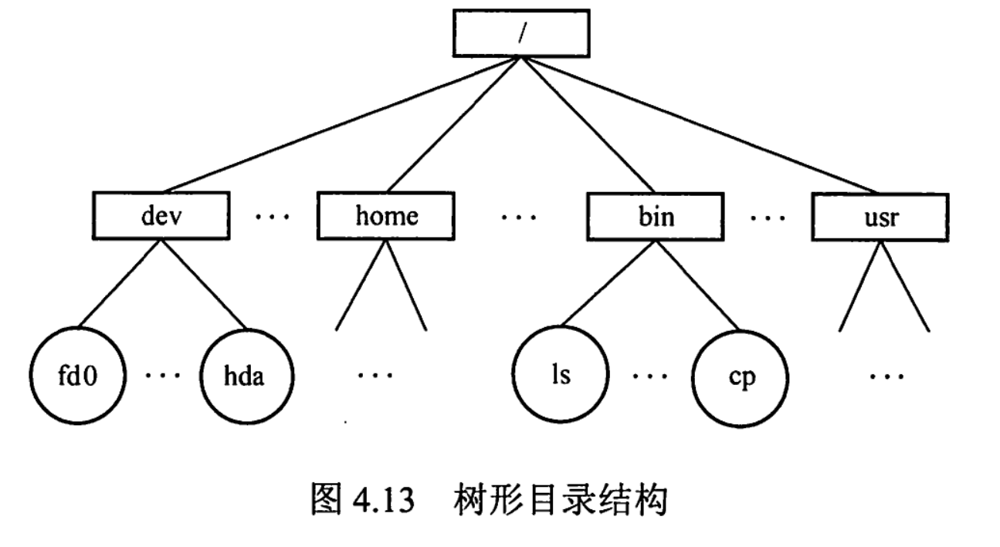

# 3计算机系统概述

## 操作系统基本概念

**操作系统定义：**负责管理协调软硬件等计算机资源工作、为上层用户及应用程序提供简单易用服务 的系统软件
**操作系统功能：**

- 资源管理：处理机管理，存储器管理，文件管理，设备管理
- 为上层提供服务：GUI图形界面与联机/脱机命令接口(普通用户)、程序接口或者说是系统调用(程序员)
- 对硬件机器进行扩展

**操作系统特征：**

- **并发(最基础)：**并发是指两个或多个事件在同一时间间隔内发生，这些事件宏观上是同时发生的，微观上是交替执行的。

- **共享(最基础)：**资源共享即共享，是指系统中的资源可供内存中多个并发执行的进程共同使用。可以分为互斥共享和同时共享两种方式。
- **虚拟：**虚拟是指把一个物理 上的实体变为若干逻辑上的对应物。操作系统的虚拟技术有时分复用技术与空分复用技术。
- **异步：**多道程序环境允许多个程序并发执行，但由于资源有限，进程的执行并不是一-贯到底的，而是走走停停的，它以不可预知的速度向前推进，这就是进程的异步性。

## 计算机系统的发展过程

- 手工操作阶段：一切由人工完成
- 单道批处理阶段：引入脱机输入输出技术，缓解部分人机矛盾
- 多道批处理阶段：可以多道程序并发执行，但用户响应时间长，没有人机交互。
- 分时操作系统：计算机以时间片为单位轮流为各个用户/作业服务，解决了人机交互的问题，但不能处理一些紧急任务。
- 实时操作系统：计算机以时间片为单位轮流为各个用户/作业服务，能够响应一些紧急任务，具备及时性和可靠性。

## 操作系统运行环境

### 处理器运行模式

```
计算机系统中，通常CPU执行两种不同性质的程序：操作系统内核程序，应用程序
CPU有两种状态：用户态(目态)，内核态(管态)。
CPU中有两种指令：特权指令(不允许用户直接使用的指令，IO指令，置中断指令，等)，非特权指令(允许用户直接使用的指令)
CPU处于内核态时，说明此时正在运行的是内核程序，此时可以执行CPU特权指令处于用户态时，说明此时正在运行的是应用程序，此时只能执行非特权指令

用户态到内核态的转换：应用程序向操作系统请求服务时，通过使用访管指令(trap，用户态执行，不是特权指令)，产生一个内中断事件，切换到内核态(硬件中断机制完成)，从而进行系统调用。

内核态-->用户态:执行一条特权指令，修改PSW的标志位为用户态
```

### 中断和异常


**中断可以分为：**内中断(异常)，外中断(中断)两类。其中在CPU执行指令时引起的中断叫内中断。有外部设备发起的中断请求叫外中断。

**内中断：**

- **自陷(Trap)：**预先安排的一种异常事件，执行指令前便已知晓。断点，用户态到异常态的切换都是通过自陷来实现的。
- **故障(Fault)：**在执行指令时，被检测到的异常事件，有的可恢复(缺段，缺页)，有的不可恢复(整数除0，非法操作码)
- **终止(Abort)：**执行指令中，发生计算机无法继续执行的**硬件故障**，只能终止程序。如控制器出错，存储器校验错等

## 操作系统结构


 

## 操作系统引导


## 虚拟机


# 进程与线程

## 进程与线程

### 进程的概念和特征

**进程的定义：**

```
进程是程序的一次动态执行过程。
进程是系统进行资源分配和调度的独立单位
进程实体由进程控制块PCB，程序段，数据段构成。PCB是进程存在，标识进程的唯一标志。
```

**进程的特征：**动态性(最基本特征)、并发性、独立性、异步性

### 进程的状态与转换


```
进程的五种状态：
创建态：进程正被创建。需要先申请一个空白PCB并初始化，然后分配资源，完毕后便进入就绪态并插入就绪队列
就绪态：进程已经创建情况下，拥有除处理机外的一切所需资源。在获得CPU后进入运行态
运行态：进程正在CPU上运行，如果进程执行完毕或因其它原因退出便进入终止态，如果进程因等待某一事件而暂时不能运行便进入阻塞态。
阻塞态：已建成的进程正等待某一事件而暂停运行。如果等待的事件发生，进程便进入就绪态。
终止态：进程正从CPU中消失，操作系统会释放进程拥有的资源，撤销PCB。
```

### 进程的组成

- 进程控制块PCB

  ```
  进程创建时，操作系统会为其创建一个PCB，之后PCB常驻内存。
  为方便管理，各个进程的PCB通常会用链表或索引表方式组织起来。
  ```

  

  

- 程序段

- 数据段

### 进程控制

```
内核中的许多程序要求一气呵成，比如进程调度，因此需要用原语实现，原语的原子性用关中断和开中断实现。
```

#### 进程的创建


#### 进程的切换


#### 进程的阻塞和唤醒


#### 进程的终止


### 进程的通信

```
进程通信：进程间的信息交换。通信方式有低级通信方式PV交换，高级通信方式，高级通信方式主要有三类：共享存储、消息传递与管道通信。
高级通信方式是指以较高效率传输大量数据的方式。
```

#### 共享存储

```
在通信的进程之间存在一块可直接访问的共享空间，通过对这片共享空间进行读写操作，实现进程之间的信息交换。
为了避免出错，各个进程对共享空间的访问应该是互斥的，这一点通过使用操作系统提供的同步互斥工具(如P、V操作)实现
```

##### 基于数据结构的共享

```
是一种低级通信方式，速度慢，限制多。
```


##### 基于存储区的共享

```
是一种高级的通信方式，速度快。。
```


#### 消息传递

```
进程间的数据交换以格式化的消息为单位
```


##### 直接通信方式

```
发送进程直接把消息发送给接收进程，并将其挂在接收进程的消息缓冲队列中，接收进程从消息缓冲队列中取得消息。
```


##### 间接通信方式

```
发送进程把消息发送到某个中间实体，接收进程从中间实体取得消息。
```


#### 管道通信


### 线程

#### 线程的基本概念

##### 定义

**引入线程的目的：**进程有时需要同时执行一些事务，而传统的进程只能串行的执行一些代码，可以用多个进程实现，但开销会很大，因此引入线程。以减小程序在并发执行时的时空开销，提高操作系统的并发性能。

**定义：**线程就是一个轻量级进程，是系统独立调度和反派的基本单位，同一进程内的多个线程共享该进程的资源。

**线程的组成：**和进程差不多


##### 线程机制的好处


#### 线程的状态转换

```
执行状态:线程已获得处理机而正在运行。
就绪状态:线程己具备各种执行条件，只需再获得CPU便可立即执行。
阻塞状态:线程在执行中因某事件受阻而处于暂停状态。
```


#### 线程的实现方式


- **用户级线程ULT**

  ```
  用户级线程中，线程的管理创建调度都是由应用程序负责的，内核意识不到线程的存在。
  故线程切换不需要转换到内核态，开销小；线程不能并行运行;一个线程阻塞，该进程内所有的线程都要被阻塞。
  
  为什么一个线程阻塞，该进程内所有的线程都会阻塞？
  因为其本质还是计算机在执行一个进程，进程内的代码串行执行。如下所示是一个简单的例子，显然其中一个线程阻塞，整个进程都会阻塞
  
  int main(void)
  {
  	while(1)
  	{
          printf("我是用户级线程1");
          printf("我是用户级线程2");
          printf("我是用户级线程3");	
  	}
  
  	return 0;
  }
  ```

- **内核级线程KLT**

  ```
  内核级线程：线程在内核支持下运行，由内核管理创建调度。
  故：线程切换需要转到内核态，开销大；线程可以并行运行；一个线程阻塞不影响其他线程。
  ```

- **组合方式**

  ```
  组合方式：内核支持多个内核级线程的建立、调度和管理，同时允许用户程序建立、调度和管理用户级线程。
  ```

#### 多线程模型


- **多对一模型：**

  ```
  多个用户级线程映射到一个内核级线程。线程的调度和管理在用户空间完成，仅当用户线程需要访问内核才将其映射到一个内核级线程上，每次只允许一个线程进行映射。
  优缺点：线程由应用程序管理，效率高。一个线程阻塞，整个进程阻塞。线程不能并行运行。
  ```

- **一对一模型：**

  ```
  将每个用户级线程都映射到一个内核级线程。
  优缺点：线程可以并行运行，但开销大。
  ```

- **多对多模型：**综合两种模型提出的。兼具两者优点。

## 处理机调度

### 调度的概念

#### 定义

```
在多道程序系统中，容易出现进程争用处理机的情况，这时便需要处理机调度选择为哪个就绪态的进程分配处理机资源，这个分配的算法就是处理机调度算法。
```

#### 调度的三个层次

```
一个作业从提交到完成需要经历三级调度：
最初，作业在外存后备队列中，由高级调度(作业调度)选择合适的作业，将其调入内存，并分配资源，创建进程。
然后，在进程创建后，如果内存容量不够，由中级调度(内存调度)选择一些暂不能运行进程(就绪或阻塞态)被调入外存等待，此时进程的状态叫挂起态。当内存有足够多空闲空间时，同样由中级调度将其调入内存。
在进程处于就绪态时，由低级调度(进程调度)选择合适的进程，为其分配处理机。
在进程结束运行时，同样的由高级调度，将其调出内存。

注意：作业是用户提交的，进程是系统自动生成的
```

- **高级调度(作业调度)**

  ```
  从外存上处于后备队列的作业中挑选一个(或多个)，给它(们)分配内存、输入/输出设备等必要的资源，并建立相应的进程，以使它(们)获得竞争处理机的权利。每个作业只调入一次、 调出一次。调入时创建PCB，调出时撤销PCB
  ```

- **中级调度(内存调度)**

  ```
  为此，将那些暂时不能运行的进程调至外存等待，当它们已具备运行条件且内存又稍有空闲时，由中级
  调度再重新调入内存，并修改其状态为就绪态，挂在就绪队列上等待。中级调度实际上是存储器管理中的对换功能。目的是提高内存利用率和系统吞吐量。
  ```

  

- **低级调度(进程调度，最基础)**

  ```
  按照某种算法从就绪队列中选取一个进程， 将处理机分配给它。
  ```

  

#### 七状态模型

```
挂起态：处于就绪或阻塞态进程，因内存不足被调入外存时的状态
```


### 调度的评价指标

- **CPU利用率：**

$$
CPU利用率=\frac{CPU有效工作时间}{CPU有效工作时间+CPU空闲等待时间}
$$

- **系统吞吐量：**单位时间内CPU完成作业的数量
- **周转时间：**作业从提交到作业完成所经历的时间。
  $$周转时间=作业完成时间-作业提交时间$$
- **带权周转时间：**作业周转时间与作业实际运行时间的比值。越小越好。
  $$带权周转时间=\frac{作业周转时间}{作业实际运行时间}$$
- **等待时间：**指进程处于等处理机的时间之和，等待时间越长，用户满意度越低。IO操作时也在为用户服务，不算入等待时间。
- **响应时间：**指从用户提交请求到系统首次产生响应所用的时间。

### 调度的实现

#### 调度程序(调度器)
```
用于调度和分派CPU的组件称为调度程序，它通常由三部分组成：排队器，分派器，上下文切换器
```


#### 调度时机
**不能调度的情况：**

- 在处理中断的过程中。
- 进程在操作系统内核临界区中。
- 其他需要完全屏蔽中断的原子操作过程中。
- 应该调度的情况：进程主动或被动放弃处理机资源

**调度方式：**抢占式调度、非抢占式调度。

#### 闲逛进程

```
在进程切换时，如果没有就绪进程，就会调度闲逛进程(idle) 运行， 直到有进程就绪，便立即让出处理机。
闲逛进程的优先级最低，不需要CPU之外的资源，它不会被阻塞。
```


### 调度算法
#### 先来先服务(FCFS)调度算法

```
既可用于作业调度，又可用于进程调度。
算法每次选择最先进入队列的进程/作业进行调度，分配资源
```

#### 短作业优先(SJF)调度算法

```
算法每次选择估计运行时间最短的进程/作业进行调度，分配资源。其平均等待时间，平均周转时间最少。
```

#### 优先级调度算法

```
算法每次选择优先级最高的进程/作业进行调度，分配资源。
```

#### 高响应比优先调度算法

```
主要用于作业调度，算法每次选择响应比最高的进程/作业进行调度，分配资源
综合了短作业优先和先来先服务的优点，等待时间相同时，短作业优先。要求服务时间相同时，先来的优先。
```


$$
响应比R_P=\frac{等待时间+要求服务时间}{要求服务时间}
$$

#### 时间片轮转调度算法

```
主要适用于分时系统。系统将所有就绪进程按FCFS排成一个就绪队列,调度程序每次选择就绪队列中的第一个进程执行一个时间片便再次进行调度。
```

#### 多级队列调度算法

```
该算法在系统中设置多个就绪队列，将不同类型或性质的进程固定分配到不同的就绪队列。每个队列可实施不同的调度算法。
```

#### 多级反馈队列调度算法


#### 调度算法对比


## 同步与互斥

### 同步和互斥的基本概念

**临界资源：**一次仅允许一个进程使用的资源


**同步**

```
定义：是指为完成某种任务而建立的两个或多个进程，这些进程因为需要在某些位置上协调它们的工作次序而等待、传递信息所产生的制约关系。
```

**互斥**

```
定义：当一个进程进入临界区使用临界资源时，另一个进程必须等待，当
占用临界资源的进程退出临界区后，另一进程才允许去访问此临界资源。
```

**同步互斥机制应遵循以下原则：**

- **空闲让进。**临界区空闲时，可以允许一个请求进入临界区的进程立即进入临界区。
- **忙则等待。**当己有进程进入临界区时，其他试图进入临界区的进程必须等待。
- **有限等待**。对请求访问的进程，应保证能在有限时间内进入临界区。
- **让权等待。**当进程不能进入临界区时，应立即释放处理器，防止进程忙等待。

### 实现临界区互斥的基本方法

#### 软件实现

##### 单标志法


##### 双标志先检查


##### 双标志后检查


##### Peterson算法


#### 硬件实现

##### 中断屏蔽方法


##### 硬件指令TestAndSet指令


##### 硬件指令Swap指令


### 互斥锁


### 信号量

```
一个变量(可以是一个整数，或是记录型变量)，用来表示系统中某种资源的数量。
可以用一对原语Wait(S)和Signal(S)对信号量S进行操作，实现进程互斥和同步，这一对原语又常写作P(S),V(S)。
```

#### 整型信号量


#### 记录型信号量

```
题目中用semaphore定义的都是记录型信号量。
```


### 管程

#### 管程定义

```
定义了一个共享数据结构，用来表示系统中的共享资源，基于该数据结构定义了一组操作，用以实现进程对进程对共享资源的申请、释放等操作。
管程可以根据资源情况，接受或阻塞进程的访问，确保每次仅有一个进程使用共享资源。(编译器实现)。
```

#### 管程的组成和特征

```
管程是一种特殊的软件模块，有这些部分组成：
1.局部于管程的共享数据结构说明；
2.对该数据结构进行操作的一组过程；
3.对局部于管程的共享数据设置初始值的语句；
4.管程有一个名字。

管程的基本特征：
1.局部于管程的数据只能被局部于管程的过程所访问；
2.一个进程只有通过调用管程内的过程才能进入管程访问共享数据；
3.每次仅允许一个进程在管程内执行某个内部过程。

```

#### 管程的示例

```
注意这里的wait与signal并不与信号量的PV操作一样。
虽然它们都能阻塞与唤醒进程。
但管程中的条件变量full与empty是没有值的，只是代表缓冲池满和空两种条件，用来实现排队等待，而信号量是有值的，用来反应剩余资源数。管程中资源数用共享数据结构记录

图中当count==N,说明缓冲区满，则使用wait(full)(也可写作full.wait())将该进程插入full的等待队列中。
```


### 经典同步问题

#### 生产者消费者问题

**问题描述**

```
问题描述：一组生产者进程和一组消费者进程共享一个初始为空、大小为n的缓冲区，只有缓冲区没满时，生产者才能把消息放入缓冲区，否则必须等待；只有缓冲区不空时，消费者才能从中取出消息，否则必须等待。由于缓冲区是临界资源，它只允许一个生产者放入消息，或一个消费者从中取出消息。
```

**问题分析**

```
生产者和消费者对缓冲区的访问是互斥的，生产者和消费者存在同步关系，只有生产者生产，消费者才能消费。
故定义一个互斥信号量mutex，初值1，控制互斥访问缓冲池
定义同步信号量empty，初值n,记录当前缓冲池中的空缓冲区数目
定义同步信号量full，初值0，记录当前缓冲池中的满缓冲区数目
```

**解决代码**

```
semaphore mutex=1;//实现对缓冲区的互斥访问
semaphore empty=n;//表示空闲缓冲区的数量
semaphore full=0;//表示产品的数量，也即非空缓冲区的数量
//生产者进程
producer()
{
	while(1)
	{
        生产一个产品;
        P(mutex);
        P(empty);
        把产品放入缓冲区;
        V(full);
        V(mutex);
	}
}

//消费者进程
consumer()
{
    while(1)
    {
    	P(mutex); 
    	P(full);
    	从缓冲区取出一个产品;
        V(empty);
        V(mutex);
        使用产品;
	}
}
```

#### 吸烟者问题

**问题描述**

```
假设一个系统有三个抽烟者进程和一个供应者进程。每个抽烟者不停地卷烟并抽掉它，但要卷起并抽掉一支烟，抽烟者需要有三种材料：烟草、纸和胶水。三个抽烟者中，第一个拥有烟草，第二个拥有纸，第三个拥有胶水。供应者进程无限地提供三种材料，供应者每次将
两种材料放到桌子上，拥有剩下那种材料的抽烟者卷一根烟并抽掉它，并给供应者一个信号告诉已完成，此时供应者就会将另外两种材料放到桌上，如此重复（让三个抽烟者轮流地抽烟）。
```

**问题分析**

```
供应者进程与抽烟者进程存在同步关系，供应者提供材料吸烟者才能吸烟，吸烟完成供应者才能继续提供。
信号量offer1，offer2，offer3分别表示烟草和纸组合的资源、烟草和胶水组合的资源、纸和胶水组合的资源。
信号量finish表示吸烟完成。

```

**解决代码**

```
semaphore offer1=0;//定义信号量表示烟草和纸组合的资源
semaphore offer2=0;//定义信号量表示烟草和胶水组合的资源
semaphore offer3=0;//定义信号量表示纸和胶水组合的资源
semaphore finish=0;//表示抽烟完成
int i=0;//用于实现“三个抽烟者轮流抽烟
//供应者进程
provider()
{
    while(1)
    {
    	if(i==0)
    		V(offer1);
    	else if(i==1)
    		V(offer2);
    	else if(i==2)
    		V(offer3);
    	提供材料，放在桌子上
    	i=(i+1)%3;
    	P(finish);
    }
}
//抽烟者进程
smoker1()
{
    while(1)
    {
        P(offer1);
        从桌上拿走材料；卷烟；抽掉；
        V(finish);
    }
}
```

#### 哲学家进餐问题

**问题描述**

```
一张圆桌边上坐着5名哲学家，每两名哲学家之间的桌上摆一根筷子，两根筷子中间是一碗米饭，如图所示。哲学家们倾注毕生精力用于思考和进餐，哲学家在思考时，并不影响他人。只有当哲学家饥饿时，
才试图拿起左、右两根筷子（一根一根地拿起）。若筷子已在他人手
上，则需要等待。饥饿的哲学家只有同时拿到了两根筷子才可以开始进餐，进餐完毕后，放下筷子继续思考。
```


**问题分析**

```
五名哲学家两两对中间的筷子是互斥访问的。
可能出现五名哲学家都拿起了左边的筷子，死锁的情况。
定义互斥信号量chopstick[5]，初值1，代表5根筷子
```

**解决代码**

```
semaphore chopstick[5]={1,1,1,1,1};//5根筷子
semaphore mutex=1;//互斥地取筷子
//i号哲学家的进程
Pi()
{
	while(1)
	{
		P(mutex);
		P(chopstick[i]);
		P(chopstick[(i+1)%5]);
		V(mutex);
		吃饭
		V(chopstick[i]);
		V(chopstick[(i+1)%5]);
		思考
	}
}
```

#### 读者写者问题

**问题描述**

```
问题描述：有读者和写者两组并发进程，共享一个文件，当两个或以上的读进程同时访问共享数据时不会产生副作用，但若某个写进程和其他进程（读进程或写进程）同时访问共享数据时则可能导致数据不一致的错误。因此要求：①允许多个读者可以同时对文件执行读操作：②只允许一个写者往文件中写信息：③任意一个写者在完成写操作之前不允许其他读者或写者工作；④写者执行写操作前，应让已有的读者和写者全部退出

```

**问题分析**

```
互斥关系：写进程—写进程、写进程—读进程。读进程与读进程不存在互斥问题。
```

**解决代码**

```
//读优先
semaphore rw=1;//用于实现对共享文件的互斥访问
int count=0;//记录当前有几个读进程在访问文件
semaphore mutex=1;//用于保证对count变量的互斥访问
writer()
{
	while(1)
	{
		P(rw);//写之前“加锁”
		写文件
		V(rw);//写完了“解锁”
	}
}

reader()
{
	while(1)
	{
		P(mutex);//各读进程互斥访问count 					if(count==0)//由第一个读进程负责
			P(rw);//读之前“加锁”
		count++;//访问文件的读进程数+1
		V(mutex);
		读文件
		P(mutex);//各读进程互斥访问count
		count--;//访问文件的读进程数-1
		if(count==0)//由最后一个读进程负责
			V(rw);//读完了“解锁”
		V(mutex);
	}
}
```

```
//读写公平法
semaphore rw=1;//用于实现对共享文件的互斥访问
int count=0;//记录当前有几个读进程在访问文件
semaphore mutex=1;//用于保证对count变量的互斥访问
semaphore w=1;//用于实现“写优先”

writer()
{
	while(1)
	{
		P(w);
		P(rw);
		写文件
		V(rw);
		V(w);
	}
}

reader()
{
	while(1)
	{
		P(w);
		P(mutex);
		if(count==0)
			P(rw);
		count++;
		V(mutex);
		V(w);
		读文件
		P(mutex);
		count--;
		if(count==0)
			V(rw);
		V(mutex);
	}
}
```

## 死锁

### 死锁的定义

#### 定义

**死锁：**各进程互相等待对方手里的资源，导致各进程都阻塞，无法向前推进的现象。

**死锁、饥饿、死循环的区别**

```
定义：
饥饿：由于长期得不到想要的资源，某进程无法向前推进的现象。比如：在短进程优先（SPF）算法中，若有源源不断的短进程到来，则长进程将一直得不到处理机，从而发生长进程“饥饿”。
死循环：某进程执行过程中一直跳不出某个循环的现象。有时是因为程序逻辑bug导致的，有时是程序员故意设计的。
```


#### 死锁产生的原因

- 对系统资源的竞争
- 进程推进顺序非法。
- 信号量的使用不当也会造成死锁。
- 总之，对不可剥夺资源的不合理分配，可能导致死锁。

#### 死锁产生的必要条件

- 互斥条件
- 不剥夺条件
- 请求并保持条件
- 循环等待条件

#### **死锁的处理策略**

- **预防死锁。**破坏死锁产生的四个必要条件中的一个或几个。

- **避免死锁。**用某种方法防止系统进入不安全状态，从而避免死锁（银行家算法）

- **死锁的检测和解除**。允许死锁的发生，不过操作系统会负责检测出死锁的发生，然后采取某种措施解除死锁。

  

### 死锁预防

- **破坏互斥条件：**将互斥资源改造为允许共享使用资源。比如:SPOOLing技术。但不是所有的资源都可以改造。

- **破坏不剥夺条件：**

  - **方案一：**当某进程请求新的资源不得满足时，必须立即释放保持的所有资源，待以后需要时再重新申请。

  - **方案二**：当某个进程需要的资源被其他进程所占有的时候，可以由操作系统协助，将想要的资源强行剥夺。这种方式一般需要考虑各进程的优先级

  该策略的缺点：

  ```
  实现较复杂。
  释放已获资源可能造成此前工作失效。因此这种方法一般只适用于易保存和恢复状态的资源，如CPU。
  反复地申请和释放资源会增加系统开销，降低系统吞吐量。
  若采用方案一，意味着只要暂时得不到某个资源，之前获得的那些资源就都需要放弃，以后再重新申请。如果一直发生这样的情况，就会导致进程饥饿。
  ```

- **破坏请求和保持条件：**采用静态分配方法，在进程运行前一次性申请完所需全部资源，资源未满足前，不运行。运行期间，一直持有这些资源。

  特点：实现简单，但有些资源只使用很短时间，一直持有资源易造成资源浪费，且有可能导致某些进程饥饿。

- **破坏循环等待条件：**采用顺序资源分配法。首先给系统中的资源编号，规定每个进程必须按编号递增的顺序请求资源，

  同类资源（即编号相同的资源）一次申请完。

  ```
  原理分析：一个进程只有已占有小编号的资源时，才有资格申请更大编号的资源。按此规则，已持有大编号资源的进程不可能逆向地回来申请小编号的资源，从而就不会产生循环等待的现象。
  
  该策略的缺点：
  1.不方便增加新的设备，因为可能需要重新分配所有的编号；
  2.进程实际使用资源的顺序可能和编号递增顺序不一致，会导致资源浪费；
  3.必须按规定次序申请资源，用户编程麻烦。
  ```

  

### 死锁避免

#### 核心思想

```
思想：在资源动态分配过程中，防止系统进入不安全状态，以避免发生死锁。

实现：允许进程动态地申请资源，但系统在进行资源分配之前，应先计算此次分配的安全性。若此次分配不会导致系统进入不安全状态，则允许分配，否则让进程等待。

安全状态：是指系统能按某种进程推进顺序（P1，P2，...，Pn）为每个进程Pi分配其所需的资源，直至满足每个进程对资源的最大需求，使每个进程都可顺序完成。此时称P1，P2，...，Pn为安全序列。若系统无法找到一个安全序列，则称系统处于不安全状态。
```

#### 银行家算法

```
进程运行前先声明对各种资源的最大需求量，当进程执行过程中继续申请资源时，先测试进程已占有资源和本次申请资源和是否超过声明的最大需求量，若超过则拒绝分配资源，若未超过，则再测试系统现有资源能否满足该进程尚需的最大资源量，若能满足(资源量足，且分配后处于安全状态)，则按当前申请量分配，否则推迟分配。
```


### 死锁检测和解除

#### 死锁检测

##### 资源分配图

```
进程结点：图中用圆圈表示如P1，P2的是进程节点，对应一个进程
资源结点：图中用方框表示的如R1，R2是资源结点，对应一类资源，R1中3个圈，表示有R1资源3个
请求边：进程结点指向资源结点的边，表示进程想申请几个资源(每条边代表一个)
分配边：资源结点指向进程结点的边，表示已为进程分配了几个资源(每条边代表一个)
图中显示，共有R1资源3个，其中2个已经分配给了P1，一个已分配给P2，剩余0个。P1持有2个R1资源，并请求一个R2资源。
```


##### 死锁定理

```
通过简化资源分配图，可检测系统状态S是否为死锁状态。S为死锁当且仅当资源分配图不可完全简化。下图的图c便是完全简化的资源分配图。

如何简化：
找到非孤立且不阻塞的进程(不阻塞指系统现有资源能满足其请求)，消去其所有请求边和分配边(为其分配资源，执行完了，释放全部资源)。不断消除下去，直到资源分配图完全简化，或不可简化。如果资源分配图不可简化，那么此时不是孤立的进程便称为死锁进程。

如图所示：
(R1,R2)剩余(0,1)，P1请求资源(R1,R2)为(0,1),P2请求（1，0),故P1不阻塞，P2阻塞。
消去P1所有边
(R1,R2)剩余(2,1)，P1请求（1，0），故P2，不阻塞
消去P2所有边
资源分配图可完全简化，资源分配图不是死锁状态。
```


#### 死锁解除

```
用死锁检测算法化简资源分配图后，还连着边的那些进程就是死锁进程
```

- **资源剥夺法：**挂起某些死锁进程，并抢占它的资源，将这些资源分配给其他的死锁进程。但是应防止被挂起的进程长时间得不到资源而饥饿。
- **撤销进程法：**强制撤销部分、甚至全部死锁进程，并剥夺这些进程的资源。这种方式的优点是实现简单，但所付出的代价可能会很大。
- **进程回退法：**让一个或多个死锁进程回退到足以避免死锁的地步。这就要求系统要记录进程的历史信息，设置还原点。


# 内存管理

## 内存管理基础

### 内存管理的基本原理和要求

#### 内存管理的意义

```
由于内存昂贵容量有限，且用户进程的数据越来越大，因此将所有用户进程的程序和数据都放入内存几乎是不可行的，所以让操作系统对内存进行有效的管理，使得诸多进程能并发的运行，便是十分必要的。
```

#### 内存管理的功能

- 内存空间的分配与回收
- 地址转换
- 内存空间的扩充
- 内存共享
- 存储保护

### 内存空间的分配与回收

内存的分配策略可以分为：

- **连续分配管理方式：**为用户进程分配一个连续的内存空间

  - 单一连续分配

  - 固定分区分配

  - 动态分区分配

    ```
    基于动态分区分配，又提出了动态分区分配算法：
    首次适应算法，最佳适应算法，最坏适应算法，邻近适应算法。
    ```

- **非连续分配管理方式：**为用户进程分配一些分散的内存空间
  - 基本分页存储管理
  - 基本分段存储管理
  - 段页式存储管理

### 地址转换

```
操作系统负责将逻辑地址转换成物理地址。因为在实际使用时，基于方便编程等考量，编程人员和进程知晓的都是逻辑地址(相对地址)，在指令运行时，再由操作系统将进程使用的逻辑地址转换为物理地址(绝对地址)的。
```

#### 程序的链接与装入

```
一个程序从源程序变成可执行的程序通常要经过以下几步：编译，链接，装入。
用C语言写过代码的，应该会知道，通常会将一个工程的多个.c文件都编译生成多个.o的中间文件，然后再得到一个.exe文件，然后便可运行。这便涉及程序的编译，链接，装入过程。
```


**编译：**由编译程序将用户源代码编译成若干个目标模块（从高级语言变到机器语言)

**链接：**由链接程序将编译后形成的一组目标模块，以及所需库函数链接在一起，形成一个完整的装入模块
**装入（装载）：**由装入程序将装入模块装入内存运行(负责将逻辑地址转成物理地址)


##### 程序链接的三种方式：

- **静态链接：**装入前链接成一个完整的装入模块。

- **装入时动态链接**：将各目标模块装入内存时，一边装入一边链接。

- **运行时动态链接：**程序执行中，需要该目标模块时，才进行链接。

##### 程序装入的三种方式：

- **绝对装入：**编译时便产生了物理地址。
- **可重定位装入：**装入时，通过重定位(相对地址加基地址)将逻辑地址变成物理地址，装入内存的程序中的地址是物理地址，故程序不可以移动。
- **动态重定位**：程序运行时，通过重定位寄存器将逻辑地址变成物理地址，装入内存的程序中的地址仍是相对地址，程序可以移动。

### 内存空间的扩充

```
内存空间的扩充有以下几种方法:覆盖技术，交换技术，虚拟存储技术
```

#### 覆盖技术

##### 核心思想

```
将程序分为多个段（多个模块）。常用的段常驻内存，不常用的段在需要时调入内存。
内存中分为一个“固定区”和若干个“覆盖区”。需要常驻内存的段放在“固定区”中，调入后就不再调出（除非运行结束）
不常用的段放在“覆盖区”，需要用到时调入内存，用不到时调出内存
```

##### 示例


#### 交换技术

##### 核心思想

```
内存空间紧张时，系统将内存中某些进程暂时换出外存，把外存中
某些已具备运行条件的进程换入内存。中级调度采用的就是交换技术。

通常会把外存分为文件区和对换区。文件区存储文件，离散分配。对换区用于交换数据，连续分配。
```

#### 虚拟内存技术

```
基于程序局部性原理，将很快要使用的部分装入内存，暂时用不到的部分留在外存，使得用户眼里的内存比实际上看起来大得多。
```

#### 覆盖和交换的区别

```
交换技术主要在不同进程（或作业）之间进行，而覆盖则用于同一个程序或进程中。
```

### 内存共享

```
内存空间中只有只读的区域可以共享。可重入代码，内存映射文件都是内存共享的实现方式。

```

#### 可重入代码

```
可重入代码时一种允许多进程同时访问但不允许修改的代码。
```

#### 内存映射文件

```
将磁盘文件的部分或全部内容与进程虚拟地址空间的某个区域构成映射关系，便可直接访问被映射的文件，而不必执行IO操作，不必对文件内容进行缓存处理。
进程通过系统调用，请求将操作系统将文件映射到进程的虚拟地址空间，然后以访问内存的方式读写文件，进程关闭文件时，操作系统负责将文件数据写回磁盘，并解除内存映射。

这样可以实现多个进程映射同一个文件，一个进程修改文件数据时，另一个进程可以立马看到。文件的读写完全由操作系统负责，程序员只需要按访问内存的方式读写即可。
```


### 存储保护

```
存储保护便是保证各进程在自己的内存空间运行，不会越界访问。
```

- **内存保护方法一：**设置上、下限寄存器，以检查是否越界。

内存保护可采取两种方法：

- **内存保护方法二：**：采用重定位寄存器（又称基址寄存器）和界

地址寄存器（又称限长寄存器）进行越界检查。重定位寄存器中存放的起始物理地址。界地址寄存器中存放最大逻辑地址。

## 连续分配管理

### 单一连续分配

```
内存在分为系统区和用户区，系统区仅供操作系统使用(低地址)；在用
户区内存中，由一道用户程序独占。

特点：简单、无外部碎片，无须进行内存保护。只能用于单用户、单任务的操作系统中，有内部碎片，存储器利用率极低。
```


### 固定分区分配

```
将用户空间划分为若干个固定大小的分区，在每个分区中只装入一道作业。分区的划分有分区大小相等、分区大小不等两种方式。
特点：实现简单，无外部碎片，但可能出现所有分区都不能放下作业的情况，有内部碎片，内存利用率低。
```


### 动态分区分配

```
不会预先划分内存分区，而是在进程装入内存时，根据进程的大小动态地建立分区，并使分区的大小正好适合进程的需要

采用动态分区分配时，可以用空闲分区链/表来记录内存使用情况。
外部碎片如何处理？可通过紧凑技术解决。
有多个可分配的分区，如何选择？可采用动态分区分配算法选择。
回收内存分区时，出现相邻分区，如何处理？合并。
```

#### 动态分区分配算法


## 非连续分配管理

```
当进程较大时，在内存中分配一块大的连续的内存空间是很难的，因此希望能将进程离散的存储在内存空间中。
```

### 基本分页存储管理

#### 普通的的基本分页存储

```
内存空间划分为大小相等的若干块，进程，外存也以同样的单位划分。进程中的块叫页、页面，内存中的块叫页框、页帧......。操作系统以页框为单位为各个进程分配内存空间。进程的每个页面分别放入一个页框中。用页表来存储它们的的对应关系。用地址变换机构将逻辑地址转为内存物理地址。
注意，页表中，页号是隐含的，不占存储空间。实际中，常常会让一个页框正好放下一个页表为佳。
```


#### 引入快表的基本分页存储

```
快表（TLB），是一种访问速度比内存快很多的高速缓存，用来存放最近访问的页表项的副本，可以加速地址变换的速度。
给出逻辑地址后，查找快表中是否有对应的记录，若有，得到物理地址。若无，访问慢表，得到物理地址，并将该条数据存入快表。快表满时，按特定的算法淘汰一个旧页表项。基于程序的局部性原理，引入快表机制可以大大提高访问速度。
```


#### 多级页表的基本分页存储

```
一个逻辑地址空间大的进程，其页表大小可能也是过大的，内存中难以分配如此大的连续的内存空间，所以可以对页表也采取分页存储，引入多级页表。另一方面，基于程序的局部性原理，并不是整个页表都需要常驻内存，所以可以引入一个标志位，标识页表是否在内存中，当访问到时，才需要调入内存(虚拟存储技术)。
另外，一般各级页表的大小不宜超过一个页面。
```


### 基本分段存储管理

```
按照程序自身的逻辑关系划分为若干个段进行存储，为每个进程建立一张段映射表，标识段号和内存单元的映射关系。

和页式存储相比，分段管理方便进行信息共享与保护。分页用户不可见，分段用户是可见的。分页没有外部碎片，分段有外部碎片。
分页的用户进程地址空间是一维的，程序员只需给出一个记忆符即可表示一个地址。
分段的用户进程地址空间是二维的，程序员在标识一个地址时，既要给出段名，也要给出段内地址。

```


### 段页式存储管理

```
先分段，对每个段再分页。
```

## 虚拟内存管理

```
首先，应该明确虚拟内存的定义，然后虚拟内存是基于页表/段表机制实现的，内存中可能没有需要的页面，以及调入需要的页面时，内存可能已满，于是需要提供请求调页功能和页面置换功能。那么什么时候进行页面置换，选择哪一个页面进行置换(页面置换算法)，便是需要研究的问题。虚拟内存中，进程只有部分内容驻留于内存，那么系统应该给进程分配多少空间呢？(内存分配策略)
```

### 定义

```
定义：
基于局部性原理，在程序装入时，可以将程序中很快会用到的部分装入内存，暂时用不到的部分留在外存，就可以让程序开始执行。在程序执行过程中，当所访问的信息不在内存时，由操作系统负责将所需信息从外存调入内存，然后继续执行程序。若内存空间不够，由操作系统负责将内存中暂时用不到的信息换出到外存。在操作系统的管理下，在用户看来似乎有一个比实际内存大得多的内存，这就是虚拟内存

虚拟内存有三个特征：多次性，对换性，虚拟性
```

### 实现(请求分页存储管理)

虚拟内存的实现有三种方式：

- 请求分页存储管理
- 请求分段存储管理
- 请求段页式存储管理

下面以请求分页存储管理来介绍虚拟内存的实现。

#### 请求分页存储管理

> 请求分页存储管理与分页存储管理大体上差不多，区别在于请求分页存储管理的页面可能不在内存，不在内存时，会产生缺页中断，将需要的页面调入内存。调入内存时，如果内存空闲，存入空闲的内存单元，否则会替换掉一个页面(页面的选择策略是页面替换算法负责的)。
> **实现这一点需要页表增加关于页面是否在内存的标志位，中断机制，相应的地址变换机构。**


### 页面置换算法

#### 最佳置换算法OPT

**思想：**淘汰以后永不使用的页面，或最长时间不被访问的页面。
**实现：**无法预知哪个页面是最长时间不被访问的，所以只是理想的算法，无法实现。但可以用来评估其他算法。
**示例：**


```
如图所示，假设分配了三个物理块，进程预要访问的页面是：7、0、1、2、0、3、0、4、2、3、0、3、2、1、2、0、1、7、0、1
在第4次访问，访问页面2时，发现2不在内存，触发缺页中断，而此时内存满，需要进行页面替换，接下来要访问的页面:
[0]、3、0、4、2、3、0、3、2、[1]、2、0、1、[7]、......
从这里可以看出，最长时间不被访问的页面是7，故替换掉7号页面。
```


#### 先进先出页面置换算法FIFO

**思想：**优先淘汰最早进入内存的页面
**实现：**队列记录实现
**示例：**


```
如图所示，假设分配了三个物理块，进程预要访问的页面是：7、0、1、2、0、3、0、4、2、3、0、3、2、1、2、0、1、7、0、1
在第4次访问，访问页面2时，发现2不在内存，触发缺页中断，而此时内存满，需要进行页面替换，7、0、1中，最早进入内存的页面是7，故替换掉7号页面。
```

**注意：**FIFO算法会出现Belady异常(上例，分配物理块数改4，缺页异常数增加)，也只有它会出现这个异常。

**Belady 异常：**当为进程分配的物理块数增大时，缺页次数不减反增的异常现象。

#### 最近最久未使用置换算法LRU

**思想：**优先淘汰最近最长时间未访问过的页面。认为过去一段时间未访问的，在最近的将来有不会被访问。
**实现：**给每个页面设置一个访问字段，记录从上次访问至今经过的时间
**示例：**


#### 时钟置换算法/最近未用算法NRU

**思想：**淘汰最近未被使用的页面。
**实现：**

```
为每个页面时钟一个访问位，如果一个页面首次被装入或被访问是，访问位置1。那么访问位为0的，一定是最近没有被使用的。
将内存中所有页面视为一个循环队列。淘汰页面时，循环扫描各页面，如果访问位为0，换出该页;如果访问位为1，将访问位置0，暂不换出，给予该页第二次驻留内存的机会。如果一轮扫描，没有可替换页面，继续循环扫描。最多两轮循环一定能找到可淘汰页面。
```

**示例：**


#### 改进的时钟置换算法


#### 各算法对比


### 内存分配策略

```
页面在何种时候，调入到内存的哪里，已经解决了。但还有一个问题，那便是，我们应该为一个进程分配多大的初始物理块呢?进程拥有的物理块数可不可以改变，调入的页面来自哪里呢？这便是内存分配策略要解决的问题。
```

**抖动/颠簸：**刚刚换出的页面马上又要换入内存，刚刚换入的页面马上又要换出外存，这种频繁的页面调度行为称

产生抖动的主因是进程频繁访问的页面数目高于可用的物理块数（分配给进程的物理块不够）

**工作集：**指在某段时间间隔里，进程实际访问页面的集合。

**驻留集：**指请求分页存储管理中给进程分配的内存块的集合。一般，驻留集大小不能小于工作集大小，否则将频繁缺页，也不宜太大，根据局部性原理，这样并不能明显降低缺页率，反而减少了驻留主存的进程数，降低CPU利用率。

**内存分配策略：**

- 固定分配策略：为进程分配固定数目的物理块(根据进程大小，优先级等确定），进程运行不改变。
- 可变分配策略：为基础分配一定数量的物理块，进程运行期改变。

**页面置换策略：**

- 局部置换：发生缺页时只能选进程自己的物理块进行置换。
- 全局置换：可以将操作系统保留的空闲物理块分配给缺页进程，也可以将别的进程持有的物理块置换到外存，再分配给缺页进程。

**内存分配：**页面分配策略和内存分配策略组合可构成以下三种策略。(固定分配不可能全局置换)

- 固定分配局部置换

  ```
  每个进程分配一定的物理块，进程运行期间不改变。缺页时从分配给进程的内存页面选出一页换出。
  分配多少物理块，可以根据进程的大小，优先级等来确定，或者平均分配。
  ```

- 可变分配全局置换

  ```
  先为进程分配一定数目的物理块，在运行期间根据情况调整。运行时发生缺页，从空闲物理块中取一块分配给进程。
  ```

- 可变分配局部置换

  ```
  为进程分配一定数目的物理块，进程缺页时，只允许从该进程的内存页面中的一页选出一块进行置换。若进程频繁发生缺页，系统会再为该进程分配若干物理块，直到缺页率趋于适中。如果进程的缺页率很低，系统会减少分配给该进程的物理块。
  ```

**调入页面的时机：**

- **预调页策略(运行前调页)：**根据局部性原理，一次调入若干预计不久后会被访问页面，由于预调页成功率仅50%，所以常用于进程的首次调入，由程序员指出应先调入哪些页。
- **请求调页策略(运行时调页)：**运行时，触发缺页中断，调入所缺的那一页

**从何处调入页面：**

```
通常会把外存分为文件区和对换区。文件区存储文件，离散分配。对换区用于交换数据，连续分配。显然对换区的IO速度快。
因此缺页时，如果
	系统有足够的对换区空间：全部从对换区调入所需页面。（进程相关文件在进程运行前复制到对换区)
	系统没有足够的对换区空间：不会修改的文件直接从文件区调入，可能修改的从对换区调入。
	UNIX方式：与进程有关的文件都放在文件区，因此未运行过的页面都应从文件区调入。曾经运行过但又被换出的页面，由于是放在对换区，因此在下次调入时应从对换区调入。


```

# 文件管理

## 文件

### 文件的概念

**定义：**就是一组有意义的信息/数据集合。用户进行的输入输出中，以文件为基本单位。

**属性：**文件通常包含名称，类型，创建者，所有者，位置，大小，保护，创建时间等信息。

**文件控制块FCB：**为方便管理，操作系统引入FCB，来存放文件属性等各种文件信息。

**索引结点：**查找时更多的是用到文件名，而整个文件可能很大，因此可以采用索引结点的方式，来提升检索速度。外存/内存中的索引结点叫磁盘/内存索引结点(内存里的会多些如访问位的信息)。


### 文件的操作

```
操作系统提供系统调用，定义了文件的增删改查类的基本操作
```


```
如图所示，多进程可以同时打开文件的操作系统是采用这样的两级表。系统表和进程表。
系统表:整个系统的打开文件表，包含FCB副本及其他信息。
进程表：根据其打开的所有文件，包含指向系统表对应条目的指针。
进程打开一个文件，系统表会将其FCB，磁盘位置等信息包含在内，进程表的会包含指向系统表对应条目的指针。
系统表位每个文件关联一个打开计数器，每一次打开关闭会增减打开计数器。打开计数器为0，表示文件不在使用，可以从系统表中删除对应项。
```

**打开文件：**用open根据文件名搜索目录，将对应信息复制到内存，并返回索引给用户。

**关闭文件：**删除进程打开表对应项，若系统表中打开计数器为0，删除系统表表项。

**创建文件：**为新文件分配必要的外存空间，创建对应的目录项。
**读/写文件：**根据读写指针，读写数据量，将文件读入内存，或从内存写入外存。一般每个进程会有一个唯一独有的读写指针。
**重新定位文件：**搜索目录以找到适当的条目，并将当前文件位置指针重新定位到给定值。
**删除文件：**检索指定文件名的目录项，然后释放该文件所占
的存储空间，并删除目录条目。
**截断文件：**允许文件所有属性不变，并删除文件内容，将其长度置为0并释放其空间。

### 文件的保护

```
文件保护一般通过口令保护，加密保护，访问控制实现。
```

#### 口令保护

```
用户建立文件时提供一个口令，系统建立FCB时为其附上口令，其它用户请求访问时，需提供口令才能访问。
特点:开销小，但口令存放于系统内部，不安全。
```

#### 加密保护

```
用户通过某个密钥对文件加密，文件访问时，需要使用密钥进行解密。
特点：保密性强，但加解密需要时间。
```


#### 访问控制

通过在每个文件的FCB(或索引结点)中增加一个访问控制列表ACL，记录各个用户可以对文件执行哪些操作。

但对每个用户都进行规定过于繁琐，因此可以建立精简的访问控制列表，以组为单位进行限制，一般是如下所示的样子：


### 文件的逻辑和物理结构

#### 文件的逻辑结构

```
文件的逻辑结构可以分为：无结构文件(流式文件)，有结构文件(记录式文件)。
```

##### 无结构文件

```
无结构文件按顺序组织成记录积累保存，由一系列二进制流或字符流组成，访问记录只能通过穷举搜索的方式
```

##### 有结构文件

```
有结构文件由一组相似的数据有组织的组成。按记录的组织形式可以分为：顺序文件，索引文件，索引顺序文件，直接文件或散列文件
```

- **顺序文件：**文件中的记录逻辑上是一个接一个的顺序排列的定长或可变长记录。在物理上可以顺序存储或链式存储。

  - **串结构：**记录之间的顺序与关键字无关，通常按照时间顺序排列。
  - **顺序结构：**记录之间的顺序按关键字顺序排列

- **索引文件：**不定长的顺序文件无法实现随机存取，故引入索引文件，如下图所示，这样就将一个顺序文件变成了一个定长的顺序文件，即索引文件。

  

- **索引顺序文件：**定长的顺序文件，采用串结构只能遍历查找，而采用顺序结构则可以根据关键字迅速定位记录(如折半查找)。索引顺序文件就是将顺序文件转变成的顺序结构的定长顺序文件。

  

- **直接文件或散列文件(Hash File)：**给定记录的键值 或 通过散列函数转换的键值 直接决定记录的物理地址。

#### 文件的物理结构

##### 连续分配

> 为文件分配的是一组连续的磁盘块


**链式分配**

> 为文件分配的是一些离散的磁盘块，用链式的方式将这些磁盘块组织在一起，又可分为隐式链接和显示链接两种形式。

**隐式链接：**目录项中仅有文件第一块和最后一块的指针，除最后一个盘块外，每个盘块含有指向下一个盘块的指针。


- **显式链接：**把用于链接文件各物理块的指针显式地存放在文件分配表FAT。一个磁盘只会建立一张文件分配表。开机时文件分配表放入内存，并常驻内存。目录项中存放文件第一块的指针。

  

##### 索引分配

> 为每个文件建立一张索引表，记录文件逻辑块和物理块之间的映射关系，索引表存放在索引块中，其它的块就叫数据块。


##### 几种分配方式对比


## 目录

FCB 的有序集合称为“文件目录”，一个FCB就是一个文件目录项。

### 目录结构

#### 单级目录结构


#### 两级目录结构

> 将文件目录分为主文件目录MFD和用户文件目录UFD两级


#### 树形文件目录



#### 无环图目录


### 目录的实现


## 文件系统


# 错误

```
广义指令就是系统调用指令。
关中断指令是特权指令。
外部中断处理过程中，PC值由中断隐指令保存，通用寄存器内容由操作系统保存

1.1：16、18，应用1
1.2：5、14、16、应用1
1.3：3、4、5、21、22、25、26、27，应用1、2
1.6：3、5、7、9、10、12、13、14 
2.1:5、20、22、29、30、33、36、46、47、48、应用未做
2.2:14、25、27、32、37、应用未做
2.3:5、9、28、41、43、应用未做
2.4:18、21、22、23、27、31、34、应用未做
3.1

4333
```

