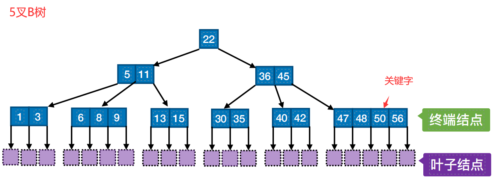

# B树


##### 定义：

```
B树，多路平衡查找树。由于自平衡和多路性质，其平均高度较低，常用于大型数据库和文件系统。  
对于一颗m叉B树，具有如下性质：  
树中每个结点至多有m个子树,即至多m-1个关键字。  
若根结点不是终端结点，至少有3棵子树  
除根结点外，所有非叶结点至少有\ceil{m/2}棵子树，\ceil{m/2}-1个关键字。  
所有非叶结点在同一层次上，是假想出的查找失败结点，不带信息。  
```

##### B树的查找：

```
首先从根节点开始，按照关键字的大小逐级向下搜索，直到找到合适的终端节点，则查找成功，如果查找到叶子结点，则查找失败。
```

 ##### B树的插入：

```
通过查找找到对应的终端结点，如果该结点未满，插入关键字并保持关键字的排序顺序，否则将其分裂为两个节点，并将中间的关键字提升到父节点中。如果父节点也满，则继续向上分裂，必要时可增加树的高度。 
B树的插入是按查找的顺序一直到查找失败为止，而后插入到查找失败的终端结点处
```

#####  B树的删除：  

```
查找：首先找到包含要删除的关键字的节点。，  
删除：  
        在终端结点:  
                删除后结点关键字不低于下限，直接删除。  
                删除后结点关键字低于下限：1、右兄弟够借，删除后调用当前结点的后继填补空缺2、左兄弟够借，删除后调用当前结点的钱去填补空缺3：左右兄弟都不够借，  
        不在终端结点：如果键在一个内部节点（非叶子节点），则需要找到它的直接前驱（它左边子树的最大键）或直接后继（它右边子树的最小键），并替换它。然后在叶子节点中删除这个键。  

处理下溢：如果删除键后节点中的键数少于最小值，需要进行调整。可以通过重新分配或合并节点来处理。重新分配是指从相邻兄弟节点中借一个键，而合并是指将节点与一个兄弟节点合并，并将一个父节点的键下移至合并的节点中。
```


