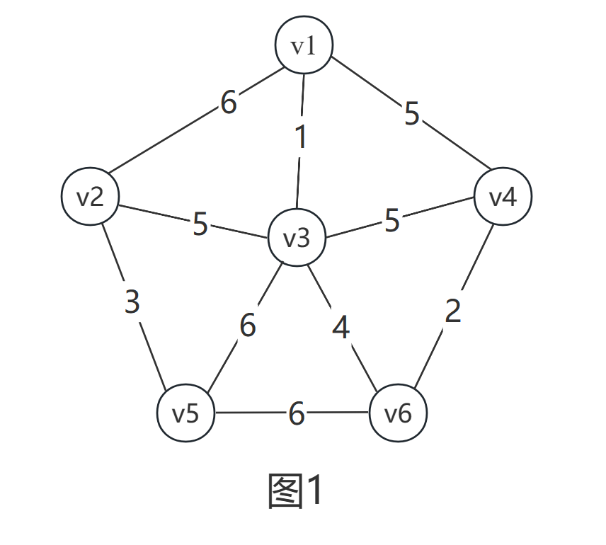
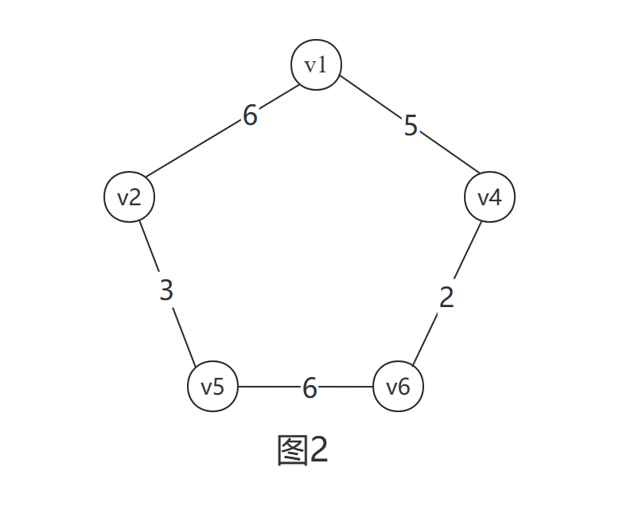
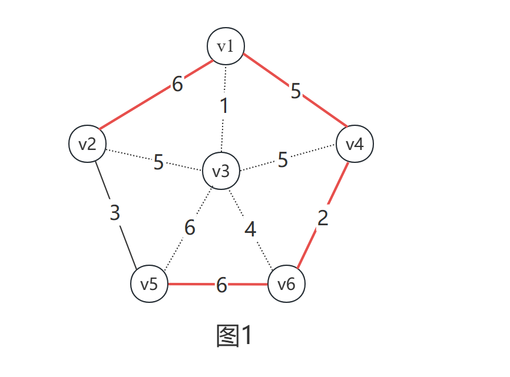
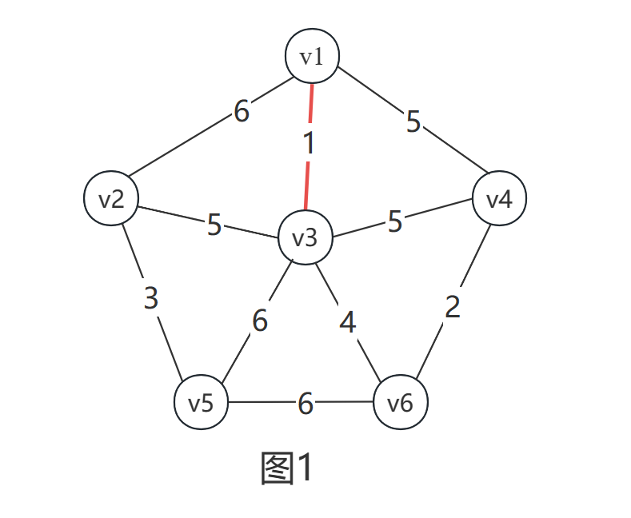
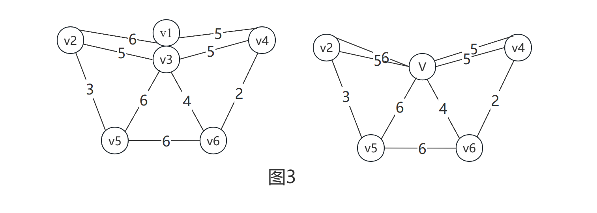

# 最小生成树算法Prim与Kruskal的证明

##### 首先，有推论1：如果一个图中<u,v>是权值最小的边，那么所有的最小生成树必定包括这条边
**该推论证明：**

如图所示，(V1,V3)是图1中权值最小的边，除去顶点V3，及其相关边，得图2。

易证图1的最小生成树，一定是图2的最小生成树连上V3所得。
任意给定一个图2的最小生成树，如何要得到图1的最小生成树呢？

(Vi,V3)选一个权值最小的连上就行，而(V1,V3)是图1中权值最小的边，一定也是(Vi,V3)中权值最小的边。故图1的最小生成树一定包含权值最小的边(V1,V3)，证明完毕

##### Prim证明

从推论1的证明中，其实可以看出来一个推论2：对于顶点V3，最小生成树中一定包含 以顶点V3为端点的边中权值最小的那条边。

step1：如果从V1出发，可以确定最小生成树中一定包括(V1,V3)

step2：然后，把V1和V3捏合成一个顶点V看待，这对寻找最小生成树是没有影响的

step3：所以，问题又回到了从V出发，构造最小生成树，也就是转Step1,直到最后只剩一个顶点，最小生成树构造完毕。

##### Kruskal证明

Prim是以点为核心，从点出发，层层简化，那么Kruskal就是以边为核心，层层简化。
Step1：由推论1，图1的最小生成树一定包含权值最小的边（V1，V3）

Step2：捏合顶点V1，V3，

Step3：问题又回到了Step1的情况，继续寻找最小权值边，捏合顶点直到只剩一个顶点为止。

